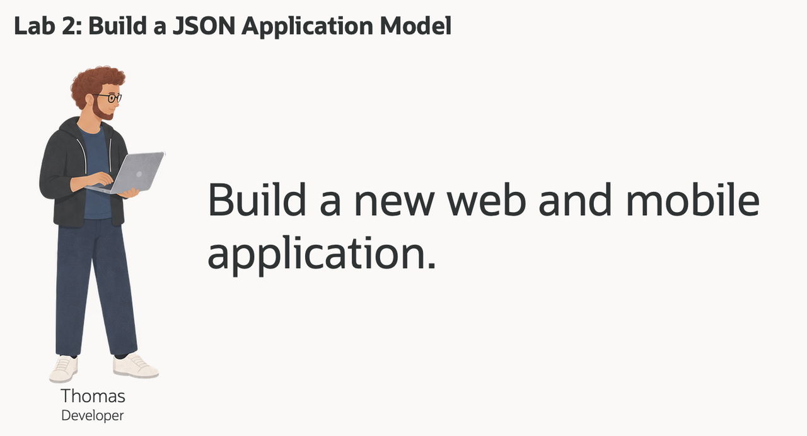
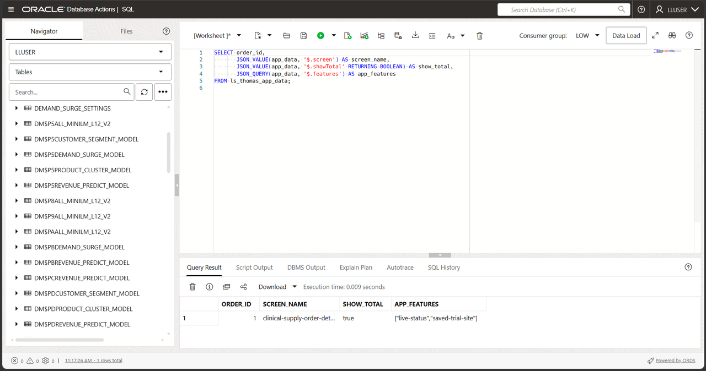
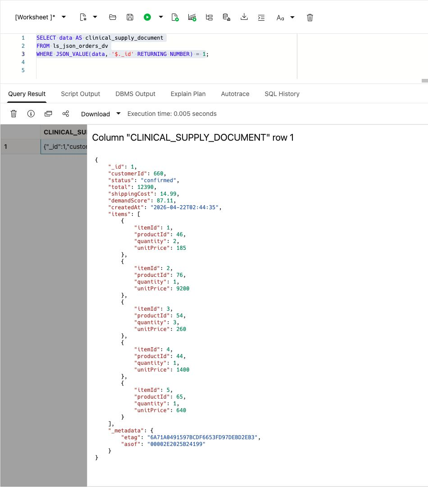
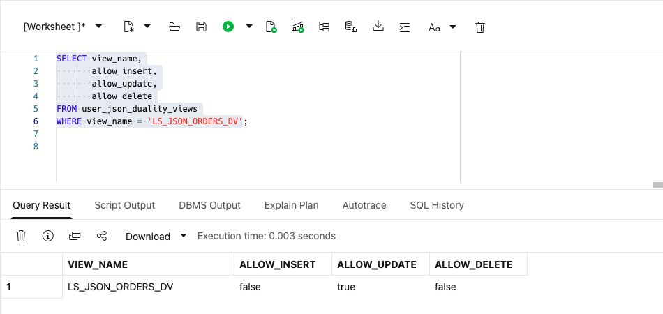
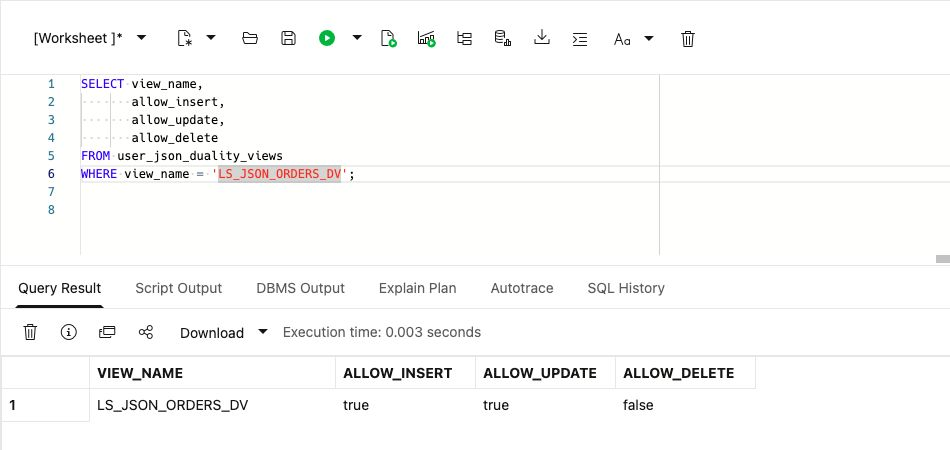
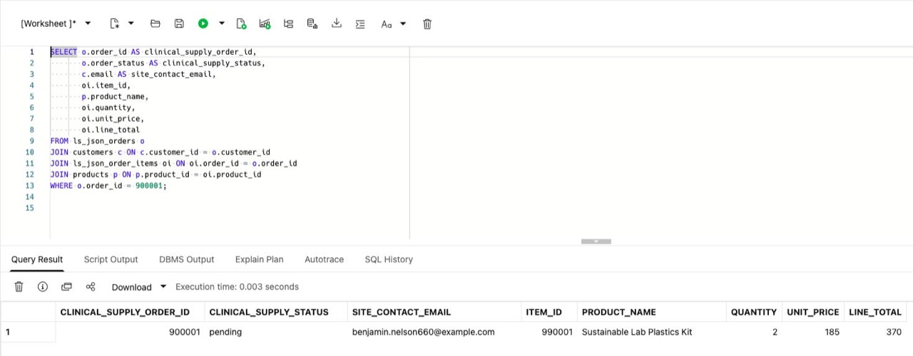
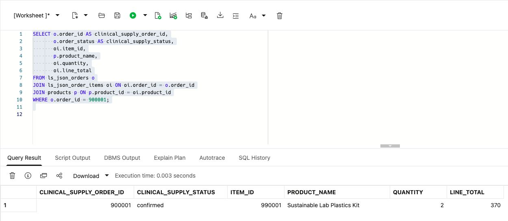
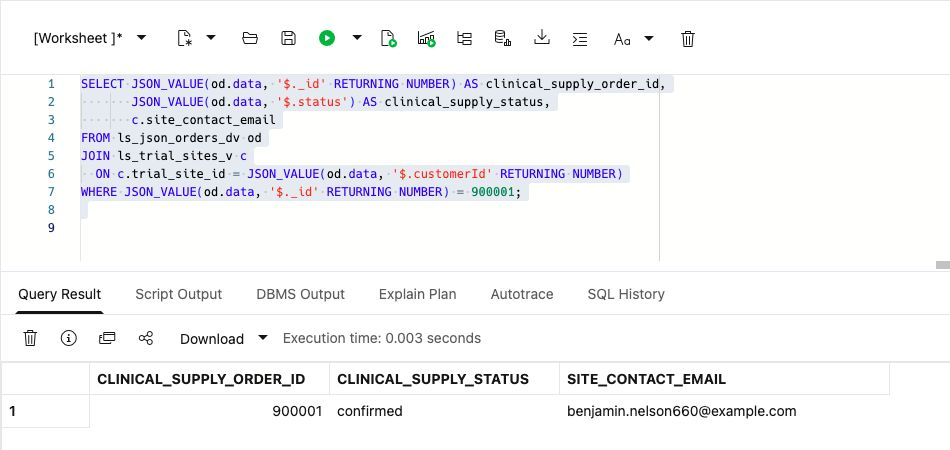
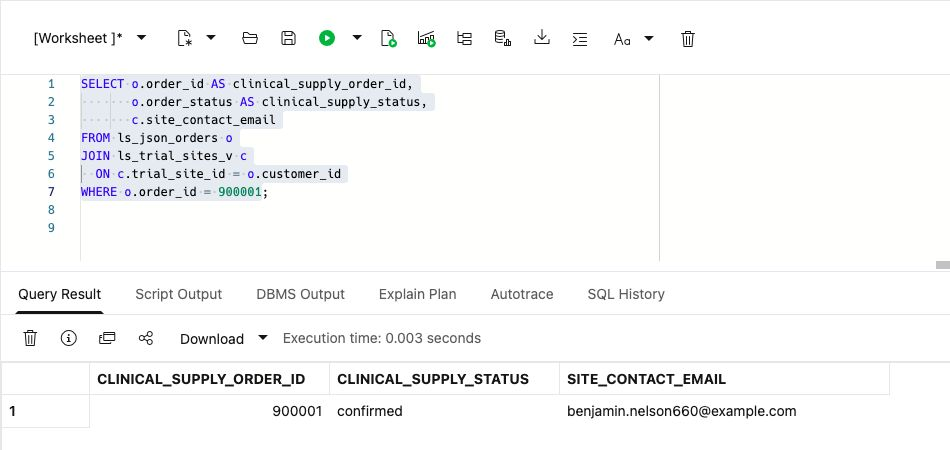

# Build a Clinical Supply JSON Application Model

## Introduction

Thomas Brune is an application developer at Seer Scientific. He and his team are building a new web and mobile application for clinical supply teams. The team wants a faster clinical supply experience, with fewer round trips and payloads that match the screens and services they are building.

Thomas needs order data as a JSON payload that a web or mobile application can consume directly. One payload can group trial-site identifiers, order status, line items, and optional app-specific attributes. JSON lets him evolve that payload as the product changes. The data already lives in Oracle AI Database, so his question is how to use JSON without giving up relational keys, SQL, transactions, and database controls.

Thomas asks Jessica, the DBA, to walk through three ways to work with JSON in Oracle AI Database. They start with a JSON value in a relational table, then a collection of JSON documents, and finally a JSON Relational Duality View over existing relational rows. The goal is to choose the right approach for each application feature. A collection stores its own documents; a duality view presents existing relational rows without a second document store.



<details>
<summary><strong>Key terms: JSON columns, JSON collections, and JSON Relational Duality</strong></summary>

> - A **JSON column** stores a JSON value in a relational table alongside normal typed columns, keys, and constraints. Thomas can use it for optional or changing application attributes without turning every new attribute into a schema change.
>
> - A **JSON collection** is a special table or view that provides a set of JSON documents through one `JSON`-typed `DATA` column. Each document can have a top-level `_id` used to identify it.
>
> - **JSON Relational Duality** lets Oracle Database expose relational data as JSON documents without copying it into a separate document database. The application gets the document shape Thomas wants for its API. The database keeps the relational rows and controls.
>

</details>

Thomas's application needs a payload with the order and its line items together, such as this abbreviated example:

```json
{
  "_id": 900001,
  "customerId": 660,
  "status": "confirmed",
  "items": [
    { "productId": 46, "quantity": 2, "unitPrice": 185 }
  ]
}
```

For the duality exercise, the application uses this document shape while the database keeps the order and line items in relational form. In this lab, you explore the three JSON approaches. You build and inspect database objects in SQL Worksheet, not a complete web application.

### Objectives

- Store flexible application attributes as JSON in a relational table.
- Create and query a JSON Collection Table of order documents.
- Read and update relational order data through `LS_JSON_ORDERS_DV`.
- Compare the three JSON approaches and choose the right one for an application feature.

Estimated Time: **10 minutes**

### Hands-on Scenario

| Step | Life Sciences focus |
| --- | --- |
| Business Problem | Thomas's team needs flexible JSON payloads for a new clinical supply web and mobile application. |
| Technical Challenge | The team needs application-friendly documents while the database keeps relational keys, joins, and controls. |
| Persona Focus | Thomas tests JSON storage, collections, and duality with Jessica's database guidance. |
| What You Will See | One Oracle AI Database supports several JSON access patterns over the clinical supply data. |
| Database Capability | Native JSON, SQL/JSON functions, and JSON Relational Duality work together. |
| Outcome | Thomas can distinguish stored JSON documents from a document view over existing rows. |

Persona focus: You are Thomas, working with Jessica to decide how the new application should store, assemble, and read clinical supply order data.

### Thomas's three JSON choices

Thomas does not need one JSON pattern for every feature. A JSON column holds optional application attributes in a relational table. A JSON Collection Table holds documents owned by the application. A duality view assembles a document from existing relational tables. Thomas uses the document shape in the application, while Jessica works with the underlying rows using SQL.

This keeps the order in one database and avoids complex, expensive integration between separate systems. Thomas gets the document shape his application needs, and Jessica keeps the relational rows, SQL access, and database controls.

> **SQL Worksheet reminder:** Need a reminder on how to open and use the SQL Worksheet? Return to [Getting Started Task 2: Open SQL Worksheet](?lab=getting-started#Task2:OpenSQLWorksheet) for the step-by-step guide on how to run SQL statements.

## Task 1: Store flexible application data as JSON

Thomas starts with data that belongs to the application but does not need its own relational columns. The workshop database already contains the source order rows. He adds a small application-data table with a native `JSON` column for optional screen and supply-team display settings.

1. Create the application-data table and add one sample payload. Select the entire block and choose **Run Script (F5)**. For single `SELECT` queries, select the statement and choose **Run Statement**. Check each output for errors before continuing.

    ```sql
    <copy>
    CREATE TABLE ls_thomas_app_data (
        order_id  NUMBER PRIMARY KEY,
        app_data  JSON NOT NULL
    );

    INSERT INTO ls_thomas_app_data (order_id, app_data)
    SELECT order_id,
           JSON_OBJECT(
               'screen'    VALUE 'clinical-supply-order-detail',
               'showTotal' VALUE 'true' FORMAT JSON,
               'features'  VALUE JSON_ARRAY('live-status', 'saved-trial-site')
               RETURNING JSON
           )
    FROM (
        SELECT order_id
        FROM orders
        WHERE order_id = 1
    );

    COMMIT;
    </copy>
    ```

2. Read values from the JSON column.

    ```sql
    <copy>
    SELECT order_id,
           JSON_VALUE(app_data, '$.screen') AS screen_name,
           JSON_VALUE(app_data, '$.showTotal' RETURNING BOOLEAN) AS show_total,
           JSON_QUERY(app_data, '$.features') AS app_features
    FROM ls_thomas_app_data;
    </copy>
    ```

    

    Expect one row for order `1`, screen `clinical-supply-order-detail`, Boolean `true`, and features `live-status` and `saved-trial-site`.

    `ORDER_ID` remains a relational primary key; this small settings table does not declare a foreign key to `ORDERS`. `APP_DATA` can change as the application changes. Thomas can query both with SQL in one table.

## Task 2: Create a JSON Collection Table

Thomas now needs a collection of application documents. Unlike the JSON column in Task 1, this object is a JSON Collection Table: each row is a document, the document is stored in `DATA`, and `_id` identifies the document.

1. Create the collection and add the sample order document using **Run Script (F5)**.

    ```sql
    <copy>
    CREATE JSON COLLECTION TABLE ls_thomas_order_docs
    WITH ETAG;

    INSERT INTO ls_thomas_order_docs (data)
    SELECT JSON_OBJECT(
               '_id'        VALUE o.order_id,
               'customerId' VALUE o.customer_id,
               'status'     VALUE o.order_status,
               'items'      VALUE (
                   SELECT JSON_ARRAYAGG(
                              JSON_OBJECT(
                                  'itemId'    VALUE oi.item_id,
                                  'productId' VALUE oi.product_id,
                                  'quantity'  VALUE oi.quantity,
                                  'unitPrice' VALUE oi.unit_price
                                  RETURNING JSON
                              ) ORDER BY oi.item_id RETURNING JSON
                          )
                   FROM order_items oi
                   WHERE oi.order_id = o.order_id
               ) FORMAT JSON
               RETURNING JSON
           )
    FROM orders o
    JOIN ls_thomas_app_data t ON t.order_id = o.order_id;

    COMMIT;
    </copy>
    ```

    `WITH ETAG` adds an `_metadata.etag` value to each document. Oracle changes the tag whenever the document changes. Thomas's application can send the tag it last read when it updates a document. If the tag no longer matches, the application knows that someone else changed the document first and can avoid overwriting the newer version. This protects clinical supply data when web and mobile requests try updating the same document at the same time.

2. Query the collection as documents.

    ```sql
    <copy>
    SELECT JSON_SERIALIZE(data PRETTY) AS clinical_supply_document
    FROM ls_thomas_order_docs
    WHERE JSON_VALUE(data, '$._id' RETURNING NUMBER) =
          (SELECT order_id FROM ls_thomas_app_data);
    </copy>
    ```

    Expect one stored document for order `1`, customer `660`, status `confirmed`, five items, and an `_metadata.etag` value.

    Thomas now has a document collection that a document API can access, and SQL can query the same `DATA` column. The collection stores the documents; it is separate from the source relational `ORDERS` and `ORDER_ITEMS` tables. It is a stored sample copy, not an automatically synchronized view of those rows.

## Task 3: Read a clinical supply document from relational data

Thomas now tests the document shape his application can consume directly. The loader supplied `LS_JSON_ORDERS` and `LS_JSON_ORDER_ITEMS`, a small practice copy of source order `1` and its five items. `LS_JSON_ORDERS_DV` presents those practice rows as JSON. The practice copy protects the original workshop data; it is not a requirement of duality.

1. Run this query:

    This query selects the JSON `DATA` column from `LS_JSON_ORDERS_DV` so Thomas can inspect the document shape in SQL Worksheet.

    <details>
    <summary><strong>Why this matters to Thomas</strong></summary>

    > Thomas can use a JSON Collection Table when the application owns the document. But the order already has relational tables that Jessica and other teams rely on.
    > The duality view gives Thomas a document over those existing rows. He can choose the application shape without copying the order into another store.

    </details>

    ```sql
    <copy>
    SELECT data AS clinical_supply_document
    FROM ls_json_orders_dv
    WHERE JSON_VALUE(data, '$._id' RETURNING NUMBER) = 1;
    </copy>
    ```

    **Expected output:**

    

2. Expand the document in SQL Worksheet.
    The query reads the duality view as a document source. Oracle constructs the JSON shape from relational data, so the application gets an order payload without a second copy of the order record.

    Expect order `1`, customer `660`, status `confirmed`, total `12390`, and five items. Expand `items` to inspect them; array order is not a guaranteed business ordering.

    The \_id value appears in the JSON document while the source data remains relational. The payload includes `customerId`, `status`, totals, timestamps, and line items. The application gets these fields without a second order store.

    The same order now has two useful forms: API-ready JSON for the application and relational rows for analysis.

    > **Note:** Look for `_metadata.etag` in the document. The ETAG changes when the document changes, so Thomas's application can detect a newer version before updating the order and avoid overwriting another request.

## Task 4: Enable document inserts and updates

The existing `LS_JSON_ORDERS_DV` lets an application update an existing order document. In this task, you extend that contract so the application can also create one. The database continues to control the relational tables, keys, and constraints. A separately privileged application could receive access only to the view. Here you work as the workshop schema owner, so this exercise does not establish separate application-user security.

1. Check the current document-write capabilities.

    ```sql
    <copy>
    SELECT view_name,
           allow_insert,
           allow_update,
           allow_delete
    FROM user_json_duality_views
    WHERE view_name = 'LS_JSON_ORDERS_DV';
    </copy>
    ```

    **Expected output: Current Document Capabilities**

    

    The view currently allows updates but not new top-level documents. The root `LS_JSON_ORDERS` table controls document insertion. The nested `LS_JSON_ORDER_ITEMS` rows must also allow inserts so the document can include line items.

2. Enable insert and update for the document and its line items.

    You are changing the duality-view definition, not creating a second API store. The two `WITH INSERT UPDATE` clauses allow developers to create and update the JSON document. Oracle still enforces the relational keys and data types.

    ```sql
    <copy>
    CREATE OR REPLACE JSON RELATIONAL DUALITY VIEW ls_json_orders_dv AS
    SELECT JSON {
        '_id'         : o.order_id,
        'customerId'  : o.customer_id,
        'status'      : o.order_status,
        'total'       : o.order_total,
        'shippingCost': o.shipping_cost,
        'demandScore' : o.demand_score,
        'createdAt'   : o.created_at,
        'items' : [
            SELECT JSON {
                'itemId'    : oi.item_id,
                'productId' : oi.product_id,
                'quantity'  : oi.quantity,
                'unitPrice' : oi.unit_price
            }
            FROM ls_json_order_items oi WITH INSERT UPDATE
            WHERE oi.order_id = o.order_id
        ]
    }
    FROM ls_json_orders o WITH INSERT UPDATE;
    </copy>
    ```

    This duality view uses two relational tables. `LS_JSON_ORDERS` provides the document root. Related `LS_JSON_ORDER_ITEMS` rows become the nested `items` collection. The `WITH INSERT UPDATE` clauses let Thomas write the complete JSON document while Oracle maintains the rows and relationships.

    **Expected output: View Definition Updated**

    Oracle created or replaced the duality view. Verify the new capabilities in the next step.

3. Run the capability query again.

    ```sql
    <copy>
    SELECT view_name,
           allow_insert,
           allow_update,
           allow_delete
    FROM user_json_duality_views
    WHERE view_name = 'LS_JSON_ORDERS_DV';
    </copy>
    ```

    **Expected output: Document Capabilities Enabled**

    

    Both root and child now allow INSERT and UPDATE; DELETE remains disabled. Identifying keys cannot be updated through the view. The view can now receive a new JSON order document and apply a document update. Thomas has a document-shaped database interface over the existing relational order data. He can use it for a clinical supply feature such as submitting a new order. The application sends one document, and the database writes the order and its line items to the relational tables.

## Task 5: Create and update a JSON order

Thomas now tests a complete clinical supply order. He creates it as one nested JSON document, then confirms that Jessica can immediately see the same data as structured relational rows.

1. Insert the supplied workshop order document using **Run Script (F5)**.

    The `INSERT` targets `LS_JSON_ORDERS_DV`, the JSON Relational Duality View, rather than the underlying `LS_JSON_ORDERS` or `LS_JSON_ORDER_ITEMS` tables. The database uses the view definition to write the document to those relational tables. The document uses order ID `900001`, customer `660`, and product `46` (Sustainable Lab Plastics Kit). It includes one nested line item. For a sequential rerun, after the order exists, it inserts zero rows and preserves the existing record. On the first run, the new order has status `pending`.

    ```sql
    <copy>
    INSERT INTO ls_json_orders_dv (data)
    SELECT JSON(
      '{
        "_id": 900001,
        "customerId": 660,
        "status": "pending",
        "total": 370,
        "shippingCost": 0,
        "items": [
          {
            "itemId": 990001,
            "productId": 46,
            "quantity": 2,
            "unitPrice": 185
          }
        ]
      }'
    )
    WHERE NOT EXISTS (
      SELECT 1
      FROM ls_json_orders
      WHERE order_id = 900001
    );

    COMMIT;
    </copy>
    ```

    **Expected output: Order Document Created**

    On the first run, you insert one document. On later runs, the `NOT EXISTS` check returns zero rows because the workshop order is already present.

2. Confirm the JSON document became relational rows.

    >**Note**: We are querying here the relational tables `LS_JSON_ORDERS` and `LS_JSON_ORDER_ITEMS`!

    ```sql
    <copy>
    SELECT o.order_id AS clinical_supply_order_id,
           o.order_status AS clinical_supply_status,
           c.email AS site_contact_email,
           oi.item_id,
           p.product_name,
           oi.quantity,
           oi.unit_price,
           oi.line_total
    FROM ls_json_orders o
    JOIN customers c ON c.customer_id = o.customer_id
    JOIN ls_json_order_items oi ON oi.order_id = o.order_id
    JOIN products p ON p.product_id = oi.product_id
    WHERE o.order_id = 900001;
    </copy>
    ```

    **Expected output: Created Order Rows**

    One row: order `900001`, status `pending`, item `990001`, Sustainable Lab Plastics Kit, quantity `2`, unit price `185`, and line total `370`.

    

3. Update the document status through the duality view.

    This update changes JSON data through `LS_JSON_ORDERS_DV`. This statement changes only `status`, which Oracle maps to `LS_JSON_ORDERS.ORDER_STATUS`. The table-level `WITH UPDATE` annotations permit other mapped non-key fields too; they are not a status-only permission. Keys, relationships and constraints still apply. He does not need application-side parsing or a second order store.

    ```sql
    <copy>
    UPDATE ls_json_orders_dv
    SET data = JSON_TRANSFORM(data, SET '$.status' = 'confirmed')
    WHERE JSON_VALUE(data, '$._id' RETURNING NUMBER) = 900001;

    COMMIT;
    </copy>
    ```

    This partial update is not a test of stale-ETAG concurrency protection. A document replacement using a previously read ETAG is a different operation.

    **Expected output: Order Status Updated**

    Run the update/commit block using **Run Script (F5)**. Oracle updates one document. The following query confirms that the relational order row now has status `confirmed`.

4. Verify the updated relational status.

    ```sql
    <copy>
    SELECT o.order_id AS clinical_supply_order_id,
           o.order_status AS clinical_supply_status,
           oi.item_id,
           p.product_name,
           oi.quantity,
           oi.line_total
    FROM ls_json_orders o
    JOIN ls_json_order_items oi ON oi.order_id = o.order_id
    JOIN products p ON p.product_id = oi.product_id
    WHERE o.order_id = 900001;
    </copy>
    ```

    **Expected output: Updated Order Rows**

    One row: order `900001`, status `confirmed`, item `990001`, quantity `2`, and line total `370`.

    

## Task 6: Project JSON fields with SQL

Thomas has confirmed that the application can display and update the document. Jessica now checks the same order with SQL before the feature goes live. She uses the relational tables for normal reporting and analysis. Here, she queries `LS_JSON_ORDERS_DV` to verify the exact JSON contract that Thomas's application receives. She can also project fields from the document to test clinical supply searches and status filters. In this context, "project" means pulling selected values out of the JSON document and displaying them as SQL result columns.

1. Run this SQL/JSON projection query:

    Thomas's document is still available for SQL analysis. The same order shape can be queried, filtered, and joined to relational clinical supply data.

    The SQL uses `JSON_VALUE` to extract order fields from the duality document. That is the projection step. It returns the order ID and status, reads the embedded customer identifier, joins that identifier to `LS_TRIAL_SITES_V` (the source trial-site view over `CUSTOMERS`), and filters to the practice order for review.

    Thomas does not need to hand-build this document in the application or copy the order to a separate document store. The application gets JSON, while Jessica still has SQL access to the same order rows.

    ```sql
    <copy>
    SELECT JSON_VALUE(od.data, '$._id' RETURNING NUMBER) AS clinical_supply_order_id,
           JSON_VALUE(od.data, '$.status') AS clinical_supply_status,
           c.site_contact_email
    FROM ls_json_orders_dv od
    JOIN ls_trial_sites_v c
      ON c.trial_site_id = JSON_VALUE(od.data, '$.customerId' RETURNING NUMBER)
    WHERE JSON_VALUE(od.data, '$._id' RETURNING NUMBER) = 900001;
    </copy>
    ```

    **Expected output: JSON Field Projection**

    

2. Run the equivalent query against the relational tables.

    ```sql
    <copy>
    SELECT o.order_id AS clinical_supply_order_id,
           o.order_status AS clinical_supply_status,
           c.site_contact_email
    FROM ls_json_orders o
    JOIN ls_trial_sites_v c
      ON c.trial_site_id = o.customer_id
    WHERE o.order_id = 900001;
    </copy>
    ```

    

    Compare the result with the previous query. The order ID, status, and site contact email should match. Thomas's application is reading the JSON document, while Jessica's relational query reads the underlying rows.

## Conclusion: Choose the right JSON approach

Thomas does not have to choose one JSON model for the whole application. He can choose based on who owns the data and whether the application needs a document over existing relational rows.

| Approach                          | Use it when                                                                                 | Example in Thomas's application                                                                            | Where the data lives                                                                                           |
| -----------------------------------| ---------------------------------------------------------------------------------------------| ------------------------------------------------------------------------------------------------------------| ----------------------------------------------------------------------------------------------------------------|
| JSON column in a relational table | A relational record needs optional or changing attributes.                                  | Store screen settings or supply-team display options alongside an order key.                          | A normal relational table with a native `JSON` column.                                                         |
| JSON Collection Table             | The application owns a set of JSON documents and needs document-style access.               | Store saved clinical supply drafts that may change as supply teams add or remove items.                              | A JSON Collection Table with one document in each `DATA` row.                                                  |
| JSON Relational Duality View      | The data already belongs in relational tables, but the application needs one JSON document. | Return a clinical supply order with its status and line items, or accept a new order document from the app. | Relational tables such as `LS_JSON_ORDERS` and `LS_JSON_ORDER_ITEMS`; the duality view defines the JSON shape for Thomas' app. |

For Thomas, `LS_JSON_ORDERS_DV` is the right choice for the order feature because `LS_JSON_ORDERS` and `LS_JSON_ORDER_ITEMS` hold practice relational rows modeled on the governed clinical supply data. The application gets the JSON payload it needs, while Jessica keeps SQL, relational constraints, and controlled access to the same data.

## Acknowledgements

* **Author** - Kevin Lazarz
* **Contributor** - Eugenio Galiano
* **Last Updated By/Date** - Joshua Pasaribu, October 2026
