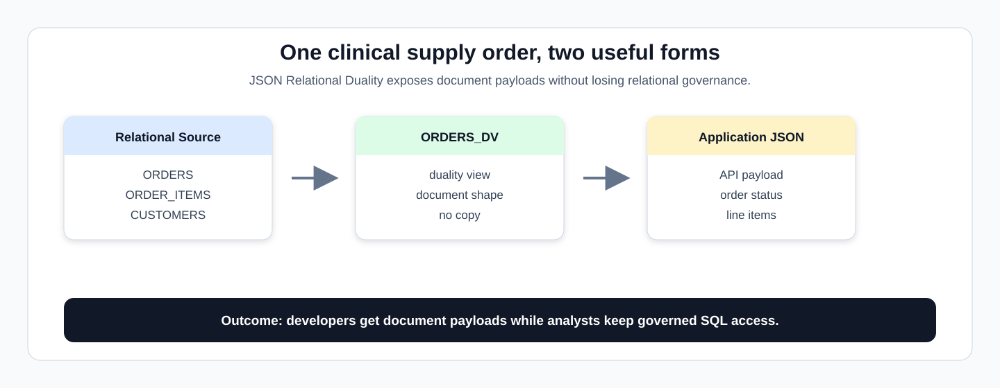
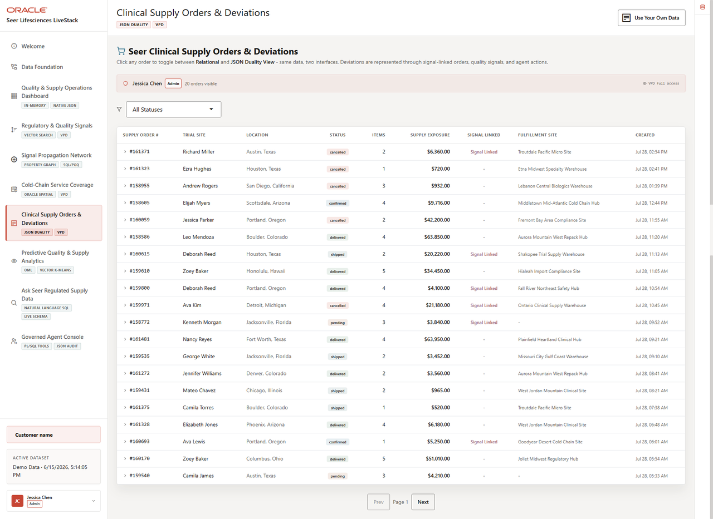

# Clinical Supply Orders and Deviations with JSON Relational Duality

## Introduction

Applications often need clinical supply order data as a clean JSON document, while analysts still need the same data in relational form for filtering, joining, and investigation. This lab uses **JSON Relational Duality** to satisfy both needs from the same governed order data.

Think of this as one clinical supply order wearing two useful forms. The application gets an API-friendly document, while analysts and database developers keep SQL access to the underlying facts for review, investigation, and reconciliation.



The image below is the Clinical Supply Orders and Deviations screen from the Seer Lifesciences application. It shows the order list, clinical supply statuses, signal-linked orders, and fulfillment-site context that JSON Relational Duality keeps connected to relational SQL.



### Objectives

- Read application-friendly clinical supply order documents from a duality view.
- Explain why JSON Relational Duality avoids a separate document copy.
- Use SQL/JSON projection to return document fields as SQL columns for investigation.

Estimated Time: **10 minutes**

### Business Scenario

| Step | Life sciences focus |
| --- | --- |
| Business Problem | Application teams want document-shaped order data, while quality and supply teams need relational controls. |
| Technical Challenge | Developers need API-friendly JSON without copying regulated order records into a separate document store. |
| Persona Focus | Application developers serve document payloads while database developers preserve relational governance and SQL access. |
| What You Will See | JSON Relational Duality exposes clinical supply documents without duplicating data. |
| Database Capability | `ORDERS_DV` and SQL/JSON functions expose JSON and relational access together. |
| Outcome | Clinical supply operations can serve application and analytics needs from one source. |

Persona focus: You are the application/database developer showing how Seer Lifesciences can expose clinical supply order documents while keeping governed relational evidence intact.

Implementation note: `ORDERS_DV` is the physical duality view name in the reusable LiveStack schema. In this Life Sciences workshop, it represents clinical supply orders. The SQL aliases and expected outputs use the clinical supply wording so the physical name does not hide the business meaning.

<details>
<summary><strong>Key terms: JSON, relational tables, JSON Relational Duality, duality view, and projection</strong></summary>

> - **JSON** is a document format that application developers often prefer for APIs because it can represent a complete business object in one payload.
>
> - **Relational tables** store data in rows and columns with defined keys, relationships, constraints, and data types.
>
> - **JSON Relational Duality** lets Oracle Database expose relational data as JSON documents without copying it into a separate document database.
>
> - A **duality view** maps relational tables and columns into a JSON structure. In this lab, `ORDERS_DV` maps `ORDERS` and `ORDER_ITEMS` into one order document.
>
> - **Projection** means pulling selected JSON fields into SQL columns so analysts can filter, sort, and join document values.

</details>

## Task 1: Inspect document-shaped clinical supply orders

Start by inspecting a document-shaped clinical supply order so learners can see the application-friendly JSON shape backed by governed relational data:

1. Run this query:

    > **SQL Worksheet reminder:** Need a reminder on how to open and use the SQL Worksheet? Return to [Getting Started Task 2: Open SQL Worksheet](/workshops/sandbox/index.html?lab=getting-started#Task2:OpenSQLWorksheet) for the step-by-step graphic showing where to paste and run SQL statements.

    You are viewing an order the way an application can consume it: as a JSON document. The SQL selects from `ORDERS_DV` and uses `JSON_SERIALIZE(... PRETTY)` so SQL Worksheet displays the document clearly.

    ```sql
    <copy>
    SELECT JSON_SERIALIZE(data PRETTY) AS order_document
    FROM orders_dv
    ORDER BY JSON_VALUE(data, '$._id' RETURNING NUMBER)
    FETCH FIRST 1 ROW ONLY;
    </copy>
    ```

    **Expected output: Order Document Excerpt**

    | Order Document |
    | --- |
    | { "\_id" : 1, "\_metadata" : { ... }, "customerId" : 1, "status" : "...", "items" : [ ... ] } |

2. Expand the document in SQL Worksheet.

    The database constructs the JSON shape from relational data, so the application gets an order payload without creating a second copy of the regulated supply record.

**Note:** Sample values may change after data refreshes or rebuilds. Focus on the expected result pattern and the business takeaway, not the exact values.

## Task 2: Project JSON fields with SQL

Next, project JSON fields into SQL columns so analysts can review clinical supply status, customer context, and order details without leaving SQL:

1. Run this SQL/JSON projection query:

    The SQL uses `JSON_VALUE` to extract order fields from the duality document. That extraction is the projection step.

    ```sql
    <copy>
    SELECT JSON_VALUE(od.data, '$._id' RETURNING NUMBER) AS clinical_supply_order_id,
           JSON_VALUE(od.data, '$.status') AS clinical_supply_status,
           sites.site_contact_email
    FROM orders_dv od
    JOIN ls_trial_sites_v sites
      ON sites.trial_site_id = JSON_VALUE(od.data, '$.customerId' RETURNING NUMBER)
    WHERE JSON_VALUE(od.data, '$._id' RETURNING NUMBER) IS NOT NULL
    ORDER BY clinical_supply_order_id
    FETCH FIRST 10 ROWS ONLY;
    </copy>
    ```

    **Expected output: JSON Field Projection**

    | Clinical Supply Order Id | Clinical Supply Status | Site Contact Email |
    | --- | --- | --- |
    | 1 | confirmed | site-0417@seer-clinical.example |
    | 2 | processing | site-0971@seer-clinical.example |
    | 3 | shipped | site-0881@seer-clinical.example |
    | 4 | delivered | site-1160@seer-clinical.example |
    | 5 | delivered | site-1814@seer-clinical.example |
    | 6 | delivered | site-1535@seer-clinical.example |
    | 7 | cancelled | site-0763@seer-clinical.example |
    | 8 | pending | site-0554@seer-clinical.example |
    | 9 | confirmed | site-0429@seer-clinical.example |
    | 10 | processing | site-0919@seer-clinical.example |

2. Review the columns returned from the JSON document.

    A developer can serve a clean clinical supply order document to an application, while a quality analyst can still ask normal SQL questions about order status and trial-site contact details. Both users are working from the same source of truth.

**Note:** Sample values may change after data refreshes or rebuilds. Focus on the expected result pattern and the business takeaway, not the exact values.

## Acknowledgements

* **Author** - Oracle Database Product Management
* **Last Updated By/Date** - Oracle Database Product Management, July 2026
