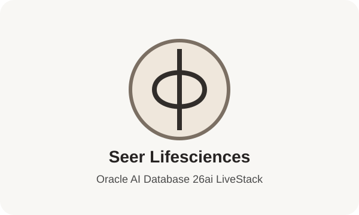

# Final Quiz

```quiz-config
passing: 75
badge: images/livestack-lifesciences-badge.svg
```

## Introduction

Use this scored quiz to check whether you can connect each Seer Lifesciences outcome to the database evidence you inspected in the labs.

### Objectives

- Review the main database capabilities used in the workshop.
- Connect each Life Sciences outcome to supporting database evidence.
- Earn the workshop badge by answering the scored questions.

Estimated Time: **5 minutes**

## Task 1: Answer the quiz questions

1. Complete the scored quiz.

    ```quiz score
    Q: Why does the workshop begin with the Life Sciences data foundation?
    - To manually install every database object.
    * To map the shared data used by each later regulated supply workflow.
    - To replace the application dashboard with catalog reports.
    - To move clinical supply records into external files.
    > The foundation lab orients you to the shared database objects behind the application. Later labs reuse that foundation for dashboard evidence, JSON documents, vector search, graph analysis, spatial coverage, and OML scoring.

    Q: What is the main business value of recreating dashboard evidence with SQL?
    - It hides supporting rows from the quality review process.
    - It treats dashboard screenshots as the final evidence source.
    * It connects KPI summaries to reviewable database evidence.
    - It removes the need for Life Sciences semantic views.
    > The dashboard lab is about explainability. SQL aggregates connect the application summary to reviewable signal, exposure, product, order, and supply evidence.

    Q: What does JSON Relational Duality help Seer Lifesciences do in the order lab?
    - Copy order documents into a separate document database.
    * Serve order data as JSON while keeping SQL access to the same source.
    - Remove relational tables from the order review process.
    - Force analysts to manually read raw JSON for every review.
    > JSON Relational Duality lets the application read an order as a JSON document while analysts can still project fields back into SQL columns and join to governed relational data.

    Q: Why is in-database AI Vector Search valuable for quality signal intelligence?
    * Analysts can search by meaning inside governed Life Sciences data.
    - Analysts must export signal text into a separate search service.
    - Search results come only from table and column metadata.
    - Reviewable SQL is replaced by hidden prompt output.
    > The vector lab shows semantic search by intent, not just keywords. The governance value is that embedding and similarity scoring stay near the regulated supply data.

    Q: In the vector lab, what does the similarity score help an analyst do?
    - Prove that a quality signal is a confirmed deviation.
    - Replace the product and signal tables with embeddings only.
    * Rank products or signals by how closely they match the search phrase.
    - Count how many rows exist in each Life Sciences table.
    > The query turns vector distance into a similarity score, where a higher score means the stored product or signal text is closer in meaning to the search phrase.

    Q: Why does the property graph lab use the physical graph name `INFLUENCER_NETWORK`?
    - It scores future revenue for clinical supply orders.
    * It is the reusable stack graph that the Life Sciences dataset uses for signal sources, manufacturers, and products.
    - It stores service coverage regions for operations teams.
    - It replaces relationship evidence with flat product totals.
    > The graph lab explains the physical naming convention before using SQL/PGQ. The business meaning comes from the Life Sciences data and learner-facing aliases.

    Q: Why does the cold-chain service coverage lab use spatial data?
    - To make coverage decisions outside the governed database.
    - To hide capacity evidence from supply operations leaders.
    * To compare trial-site distance, cold-chain locations, and supply capacity.
    - To replace spatial queries with static labels.
    > Spatial data lets operations teams measure which cold-chain sites are near trial sites and whether capacity evidence supports response planning.

    Q: What outcome does in-database OML scoring support?
    - Regulated supply records must be exported into a separate prediction store.
    - Model output can only be reviewed inside the application UI.
    - Models can be trusted without showing SQL evidence.
    * Predictions can be scored where governed data already lives.
    > The OML lab is not only about model names. It shows how deployed models produce reviewable predictions close to the data that drives them.

    Q: In the OML lab, what does model confidence mean?
    - It guarantees that the prediction will happen.
    * It is the model probability for a prediction and should still be reviewed.
    - It is the number of rows in the OML model catalog.
    - It means the model no longer needs business context.
    > Confidence helps compare stronger and weaker predictions, but it is not certainty. The lab also uses a simple agreement check to compare predicted labels with the stored labels.

    Q: What is the main advantage of using Oracle Database as the converged foundation for this workshop?
    - Each Life Sciences capability must use a separate specialized data store.
    * SQL, JSON, vector, graph, spatial, and OML evidence stay connected.
    - Application screenshots replace the need for database evidence.
    - Quality teams must reconcile copied data before every investigation.
    > The workshop uses different database capabilities for different Life Sciences questions, but the value is that they operate from connected governed data. That reduces copying, reconciliation, and fragmented explanations.
    ```

2. Review the completion badge.

    

## Acknowledgements

* **Author** - Oracle Database Product Management
* **Last Updated By/Date** - Oracle Database Product Management, July 2026
