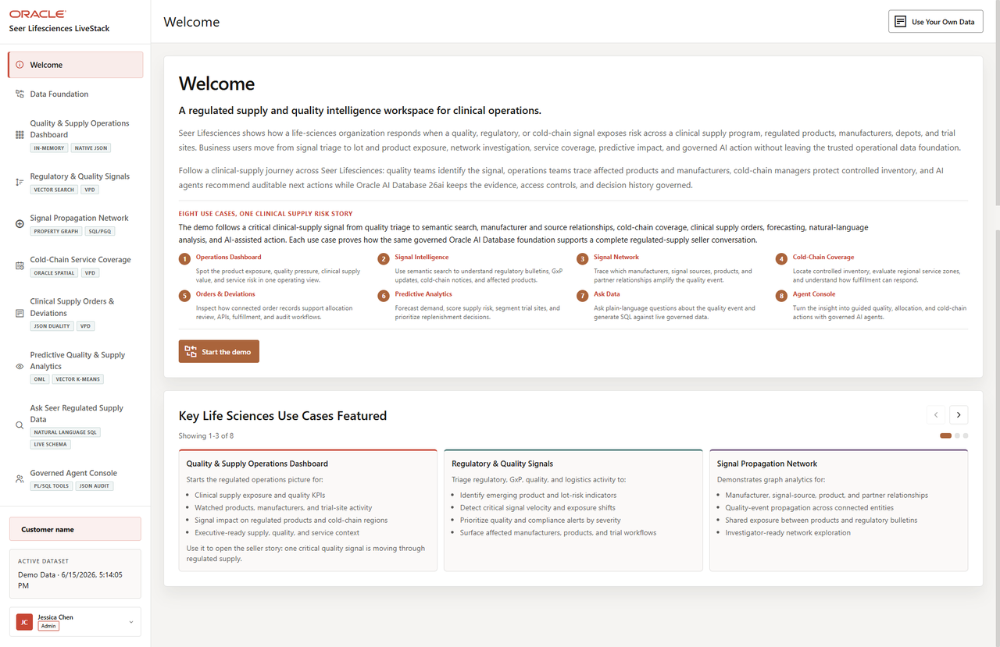

# Introduction

## Introduction

A quality alert lands before the clinical supply meeting starts. **Seer Lifesciences** needs to know which regulated products, trial sites, cold-chain routes, and manufacturer relationships deserve attention first, and every answer must be explainable.

In this workshop, you use **Oracle AI Database 26ai** to follow that evidence in SQL: map the data foundation, recreate dashboard metrics, inspect clinical supply order documents, search quality signal language by meaning, traverse signal relationships, measure cold-chain coverage, and score predictive models.

The business problem is familiar in life sciences: supply and quality teams must prioritize regulated products, trial sites, and cold-chain routes without losing the evidence trail. Those decisions become harder when product masters, order details, quality signals, semantic search indexes, relationship graphs, maps, and model scores sit in separate systems.

This workshop follows one regulated supply decision path. You begin by mapping the data foundation, then recreate dashboard evidence, inspect clinical supply order documents, search quality signal language by meaning, traverse signal relationships, measure cold-chain coverage, and score predictive models. Each step uses SQL so you can explain where the evidence came from and why the result is safe to review.

Expandable sections are used throughout the workshop for optional detail. Select the arrow beside **Key terms** or **Why this matters** sections when you want more context without leaving the main task flow.

The image below is the Seer Lifesciences welcome and orientation screen. It introduces the clinical supply control-tower story: regulated product exposure, quality signals, cold-chain routing, and predictive supply analytics need to stay connected so teams can respond quickly and explain their decisions.

<strong>Key terms: regulated product, quality signal, clinical supply, cold chain, and converged database</strong>

> - A **regulated product** is a product or material that must be handled with life sciences controls, such as manufacturing, quality, clinical trial, labeling, or temperature requirements.
>
> - A **quality signal** is a bulletin, event, deviation, advisory, complaint, or operational observation that may affect regulated supply decisions.
>
> - **Clinical supply** refers to the products, kits, lots, and materials shipped to trial sites or care settings.
>
> - **Cold chain** is the temperature-controlled storage and logistics path for products that must remain within controlled handling conditions.
>
> - A **converged database** lets relational rows, JSON documents, vectors, property graphs, spatial data, and machine learning work from one governed database foundation.

### Objectives

- Understand the Seer Lifesciences clinical supply scenario.
- See how the workshop maps to the active Life Sciences LiveStack scenes.
- Preview the SQL-first decision path you will follow.

Estimated Workshop Time: **90 minutes**

### Business Scenario

| Step | Life sciences focus |
| --- | --- |
| Business Problem | Quality, supply, and trial operations teams need connected evidence before deciding which products, trial sites, or routes need attention. |
| Technical Challenge | The application uses relational data, JSON documents, vectors, graphs, spatial objects, and OML models, but learners need a deterministic SQL path that can be explained. |
| Persona Focus | Database developers, clinical supply analysts, quality leaders, and supply planners trace the evidence behind the Seer Lifesciences application. |
| What You Will Do | Query the database objects behind the active Life Sciences application scenes. |
| Database Capability | Oracle AI Database 26ai supports SQL, JSON Relational Duality, AI Vector Search, Property Graph, Oracle Spatial, and Oracle Machine Learning in one schema. |
| Outcome | You can explain the clinical supply decision path from governed database evidence rather than disconnected screenshots or generated answers. |

## Task 1: Review the workshop path

Start by reviewing the active lab sequence so you can see how each exercise follows the same regulated supply decision path:

1. Review the active lab sequence.

    | Lab | What you inspect |
    | --- | --- |
    | Lab 1 | The shared Life Sciences data foundation and object inventory. |
    | Lab 2 | Dashboard KPIs and regulated product exposure evidence. |
    | Lab 3 | Clinical supply order documents with JSON Relational Duality. |
    | Lab 4 | Quality signal search with AI Vector Search. |
    | Lab 5 | Signal source and manufacturer relationships with Property Graph. |
    | Lab 6 | Cold-chain site and trial-site coverage with Oracle Spatial. |
    | Lab 7 | Predictive quality and supply analytics with Oracle Machine Learning (OML). |
    | Lab 8 | Business outcomes and the converged database takeaway. |
    | Lab 9 | Final quiz and completion badge. |

2. Notice the SQL-first pattern.

    Each active lab starts from a business question and then asks the database for evidence. That pattern keeps the workshop deterministic: dashboard values, document fields, vector matches, graph paths, spatial distances, and model scores can all be explained from SQL.

## Acknowledgements

* **Author** - Oracle Database Product Management
* **Last Updated By/Date** - Oracle Database Product Management, July 2026
