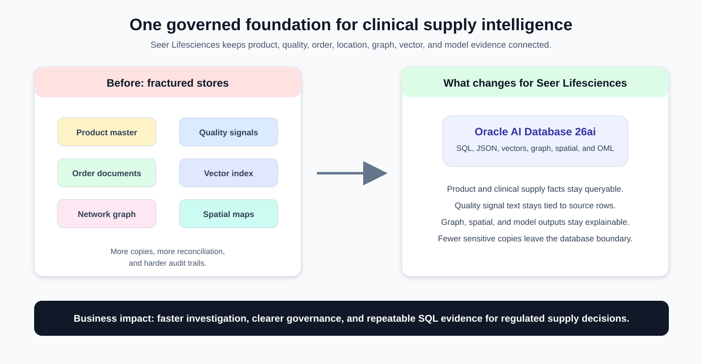
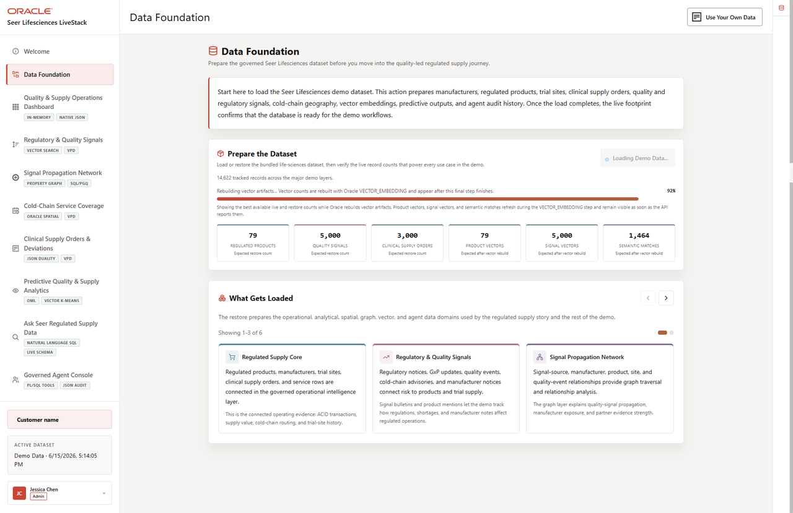

# Life Sciences Data Foundation

## Introduction

This lab confirms that the current **Seer Lifesciences** data foundation is present before any clinical supply result is trusted. You inspect semantic views, core data groups, **JSON duality views**, vectors, graphs, spatial objects, and **Oracle Machine Learning (OML)** models as the shared evidence base for the rest of the workshop.

The goal is simple: confirm how regulated product, quality signal, trial-site, order, cold-chain, and predictive decisions connect to one database before you start using the data for review or prioritization.

**Oracle AI Database 26ai** is a converged database. It lets these different life sciences workloads use one governed database foundation instead of forcing each data type into a separate specialist system.



The image below is the Data Foundation screen from the Seer Lifesciences application. It shows the dataset preparation workflow, restore progress, loaded data groups, and current counts that anchor the SQL checks in this lab.



<details>
<summary><strong>Key terms: schema, view, vector, graph, spatial, and Oracle Machine Learning (OML)</strong></summary>

> - A **schema** is a named workspace inside the database. In this workshop, `LLUSER` owns the Life Sciences tables, views, vectors, graphs, functions, and models.
>
> - A **view** is a saved SQL query that presents data in a useful shape. The `LS_*_V` views expose business-friendly Life Sciences names over the application tables.
>
> - A **vector** stores a numerical representation of meaning. It helps the database compare quality signal text and regulated product descriptions by meaning.
>
> - A **property graph** represents entities and relationships. In this workshop, signal sources, manufacturers, products, and posts can be queried as connected evidence.
>
> - **Spatial** data stores location and shape information. Cold-chain sites and trial sites use points, while coverage regions use boundaries.
>
> - **Oracle Machine Learning (OML)** lets models be stored and scored inside Oracle Database, where the regulated supply data already lives.

</details>

### Objectives

- Review the Life Sciences semantic views.
- Check the current object families used by later labs.
- Map each application workflow to the Oracle AI Database 26ai capability behind it.

Estimated Time: **10 minutes**

### Business Scenario

| Step | Life sciences focus |
| --- | --- |
| Business Problem | Quality, supply, and trial operations teams need a shared view of the evidence used to make regulated supply decisions. |
| Technical Challenge | Platform teams must show how one schema supports semantic views, JSON, vectors, graph, spatial, and OML evidence. |
| Persona Focus | Database developers and platform engineers map the foundation that business users rely on for downstream decisions. |
| What You Will See | The current Life Sciences LiveStack uses connected views and object families in one database schema. |
| Database Capability | Oracle catalog views and Life Sciences semantic views expose the governed object inventory. |
| Outcome | Each regulated supply result can be traced back to the same queryable data foundation. |

Persona focus: You are the database developer showing how Seer Lifesciences' shared foundation supports quality, supply, routing, and prediction workflows.

## Task 1: Inventory the Life Sciences object families

Start by inventorying the semantic views and database capabilities that the rest of the workshop depends on:

1. Run this inventory query:

    > **SQL Worksheet reminder:** Need a reminder on how to open and use the SQL Worksheet? Return to [Getting Started Task 2: Open SQL Worksheet](/workshops/sandbox/index.html?lab=getting-started#Task2:OpenSQLWorksheet) for the step-by-step graphic showing where to paste and run SQL statements.

    You are building a capability map before making any regulated supply decisions. Each section counts one kind of capability used by later labs.

    The Life Sciences LiveStack reuses a common application schema under the Life Sciences semantic layer. That is why some physical object names are generic, such as `ORDERS_DV`, `PRODUCTS_INVENTORY_DV`, `INFLUENCER_NETWORK`, `FULFILLMENT_CENTERS`, and `CUSTOMERS`. In this workshop, the learner-facing views map those objects to clinical supply orders, regulated product inventory, signal propagation, cold-chain sites, and trial sites.

    ```sql
    <copy>
    SELECT 'Life Sciences semantic views' AS "Area", COUNT(*) AS "Count"
    FROM user_views
    WHERE view_name IN (
      'LS_MANUFACTURERS_V','LS_REGULATED_PRODUCTS_V','LS_QUALITY_SIGNALS_V',
      'LS_SIGNAL_SOURCES_V','LS_CLINICAL_SUPPLY_ORDERS_V','LS_TRIAL_SITES_V',
      'LS_COLD_CHAIN_SITES_V','LS_SUPPLY_CAPACITY_V','LS_COLD_CHAIN_ROUTES_V',
      'LS_OPERATIONS_DASHBOARD_V'
    )
    UNION ALL
    SELECT 'JSON duality views', COUNT(*)
    FROM user_json_duality_views
    WHERE view_name IN ('ORDERS_DV','PRODUCTS_INVENTORY_DV')
    UNION ALL
    SELECT 'Signal property graphs', COUNT(*)
    FROM user_property_graphs
    WHERE graph_name = 'INFLUENCER_NETWORK'
    UNION ALL
    SELECT 'MiniLM vector columns', COUNT(*)
    FROM user_tab_cols
    WHERE data_type = 'VECTOR'
      AND table_name IN ('PRODUCT_EMBEDDINGS','POST_EMBEDDINGS')
    UNION ALL
    SELECT 'Spatial metadata layers', COUNT(*)
    FROM user_sdo_geom_metadata
    WHERE table_name IN ('FULFILLMENT_CENTERS','CUSTOMERS','FULFILLMENT_ZONES','DEMAND_REGIONS')
    UNION ALL
    SELECT 'OML mining models', COUNT(*)
    FROM user_mining_models
    WHERE model_name IN (
      'DEMAND_SURGE_MODEL','CUSTOMER_SEGMENT_MODEL',
      'REVENUE_PREDICT_MODEL','PRODUCT_CLUSTER_MODEL'
    );
    </copy>
    ```

    **Expected output: Foundation Object Inventory**

    | Area | Count |
    | --- | --- |
    | Life Sciences semantic views | 10 |
    | JSON duality views | 2 |
    | Signal property graphs | 1 |
    | MiniLM vector columns | 2 |
    | Spatial metadata layers | 4 |
    | OML mining models | 4 |

2. Review the counts.

    Read the result as a capability checklist. The query reads Oracle catalog views instead of application tables, so it tells you which kinds of database objects are available before you use them.

    The physical names are part of the reusable stack implementation. The business meaning comes from the Life Sciences semantic views and the lab context. That distinction matters in production too: application object names may remain stable while views and documentation expose industry-specific terms.

**Note:** Sample values may change after data refreshes or rebuilds. Focus on the expected result pattern and the business takeaway, not the exact values.

## Task 2: Count the current Life Sciences data groups

Next, count the current Life Sciences data groups so later dashboard, graph, search, spatial, and prediction results have a scale reference:

1. Run this data group count query:

    ```sql
    <copy>
    SELECT 'Manufacturers' AS "Data Group", COUNT(*) AS "Rows" FROM ls_manufacturers_v
    UNION ALL SELECT 'Regulated products', COUNT(*) FROM ls_regulated_products_v
    UNION ALL SELECT 'Quality signals', COUNT(*) FROM ls_quality_signals_v
    UNION ALL SELECT 'Signal sources', COUNT(*) FROM ls_signal_sources_v
    UNION ALL SELECT 'Clinical supply orders', COUNT(*) FROM ls_clinical_supply_orders_v
    UNION ALL SELECT 'Trial sites', COUNT(*) FROM ls_trial_sites_v
    UNION ALL SELECT 'Cold-chain sites', COUNT(*) FROM ls_cold_chain_sites_v
    UNION ALL SELECT 'Supply capacity rows', COUNT(*) FROM ls_supply_capacity_v
    UNION ALL SELECT 'Cold-chain routes', COUNT(*) FROM ls_cold_chain_routes_v;
    </copy>
    ```

    **Expected output: Life Sciences Row Counts**

    | Data Group | Rows |
    | --- | --- |
    | Manufacturers | 50 |
    | Regulated products | 79 |
    | Quality signals | 5000 |
    | Signal sources | 463 |
    | Clinical supply orders | 3000 |
    | Trial sites | 2000 |
    | Cold-chain sites | 30 |
    | Supply capacity rows | 781 |
    | Cold-chain routes | 1500 |

2. Use the counts as the baseline for later analysis.

    These counts establish the scale of the Life Sciences scenario. When a later query returns only a few rows, you can understand why: the SQL is filtering, ranking, scoring, or following relationships from this larger population.

**Note:** Sample values may change after data refreshes or rebuilds. Focus on the expected result pattern and the business takeaway, not the exact values.

## Acknowledgements

* **Author** - Oracle Database Product Management
* **Last Updated By/Date** - Oracle Database Product Management, July 2026
