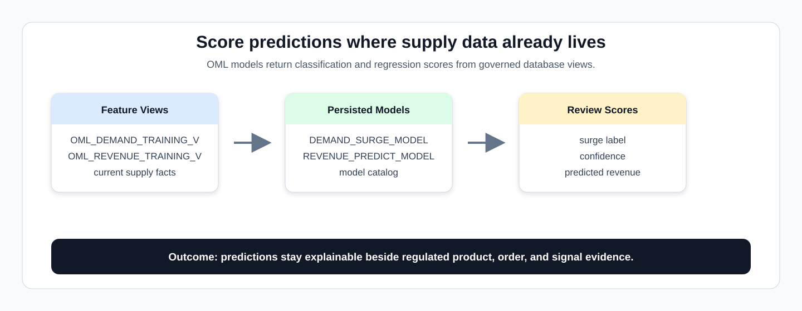
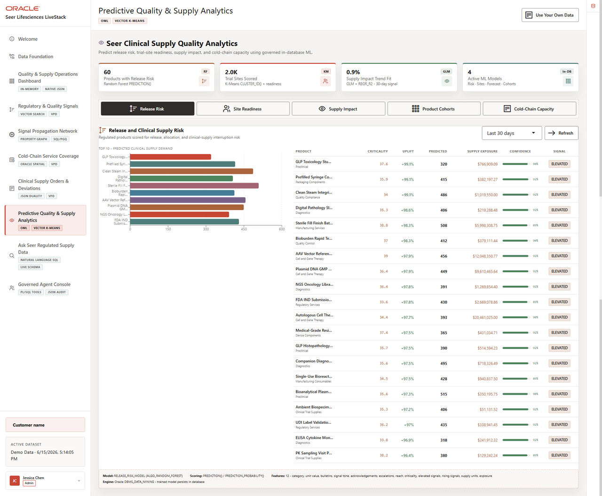

# Predictive Quality and Supply Analytics with Oracle Machine Learning (OML)

## Introduction

Life sciences teams use dashboards to understand what has already happened, but they also need predictions that help them plan what to do next. Those predictions are more useful when analysts can see which model produced the score, which business record was scored, and how the result connects back to regulated product, signal, order, or supply decisions.



The image below is the Predictive Quality and Supply Analytics screen from the Seer Lifesciences application. It shows release-risk scoring, site readiness, supply impact, product cohorts, and model evidence that the OML SQL examples inventory and score directly in the database.



### Objectives

- Inventory the four OML models.
- Score classification and regression models.
- Review a simple model agreement check.

Estimated Time: **12 minutes**

### Business Scenario

| Step | Life sciences focus |
| --- | --- |
| Business Problem | Supply teams need prediction without exporting sensitive regulated operating data. |
| Technical Challenge | Data science and application teams need deployed models that can be scored from SQL. |
| Persona Focus | You connect deployed ML models to the supply decision-maker review process. |
| What You Will See | Persisted OML models can be inventoried and scored directly in SQL. |
| Database Capability | The OML model catalog, `PREDICTION`, and `PREDICTION_PROBABILITY` support in-database ML scoring. |
| Outcome | Demand, segmentation, revenue, and product grouping outputs are explainable from SQL. |

<details>
<summary><strong>Key terms: OML model, feature, classification, regression, clustering, and confidence</strong></summary>

> - A **model** is a trained pattern that can score current data.
>
> - A **feature** is an input value used by a model.
>
> - **Classification** predicts a category or label, such as `SURGE` or `STABLE`.
>
> - **Regression** predicts a number, such as expected order value or supply impact.
>
> - **Clustering** groups similar records together without requiring a preassigned label.
>
> - **Confidence** is the model probability for a prediction. It is not a guarantee and still needs business review.

</details>

## Task 1: Inventory persisted OML models

Start by inventorying the persisted OML models so learners know which predictive assets are available before scoring regulated supply data:

1. Run this model inventory query:

    > **SQL Worksheet reminder:** Need a reminder on how to open and use the SQL Worksheet? Return to [Getting Started Task 2: Open SQL Worksheet](/workshops/sandbox/index.html?lab=getting-started#Task2:OpenSQLWorksheet) for the step-by-step graphic showing where to paste and run SQL statements.

    `USER_MINING_MODELS` is the Oracle Machine Learning model catalog for the current schema. This query confirms which persisted models are available before you call them from SQL.

    The physical model names come from the reusable LiveStack training scripts. In this Life Sciences workshop, `DEMAND_SURGE_MODEL` scores regulated product supply pressure, `REVENUE_PREDICT_MODEL` predicts order value exposure, and the clustering models group trial sites or products for planning.

    ```sql
    <copy>
    SELECT model_name,
           mining_function,
           algorithm
    FROM user_mining_models
    WHERE model_name IN (
      'CUSTOMER_SEGMENT_MODEL',
      'DEMAND_SURGE_MODEL',
      'PRODUCT_CLUSTER_MODEL',
      'REVENUE_PREDICT_MODEL'
    )
    ORDER BY model_name;
    </copy>
    ```

    **Expected output: OML Model Inventory**

    | Model Name | Mining Function | Algorithm |
    | --- | --- | --- |
    | CUSTOMER\_SEGMENT\_MODEL | CLUSTERING | KMEANS |
    | DEMAND\_SURGE\_MODEL | CLASSIFICATION | RANDOM\_FOREST |
    | PRODUCT\_CLUSTER\_MODEL | CLUSTERING | KMEANS |
    | REVENUE\_PREDICT\_MODEL | REGRESSION | GENERALIZED\_LINEAR\_MODEL |

2. Confirm the model list.

    The inventory gives you a checkpoint before scoring: what model exists, what it predicts, and whether it can be called from SQL.

**Note:** Sample values may change after data refreshes or rebuilds. Focus on the expected result pattern and the business takeaway, not the exact values.

## Task 2: Score demand surge and revenue in SQL

Next, score demand surge and revenue directly in SQL so model output stays connected to regulated product, order, signal, and business context:

1. Run the demand surge classification query:

    ```sql
    <copy>
    SELECT s.product_id,
           p.product_name,
           s.training_label,
           s.predicted_surge,
           s.confidence
    FROM (
      SELECT product_id,
             surge_flag AS training_label,
             PREDICTION(DEMAND_SURGE_MODEL USING *) AS predicted_surge,
             ROUND(PREDICTION_PROBABILITY(DEMAND_SURGE_MODEL USING *), 4) AS confidence
      FROM oml_demand_training_v
    ) s
    JOIN products p ON p.product_id = s.product_id
    ORDER BY s.product_id
    FETCH FIRST 10 ROWS ONLY;
    </copy>
    ```

    **Expected output: Surge Prediction Results**

    | Product Id | Product Name | Training Label | Predicted Surge | Confidence |
    | --- | --- | --- | --- | --- |
    | 1 | mRNA LNP Clinical Batch | WATCH | WATCH | 0.6552 |
    | 2 | Recombinant Protein GMP Lot | SURGE | SURGE | 0.6592 |
    | 3 | AAV Vector Reference Lot | SURGE | SURGE | 0.9833 |
    | 4 | Sterile Fill Finish Batch Slot | SURGE | SURGE | 0.995 |
    | 5 | Stability Study Sample Set | WATCH | WATCH | 0.7379 |
    | 6 | Phase II Site Activation Kit | WATCH | SURGE | 0.6483 |
    | 7 | eConsent Participant Packet | SURGE | SURGE | 0.9838 |
    | 8 | Randomization Label Pack | WATCH | WATCH | 0.7379 |
    | 9 | Comparator Drug Blinding Kit | SURGE | SURGE | 0.9883 |
    | 10 | Rescue Medication Site Pack | SURGE | SURGE | 0.6693 |

2. Check how often the demand model matches the known label. This comparison is a simple validation view: it does not prove the model is perfect, but it shows whether predicted labels line up with the labels in the workshop data.

    ```sql
    <copy>
    SELECT actual_label,
           predicted_label,
           COUNT(*) AS product_count
    FROM (
      SELECT surge_flag AS actual_label,
             PREDICTION(DEMAND_SURGE_MODEL USING *) AS predicted_label
      FROM oml_demand_training_v
    )
    GROUP BY actual_label,
             predicted_label
    ORDER BY actual_label,
             predicted_label;
    </copy>
    ```

    **Expected output: Demand Model Agreement Check**

    | Actual Label | Predicted Label | Product Count |
    | --- | --- | --- |
    | SURGE | SURGE | 57 |
    | SURGE | WATCH | 2 |
    | WATCH | SURGE | 4 |
    | WATCH | WATCH | 16 |

3. Run revenue regression. A regression model predicts a number, so this query compares the known target revenue with the predicted revenue returned by the model for each order.

    ```sql
    <copy>
    SELECT order_id,
           target_revenue,
           ROUND(PREDICTION(REVENUE_PREDICT_MODEL USING *), 2) AS predicted_revenue
    FROM oml_revenue_training_v
    ORDER BY order_id
    FETCH FIRST 10 ROWS ONLY;
    </copy>
    ```

    **Expected output: Revenue Prediction Results**

    | Order Id | Target Revenue | Predicted Revenue |
    | --- | --- | --- |
    | 1 | 5250.0 | 4870.96 |
    | 2 | 2580.0 | 3525.59 |
    | 3 | 54785.0 | 42643.25 |
    | 4 | 70570.0 | 118099.46 |
    | 5 | 149290.0 | 95200.72 |
    | 6 | 1080.0 | -3529.89 |
    | 7 | 75134.0 | 97292.78 |
    | 8 | 28500.0 | 26042.58 |
    | 9 | 18800.0 | 18790.96 |
    | 10 | 3540.0 | 4053.21 |

4. Compare actual target revenue to predicted revenue.

    Close values show where the model estimate lines up with known outcomes. Larger gaps show where an analyst may want more context, such as unusual trial-site behavior, product mix, or fulfillment timing.

**Note:** Sample values may change after data refreshes or rebuilds. Focus on the expected result pattern and the business takeaway, not the exact values.

## Acknowledgements

* **Author** - Oracle Database Product Management
* **Last Updated By/Date** - Oracle Database Product Management, July 2026
