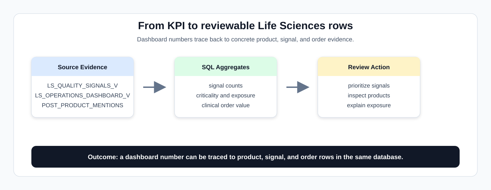
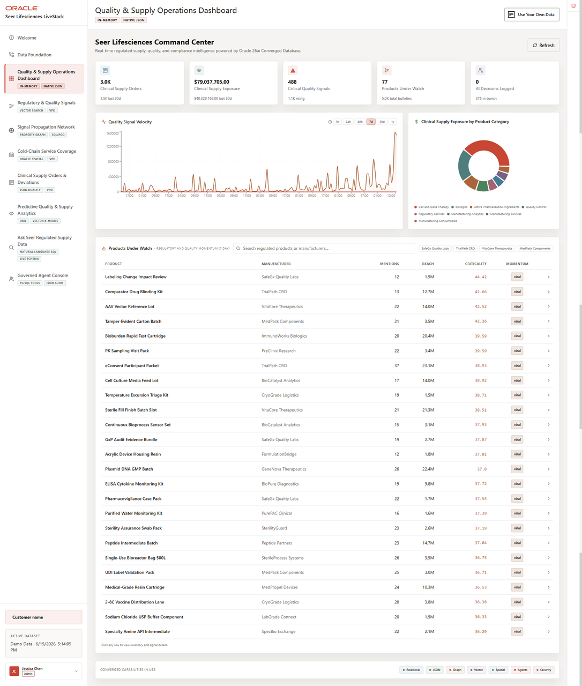

# Quality and Supply Operations Dashboard

## Introduction

Quality and supply leaders rarely have time to inspect every signal one by one. They need to know which regulated products, quality signals, and clinical supply orders deserve review first. In this lab, you recreate the evidence behind the application dashboard so each metric can be traced back to SQL.

In this lab, **exposure** means the reach or scale of monitored quality and supply signals. A high-exposure signal can affect more trial sites, regulated products, routes, or operational work.



The image below is the Quality and Supply Operations Dashboard from the Seer Lifesciences application. It shows the KPI cards, signal velocity chart, exposure breakdown, and product review queue that the SQL in this lab explains from governed database rows.



### Objectives

- Calculate quality signal KPIs.
- Identify regulated products with high signal exposure.
- Drill through from dashboard totals to reviewable rows.

Estimated Time: **10 minutes**

### Business Scenario

| Step | Life sciences focus |
| --- | --- |
| Business Problem | Quality and supply teams need a shared view of signal severity, order exposure, and review pressure. |
| Technical Challenge | App and data teams need one explainable query path instead of separate pipelines for signals, products, trial sites, and orders. |
| Persona Focus | Quality operations leaders read the dashboard; database developers show where the evidence comes from. |
| What You Will See | Dashboard metrics are database-backed and can be explained with SQL. |
| Database Capability | Converged SQL aggregates Life Sciences views and source tables. |
| Outcome | Operators can move from a dashboard KPI to trusted detail without changing systems. |

Persona focus: You support the quality operations leader by showing that one database query path can explain the dashboard.

## Task 1: Calculate quality signal KPIs

Start with the dashboard aggregate query so the top-level quality and supply metrics become reviewable SQL evidence:

1. Run the dashboard aggregate query:

    > **SQL Worksheet reminder:** Need a reminder on how to open and use the SQL Worksheet? Return to [Getting Started Task 2: Open SQL Worksheet](/workshops/sandbox/index.html?lab=getting-started#Task2:OpenSQLWorksheet) for the step-by-step graphic showing where to paste and run SQL statements.

    The SQL aggregates `LS_QUALITY_SIGNALS_V`, calculates average criticality, counts signals above the high-review threshold, and sums exposure and opened cases into one KPI row.

    ```sql
    <copy>
    SELECT COUNT(*) AS total_signals,
           ROUND(AVG(criticality_score), 1) AS avg_criticality,
           SUM(CASE WHEN criticality_score >= 75 THEN 1 ELSE 0 END) AS high_review_signals,
           SUM(exposure_count) AS total_exposure,
           SUM(cases_opened_count) AS cases_opened
    FROM ls_quality_signals_v;
    </copy>
    ```

    **Expected output: Dashboard KPI Summary**

    | Total Signals | Avg Criticality | High Review Signals | Total Exposure | Cases Opened |
    | --- | --- | --- | --- | --- |
    | 5000 | 33.8 | 480 | 1636030111 | 5742392 |

2. Interpret the result.

    The query compresses monitored quality and supply signals into headline measures a leader would scan first: volume, average severity, high-review count, exposure, and opened cases. A signal is not automatically a confirmed deviation. It is evidence that may need review, escalation, or supply planning.

**Note:** Sample values may change after data refreshes or rebuilds. Focus on the expected result pattern and the business takeaway, not the exact values.

## Task 2: Review product-linked quality signal rows

Next, review product-linked quality signal rows so a dashboard count becomes a prioritized list of regulated products, manufacturers, and signals:

1. Run this product-linked signal query:

    `POST_PRODUCT_MENTIONS` is a bridge table. It connects a quality signal to the regulated product mentioned by that signal. The joins then bring in product and manufacturer context so the dashboard number becomes a reviewable business row.

    ```sql
    <copy>
    SELECT signals.signal_id,
           signals.criticality_score,
           signals.exposure_count,
           signals.cases_opened_count,
           products.regulated_product_name,
           manufacturers.manufacturer_name,
           products.product_category
    FROM ls_quality_signals_v signals
    JOIN post_product_mentions mentions
         ON mentions.post_id = signals.signal_id
    JOIN ls_regulated_products_v products
         ON products.regulated_product_id = mentions.product_id
    JOIN ls_manufacturers_v manufacturers
         ON manufacturers.manufacturer_id = products.manufacturer_id
    WHERE signals.criticality_score >= 75
    ORDER BY signals.criticality_score DESC, signals.exposure_count DESC, signals.signal_id
    FETCH FIRST 10 ROWS ONLY;
    </copy>
    ```

    **Expected output: Product-Linked Quality Signals**

    | Signal Id | Criticality Score | Exposure Count | Cases Opened Count | Regulated Product Name | Manufacturer Name | Product Category |
    | --- | --- | --- | --- | --- | --- | --- |
    | 3968 | 99.81 | 13534246 | 48191 | Protein A Resin Qualification Pack | ImmunoWorks Biologics | Manufacturing Consumables |
    | 1724 | 99.76 | 7491548 | 43452 | Prefilled Syringe Component Kit | MedPack Components | Packaging Components |
    | 2640 | 99.71 | 2548578 | 34176 | Bioanalytical Plasma Sample Set | PreClinix Research | Preclinical |
    | 3881 | 99.7 | 14818896 | 42312 | PAT Spectroscopy Model Pack | BioCatalyst Analytics | Manufacturing Analytics |
    | 4456 | 99.69 | 17307285 | 39206 | Sterile WFI Vial Batch | WFI Direct | Pharma Excipients |
    | 945 | 99.66 | 18287184 | 40207 | UDI Label Validation Pack | MedPack Components | Regulatory Services |
    | 3614 | 99.66 | 7233128 | 35972 | Plasmid DNA GMP Batch | GeneNova Therapeutics | Cell and Gene Therapy |
    | 2362 | 99.66 | 6165924 | 22292 | qPCR Respiratory Panel | BioPure Diagnostics | Diagnostics |
    | 1990 | 99.65 | 9167878 | 36584 | Protein A Resin Qualification Pack | ImmunoWorks Biologics | Manufacturing Consumables |
    | 3753 | 99.65 | 4250008 | 44454 | Phase II Site Activation Kit | TrialPath CRO | Clinical Trial Supplies |

2. Review the product-linked rows.

    Each row connects a quality signal to a regulated product. Start with the first row and ask three questions: which product is involved, who manufactures it, and how much exposure or follow-up work exists?

**Note:** Sample values may change after data refreshes or rebuilds. Focus on the expected result pattern and the business takeaway, not the exact values.

## Task 3: Summarize regulated product exposure

Broaden the view from individual signals to regulated product exposure so quality leaders can see which products combine signal volume, severity, and business reach:

1. Run this product exposure query.

    ```sql
    <copy>
    SELECT products.regulated_product_name,
           manufacturers.manufacturer_name,
           products.product_category,
           COUNT(DISTINCT signals.signal_id) AS signal_count,
           ROUND(AVG(signals.criticality_score), 1) AS avg_criticality,
           SUM(signals.exposure_count) AS exposure_count
    FROM ls_quality_signals_v signals
    JOIN post_product_mentions mentions
         ON mentions.post_id = signals.signal_id
    JOIN ls_regulated_products_v products
         ON products.regulated_product_id = mentions.product_id
    JOIN ls_manufacturers_v manufacturers
         ON manufacturers.manufacturer_id = products.manufacturer_id
    GROUP BY products.regulated_product_name, manufacturers.manufacturer_name, products.product_category
    ORDER BY avg_criticality DESC, exposure_count DESC
    FETCH FIRST 10 ROWS ONLY;
    </copy>
    ```
    **Note:** This query groups product-linked quality signals by regulated product and manufacturer, then calculates how often each product appears, how severe the linked signals are on average, and how much exposure is represented.

    **Expected output: Top Product Exposure**

    | Regulated Product Name | Manufacturer Name | Product Category | Signal Count | Avg Criticality | Exposure Count |
    | --- | --- | --- | --- | --- | --- |
    | Process Deviation Triage Service | BioCatalyst Analytics | Quality Compliance | 40 | 39.8 | 34015497 |
    | Sterile Connector Assembly | SterileProcess Systems | Manufacturing Consumables | 44 | 39.1 | 9403615 |
    | Imported API Release Lot | PortBio Supply | Active Pharmaceutical Ingredients | 44 | 38.8 | 46381339 |
    | eConsent Participant Packet | TrialPath CRO | Clinical Trial Supplies | 55 | 38.5 | 38476225 |
    | Device Adhesive Biocompatibility Lot | AdhesiveOne Medical | Device Components | 42 | 38.5 | 26596099 |
    | AAV Vector Reference Lot | VitaCore Therapeutics | Cell and Gene Therapy | 53 | 37.5 | 20087922 |
    | Sterile Fill Finish Batch Slot | VitaCore Therapeutics | Manufacturing Services | 48 | 37.1 | 45707030 |
    | Protein A Resin Qualification Pack | ImmunoWorks Biologics | Manufacturing Consumables | 46 | 37.1 | 42313070 |
    | Animal Health Vaccine Batch | PreClinix Research | Vaccines | 45 | 37.1 | 15063914 |
    | PAT Spectroscopy Model Pack | BioCatalyst Analytics | Manufacturing Analytics | 53 | 36.9 | 27281615 |

2. Use the summary to prioritize review.

    Review products with many signals, high average criticality, and high exposure first. That mix means the issue appears repeatedly, scores as more severe, and may affect more regulated supply work.

    For a production dashboard, useful indexes usually support the filter and join columns used here: `SIGNAL_ID`, `POST_ID`, `PRODUCT_ID`, `CRITICALITY_SCORE`, and manufacturer or product keys. A materialized view may help when many users run the same dashboard totals. This lab uses direct SQL so the calculation stays visible.

**Note:** Sample values may change after data refreshes or rebuilds. Focus on the expected result pattern and the business takeaway, not the exact values.

## Acknowledgements

* **Author** - Oracle Database Product Management
* **Last Updated By/Date** - Oracle Database Product Management, July 2026
