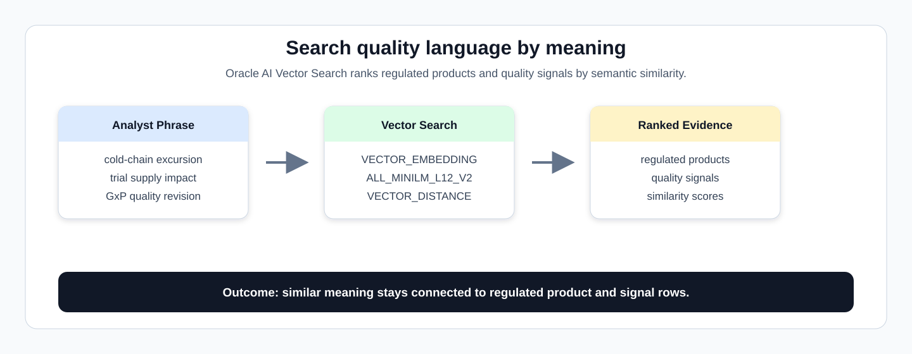
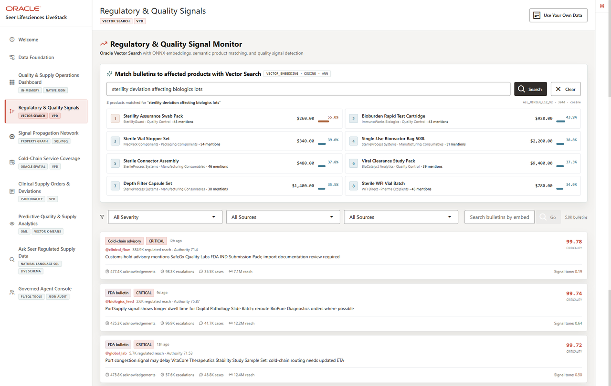

# Regulatory and Quality Signals with AI Vector Search

## Introduction

Quality teams often know what they are looking for before they know the exact words used in the data. This lab uses current Life Sciences embeddings to search by meaning instead of exact keywords, helping analysts connect regulated product language, clinical supply impact, and quality signals without exporting text to another service.

That matters because an analyst may ask about "cold-chain excursion trial supply impact" while the data uses related phrases such as stability, temperature deviation, GxP queue, or clinical batch. Vector search helps find the right neighborhood of meaning while the source text and similarity scoring stay inside **Oracle AI Database**.



The image below is the Regulatory and Quality Signal Monitor from the Seer Lifesciences application. It shows vector search over bulletin language, matched regulated products, and critical signal rows that the SQL in this lab searches by meaning.



### Objectives

- Run semantic regulated product search.
- Run semantic quality signal search.

Estimated Time: **12 minutes**

### Business Scenario

| Step | Life sciences focus |
| --- | --- |
| Business Problem | Quality analysts cannot rely only on keyword matching when signals use different words for similar regulated-supply risk. |
| Technical Challenge | AI and data teams need semantic search without exporting governed quality text to an external embedding pipeline. |
| Persona Focus | Quality analysts ask by intent; database developers keep embedding and search work inside the database. |
| What You Will See | Vector search ranks regulated products and quality signals by semantic similarity. |
| Database Capability | `VECTOR_EMBEDDING`, vector columns, and `VECTOR_DISTANCE` run inside Oracle AI Database with the shared `ADMIN.ALL_MINILM_L12_V2` embedding model. |
| Outcome | Analysts can find product and signal evidence even when wording varies. |

Persona focus: You support the quality analyst with semantic search while keeping source text, embeddings, and similarity scoring inside the governed database boundary.

<details>
<summary><strong>Key terms: embedding, vector, vector distance, and semantic search</strong></summary>

> - An **embedding** is a numerical profile of what text means. In this workshop, embeddings represent regulated product descriptions and quality signal text.
>
> - A **vector** is the stored numerical form of an embedding. Keeping vectors in Oracle Database keeps the meaning index connected to the source business rows.
>
> - **Vector distance** measures how close two vectors are. A smaller distance means the meanings are more similar, and these labs use `1 - VECTOR_DISTANCE(...)` so a higher displayed similarity score is better.
>
> - **Semantic search** means searching by meaning instead of exact words. It helps quality analysts find related regulated-supply concerns even when teams describe the same problem differently.

</details>

## Task 1: Search regulated products by meaning

Start with semantic product search so the analyst phrase becomes a ranked list of regulated products by meaning, not exact keyword match:

1. Run the following query:

    > **SQL Worksheet reminder:** Need a reminder on how to open and use the SQL Worksheet? Return to [Getting Started Task 2: Open SQL Worksheet](/workshops/sandbox/index.html?lab=getting-started#Task2:OpenSQLWorksheet) for the step-by-step graphic showing where to paste and run SQL statements.

    The SQL creates an embedding for the phrase `cold-chain excursion trial supply impact`, compares it with stored product embeddings using cosine vector distance, and orders the result by closest semantic match.

    ```sql
    <copy>
    SELECT p.product_name,
           p.category,
           ROUND(1 - VECTOR_DISTANCE(
             pe.embedding,
             VECTOR_EMBEDDING(ADMIN.ALL_MINILM_L12_V2 USING 'cold-chain excursion trial supply impact' AS DATA),
             COSINE), 4) AS similarity
    FROM product_embeddings pe
    JOIN products p ON p.product_id = pe.product_id
    ORDER BY similarity DESC
    FETCH FIRST 5 ROWS ONLY;
    </copy>
    ```

    **Expected output: Regulated Product Matches**

    | Product Name | Category | Similarity |
    | --- | --- | --- |
    | Temperature Excursion Triage Kit | Quality Control | 0.5281 |
    | Dry Ice Replenishment Service | Cold Chain | 0.4502 |
    | Cryopreserved Dose Shipper | Cold Chain | 0.4388 |
    | Validated Sample Return Mailer | Clinical Trial Supplies | 0.4267 |
    | Cryogenic Dewar Validation Pack | Cold Chain | 0.3703 |

2. Review the ranked products.

    The query embeds the analyst phrase at runtime and compares it to stored product embeddings. The similarity score gives the analyst a way to compare the strength of each match. Higher is closer in meaning.

**Note:** Sample values may change after data refreshes or rebuilds. Focus on the expected result pattern and the business takeaway, not the exact values.

## Task 2: Search quality signals by meaning

Next, search monitored quality signal language by meaning so analysts can review the excerpts most closely related to cold-chain excursion and trial supply impact:

1. Run the following query:

    ```sql
    <copy>
    SELECT sp.post_id AS signal_id,
           SUBSTR(sp.post_text, 1, 120) AS signal_excerpt,
           ROUND(1 - VECTOR_DISTANCE(
             pe.embedding,
             VECTOR_EMBEDDING(ADMIN.ALL_MINILM_L12_V2 USING 'GxP quality revision trial supply' AS DATA),
             COSINE), 4) AS similarity
    FROM post_embeddings pe
    JOIN social_posts sp ON sp.post_id = pe.post_id
    ORDER BY similarity DESC, signal_id
    FETCH FIRST 5 ROWS ONLY;
    </copy>
    ```

    **Expected output: Quality Signal Matches**

    | Signal Id | Signal Excerpt | Similarity |
    | --- | --- | --- |
    | 4417 | Allocation notice issued for GxP Audit Evidence Bundle; SafeGx Quality Labs prioritizing enrolled trial sites first | 0.6801 |
    | 1352 | Protocol amendment increases demand for GxP Audit Evidence Bundle; SafeGx Quality Labs trial supply forecast needs refre | 0.6751 |
    | 2282 | Protocol amendment increases demand for GxP Audit Evidence Bundle; SafeGx Quality Labs trial supply forecast needs refre | 0.6751 |
    | 2732 | Protocol amendment increases demand for GxP Audit Evidence Bundle; SafeGx Quality Labs trial supply forecast needs refre | 0.6751 |
    | 1499 | Clinical supply desk requests allocation review for GxP Audit Evidence Bundle; SafeGx Quality Labs confidence changed | 0.6482 |

    **Note:** This query searches monitored quality signal language, creates an embedding for the review phrase, compares that meaning with stored signal embeddings, and returns short excerpts so the analyst can decide which source text deserves review.

2. Compare the excerpts and scores.

    This query searches the language of monitored quality signals, not just product metadata. The returned excerpts help analysts move from a broad concern to reviewable source text while the source rows and vectors remain in Oracle Database.

**Note:** Sample values may change after data refreshes or rebuilds. Focus on the expected result pattern and the business takeaway, not the exact values.

## Acknowledgements

* **Author** - Oracle Database Product Management
* **Last Updated By/Date** - Oracle Database Product Management, July 2026
