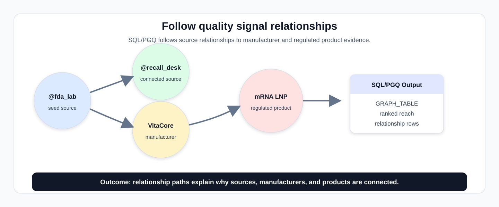
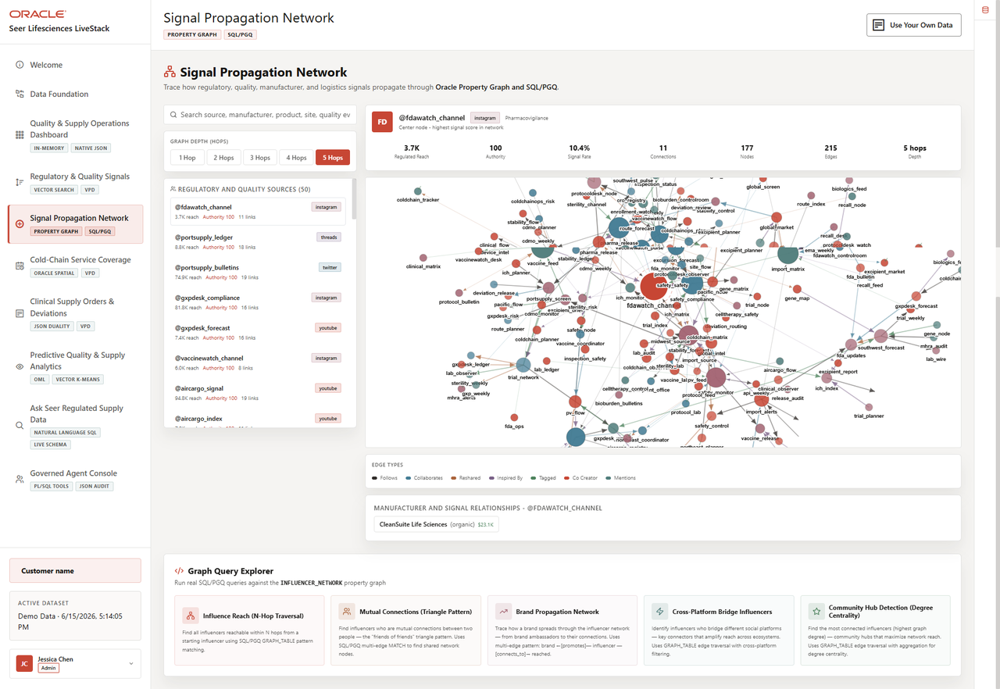

# Signal Propagation Network with Property Graph

## Introduction

Once a quality signal looks important, teams need to know which signal sources, manufacturers, and regulated products are connected to it. This lab investigates that relationship network with **Oracle Property Graph** and **SQL Property Graph Queries**.

Quality and regulatory patterns often hide in relationships rather than in a single row. One bulletin may not reveal the full picture, but related sources, manufacturer links, product mentions, and reposted or cited signals can show where attention should move next.



The image below is the Signal Propagation Network screen from the Seer Lifesciences application. It shows the source list, selected source profile, network canvas, relationship legend, and graph query explorer that the SQL/PGQ examples reproduce from database graph evidence.



### Objectives

- Traverse quality signal source reach.
- Find manufacturer and regulated product relationships.

Estimated Time: **12 minutes**

### Business Scenario

| Step | Life sciences focus |
| --- | --- |
| Business Problem | Quality teams need to see relationships that are hard to detect from signal rows alone. |
| Technical Challenge | Investigators need path-based relationship analysis without long chains of self-joins. |
| Persona Focus | Quality analysts interpret the network; database developers provide the graph pattern. |
| What You Will See | A property graph exposes signal source reach and manufacturer relationships with SQL. |
| Database Capability | `INFLUENCER_NETWORK` and `GRAPH_TABLE` support SQL/PGQ traversal over the reusable signal-source graph. |
| Outcome | Teams can explain why sources, manufacturers, and products are connected. |

Persona focus: You help a quality analyst move from a signal source to explainable relationship evidence.

Implementation note: `INFLUENCER_NETWORK` is the physical graph name in the reusable LiveStack schema. In the Life Sciences dataset, its vertices represent regulated signal sources, manufacturers, products, and posts. The SQL must use the physical graph labels, such as `influencer` and `brand`, but the selected column aliases and result labels use Life Sciences terms.

<details>
<summary><strong>Key terms: property graph, vertex, edge, and SQL Property Graph Queries (SQL/PGQ)</strong></summary>

> - A **property graph** represents things and how they are connected. In this lab, the graph connects signal sources, manufacturers, products, and posts.
>
> - A **vertex** is a graph node, such as a signal source, manufacturer, product, or post. Vertices are the business entities an analyst wants to follow.
>
> - An **edge** is a relationship, such as a source connection, manufacturer relationship, or product mention. Edges explain why two entities appear near each other in the investigation.
>
> - **SQL/PGQ** lets you describe graph patterns in SQL. That means the relationship path can be reviewed from database evidence instead of only from a visual network screen.

</details>

## Task 1: Trace signal source reach

Start from `@fda_lab` so learners can follow one seed source into connected signal-source evidence.

1. Run the SQL/PGQ traversal from `@fda_lab`.

    > **SQL Worksheet reminder:** Need a reminder on how to open and use the SQL Worksheet? Return to [Getting Started Task 2: Open SQL Worksheet](/workshops/sandbox/index.html?lab=getting-started#Task2:OpenSQLWorksheet) for the step-by-step graphic showing where to paste and run SQL statements.

    The query starts with one seed source, `@fda_lab`, follows one outgoing source-connection edge, and returns the reached source with channel, authority score, relationship category, and relationship strength. Read the result as the first hop in a quality-signal investigation.

    ```sql
    <copy>
    SELECT reached_source_code,
           reached_source_name,
           CASE source_platform
             WHEN 'instagram' THEN 'FDA bulletin'
             WHEN 'tiktok' THEN 'EMA/FDA notice'
             WHEN 'twitter' THEN 'Regulatory notice'
             WHEN 'youtube' THEN 'Cold-chain advisory'
             ELSE source_platform
           END AS source_channel,
           source_authority_score,
           relationship_category,
           strength
    FROM GRAPH_TABLE ( influencer_network
      MATCH (source IS influencer) -[edge IS connects_to]-> (reached IS influencer)
      WHERE source.handle = '@fda_lab'
      COLUMNS (
        reached.handle AS reached_source_code,
        reached.display_name AS reached_source_name,
        reached.platform AS source_platform,
        reached.influence_score AS source_authority_score,
        edge.connection_type AS relationship_category,
        edge.strength AS strength
      )
    )
    ORDER BY strength DESC, source_authority_score DESC;
    </copy>
    ```

    **Expected output: Signal Source Reach**

    | Reached Source Code | Reached Source Name | Source Channel | Source Authority Score | Relationship Category | Strength |
    | --- | --- | --- | --- | --- | --- |
    | @recall_desk | Recall Desk | FDA bulletin | 85.96 | duet | 0.999 |
    | @coldchain_office | Coldchain Office | Cold-chain advisory | 69.39 | duet | 0.822 |
    | @ich_bulletin | Ich Bulletin | FDA bulletin | 98.05 | duet | 0.714 |
    | @celltherapy_bridge | Celltherapy Bridge | Regulatory notice | 75.82 | reshared | 0.687 |
    | @fdawatch_report | Fdawatch Report | Cold-chain advisory | 81.68 | collaborates | 0.41 |
    | @clinical_map | Clinical Map | EMA/FDA notice | 73.86 | duet | 0.207 |

2. Review the connected sources.

    The graph pattern says the investigation in plain terms: start with this quality source, follow its relationships, and show who is connected.

**Note:** Sample values may change after data refreshes or rebuilds. Focus on the expected result pattern and the business takeaway, not the exact values.

## Task 2: Find manufacturer propagation paths

Next, reverse the investigation angle and start from a manufacturer so the result explains which source relationships may deserve review first:

1. Run this manufacturer relationship query.

    ```sql
    <copy>
    SELECT signal_source_code,
           manufacturer_name,
           relationship_category,
           signal_count,
           avg_signal_engagement,
           supply_value_attributed
    FROM GRAPH_TABLE ( influencer_network
      MATCH (manufacturer IS brand) <-[edge IS promotes]- (source IS influencer)
      WHERE manufacturer.brand_name = 'VitaCore Therapeutics'
      COLUMNS (
        source.handle AS signal_source_code,
        manufacturer.brand_name AS manufacturer_name,
        edge.relationship_type AS relationship_category,
        edge.post_count AS signal_count,
        edge.avg_engagement AS avg_signal_engagement,
        edge.revenue_attributed AS supply_value_attributed
      )
    )
    ORDER BY avg_signal_engagement DESC;
    </copy>
    ```

    **Note:** This query reverses the investigation angle: instead of starting from a source, it starts from one manufacturer and finds source relationships that point to that manufacturer. The returned signal count, average signal engagement, and attributed supply value help the analyst understand which relationships may deserve review first.

    **Expected output: Manufacturer Signal Relationships**

    | Signal Source Code | Manufacturer Name | Relationship Category | Signal Count | Avg Signal Engagement | Supply Value Attributed |
    | --- | --- | --- | --- | --- | --- |
    | @inspection_queue | VitaCore Therapeutics | organic | 64 | 0.1112 | 16494 |
    | @midwest_feed | VitaCore Therapeutics | affiliate | 61 | 0.11 | 20639.98 |
    | @coldchainops_channel | VitaCore Therapeutics | ambassador | 1 | 0.1091 | 40453.43 |
    | @safety_monitor | VitaCore Therapeutics | ambassador | 29 | 0.0876 | 15127.45 |
    | @protocol_monitor | VitaCore Therapeutics | sponsored | 79 | 0.0769 | 27817.91 |
    | @fdawatch_coordinator | VitaCore Therapeutics | organic | 16 | 0.0728 | 23695.39 |
    | @pv_flow | VitaCore Therapeutics | sponsored | 64 | 0.0717 | 28843.08 |
    | @bioburden_compliance | VitaCore Therapeutics | ambassador | 23 | 0.0687 | 43650.35 |
    | @route_node | VitaCore Therapeutics | ambassador | 76 | 0.068 | 4372.98 |
    | @safety_matrix | VitaCore Therapeutics | organic | 78 | 0.0674 | 22943.15 |
    | @airport_compliance | VitaCore Therapeutics | organic | 65 | 0.0643 | 34088.27 |
    | @deviation_notice | VitaCore Therapeutics | ambassador | 52 | 0.0637 | 35972.88 |
    | @pharma_desk | VitaCore Therapeutics | organic | 68 | 0.0536 | 9195.52 |
    | @vaccinewatch_risk | VitaCore Therapeutics | organic | 35 | 0.0473 | 28845.3 |
    | @api_node | VitaCore Therapeutics | sponsored | 12 | 0.0434 | 29025.68 |
    | @gxp_routing | VitaCore Therapeutics | ambassador | 81 | 0.0425 | 15187.56 |
    | @sterility_lab | VitaCore Therapeutics | organic | 91 | 0.0381 | 40860.8 |
    | @import_source | VitaCore Therapeutics | organic | 90 | 0.034 | 425.39 |
    | @portsupply_risk | VitaCore Therapeutics | affiliate | 87 | 0.0339 | 33449.14 |
    | @excursion_flow | VitaCore Therapeutics | affiliate | 42 | 0.0286 | 47654.13 |
    | @diagnostic_planner | VitaCore Therapeutics | affiliate | 33 | 0.0261 | 6573.31 |
    | @import_brief | VitaCore Therapeutics | sponsored | 52 | 0.0194 | 4879.76 |
    | @excursion_bridge | VitaCore Therapeutics | sponsored | 54 | 0.0192 | 22185.34 |
    | @diagnostic_wire | VitaCore Therapeutics | organic | 4 | 0.0174 | 34927.45 |

2. Use the result to explain investigation priority.

    A graph result gives quality teams relationship evidence that would be tedious to assemble with repeated joins. The business value is not the picture alone; it is the explainable path behind the picture.

**Note:** Sample values may change after data refreshes or rebuilds. Focus on the expected result pattern and the business takeaway, not the exact values.

## Acknowledgements

* **Author** - Oracle Database Product Management
* **Last Updated By/Date** - Oracle Database Product Management, July 2026
