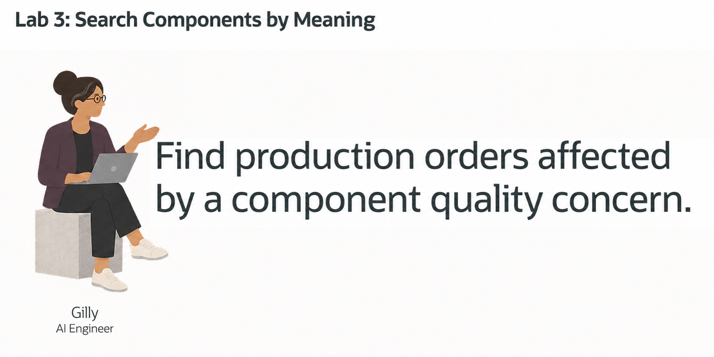
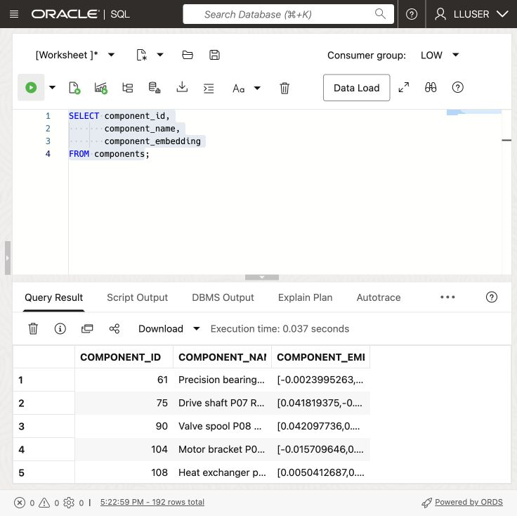
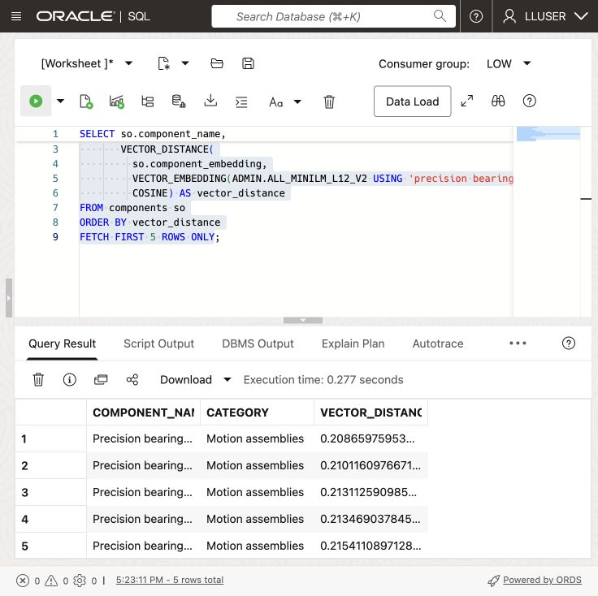
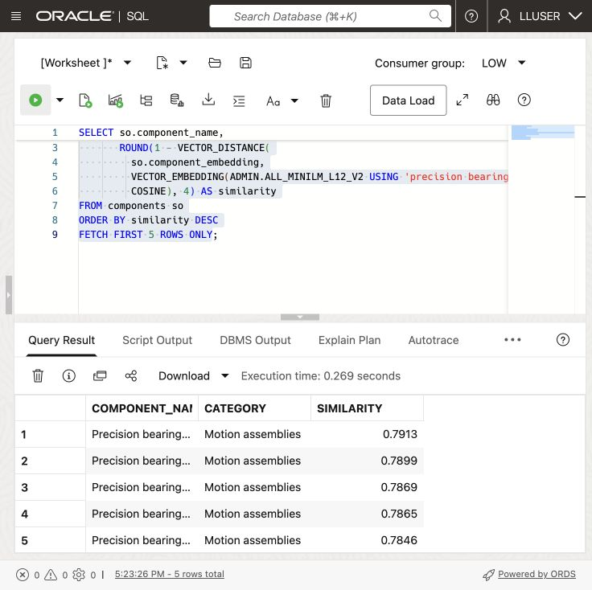
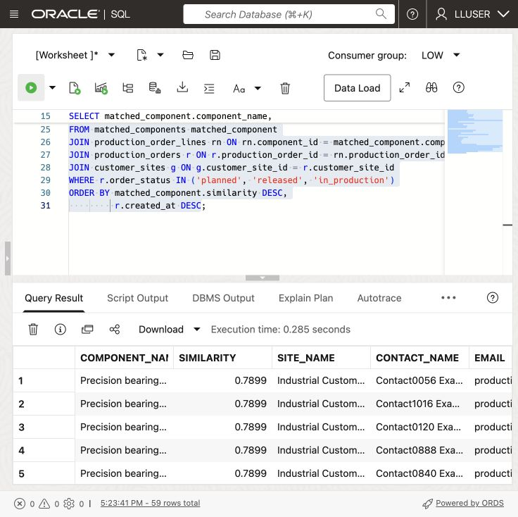

# Search Components by Meaning



## Introduction

> **Validation status:** The manual LLUSER walkthrough and authentic manufacturing captures are recorded in the [validation report](../validation/validation-report.md). Green-button and Terraform provisioning remain untested.

Gilly Bourne is an AI engineer at SEER MANUFACTURING. Her team has built a search feature for the production quality operations application. A production analyst can enter a question such as **which customer sites may be affected by a bearing dimensional-tolerance concern?** The application should find the relevant components first, then show the customer sites with orders for them.

Gilly has the component, production order, and customer site data in Oracle AI Database. She needs to match a plain-language question to components, then find the customer sites with orders for them. The result must give the production team names and production orders to follow up.

Gilly runs the search in the database. One SQL statement compares the question with component vectors, joins the matches to production orders and customer sites, and returns the follow-up list. This avoids copying text and vectors to a separate search service.

In this lab, you check the embedding model, create component vectors, and use a search result to find matching production orders and customer sites.


<details>
<summary><strong>Key terms: embedding, vector, vector distance, and semantic search</strong></summary>

> - An **embedding** is a numerical profile of what text means. In this lab, component data is embedded so similar manufacturing ideas sit near each other mathematically, even when the wording is different.
>
> - An **ONNX embedding model** is a portable machine-learning model saved in the Open Neural Network Exchange (ONNX) format. It turns text into a vector of numbers that captures meaning. Oracle AI Database can load and run this model inside the database, close to the component rows.
>
> - A **vector** is the stored numerical form of an embedding. Oracle Database can store vectors beside the manufacturing rows they describe, so the search stays connected to component names, material grades, process routes, and unit costs.
>
> - **Vector distance** measures how close two vectors are. A smaller distance means the meanings are more similar; a larger distance means they are farther apart. In this lab, distance helps rank which components best match a production analyst's question.
>
> - **Semantic search** means searching by meaning instead of exact words. A search for "precision bearing with low vibration and tight dimensional tolerance" can find related components even when the component names use different wording.

</details>

A production-quality search page can let a user enter a concern and receive components ranked by meaning. The following tasks explain the SQL behind that search.

### Objectives

- Check the embedding model Gilly needs for semantic search.
- Create a vector from component data inside the database.
- Search for components that match a production-quality concern.
- Turn component matches into a customer follow-up list.
- Explain why vector search belongs beside manufacturing data and access controls.

Estimated Time: **10 minutes**

### Hands-on Scenario

| Step                | Manufacturing focus                                                                                                                               |
| ---------------------| ---------------------------------------------------------------------------------------------------------------------------------------------|
| Business Problem    | Production analysts need to find relevant components without knowing the exact terms used in the component data.                                     |
| Technical Challenge | Gilly must search by meaning while keeping component data, vectors, production orders, customer sites, and access controls together.                          |
| Persona Focus       | You review Gilly's implementation as she explains how the search connects a business question to components, production orders, and customer sites.           |
| What You Will See   | Vector search ranks components by meaning, then SQL adds production order and customer site details.                                                          |
| Database Capability | `VECTOR_EMBEDDING`, vector columns, and `VECTOR_DISTANCE` run beside relational manufacturing data.                                               |
| Outcome             | The application can turn a plain-language concern into a customer follow-up list without a separate vector database or copied manufacturing text. |

Persona focus: You are reviewing the search tool Gilly built for production quality operations.


> **SQL Worksheet reminder:** See [Getting Started Task 2: Open SQL Worksheet](?lab=getting-started#Task2:OpenSQLWorksheet) for the steps to paste and run SQL.


## Task 1: Check the embedding model

Start with Gilly's first design question: **what does similarity search need?** It needs vectors for the text being searched and an embedding model that converts a question into a vector.

Gilly asks Jessica to load an ONNX embedding model into Oracle AI Database. Oracle AI Database can store and run the ONNX model inside the database, so it creates the question embedding where the component data already live. The application does not have to send manufacturing text to a separate service and bring the vector back.

1. Run this query to list the available embedding models:

    ```sql
    <copy>
    SELECT owner,
           model_name,
           algorithm,
           mining_function
    FROM all_mining_models
    WHERE mining_function = 'EMBEDDING'
    ORDER BY owner, model_name;
    </copy>
    ```

    **Expected output: Available Embedding Models**

    

    The result should include an embedding model owned by `ADMIN`, such as `ALL_MINILM_L12_V2`. This compact model turns text into 384-number vectors. The `EMBEDDING` value confirms that the model can turn text into vectors for similarity search.

2. Review what this means for Gilly's application.

    Gilly can call the model from SQL with `VECTOR_EMBEDDING(...)`. Jessica manages the model inside the database, while Gilly uses it in her search query. The component data, vectors, and access controls remain in the same database.

    > **Note:** The embedding model runs inside Oracle AI Database. Gilly can create vectors without sending manufacturing text to another service.

## Task 2: Create a component vector

Gilly decides that one vector per component is enough. Each component record is short and describes one component, so she combines its name, category, and subcategory into one text value before creating the vector.

1. Review the text Gilly will embed:

    ```sql
    <copy>
    SELECT component_id,
           component_name,
           category,
           subcategory,
           component_name || '. Category: ' || category ||
             '. Subcategory: ' || subcategory AS embedding_text
    FROM components
    FETCH FIRST 5 ROWS ONLY;
    </copy>
    ```

    The combined text gives the model the component name and its category and subcategory. Gilly does not need to embed price, dates, or other values that do not describe what the component is.

2. Add a vector column to `COMPONENTS`:

    ```sql
    <copy>
    ALTER TABLE components ADD (component_embedding VECTOR(384));
    </copy>
    ```

    The column has 384 dimensions because `ALL_MINILM_L12_V2` produces 384-dimensional vectors.

3. Create the component vectors inside Oracle Database:

    ```sql
    <copy>
    UPDATE components
    SET component_embedding = VECTOR_EMBEDDING(
      ADMIN.ALL_MINILM_L12_V2 USING
        component_name || '. Category: ' || category ||
        '. Subcategory: ' || subcategory AS DATA)
    WHERE component_embedding IS NULL;

    COMMIT;
    </copy>
    ```

    The model reads the text in each row and writes the vector back to that same row. No component text leaves the database.

4. Verify the new column and its data:

    ```sql
    <copy>
    SELECT component_id,
           component_name,
           component_embedding
    FROM components;
    </copy>
    ```

    

    

    

    Each component now has its own 384-dimensional vector. Gilly can use this column directly when the application searches for components by meaning.

    > **Note:** Chunking is not relevant for this data. Each row describes one short component, so splitting it would create several vectors for one component without adding useful detail. Chunking becomes useful for long documents, such as policies or plant quality notices, where each section may answer a different question.

## Task 3: Test the component vector

Now Gilly tests the new column with a simple vector query. She asks for components related to precision bearing with low vibration and tight dimensional tolerance and lets the database rank them by meaning.

1. Run the following query:

    The SQL creates an embedding for the phrase `precision bearing with low vibration and tight dimensional tolerance`, compares it with the vectors in `COMPONENTS.COMPONENT_EMBEDDING`, and returns the cosine distance. A smaller distance means the two vectors are closer in meaning, so the query orders the smallest distance first.

    <details>
    <summary><strong>Why this matters to Gilly</strong></summary>

    > Gilly could export the text to an external embedding pipeline or search service. That would create extra copies of sensitive manufacturing text and make it harder to show which data the application searched.
    >
    > Oracle AI Vector Search keeps the component data, vectors, SQL query, and vector distance with the manufacturing data. Gilly can check the search and use the result in the application without adding another data store.

    </details>

    ```sql
    <copy>
    SELECT so.component_name,
           so.category,
           VECTOR_DISTANCE(
             so.component_embedding,
             VECTOR_EMBEDDING(ADMIN.ALL_MINILM_L12_V2 USING 'precision bearing with low vibration and tight dimensional tolerance' AS DATA),
             COSINE) AS vector_distance
    FROM components so
    ORDER BY vector_distance
    FETCH FIRST 5 ROWS ONLY;
    </copy>
    ```

    

    

    **Expected output: Relevant Component Matches**

    

2. Review the ranked components.
    The query embeds the analyst phrase at runtime and compares it to the `COMPONENTS.COMPONENT_EMBEDDING` column. `VECTOR_DISTANCE` calculates the distance between the two vectors using the `COSINE` metric. A lower value means a closer match.

    Use the ranked components to focus the dashboard review on the component quality concern.

3. Show the result as a similarity score:

    Vector distance is useful for checking the search, but production analysts may not know what a cosine distance means. Gilly changes the display to a similarity score. She subtracts the distance from `1`, so a higher score means a closer match, and rounds the result to four decimal places.

    ```sql
    <copy>
    SELECT so.component_name,
           so.category,
           ROUND(1 - VECTOR_DISTANCE(
             so.component_embedding,
             VECTOR_EMBEDDING(ADMIN.ALL_MINILM_L12_V2 USING 'precision bearing with low vibration and tight dimensional tolerance' AS DATA),
             COSINE), 4) AS similarity
    FROM components so
    ORDER BY similarity DESC
    FETCH FIRST 5 ROWS ONLY;
    </copy>
    ```

    

    

    The query uses the same vectors and the same cosine calculation. It only changes how the result is shown to the person using the application.

    

## Task 4: Find customer sites affected by a component concern

Gilly now connects the component search to customer orders. A production analyst should be able to enter a concern and find customer sites with orders for related components. The status filter limits the follow-up to planned, released, and in-production orders. The result gives the production-quality team a short list for follow-up, with the component match, production order status, production order date, and customer contact details.

1. Run the following query for the concern `precision bearing with low vibration and tight dimensional tolerance`:

    ```sql
    <copy>
    WITH matched_components AS (
        SELECT so.component_id,
               so.component_name,
               ROUND(1 - VECTOR_DISTANCE(
                 so.component_embedding,
                 VECTOR_EMBEDDING(
                   ADMIN.ALL_MINILM_L12_V2
                   USING 'precision bearing with low vibration and tight dimensional tolerance' AS DATA
                 ),
                 COSINE), 4) AS similarity
        FROM components so
        ORDER BY similarity DESC
        FETCH FIRST 5 ROWS ONLY
    )
    SELECT matched_component.component_name,
           matched_component.similarity,
           g.site_name,
           g.first_name || ' ' || g.last_name AS contact_name,
           g.email,
           r.production_order_id,
           r.order_status,
           r.created_at,
           rn.quantity,
           rn.line_total
    FROM matched_components matched_component
    JOIN production_order_lines rn ON rn.component_id = matched_component.component_id
    JOIN production_orders r ON r.production_order_id = rn.production_order_id
    JOIN customer_sites g ON g.customer_site_id = r.customer_site_id
    WHERE r.order_status IN ('planned', 'released', 'in_production')
    ORDER BY matched_component.similarity DESC,
             r.created_at DESC;
    </copy>
    ```

    

    

    The first part ranks components by meaning. The remaining joins use ordinary relational keys to find the matching order lines, production orders, and customer sites.

    **Expected output: Customer Follow-up List**

    The result shows customer sites with orders for components related to the concern. The similarity score explains why the component was included, while the production order and customer site columns give the production team enough information to decide what to do next.


    

2. Review the business result.

    Gilly creates vectors for components, then uses SQL joins to find production order and contact details. She does not need a vector for each production order or customer site.

## Conclusion

Gilly has built a component search that helps the quality team decide which customers to contact. A plain-language concern can produce ranked components and a customer follow-up list using vectors, relational joins, and SQL in Oracle AI Database. 

## Acknowledgements

* **Author** - Matt Kowalik
* **Contributor** - Kevin Lazarz
* **Last Updated By/Date** - Matt Kowalik, September 2026
