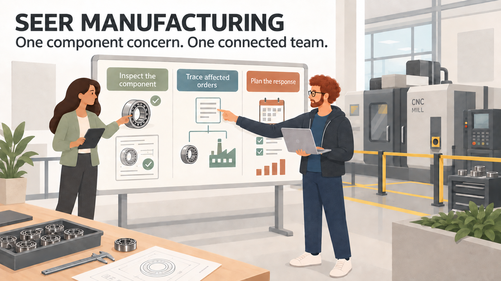
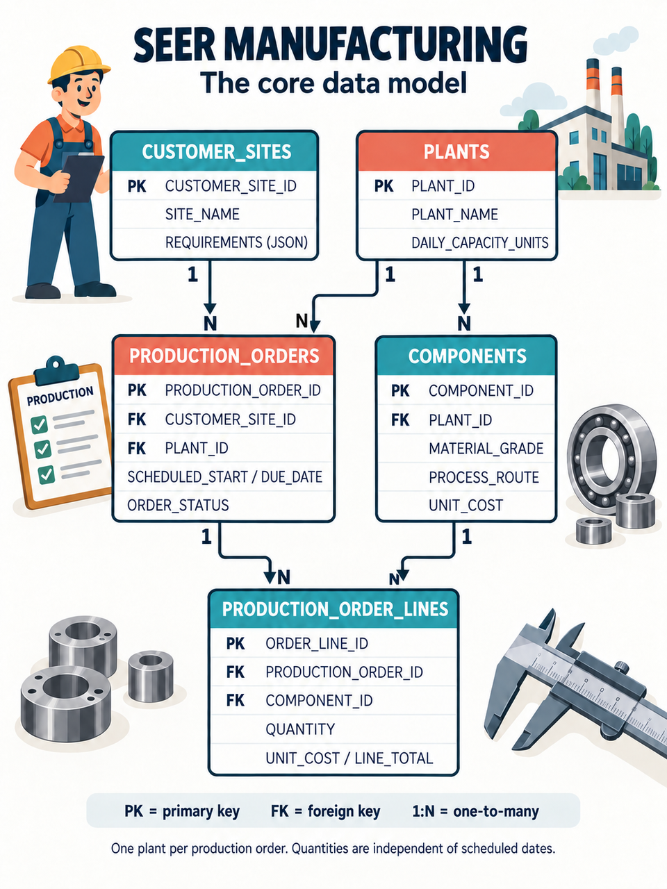
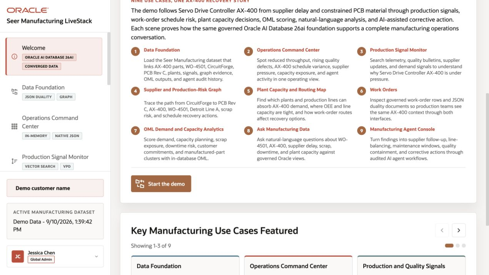

# Build Connected Manufacturing Solutions with Oracle AI Database

## Introduction

Jessica Chan, the DBA at SEER MANUFACTURING, starts the morning with a question from the quality team. An inspection has flagged a dimensional concern in a precision bearing. Which production orders use that component, and what should the team review before work continues?

Thomas, the application developer, needs the production order as a JSON document. Gilly will help the team find related components even when the inspection uses different wording. Bob will trace shared material lots and machines. Moon will identify nearby plants for planners to consider. Otto will build a quality-review watchlist, and Nina will ask questions about the same production data.

Jessica brings them together around the records already held in Oracle AI Database. Each lab follows one part of their investigation. The team still needs to inspect the records and check production constraints before deciding what action to take.

The requests look different, but they share one problem. The data is already in Oracle AI Database, and each team wants to use it in a different way:

- Thomas needs customer site production orders as JSON for a web and mobile application.
- Gilly needs semantic search that can find components by meaning, as well as by matching words.
- Bob needs to follow relationships between production orders and other entities to investigate production quality.
- Moon needs to calculate distances between customer sites, plants, and demand regions.
- Otto needs to train and score a component quality model.
- Nina needs to ask manufacturing questions in plain language and turn the answers into a useful review.

### SEER MANUFACTURING data model

SEER MANUFACTURING is a fictional manufacturer. This diagram shows how customer sites, plants, component revisions, production orders, and order lines connect.

*One plant per production order. Each component revision belongs to one plant and specifies a material grade and process route. Production-order lines record quantities and unit costs.* [Open the illustrated ERD](images/seer-manufacturing-erd-illustrated.png) or the [text-based schema diagram](images/seer-manufacturing-erd.svg) or see the [complete schema and supporting entities](../validation/schema-contract.md).

> **Validation status:** The manual LLUSER walkthrough and authentic manufacturing captures are recorded in the [validation report](../validation/validation-report.md). Green-button and Terraform provisioning remain untested.

Jessica helps each team use the same manufacturing records. Oracle AI Database stores the relational tables and lets the teams work with them through JSON, vectors, graphs, spatial queries, machine learning, and AI services. Each team keeps the database access controls that apply to its work.

Each lab follows one team member as they solve a manufacturing problem. You will run the queries, inspect the results, and see how the database supports each task.

### What the team builds

| Team member                   | Requirement                                                     | What you will see                                                                                                                          |
| -------------------------------| -----------------------------------------------------------------| --------------------------------------------------------------------------------------------------------------------------------------------|
| Jessica, DBA                  | Build the query behind a Production Quality and Operations dashboard.         | One SQL result combines relational quality-alert data, semantic component matching, JSON production order data, and location data.                         |
| Thomas, application developer | Give the application flexible production order documents.            | JSON columns, JSON collections, and JSON Relational Duality Views provide different ways to serve application data.                        |
| Gilly, AI engineer            | Find components related to a production-quality question.                       | Jessica loads an ONNX embedding model into the database, and Gilly creates vectors where the component data already lives.                   |
| Bob, graph specialist         | Find connected production orders and entities in a production quality investigation.  | A property graph uses the existing relational data to show paths that become difficult to manage with repeated SQL joins.                  |
| Moon, spatial expert          | Route work using plant and region locations.           | The database calculates distance from geographic data that the application can also display.                                               |
| Otto, data scientist          | Flag components for quality review.                 | Oracle Machine Learning trains and scores a model inside the database, using the component and inspection data.                             |
| Nina, production analyst            | Ask manufacturing questions without writing every query from scratch. | Select AI generates SQL that Nina can inspect, run, and refine. Select AI Agent adds an approved SQL query tool and records the agent activity. |

Jessica can meet new requirements without moving the manufacturing records to another database. Those records can support:

- A JSON document for the application.
- A vector search.
- A graph investigation.
- A spatial calculation.
- A model score.
- A natural-language question.

<strong>Learn more: What does "converged database" mean?</strong>

> A **converged database** handles several data types and kinds of work in one database. Here, teams use relational rows, JSON documents, vectors, graphs, geographic data, machine learning models, and AI-assisted SQL.
>
> Teams use the form their application needs and keep the records and access controls together. They can query these data types without maintaining a separate store for each one.

### Objectives

- Follow Jessica and her team as they investigate a component quality concern.
- Use relational SQL, JSON, vectors, graphs, spatial data, Oracle Machine Learning, Select AI, and Select AI Agent in practical tasks.
- See how one Oracle AI Database can support different data types without separate copies of the manufacturing records.
- Understand how database privileges, AI profile settings, approved tools, and execution history help teams control access and review AI results.
- Explain how each query would support a SEER MANUFACTURING application.

Estimated Workshop Time: **90 minutes**

## Acknowledgements

* **Author** - Matt Kowalik
* **Contributor** - Kevin Lazarz
* **Last Updated By/Date** - Matt Kowalik, September 2026

## Running the manufacturing demo

The live SEER MANUFACTURING application follows the AX-400 production-recovery story. It uses a separate demo dataset from the workshop SQL fixture, so its identifiers and totals are not expected results for the lab queries.

