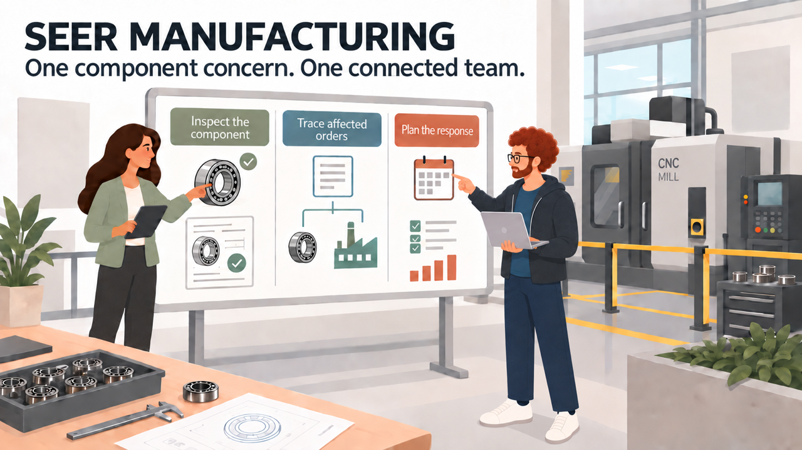
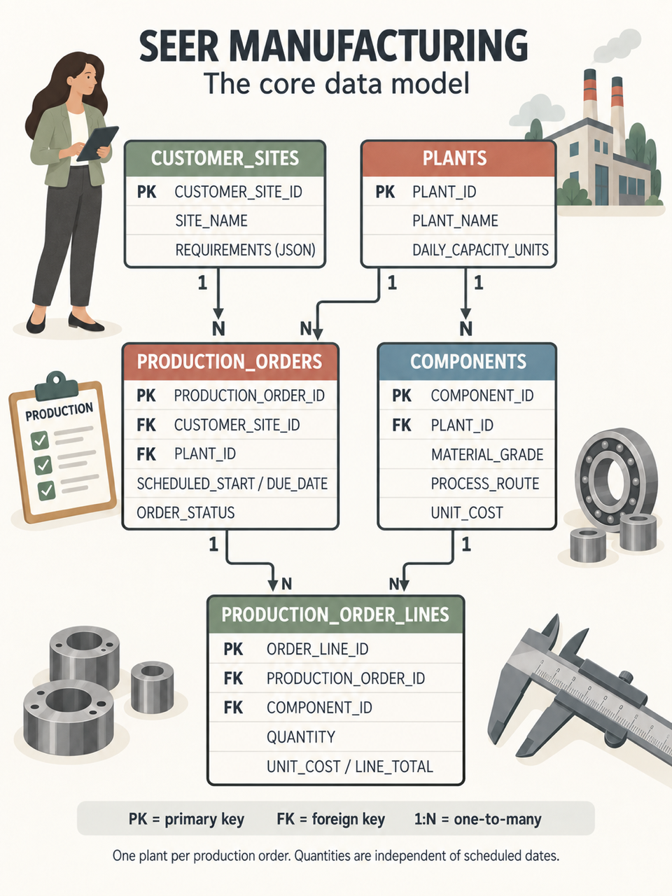
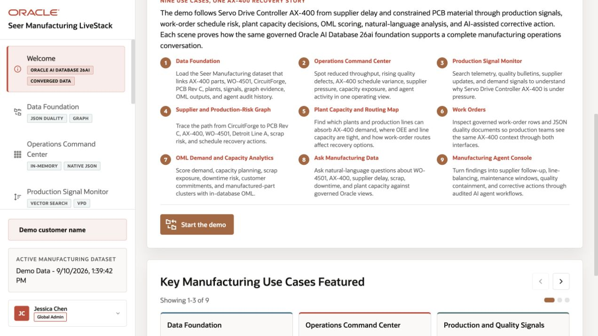

# Build Connected Manufacturing Solutions with Oracle AI Database

## Introduction

Jessica Chan, the DBA at SEER MANUFACTURING, starts the morning with a question from the quality team. An inspection has flagged a dimensional concern in a precision bearing. Which production orders use that component, and what should the team review before work continues?

Jessica’s team investigates the quality concern using records in Oracle AI Database. Follow their work through JSON, vector search, graphs, spatial queries, machine learning and AI. Run the queries and inspect the results before deciding what the quality team should do next.

### SEER MANUFACTURING data model

SEER MANUFACTURING is a fictional manufacturer. This diagram shows how customer sites, plants, component revisions, production orders, and order lines connect.

*One plant per production order. Each component revision belongs to one plant and specifies a material grade and process route. Production-order lines record quantities and unit costs.* [Open the illustrated ERD](images/seer-manufacturing-erd-illustrated.png) or the [text-based schema diagram](images/seer-manufacturing-erd.svg).

### What the team builds

| Team member | Your task |
| --- | --- |
| Jessica, DBA | Combine quality alerts, JSON orders, vectors, and locations in a dashboard query. |
| Thomas, developer | Read and update production orders as JSON. |
| Gilly, AI engineer | Find related components and affected customer sites. |
| Bob, graph specialist | Trace orders connected through shared material lots and records. |
| Moon, spatial expert | Find nearby plants for planners to assess. |
| Otto, data scientist | Build a component quality-review watchlist. |
| Nina, production analyst | Ask questions with Select AI, then build an assistant using a SQL tool. |

<strong>Learn more: What does "converged database" mean?</strong>

> A **converged database** handles several data types and kinds of work in one database. Here, teams use relational rows, JSON documents, vectors, graphs, geographic data, machine learning models, and AI-assisted SQL.
>
> Teams use the form their application needs and keep the records and access controls together. They can query these data types without maintaining a separate store for each one.

### Objectives

- Follow Jessica and her team as they investigate a component quality concern.
- Use relational SQL, JSON, vectors, graphs, spatial data, Oracle Machine Learning, Select AI, and Select AI Agent in practical tasks.
- See how one Oracle AI Database can support different data types without separate copies of the manufacturing records.
- Understand how database privileges, AI profile settings, approved tools, and execution history help teams control access and review AI results.
- Explain how each query would support a SEER MANUFACTURING application.

Estimated Workshop Time: **90 minutes**

## Application Demo

[Try the LiveStack Manufacturing demo](https://livelabs.oracle.com/ords/r/dbpm/livelabs/view-workshop?wid=4442).

The live SEER MANUFACTURING application follows the AX-400 production-recovery story. It uses a separate demo dataset from the workshop SQL fixture, so its identifiers and totals are not expected results for the lab queries.

## Acknowledgements

* **Author** - Matt Kowalik
* **Contributor** - Kevin Lazarz
* **Last Updated By/Date** - Matt Kowalik, September 2026
