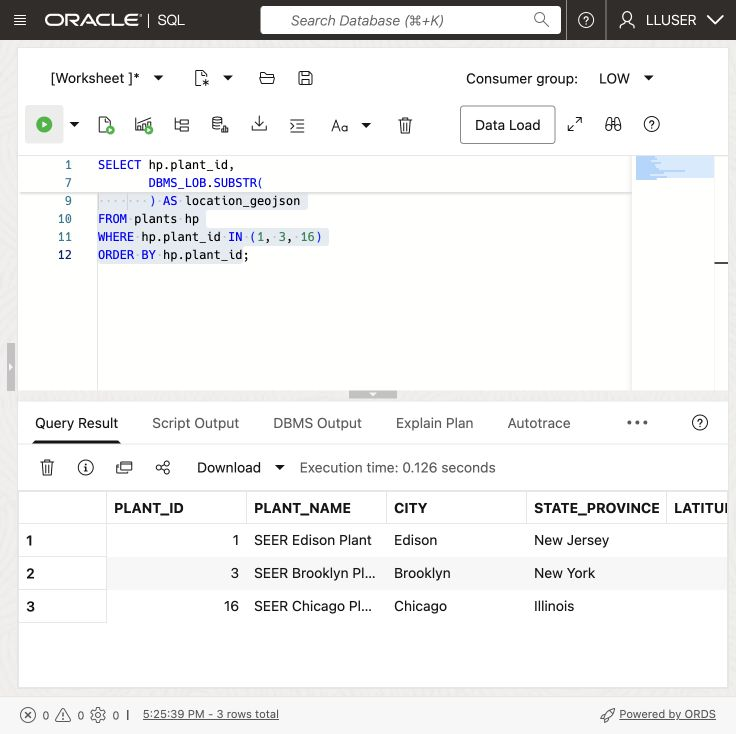
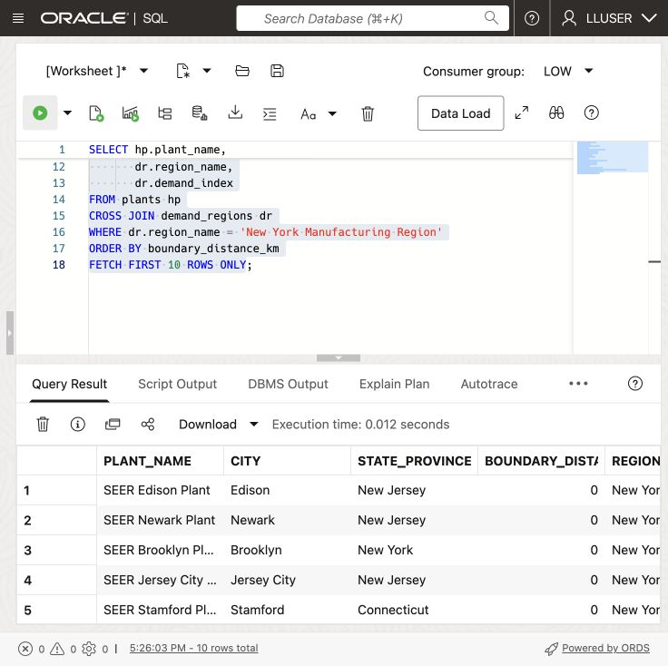
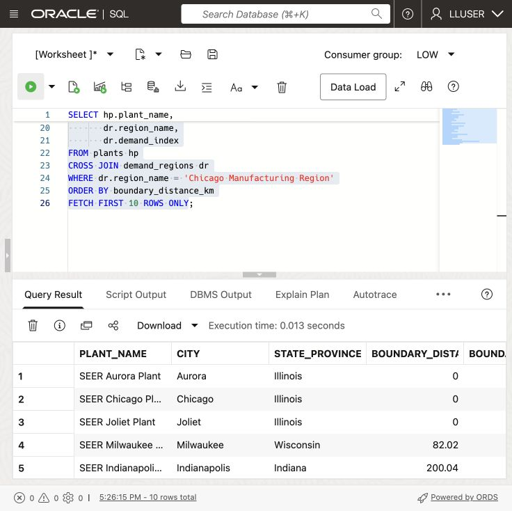
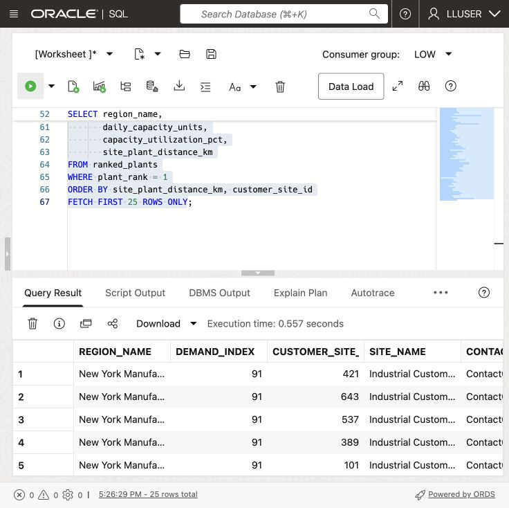

# Find the Closest Manufacturing Plant


## Introduction

> **Validation status:** The manual LLUSER walkthrough and authentic manufacturing captures are recorded in the [validation report](../validation/validation-report.md). Green-button and Terraform provisioning remain untested.

Moon Kai is SEER MANUFACTURING’s spatial specialist. Operations teams ask Moon for help when location affects a production decision: which plant is closest to a region with growing demand, and which customer sites are nearby?

Oracle AI Database stores plant and customer site locations as map points. It stores demand regions as map areas, each with a demand score.

Moon wants a query that a production team can use in a dashboard and map:

> Customer sites in a high-demand region need an alternative plant for production work. **Which customer sites are in that region, and which plant is closest to each one?**

In this lab, you follow Moon's approach. You start with a single point, measure distance to a region, find customer sites inside that region, and list the nearest plant for each customer site.


<details>
<summary><strong>Key terms: point, polygon, distance, spatial relationship, and GeoJSON</strong></summary>

> - A **point** is one location, represented by longitude and latitude. In this lab, a plant is stored as an `SDO_GEOMETRY` point.
>
> - A **polygon** is an area made from connected points. Demand regions are stored as polygons.
>
> - **Distance** measures how far two spatial objects are from each other. Here, it measures the shortest distance between a plant point and a demand-region polygon. A distance of zero means the plant is inside or touching the region.
>
> - A **spatial relationship** describes how two shapes relate to each other. `SDO_GEOM.RELATE` can test whether a customer site point is inside or touches a demand region.
>
> - **GeoJSON** is a JSON format for map locations and shapes. `SDO_UTIL.TO_GEOJSON` lets an application display the same database location on a map.
>
</details>

Oracle Spatial can support a production-routing map using the distances calculated in this lab.

### Objectives

- Identify spatial points and polygons in the manufacturing data.
- Convert a database point to GeoJSON for an application map.
- Measure which plants are closest to a demand region.
- Find customer sites inside a demand region.
- Match each customer site to the closest active plant.

Estimated Time: **10 minutes**

### Hands-on Scenario

| Step | Manufacturing focus |
| --- | --- |
| Business Problem | Production planners need nearby plants to consider when arranging production reassignment. |
| Technical Challenge | Moon needs to compare customer site points with a region, then find the closest plant for each customer site. |
| Persona Focus | You review Moon's spatial approach and interpret the result for an operations user. |
| What You Will See | Oracle Spatial turns location data into customer-site routing results with SQL. |
| Database Capability | `SDO_GEOMETRY`, `SDO_GEOM.SDO_DISTANCE`, `SDO_GEOM.RELATE`, and GeoJSON conversion support the analysis. |
| Outcome | An operations user can see which customer sites are in a region and which plant is closest to each one. |

> **SQL Worksheet reminder:** See [Getting Started Task 2: Open SQL Worksheet](?lab=getting-started#Task2:OpenSQLWorksheet) for the steps to paste and run SQL.

## Task 1: Look at the locations as points

Moon starts with the simplest spatial question: **where are the plants?** The database stores each plant as an `SDO_GEOMETRY` point, while the application can use the same point as GeoJSON.

An `SDO_GEOMETRY` point is Oracle Spatial's structured representation of one location. An illustrative plant point could use a point type, the WGS84 coordinate system, and the coordinate pair longitude `-74.4121` and latitude `40.5187`. This example explains the format; check the actual coordinates supplied by the manufacturing loader. Because Oracle stores the location as geometry, Spatial functions can calculate distance and test spatial relationships instead of treating the coordinates as two unrelated numbers.

`SDO_UTIL.TO_GEOJSON` converts that geometry into a standard JSON map object such as `{ "type": "Point", "coordinates": [-74.4121, 40.5187] }`. The application can send this object to a map without maintaining a second location format or a separate conversion service. Oracle uses the same stored geometry for SQL analysis and application display.

The same stored location supports distance calculations, relational joins, and JSON map output.

1. Run this query:

    ```sql
    <copy>
    SELECT hp.plant_id,
           hp.plant_name,
           hp.city,
           hp.state_province,
           hp.latitude,
           hp.longitude,
           DBMS_LOB.SUBSTR(
             SDO_UTIL.TO_GEOJSON(hp.location), 120, 1
           ) AS location_geojson
    FROM plants hp
    WHERE hp.plant_id IN (1, 3, 16)
    ORDER BY hp.plant_id;
    </copy>
    ```

    

    

    `LOCATION` is the database point. `LATITUDE` and `LONGITUDE` make the value easy to read, and `LOCATION_GEOJSON` gives an application a map-ready representation of the same point. GeoJSON lists longitude first and latitude second. `SDO_UTIL.TO_GEOJSON` returns a CLOB, so `DBMS_LOB.SUBSTR` limits the displayed text to 120 characters; it does not change the stored geometry.

    **Expected output: Plant Points**

    

2. Review the point data.

    Moon has not created a second map database. The point used by the application and the point used by SQL are the same value. The database can calculate with it, and the application can display it.

    Moon keeps each plant’s location beside its name, capacity, status, and current load. SQL returns the distance and plant details. `SDO_UTIL.TO_GEOJSON` returns the same location for the application map.

## Task 2: Find the closest plants to a demand region

The sample data gives New York Manufacturing Region a demand index of `91`. Moon measures the distance between each plant point and the region polygon.

1. Run the distance query:

    ```sql
    <copy>
    SELECT hp.plant_name,
           hp.city,
           hp.state_province,
           ROUND(
             SDO_GEOM.SDO_DISTANCE(
               hp.location,
               dr.boundary,
               0.005,
               'unit=KM'
             ), 2
           ) AS boundary_distance_km,
           dr.region_name,
           dr.demand_index
    FROM plants hp
    CROSS JOIN demand_regions dr
    WHERE dr.region_name = 'New York Manufacturing Region'
    ORDER BY boundary_distance_km
    FETCH FIRST 10 ROWS ONLY;
    </copy>
    ```

    

    

    `SDO_GEOM.SDO_DISTANCE` compares the plant point with the demand-region polygon. The function returns the shortest distance between the two shapes. A value of `0` means the point is inside or touching the region.

    The four arguments in this query have simple roles:

    - `hp.location` is the first geometry: the plant point.
    - `dr.boundary` is the second geometry: the demand-region polygon.
    - `0.005` is the tolerance used when Oracle compares the geometries. It helps Oracle handle small differences in the stored coordinates.
    - `'unit=KM'` tells Oracle to return the distance in kilometers. Change it to `'unit=MILE'` when the application needs miles.

    The `ROUND(..., 2)` around the function result only formats the answer to two decimal places. It does not change the spatial calculation.

    The query also returns `DEMAND_INDEX`, so Moon can read location and demand together. The plant with the smallest distance is the first plant operations should check for available capacity.

    **Expected output: New York Production coverage**

    Review the closest plant and its distance. Rankings depend on the data your loader supplied. Read the actual distances from your database result.

    

2. Try another region.

    Change the region name to `Chicago Manufacturing Region`, add a miles calculation, and run the modified query:

    ```sql
    <copy>
    SELECT hp.plant_name,
           hp.city,
           hp.state_province,
           ROUND(
             SDO_GEOM.SDO_DISTANCE(
               hp.location,
               dr.boundary,
               0.005,
               'unit=KM'
             ), 2
           ) AS boundary_distance_km,
           ROUND(
             SDO_GEOM.SDO_DISTANCE(
               hp.location,
               dr.boundary,
               0.005,
               'unit=MILE'
             ), 2
           ) AS boundary_distance_miles,
           dr.region_name,
           dr.demand_index
    FROM plants hp
    CROSS JOIN demand_regions dr
    WHERE dr.region_name = 'Chicago Manufacturing Region'
    ORDER BY boundary_distance_km
    FETCH FIRST 10 ROWS ONLY;
    </copy>
    ```

    

    

    

    The `unit` parameter controls the measurement unit. Review whether a plant lies inside the Chicago Manufacturing Region polygon. A point inside or touching the polygon has distance zero. The contract assigns this region a synthetic demand index of 78; plant rankings must be checked after loading.

    This is a useful regional result, but distance to the region boundary does not identify the customer sites that need production support. Moon now uses the region polygon to find those customer sites and then lists the closest active plant for each one.

## Task 3: Route customer sites to the closest plant

Moon now needs a result that an operations application can use: customer sites inside New York Manufacturing Region, their demand region, and the closest active plant. The query uses the customer site point (**`g.location`**) and demand-region polygon (**`dr.boundary`**) to find the customer sites first. It then compares each customer site point with every active plant and keeps the closest one.

1. Run the customer-site routing query:

    ```sql
    <copy>
    WITH regional_sites AS (
      SELECT dr.region_name,
             dr.demand_index,
             g.customer_site_id,
             g.site_name,
             g.first_name || ' ' || g.last_name AS contact_name,
             g.email,
             g.priority_class,
             g.location
      FROM customer_sites g
      CROSS JOIN demand_regions dr
      WHERE dr.region_name = 'New York Manufacturing Region'
        AND SDO_GEOM.RELATE(
              dr.boundary,
              'ANYINTERACT',
              g.location,
              0.005
            ) = 'TRUE'
    ), ranked_plants AS (
      SELECT rg.region_name,
             rg.demand_index,
             rg.customer_site_id,
             rg.site_name,
             rg.contact_name,
             rg.email,
             rg.priority_class,
             hp.plant_name,
             hp.city AS plant_city,
             hp.daily_capacity_units,
             hp.capacity_utilization_pct,
             ROUND(
               SDO_GEOM.SDO_DISTANCE(
                 rg.location,
                 hp.location,
                 0.005,
                 'unit=KM'
               ), 2
             ) AS site_plant_distance_km,
             ROW_NUMBER() OVER (
               PARTITION BY rg.customer_site_id
               ORDER BY SDO_GEOM.SDO_DISTANCE(
                          rg.location,
                          hp.location,
                          0.005,
                          'unit=KM'
                        ), hp.plant_id
             ) AS plant_rank
      FROM regional_sites rg
      CROSS JOIN plants hp
      WHERE hp.is_active = 1
    )
    SELECT region_name,
           demand_index,
           customer_site_id,
           site_name,
           contact_name,
           email,
           priority_class,
           plant_name,
           plant_city,
           daily_capacity_units,
           capacity_utilization_pct,
           site_plant_distance_km
    FROM ranked_plants
    WHERE plant_rank = 1
    ORDER BY site_plant_distance_km, customer_site_id
    FETCH FIRST 25 ROWS ONLY;
    </copy>
    ```

    

    

    `SDO_GEOM.RELATE` keeps customer sites whose point falls inside or touches the New York Manufacturing Region polygon. `SDO_GEOM.SDO_DISTANCE` then measures the distance from each matching customer site to every active plant. `ROW_NUMBER` keeps the nearest plant for each customer site.

2. Review the result as an operations decision.

    Customer site `LOCATION` is the requested customer delivery point. Each row gives a production analyst a production contact at a customer site, the closest plant, and location and capacity details to review before assigning work. The result combines the region's demand score, customer site details, plant capacity, current load, and spatial distance in one SQL result.

    A dashboard can use this result to show customer sites in the selected region and the closest plant to each customer site. The production team can review the location and capacity details together before assigning production work.

    

3. Change the query to `Chicago Manufacturing Region`.

    Compare the customer sites and candidate plants with the New York result. The spatial predicates remain the same; only the region changes. This is the kind of query an operations dashboard can run when a production analyst selects a different demand region.

    

> **Recommendation boundary:** This query finds the nearest active plant by geographic distance. It does not check process capability, certification, material stock, machine schedules, transport time, or delivery commitments. `DAILY_CAPACITY_UNITS` and `CAPACITY_UTILIZATION_PCT` describe a plant snapshot. A planner must check those constraints before reassigning work.

## Conclusion: Use location in a production decision

Moon used points and polygons to find customer sites in a demand region and rank nearby plants. The result gives the production team customer sites to contact and plants to check for suitable process routes.

One SQL query finds customer sites by location, joins their records to plant details, and returns distance, capacity, and current load. A dashboard can use these results for both its map and customer site list.

## Next Steps

You used Oracle Spatial to find customer sites and nearby plants for planners to review. For a deeper hands-on workshop focused on Oracle Spatial, open the [Oracle Spatial LiveLabs workshop](https://livelabs.oracle.com/ords/r/dbpm/livelabs/view-workshop?clear=RR,180&wid=800).

## Acknowledgements

* **Author** - Matt Kowalik
* **Contributor** - Kevin Lazarz
* **Last Updated By/Date** - Matt Kowalik, September 2026
