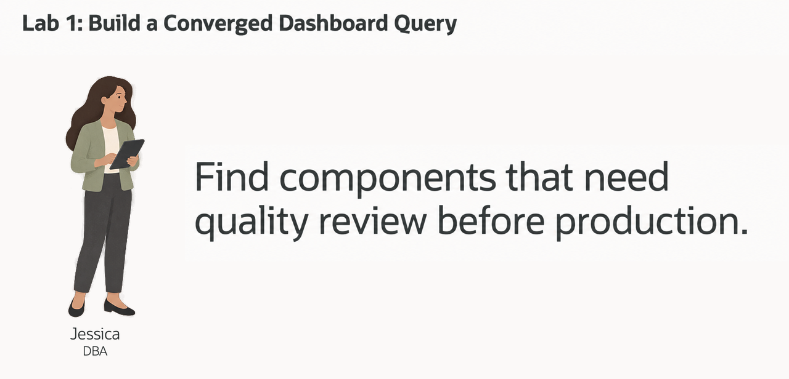
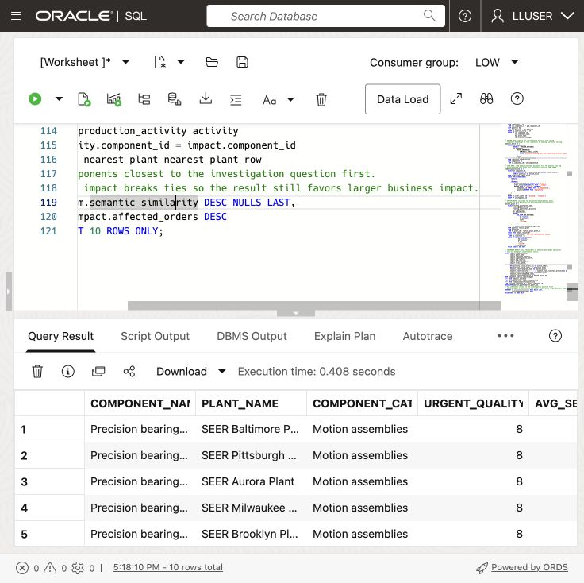
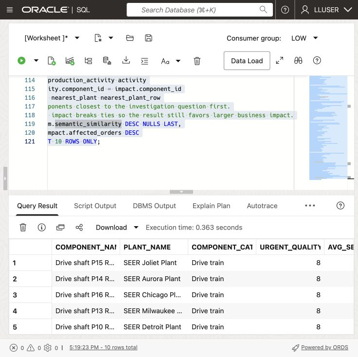

# Build a Converged Dashboard Query

## Introduction

> **Validation status:** The manual LLUSER walkthrough and authentic manufacturing captures are recorded in the [validation report](../validation/validation-report.md). Green-button and Terraform provisioning remain untested.

Jessica Chan is the database administrator responsible for maintaining SEER MANUFACTURING’s production data. Every morning, the production quality operations team asks her a familiar question: **which component needs attention first, and which production orders and customer sites may be affected?**

Jessica needs four kinds of data for the Production Quality and Operations Dashboard. Tables hold quality alerts and their impact. JSON documents hold production order activity. Vectors represent component descriptions for searches by meaning. Spatial data records plant and demand-region locations. Her query must combine all four.

Keeping these data types in separate systems would require Jessica to combine exports and keep them current. Instead, she wants a dashboard answer that the production quality team can check against the source records.

Oracle AI Database can query these data types together. Jessica can join relational rows, JSON documents, vectors, and location data in one SQL statement.

In this lab, you build Jessica’s dashboard query. It combines quality alerts, vector search, JSON production order data, and plant locations in one result.



### Objectives

- Explain how one database query combines the data needed for a production-quality review.
- Run one query that combines relational, vector, JSON, and spatial database capabilities.
- Modify the query to investigate a different production-quality question and explain the change in results.

Estimated Time: **10 minutes**

### Hands-on Scenario

| Step                | Manufacturing focus                                                                                                  |
| ---------------------| ----------------------------------------------------------------------------------------------------------------|
| Business Problem    | Production analysts need a quick way to find severe inspection issues and the production orders they may affect. |
| Technical Challenge | The query must combine quality alerts, component descriptions, production orders, and plant locations.                         |
| Persona Focus       | Jessica Chan, the DBA, builds the query that gives production analysts this dashboard view.                         |
| What You Will Do    | Use a single SQL statement that combines several data types.                                                   |
| Database Capability | Relational SQL, AI Vector Search, JSON Relational Duality, and Oracle Spatial work together.                   |
| Outcome             | Jessica can identify components to review and the production orders they may affect.               |

Persona focus: You are Jessica Chan, the DBA. Your job is to build one shared query that gives production analysts component quality issues alongside production order details.

> **SQL Worksheet reminder:** See [Getting Started Task 2: Open SQL Worksheet](?lab=getting-started#Task2:OpenSQLWorksheet) for the steps to paste and run SQL.

## Task 1: Run a converged production investigation

Run the query below to list components with severe quality alerts. Use the result to decide which components need quality review.

The query combines four data types:

- **Relational:** `QUALITY_ALERTS_V`, observation-to-component links, and manufacturing views calculate component quality issues and quality impact.
- **Vector:** `COMPONENT_EMBEDDINGS` and `VECTOR_DISTANCE` find components related by meaning to the investigation phrase.
- **JSON:** `PRODUCTION_ORDERS_DV` is read as a document, and `JSON_TABLE` projects its nested line items into rows so production order activity can be counted.
- **Spatial:** `SDO_GEOM.SDO_DISTANCE` finds the closest plant to the high-demand New York Manufacturing Region using latitude and longitude information stored as spatial geometries that can be converted to GeoJSON.

    These are four operations in one investigation. Every row combines component quality issues with production order activity, similarity to the search phrase, and nearby plants.

1. Open SQL Worksheet as `LLUSER`. 

2. Run the query (note the comments that help to locate the specific use of different data types):

    ```sql
    <copy>
    -- RELATIONAL DATA: aggregate high-severity records and join them
    -- to shared component and plant views.
    WITH component_quality_impact AS (
        SELECT sov.component_id,
               sov.component_name,
               hpv.plant_name,
               sov.component_category,
               COUNT(DISTINCT sa.alert_id) AS urgent_quality_alerts,
               ROUND(AVG(sa.severity_score), 1) AS avg_severity,
               SUM(sa.affected_orders) AS affected_orders,
               SUM(sa.corrective_actions_opened) AS cases_opened
        FROM quality_alerts_v sa
        JOIN observation_components pom
          ON pom.observation_id = sa.alert_id
        JOIN components_v sov
          ON sov.component_id = pom.component_id
        JOIN plants_v hpv
          ON hpv.plant_id = sov.plant_id
        WHERE sa.severity_score >= 80
        GROUP BY sov.component_id,
                 sov.component_name,
                 hpv.plant_name,
                 sov.component_category
    ),
    -- VECTOR DATA: compare the investigation question with stored
    -- component embeddings to rank components by meaning, not exact wording.
    semantic_match AS (
        SELECT so.component_id,
               ROUND(1 - VECTOR_DISTANCE(
               oe.embedding,
                   VECTOR_EMBEDDING(
                       ADMIN.ALL_MINILM_L12_V2
                       USING 'precision bearing wear and dimensional defects requiring quality review' AS DATA
                   ),
                   COSINE
               ), 4) AS semantic_similarity
        FROM component_embeddings oe
        JOIN components so
          ON so.component_id = oe.component_id
    ),
    -- JSON DATA: read production_order documents from the duality view and
    -- project nested line items into relational rows with JSON_TABLE.
    production_activity AS (
        SELECT jt.component_id,
               COUNT(DISTINCT jt.production_order_id) AS active_orders,
               SUM(jt.quantity) AS active_units
        FROM production_orders_dv rd
        CROSS APPLY JSON_TABLE(
            rd.data,
            '$'
            COLUMNS (
                production_order_id NUMBER PATH '$._id',
                order_status VARCHAR2(30) PATH '$.status',
                NESTED PATH '$.items[*]' COLUMNS (
                    component_id NUMBER PATH '$.componentId',
                    quantity NUMBER PATH '$.quantity'
                )
            )
        ) jt
        WHERE jt.order_status IN ('planned', 'released')
        GROUP BY jt.component_id
    ),
    -- SPATIAL DATA: calculate the distance from each plant point
    -- to the New York Manufacturing Region demand-region boundary.
    nearest_plant AS (
        SELECT routing_plant.plant_name,
               routing_plant.city,
               routing_plant.state_province,
               dr.region_name,
               dr.demand_index,
               ROUND(
                   SDO_GEOM.SDO_DISTANCE(
                       hp.location,
                       dr.boundary,
                       0.005,
                       'unit=KM'
                   ),
                   2
               ) AS distance_to_demand_region_km
        FROM plants_v routing_plant
        JOIN plants hp
          ON hp.plant_id = routing_plant.plant_id
        CROSS JOIN demand_regions dr
        WHERE dr.region_name = 'New York Manufacturing Region'
          AND hp.is_active = 1
        ORDER BY SDO_GEOM.SDO_DISTANCE(
                     hp.location,
                     dr.boundary,
                     0.005,
                     'unit=KM'
                 ), hp.plant_id
        FETCH FIRST 1 ROW ONLY
    )
    -- CONVERGED RESULT: join the outputs of the four data-model operations
    -- into one dashboard investigation result.
    SELECT impact.component_name,
           impact.plant_name,
           impact.component_category,
           impact.urgent_quality_alerts,
           impact.avg_severity,
           impact.affected_orders,
           impact.cases_opened,
           sm.semantic_similarity,
           NVL(activity.active_orders, 0) AS active_orders,
           NVL(activity.active_units, 0) AS active_units,
           nearest_plant_row.plant_name AS nearest_plant,
           nearest_plant_row.city || ', ' || nearest_plant_row.state_province AS plant_location,
           nearest_plant_row.region_name AS demand_region,
           nearest_plant_row.demand_index,
           nearest_plant_row.distance_to_demand_region_km
    FROM component_quality_impact impact
    LEFT JOIN semantic_match sm
      ON sm.component_id = impact.component_id
    LEFT JOIN production_activity activity
      ON activity.component_id = impact.component_id
    CROSS JOIN nearest_plant nearest_plant_row
    -- Put components closest to the investigation question first.
    -- quality impact breaks ties so the result still favors larger business impact.
    ORDER BY sm.semantic_similarity DESC NULLS LAST,
             impact.affected_orders DESC
    FETCH FIRST 10 ROWS ONLY;
    </copy>
    ```

    

    

3. Review the result as the component-level data behind Jessica's dashboard. Each row combines quality-alert severity, semantic match, production order activity, and plant location. This gives the dashboard a ranked component table and the details a production analyst needs when deciding what to review.

    

    Each row should include all four types of data. Compare component names, quality impact and active quantities after each search. Rankings must be measured on the loaded manufacturing data. A missing embedding or an empty regional plant set can leave the result incomplete or empty.

Use the first row to explain why a component needs attention. Check its alert severity, production order counts, match to the search phrase, and nearby plant. Check that the plant can perform the required process before assigning work. These values help the production team decide where to start.

Jessica can use this SQL result for the dashboard table and detail view. Other dashboard components, such as summary cards, can query the same database.

> **Interpretation:** The nearest-plant result is regional context shared by every row. It is not a machine-capability or scheduling check, and it does not reassign an order. Affected-production order counts are alert totals and may include a production order in more than one alert; do not read their sum as unique customer sites.

## Task 2: Change the investigation question

Jessica meets with a production analyst to review the results before she builds the dashboard. They start with components related to **precision bearing wear and dimensional defects requiring quality review**. Change the embedded investigation phrase to:


```text
machining capacity and material availability
```


Run the query again and compare the top rows.



1. Which components moved into or out of the top ten?
2. Which components still have high relational quality impact but a lower semantic similarity to the new question?
3. Which components have the most active production orders or units that may need review?

The query sorts by similarity first, so changing the question changes the review order. Quality impact breaks ties. Jessica can ask a different question using the same query and component data.


## Next Steps

Next, use JSON Relational Duality to expose the same production order data as JSON for an application while keeping SQL access for the database team.

## Acknowledgements

* **Author** - Matt Kowalik
* **Contributor** - Kevin Lazarz
* **Last Updated By/Date** - Matt Kowalik, September 2026

