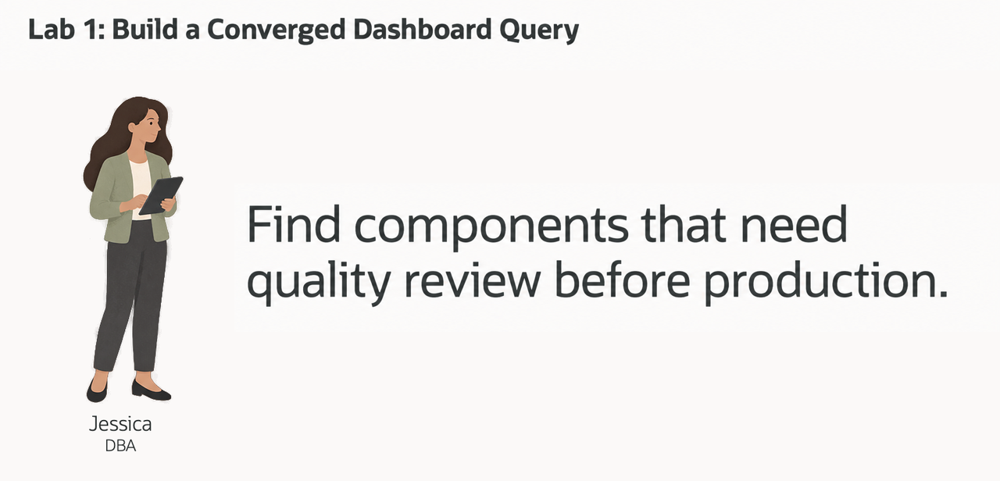
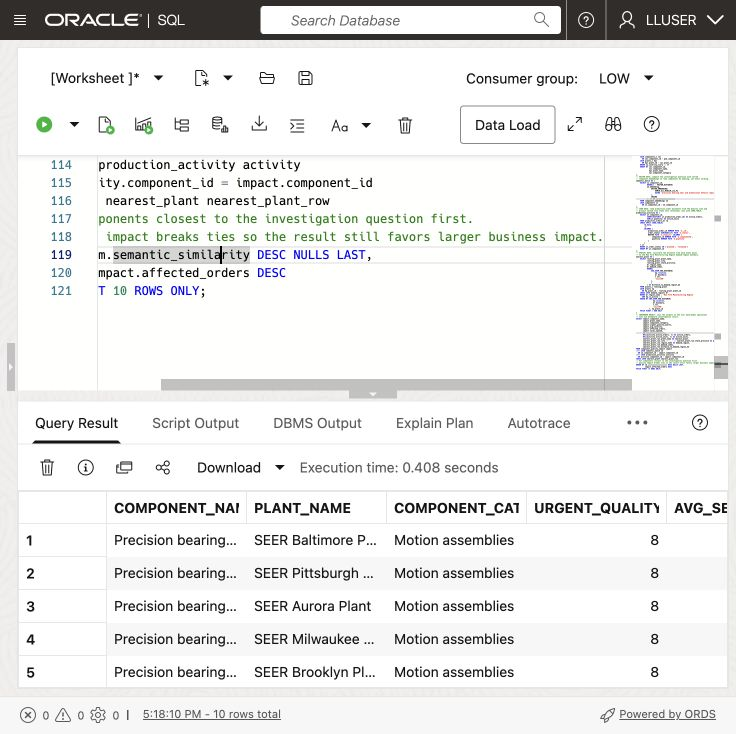
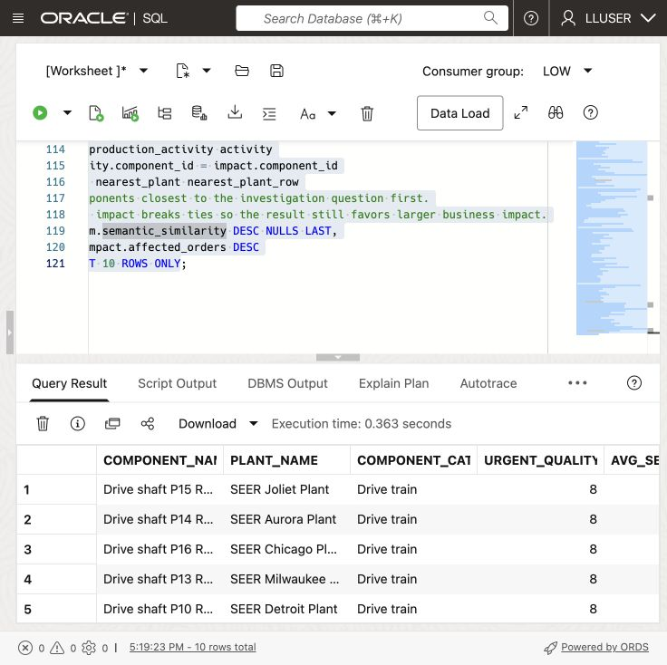
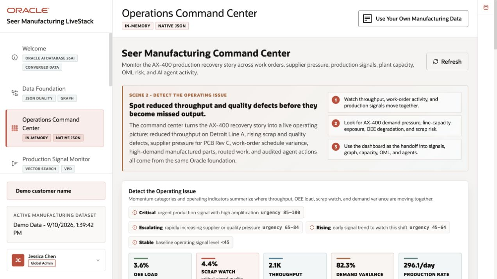
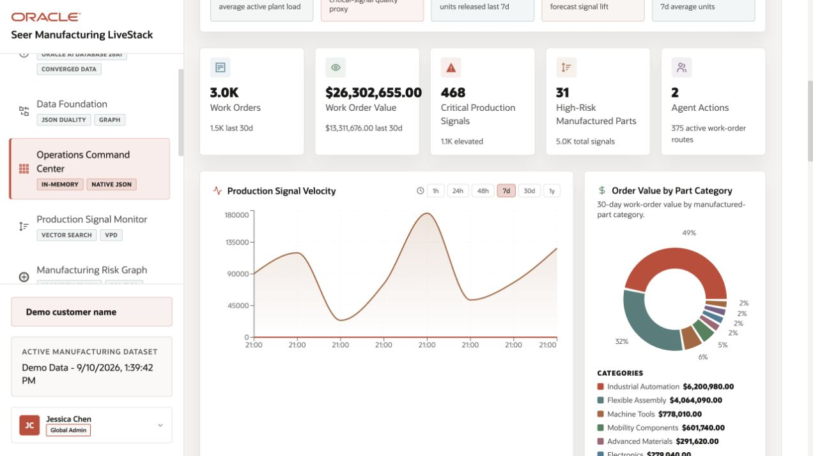

# Build a Converged Dashboard Query

## Introduction

Jessica Chan, SEER MANUFACTURING’s DBA, starts with the quality team’s morning question: **which component needs attention first, and which production orders and customer sites may be affected?**

Combine quality alerts, production orders, component vectors, and plant locations in one SQL query.



### Objectives

- Run one query that combines relational, vector, JSON, and spatial database capabilities.
- Modify the query to investigate a different production-quality question and explain the change in results.

Estimated Time: **10 minutes**

> **SQL Worksheet reminder:** See [Getting Started Task 2: Open SQL Worksheet](?lab=getting-started#Task2:OpenSQLWorksheet) for the steps to paste and run SQL.

## Task 1: Run a converged production investigation

Find components with severe quality alerts, ranked by their match to the investigation phrase.

The query combines four data types:

- **Relational:** Calculate quality impact from alerts and component records.
- **Vector:** Rank component matches with `VECTOR_DISTANCE`.
- **JSON:** Use `JSON_TABLE` to read order lines from `PRODUCTION_ORDERS_DV`.
- **Spatial:** Find the closest plant to the New York Manufacturing Region with `SDO_GEOM.SDO_DISTANCE`.

1. Open SQL Worksheet as `LLUSER`. 

2. Run the query (note the comments that help to locate the specific use of different data types):

    ```sql
    <copy>
    -- RELATIONAL DATA: aggregate high-severity records and join them
    -- to shared component and plant views.
    WITH component_quality_impact AS (
        SELECT sov.component_id,
               sov.component_name,
               hpv.plant_name,
               sov.component_category,
               COUNT(DISTINCT sa.alert_id) AS urgent_quality_alerts,
               ROUND(AVG(sa.severity_score), 1) AS avg_severity,
               SUM(sa.affected_orders) AS affected_orders,
               SUM(sa.corrective_actions_opened) AS cases_opened
        FROM quality_alerts_v sa
        JOIN observation_components pom
          ON pom.observation_id = sa.alert_id
        JOIN components_v sov
          ON sov.component_id = pom.component_id
        JOIN plants_v hpv
          ON hpv.plant_id = sov.plant_id
        WHERE sa.severity_score >= 80
        GROUP BY sov.component_id,
                 sov.component_name,
                 hpv.plant_name,
                 sov.component_category
    ),
    -- VECTOR DATA: compare the investigation question with stored
    -- component embeddings to rank components by meaning, not exact wording.
    semantic_match AS (
        SELECT so.component_id,
               ROUND(1 - VECTOR_DISTANCE(
               oe.embedding,
                   VECTOR_EMBEDDING(
                       ADMIN.ALL_MINILM_L12_V2
                       USING 'precision bearing wear and dimensional defects requiring quality review' AS DATA
                   ),
                   COSINE
               ), 4) AS semantic_similarity
        FROM component_embeddings oe
        JOIN components so
          ON so.component_id = oe.component_id
    ),
    -- JSON DATA: read production_order documents from the duality view and
    -- project nested line items into relational rows with JSON_TABLE.
    production_activity AS (
        SELECT jt.component_id,
               COUNT(DISTINCT jt.production_order_id) AS active_orders,
               SUM(jt.quantity) AS active_units
        FROM production_orders_dv rd
        CROSS APPLY JSON_TABLE(
            rd.data,
            '$'
            COLUMNS (
                production_order_id NUMBER PATH '$._id',
                order_status VARCHAR2(30) PATH '$.status',
                NESTED PATH '$.items[*]' COLUMNS (
                    component_id NUMBER PATH '$.componentId',
                    quantity NUMBER PATH '$.quantity'
                )
            )
        ) jt
        WHERE jt.order_status IN ('planned', 'released')
        GROUP BY jt.component_id
    ),
    -- SPATIAL DATA: calculate the distance from each plant point
    -- to the New York Manufacturing Region demand-region boundary.
    nearest_plant AS (
        SELECT routing_plant.plant_name,
               routing_plant.city,
               routing_plant.state_province,
               dr.region_name,
               dr.demand_index,
               ROUND(
                   SDO_GEOM.SDO_DISTANCE(
                       hp.location,
                       dr.boundary,
                       0.005,
                       'unit=KM'
                   ),
                   2
               ) AS distance_to_demand_region_km
        FROM plants_v routing_plant
        JOIN plants hp
          ON hp.plant_id = routing_plant.plant_id
        CROSS JOIN demand_regions dr
        WHERE dr.region_name = 'New York Manufacturing Region'
          AND hp.is_active = 1
        ORDER BY SDO_GEOM.SDO_DISTANCE(
                     hp.location,
                     dr.boundary,
                     0.005,
                     'unit=KM'
                 ), hp.plant_id
        FETCH FIRST 1 ROW ONLY
    )
    -- CONVERGED RESULT: join the outputs of the four data-model operations
    -- into one dashboard investigation result.
    SELECT impact.component_name,
           impact.plant_name,
           impact.component_category,
           impact.urgent_quality_alerts,
           impact.avg_severity,
           impact.affected_orders,
           impact.cases_opened,
           sm.semantic_similarity,
           NVL(activity.active_orders, 0) AS active_orders,
           NVL(activity.active_units, 0) AS active_units,
           nearest_plant_row.plant_name AS nearest_plant,
           nearest_plant_row.city || ', ' || nearest_plant_row.state_province AS plant_location,
           nearest_plant_row.region_name AS demand_region,
           nearest_plant_row.demand_index,
           nearest_plant_row.distance_to_demand_region_km
    FROM component_quality_impact impact
    LEFT JOIN semantic_match sm
      ON sm.component_id = impact.component_id
    LEFT JOIN production_activity activity
      ON activity.component_id = impact.component_id
    CROSS JOIN nearest_plant nearest_plant_row
    -- Put components closest to the investigation question first.
    -- quality impact breaks ties so the result still favors larger business impact.
    ORDER BY sm.semantic_similarity DESC NULLS LAST,
             impact.affected_orders DESC
    FETCH FIRST 10 ROWS ONLY;
    </copy>
    ```

    

3. Inspect the top component’s quality impact, similarity, and active order quantities. What makes it a priority?

    If the result is empty or incomplete, check for missing embeddings or an empty regional plant set.

> **Interpretation:** The nearest-plant result is regional context shared by every row. It is not a machine-capability or scheduling check, and it does not reassign an order. Affected-production order counts are alert totals and may include a production order in more than one alert; do not read their sum as unique customer sites.

## Task 2: Change the investigation question

Jessica wants to investigate a different concern. Replace the embedded search phrase with:

```text
machining capacity and material availability
```


Run the query again and compare the top rows.



1. Which components moved into or out of the top ten?
2. Which components still have high relational quality impact but a lower semantic similarity to the new question?
3. Which components have the most active production orders or units that may need review?

Similarity determines the ranking; quality impact breaks ties. Compare how the new phrase changes the review order.

## Next Steps

Next, use JSON Relational Duality to expose the same production order data as JSON for an application while keeping SQL access for the database team.

## Application Demo

[Try the LiveStack Manufacturing demo](https://livelabs.oracle.com/ords/r/dbpm/livelabs/view-workshop?wid=4442).

Explore the Operations Command Center. Its AX-400 demo dataset differs from the lab data, so totals will not match.





## Acknowledgements

* **Author** - Matt Kowalik
* **Contributor** - Kevin Lazarz
* **Last Updated By/Date** - Matt Kowalik, September 2026
