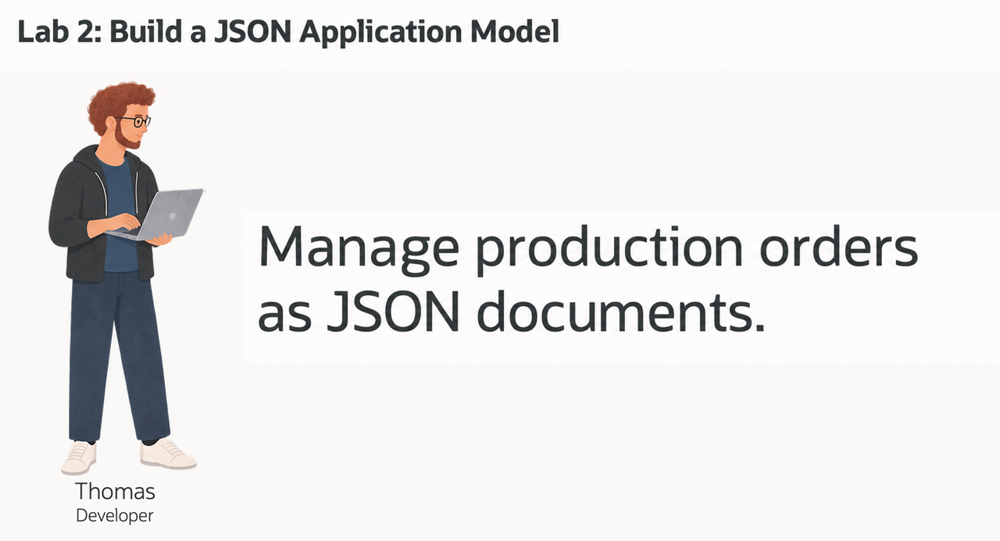
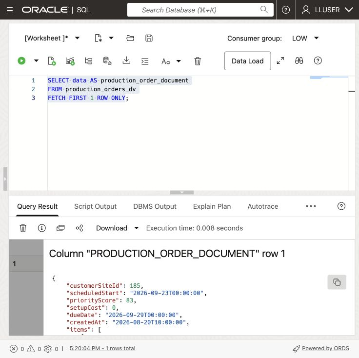
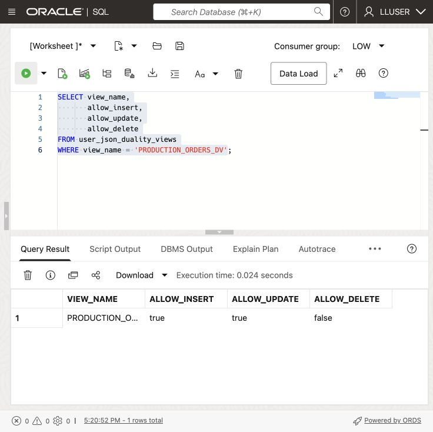
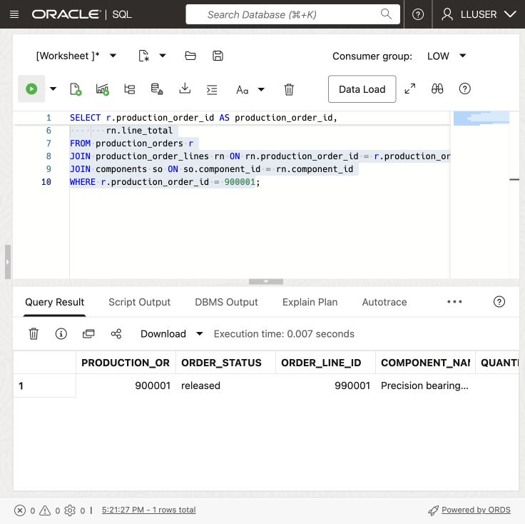
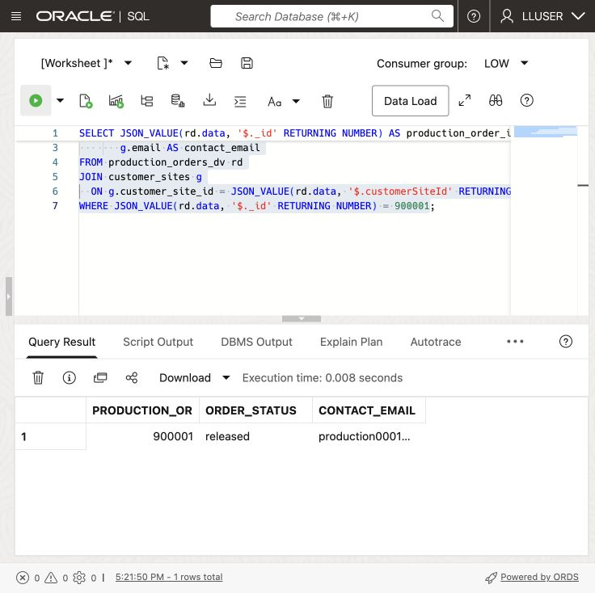
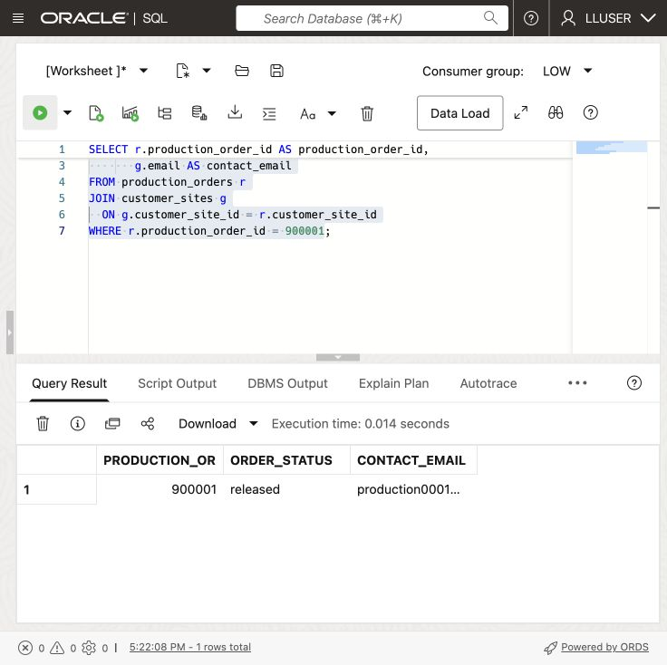

# Build a JSON Application Model

## Introduction

Thomas Brune needs production-order JSON documents for SEER MANUFACTURING’s web and mobile application. Jessica must keep the relational data available for analysis.

Compare three options: a JSON column, a JSON Collection Table, and a duality view over existing rows.



<details>
<summary><strong>Key terms: JSON columns, JSON collections, and JSON Relational Duality</strong></summary>

> - A **JSON column** stores a JSON value in a relational table alongside normal typed columns, keys, and constraints. Thomas can use it for optional or changing application attributes without turning every new attribute into a schema change.
>
> - A **JSON collection** is a special table or view that provides a set of JSON documents through one `JSON`-typed `DATA` column. Each document can have a top-level `_id` used to identify it.
>
> - **JSON Relational Duality** lets Oracle Database expose relational data as JSON documents without copying it into a separate document database. The application gets the document structure Thomas wants for its API. The database keeps the relational rows and controls.
>

</details>

Thomas's application needs a document with the production order and its production-order lines together, such as this:

```json
{
  "_id": 513063,
  "customerSiteId": 1,
  "plantId": 1,
  "scheduledStart": "2026-09-22",
  "dueDate": "2026-09-24",
  "status": "released",
  "items": [
    { "componentId": 1, "quantity": 2, "unitCost": 125.00 }
  ]
}
```


### Objectives

- Store flexible application attributes as JSON in a relational table.
- Create and query a JSON Collection Table of production order documents.
- Read and update relational production order data through `PRODUCTION_ORDERS_DV`.
- Compare the three JSON approaches and choose the right one for an application feature.

Estimated Time: **10 minutes**

> **SQL Worksheet reminder:** See [Getting Started Task 2: Open SQL Worksheet](?lab=getting-started#Task2:OpenSQLWorksheet) for the steps to paste and run SQL.

## Task 1: Store flexible application data as JSON

Thomas starts with optional screen and production-tracking settings stored in a native `JSON` column.

1. Create the application-data table and add one sample document.

    ```sql
    <copy>
    CREATE TABLE thomas_app_data (
        production_order_id  NUMBER PRIMARY KEY,
        app_data  JSON NOT NULL
    );

    INSERT INTO thomas_app_data (production_order_id, app_data)
    SELECT production_order_id,
           JSON_OBJECT(
               'screen'    VALUE 'production_order-detail',
               'showTotal' VALUE 'true' FORMAT JSON,
               'features'  VALUE JSON_ARRAY('live-status', 'delivery-requirements')
               RETURNING JSON
           )
    FROM (
        SELECT production_order_id
        FROM production_orders
        ORDER BY production_order_id
        FETCH FIRST 1 ROW ONLY
    );

    COMMIT;
    </copy>
    ```

2. Read values from the JSON column.

    ```sql
    <copy>
    SELECT production_order_id,
           JSON_VALUE(app_data, '$.screen') AS screen_name,
           JSON_VALUE(app_data, '$.showTotal' RETURNING BOOLEAN) AS show_total,
           JSON_QUERY(app_data, '$.features') AS app_features
    FROM thomas_app_data;
    </copy>
    ```

    `PRODUCTION_ORDER_ID` remains a relational key. `APP_DATA` can change as the application changes. Thomas can query both with SQL in one table.

## Task 2: Create a JSON Collection Table

Next, store application-owned documents in a JSON Collection Table. Each row’s `DATA` column holds a document identified by `_id`.

1. Create the collection and add the sample production order document.

    ```sql
    <copy>
    CREATE JSON COLLECTION TABLE thomas_production_order_docs
    WITH ETAG;

    INSERT INTO thomas_production_order_docs (data)
    SELECT JSON_OBJECT(
               '_id'        VALUE r.production_order_id,
               'customerSiteId' VALUE r.customer_site_id,
               'plantId' VALUE r.plant_id,
               'scheduledStart' VALUE TO_CHAR(r.scheduled_start, 'YYYY-MM-DD'),
               'dueDate' VALUE TO_CHAR(r.due_date, 'YYYY-MM-DD'),
               'status'     VALUE r.order_status,
               'items'      VALUE (
                   SELECT JSON_ARRAYAGG(
                              JSON_OBJECT(
                                  'orderLineId'    VALUE rn.order_line_id,
                                  'componentId' VALUE rn.component_id,
                                  'quantity'  VALUE rn.quantity,
                                  'unitCost' VALUE rn.unit_cost
                                  RETURNING JSON
                              ) ORDER BY rn.order_line_id RETURNING JSON
                          )
                   FROM production_order_lines rn
                   WHERE rn.production_order_id = r.production_order_id
               ) FORMAT JSON
               RETURNING JSON
           )
    FROM production_orders r
    JOIN thomas_app_data t ON t.production_order_id = r.production_order_id;

    COMMIT;
    </copy>
    ```

    `WITH ETAG` adds `_metadata.etag`, which changes with the document. An application can use the tag it last read to detect concurrent changes and avoid overwriting a newer version.

2. Query the collection as documents.

    ```sql
    <copy>
    SELECT JSON_SERIALIZE(data PRETTY) AS production_order_document
    FROM thomas_production_order_docs
    WHERE JSON_VALUE(data, '$._id' RETURNING NUMBER) =
          (SELECT production_order_id FROM thomas_app_data);
    </copy>
    ```

    The collection stores its own documents, separately from `PRODUCTION_ORDERS` and `PRODUCTION_ORDER_LINES`.

## Task 3: Read a customer site document from relational data

Now read a document assembled from the existing relational orders.

1. Run this query:

    ```sql
    <copy>
    SELECT data AS production_order_document
    FROM production_orders_dv
    FETCH FIRST 1 ROW ONLY;
    </copy>
    ```

    

    **Expected output:** One production-order JSON document containing the order identifier, customer-site identifier, status and nested order lines.

2. Expand the document in SQL Worksheet.
    Inspect `customerSiteId`, `status`, totals, timestamps, and nested order lines. They come from the relational rows.

    > **Note:** The duality document also has `_metadata.etag` for detecting concurrent changes.

## Task 4: Enable document inserts and updates

The existing `PRODUCTION_ORDERS_DV` lets an application update production order documents. Here, you also allow inserts. Oracle still enforces the table keys and constraints. An application granted access only to the view can use only the fields and write operations that the view allows.

1. Check the current document-write capabilities.

    ```sql
    <copy>
    SELECT view_name,
           allow_insert,
           allow_update,
           allow_delete
    FROM user_json_duality_views
    WHERE view_name = 'PRODUCTION_ORDERS_DV';
    </copy>
    ```

    **Expected output: Current Document Capabilities**

    `PRODUCTION_ORDERS_DV` should report update enabled and insert disabled in the initial loader definition.

    Enable inserts in both the root `PRODUCTION_ORDERS` mapping and the nested `PRODUCTION_ORDER_LINES` mapping. The `WITH INSERT UPDATE` annotations allow writes through the duality view; they do not grant privileges to another database user.

2. Enable insert and update for the document and its production-order lines.

    ```sql
    <copy>
    CREATE OR REPLACE JSON RELATIONAL DUALITY VIEW production_orders_dv AS
    SELECT JSON {
        '_id'         : r.production_order_id,
        'customerSiteId'  : r.customer_site_id,
        'plantId' : r.plant_id,
        'scheduledStart'     : r.scheduled_start,
        'dueDate'    : r.due_date,
        'status'      : r.order_status,
        'total'       : r.order_total,
        'setupCost': r.setup_cost,
        'priorityScore' : r.priority_score,
        'createdAt'   : r.created_at,
        'items' : [
            SELECT JSON {
                'orderLineId'    : rn.order_line_id,
                'componentId' : rn.component_id,
                'quantity'  : rn.quantity,
                'unitCost' : rn.unit_cost
            }
            FROM production_order_lines rn WITH INSERT UPDATE
            WHERE rn.production_order_id = r.production_order_id
        ]
    }
    FROM production_orders r WITH INSERT UPDATE;
    </copy>
    ```

    `PRODUCTION_ORDERS` supplies the root; `PRODUCTION_ORDER_LINES` supplies `items`. Both `WITH INSERT UPDATE` clauses allow document writes while table constraints remain enforced.

    **Expected output: View Definition Updated**

3. Run the capability query again.

    ```sql
    <copy>
    SELECT view_name,
           allow_insert,
           allow_update,
           allow_delete
    FROM user_json_duality_views
    WHERE view_name = 'PRODUCTION_ORDERS_DV';
    </copy>
    ```

    

    **Expected output: Document Capabilities Enabled**

    `PRODUCTION_ORDERS_DV` should report insert and update enabled; delete remains disabled.

## Task 5: Create and update a JSON production order

Thomas inserts an order as JSON, then checks the relational rows with Jessica.

1. Insert the supplied workshop production order document.

    The document uses order `900001` and line `990001`, reserved for this exercise, with customer site `1`, plant `1`, and component `1`.

    The sandbox supplies those referenced records. Fixed dates keep the exercise repeatable; quantity is independent of the date range. Rerunning the insert preserves the existing order.

    ```sql
    <copy>
    INSERT INTO production_orders_dv (data)
    SELECT JSON(
      '{
        "_id": 900001,
        "customerSiteId": 1,
        "plantId": 1,
        "scheduledStart": "2026-09-22",
        "dueDate": "2026-09-24",
        "status": "planned",
        "total": 250.00,
        "setupCost": 0,
        "items": [
          {
            "orderLineId": 990001,
            "componentId": 1,
            "quantity": 2,
            "unitCost": 125.00
          }
        ]
      }'
    )
    WHERE NOT EXISTS (
      SELECT 1
      FROM production_orders
      WHERE production_order_id = 900001
    );

    COMMIT;
    </copy>
    ```

    **Expected output: Production order Document Created**

    On the first run, you insert one document. On later runs, the `NOT EXISTS` check returns zero rows because the workshop production order is already present.

2. Confirm the JSON document became relational rows.

    > **Note:** This query reads the relational tables `PRODUCTION_ORDERS` and `PRODUCTION_ORDER_LINES`!

    ```sql
    <copy>
    SELECT r.production_order_id AS production_order_id,
           r.order_status AS order_status,
           g.email AS contact_email,
           rn.order_line_id,
           so.component_name,
           rn.quantity,
           rn.unit_cost,
           rn.line_total
    FROM production_orders r
    JOIN customer_sites g ON g.customer_site_id = r.customer_site_id
    JOIN production_order_lines rn ON rn.production_order_id = r.production_order_id
    JOIN components so ON so.component_id = rn.component_id
    WHERE r.production_order_id = 900001;
    </copy>
    ```

    **Expected output: Created Production order Rows**

    The sample row should contain production order 900001, order-line 990001, two units at 125.00, line total 250.00, and status `planned` on the first run. Read the customer site email and component name from the loaded rows.

3. Update the document status through the duality view.

    This statement updates only `status` through `PRODUCTION_ORDERS_DV`. Oracle maps it to `PRODUCTION_ORDERS.ORDER_STATUS`. The view also allows updates to other exposed fields; restricting writes to status alone would require a more limited view definition. Thomas does not need to parse the document in the application.

    ```sql
    <copy>
    UPDATE production_orders_dv
    SET data = JSON_TRANSFORM(data, SET '$.status' = 'released')
    WHERE JSON_VALUE(data, '$._id' RETURNING NUMBER) = 900001;

    COMMIT;
    </copy>
    ```

    **Expected output: Production order Status Updated**

    Oracle updates one document. The following query confirms that the relational production order row now has status `released`.

4. Verify the updated relational status.

    ```sql
    <copy>
    SELECT r.production_order_id AS production_order_id,
           r.order_status AS order_status,
           rn.order_line_id,
           so.component_name,
           rn.quantity,
           rn.line_total
    FROM production_orders r
    JOIN production_order_lines rn ON rn.production_order_id = r.production_order_id
    JOIN components so ON so.component_id = rn.component_id
    WHERE r.production_order_id = 900001;
    </copy>
    ```

    

    **Expected output: Updated Production order Rows**

    Production order 900001 should now have status `released`, with the same order-line values.

## Task 6: Project JSON fields with SQL

Jessica now extracts JSON fields as SQL columns—a **projection**—and compares them with the relational data.

1. Run this SQL/JSON projection query:

    `JSON_VALUE` extracts the order ID, status, and customer-site ID. The query joins `CUSTOMER_SITES` to add the email address.

    ```sql
    <copy>
    SELECT JSON_VALUE(rd.data, '$._id' RETURNING NUMBER) AS production_order_id,
           JSON_VALUE(rd.data, '$.status') AS order_status,
           g.email AS contact_email
    FROM production_orders_dv rd
    JOIN customer_sites g
      ON g.customer_site_id = JSON_VALUE(rd.data, '$.customerSiteId' RETURNING NUMBER)
    WHERE JSON_VALUE(rd.data, '$._id' RETURNING NUMBER) = 900001;
    </copy>
    ```

    

    **Expected output: JSON Field Projection**

    Compare production order ID 900001, status `released`, and the loaded customer site email with the following relational query. Check these values against your database results.

2. Run the equivalent query against the relational tables.

    ```sql
    <copy>
    SELECT r.production_order_id AS production_order_id,
           r.order_status AS order_status,
           g.email AS contact_email
    FROM production_orders r
    JOIN customer_sites g
      ON g.customer_site_id = r.customer_site_id
    WHERE r.production_order_id = 900001;
    </copy>
    ```

    

    The order ID, status, and customer-site email should match the preceding JSON projection.

## Conclusion: Choose the right JSON approach

Choose the JSON approach according to who owns the data:

| Approach | Use it for |
| --- | --- |
| JSON column | Optional attributes alongside a relational key. |
| JSON Collection Table | Application-owned documents, such as order drafts. |
| JSON Relational Duality View | Documents over shared relational orders and order lines. |

Thomas chooses a duality view for shared production orders: the application gets JSON while Jessica queries the same rows with SQL.

## Acknowledgements

* **Author** - Matt Kowalik
* **Contributor** - Kevin Lazarz
* **Last Updated By/Date** - Matt Kowalik, September 2026
