# Trace a Production Quality Network

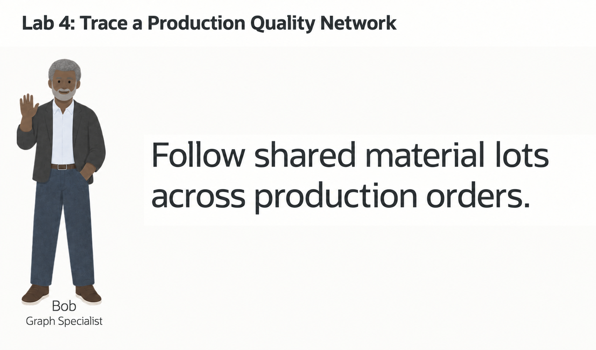

## Introduction

> **Validation status:** The manual LLUSER walkthrough and authentic manufacturing captures are recorded in the [validation report](../validation/validation-report.md). Green-button and Terraform provisioning remain untested.

Bob Green is a graph specialist at SEER MANUFACTURING. He uses property graphs to investigate production quality.

A production order row does not show where its material lot was used elsewhere. Shared material lots, inspection records, machines, or suppliers can reveal connections between production orders.

First, use SQL/PGQ to follow connections between production orders. Then open Graph Studio to view the same relationships as an interactive network.

Graph Studio is Oracle Database’s visual workspace for property graphs. SQL/PGQ returns tables you can sort and compare. Graph Studio shows nodes, edges, and paths you can explore. You will use both to investigate production order `PO-8841`.


<details>
<summary><strong>Key terms: property graph, vertex, edge, and SQL Property Graph Queries (SQL/PGQ)</strong></summary>

> - A **property graph** represents things and how they are connected. In this lab, things include production orders, material lots, suppliers, inspection records, machines, plants, and material certificates. A graph makes relationship patterns easier to see than they are in a flat table.
>
> - A **vertex** is a graph node that represents something investigators care about, such as a production order, material lot, supplier, machine, inspection record, or material certificate. In this graph, vertices use the `entity` label and carry properties such as a quality risk score, source system, or material value.
>
> - An **edge** is a connection between vertices, such as a production order using a material lot, being processed on a machine, or linking to an inspection record. In this graph, edges use the `related_to` label and carry properties such as the relationship type.
>
> - A **hop** is one step across an edge from one vertex to another. `PO-8841` to a material lot is one hop. `PO-8841` to that material lot and then to another production order is two hops. The hop count tells investigators how far the search travels from the starting production order; it does not describe physical distance or production order time.
>
> - **SQL Property Graph Queries (SQL/PGQ)** let you describe graph patterns in SQL, such as "start with this production order and follow related entities." That lets investigators ask relationship questions in SQL without moving production quality data into a separate graph-only database.

</details>

### Objectives

- Identify vertices and edges in a property graph.
- Follow connections from a flagged production order.
- Find production order pairs that share traceability records.
- Open Graph Studio from Database Actions.
- Import and run the manufacturing production-quality-network notebook.
- Explain the result in terms a production analyst can act on.

Estimated Time: **10 minutes**

### Hands-on Scenario

| Step                | Manufacturing focus                                                                                                  |
| ---------------------| ----------------------------------------------------------------------------------------------------------------|
| Business Problem    | Production quality teams need to see relationships that are hard to detect from production order tables alone.                   |
| Technical Challenge | Bob needs to follow paths and find shared traceability records without writing long chains of self-joins.                  |
| Persona Focus       | You review Bob's graph design and interpret its results for a production quality review.                                     |
| What You Will See   | A property graph shows connected entities and production order pairs with SQL.                                           |
| Database Capability | `PRODUCTION_QUALITY_NETWORK` and GRAPH\_TABLE support SQL/PGQ traversal.                                                     |
| Outcome             | A production analyst can see which production orders are connected, what they share, and which relationships deserve review. |

Persona focus: You are reviewing Bob's graph solution with a production quality analyst.

> **SQL Worksheet reminder:** See [Getting Started Task 2: Open SQL Worksheet](?lab=getting-started#Task2:OpenSQLWorksheet) for the steps to paste and run SQL.

## Task 1: Follow a flagged production order with SQL

Jessica has already written a query for Bob. It shows the entities directly connected to flagged production order `PO-8841`. The query works, but Jessica is concerned about what happens when investigators need to follow relationships several steps away.

In this lab, a **hop** means one relationship step. The production order to a material lot is one hop. The production order to that material lot and then to another production order is two hops. A four-hop search follows four such steps from `PO-8841`, so it can reveal entities that are not directly connected to the production order.

1. Run Jessica's ordinary SQL query:

    ```sql
    <copy>
    SELECT production_order.entity_key AS production_order_key,
           connected.entity_key AS connected_key,
           connected.entity_type AS connected_type,
           rel.relationship_type,
           connected.risk_score AS connected_risk
    FROM trace_entities production_order
    JOIN trace_relationships rel
      ON rel.from_entity = production_order.entity_id
    JOIN trace_entities connected
      ON connected.entity_id = rel.to_entity
    WHERE production_order.entity_key = 'PO-8841'
    ORDER BY connected_risk DESC;
    </copy>
    ```

    The query joins `TRACE_ENTITIES` twice: once for the production order and once for the connected entity. `TRACE_RELATIONSHIPS` supplies the edge between them.

    **Expected output: Direct production order Connections**

    The result lists the material lot, machine, inspection record, and plant directly connected to `PO-8841`. The supplier is reached through the material lot in the later multi-hop query.

2. Extend Jessica's query to follow one through four hops without using a graph query:

    ```sql
    <copy>
    SELECT production_order_key, connected_key, connected_type,
           relationship_path, connected_risk
    FROM (
      SELECT seed.entity_key AS production_order_key,
             reached.entity_key AS connected_key,
             reached.entity_type AS connected_type,
             r1.relationship_type AS relationship_path,
             reached.risk_score AS connected_risk
      FROM trace_entities seed
      JOIN trace_relationships r1
        ON r1.from_entity = seed.entity_id
      JOIN trace_entities reached
        ON reached.entity_id = r1.to_entity
      WHERE seed.entity_key = 'PO-8841'

      UNION

      SELECT seed.entity_key,
             reached.entity_key,
             reached.entity_type,
             r1.relationship_type || ' -> ' || r2.relationship_type,
             reached.risk_score
      FROM trace_entities seed
      JOIN trace_relationships r1
        ON r1.from_entity = seed.entity_id
      JOIN trace_entities v1
        ON v1.entity_id = r1.to_entity
      JOIN trace_relationships r2
        ON r2.from_entity = v1.entity_id
      JOIN trace_entities reached
        ON reached.entity_id = r2.to_entity
      WHERE seed.entity_key = 'PO-8841'

      UNION

      SELECT seed.entity_key,
             reached.entity_key,
             reached.entity_type,
             r1.relationship_type || ' -> ' ||
               r2.relationship_type || ' -> ' ||
               r3.relationship_type,
             reached.risk_score
      FROM trace_entities seed
      JOIN trace_relationships r1
        ON r1.from_entity = seed.entity_id
      JOIN trace_entities v1
        ON v1.entity_id = r1.to_entity
      JOIN trace_relationships r2
        ON r2.from_entity = v1.entity_id
      JOIN trace_entities v2
        ON v2.entity_id = r2.to_entity
      JOIN trace_relationships r3
        ON r3.from_entity = v2.entity_id
      JOIN trace_entities reached
        ON reached.entity_id = r3.to_entity
      WHERE seed.entity_key = 'PO-8841'

      UNION

      SELECT seed.entity_key,
             reached.entity_key,
             reached.entity_type,
             r1.relationship_type || ' -> ' ||
               r2.relationship_type || ' -> ' ||
               r3.relationship_type || ' -> ' ||
               r4.relationship_type,
             reached.risk_score
      FROM trace_entities seed
      JOIN trace_relationships r1
        ON r1.from_entity = seed.entity_id
      JOIN trace_entities v1
        ON v1.entity_id = r1.to_entity
      JOIN trace_relationships r2
        ON r2.from_entity = v1.entity_id
      JOIN trace_entities v2
        ON v2.entity_id = r2.to_entity
      JOIN trace_relationships r3
        ON r3.from_entity = v2.entity_id
      JOIN trace_entities v3
        ON v3.entity_id = r3.to_entity
      JOIN trace_relationships r4
        ON r4.from_entity = v3.entity_id
      JOIN trace_entities reached
        ON reached.entity_id = r4.to_entity
      WHERE seed.entity_key = 'PO-8841'
    ) paths
    ORDER BY connected_risk DESC;
    </copy>
    ```

    Jessica now needs four separate SELECT statements. The first branch follows one relationship step, the second follows two, the third follows three, and the fourth follows four. Each additional hop adds another relationship join and another entity join. The `UNION` combines the four path lengths and removes duplicate rows. This returns the same one-through-four-hop range as Bob's graph query, but it is much longer and harder to change.

3. Review how the SQL grows more complex when it does not use a graph query.

    Jessica can add another relationship step, but she must join `TRACE_ENTITIES` and `TRACE_RELATIONSHIPS` again. Four hops need four relationship joins and five instances of the entity table. If she wants to support several possible path lengths, the query needs more joins, unions, and duplicate handling. The SQL becomes harder to read just as the investigation becomes more important.

    This is the problem Bob's graph approach is meant to solve. The relationships already exist in relational tables, but a graph query can express the path directly.

## Task 2: Read the same connections as a graph

Bob has already created the `PRODUCTION_QUALITY_NETWORK` property graph for this lab. You do not need to create it before running the queries. The graph definition uses the existing relational tables as its source; it does not create a second copy of the production quality data. Check the appendix to learn how Bob created the graph and mapped the relational tables to vertices and edges.

In graph terms, the production order and connected objects are **vertices**. The row in `TRACE_RELATIONSHIPS` between them is an **edge**. `GRAPH_TABLE` lets Bob query those vertices and edges with a graph pattern while Oracle keeps the source data in the database.

1. Run Bob's SQL/PGQ query:

    ```sql
    <copy>
    SELECT production_order_key,
           connected_key,
           connected_type,
           relationship_type,
           connected_risk
    FROM GRAPH_TABLE ( production_quality_network
      MATCH (production_order IS entity) -[edge IS related_to]-> (connected IS entity)
      WHERE production_order.entity_key = 'PO-8841'
      COLUMNS (
        production_order.entity_key AS production_order_key,
        connected.entity_key AS connected_key,
        connected.entity_type AS connected_type,
        edge.relationship_type AS relationship_type,
        connected.risk_score AS connected_risk
      )
    )
    ORDER BY connected_risk DESC;
    </copy>
    ```

    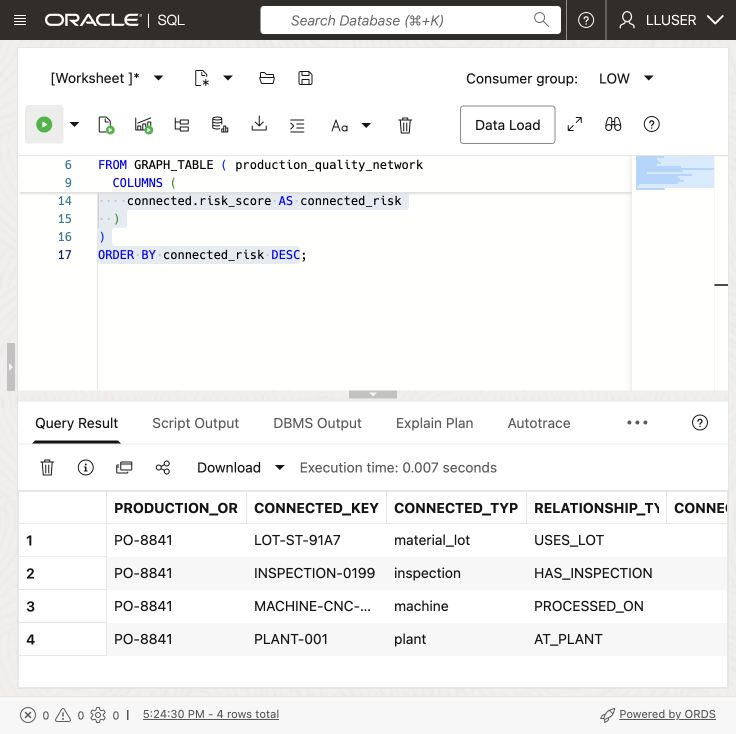

    

    In the `MATCH` pattern, `production_order` and `connected` are vertices. `edge` is the edge between them, so this pattern follows one hop. `IS entity` and `IS related_to` refer to the labels defined in `PRODUCTION_QUALITY_NETWORK`.

    The result returns the same columns as Jessica's query. The difference is the way Bob describes the investigation: start at one vertex, follow one edge, and return the connected vertex.

## Task 3: Trace four-hop quality traceability

Start from flagged production order `PO-8841` and trace the connected entities within four relationship hops.

1. Run the SQL/PGQ traversal from `PO-8841`.

    This query treats the production quality data as a graph. In the `MATCH` pattern, `(seed IS entity)` is the starting production order, `-[e IS related_to]->{1,4}` means follow a path of one, two, three, or four hops, and `(reached IS entity)` is every entity reached from that starting point. The database counts each relationship in the path as one hop. `COUNT(e.relationship_type)` returns that count as `relationship_hops`; `relationship_type` is an edge property exposed by the graph definition.

    The `WHERE` clause anchors the search on `PO-8841`, and the `COLUMNS` clause returns graph properties in a normal SQL result table.

    This is much easier than writing the same logic with ordinary joins. Without SQL/PGQ graph pattern matching, you would need separate self-joins for one-hop and four-hop paths, extra union logic for each hop level, and more code every time investigators want to follow another type of relationship.

    The graph pattern says the investigation in plain terms: start with this production order, follow the relationships, and show what is connected.

    ```sql
    <copy>
    SELECT DISTINCT entity_key, display_name, entity_type,
           relationship_hops, risk_score, risk_level,
           material_value, source_system
    FROM GRAPH_TABLE ( production_quality_network
      MATCH (seed IS entity) -[e IS related_to]->{1,4} (reached IS entity)
      WHERE seed.entity_key = 'PO-8841'
      COLUMNS (
        reached.entity_key AS entity_key,
        reached.display_name AS display_name,
        reached.entity_type AS entity_type,
        COUNT(e.relationship_type) AS relationship_hops,
        reached.risk_score AS risk_score,
        reached.risk_level AS risk_level,
        reached.material_value AS material_value,
        reached.source_system AS source_system
      )
    )
    ORDER BY risk_score DESC
    FETCH FIRST 25 ROWS ONLY;
    </copy>
    ```

    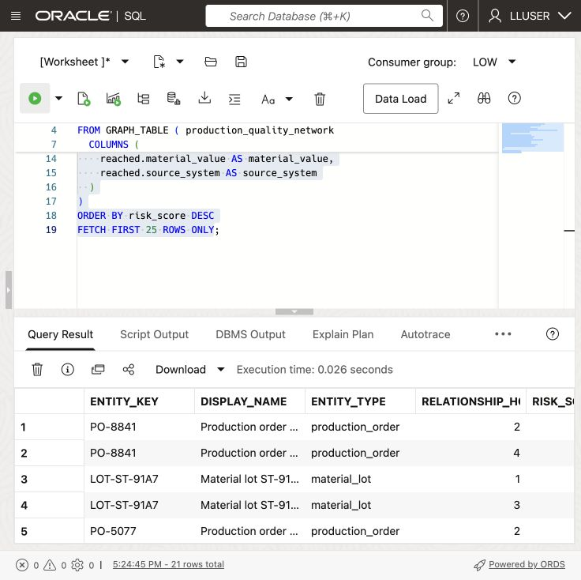

    

    RELATIONSHIP_HOPS shows the entity's level in the search. A value of `1` means the entity is directly connected to `PO-8841`; a value of `2` means the query reached it after one intermediate vertex; values `3` and `4` show deeper connections.

    **Expected output: High Risk Production quality Entities**

    

2. Review the high-risk entities.
    The query returns connected entities as a risk-sorted table, not as a visual network. That makes the graph result usable in the same SQL review workflow as the dashboard, vector search, and production order labs.

    The expected rows show the entities connected to flagged production order `PO-8841`. 
    For example:
    * `LOT-ST-91A7` is a material lot 
    * `MACHINE-CNC-017` is a machine identifier reused across production orders
    * `SUPPLIER-044` is a supplier
    * `INSPECTION-0199` is an inspection record
    
    These rows matter because they show what the flagged production order touched or shared.

    The result gives investigators a risk-sorted list of connected entities. Instead of reviewing a tangle of connections, the analyst gets a table sorted by risk. A high quality-risk score identifies a review candidate. Material value helps estimate the amount of production work involved; neither value establishes the cause of a defect.

## Task 4: Find production orders that share traceability records

Bob now moves from one flagged production order to a broader production quality question: **which production order pairs share a material lot, supplier, inspection record, or material certificate?** This is the kind of relationship pattern that can be difficult to find with ordinary joins.

1. Run Bob's production order-pair query:

    ```sql
    <copy>
    SELECT order_a, shared_entity, shared_type, order_b,
           a_risk, b_risk,
           ROUND((a_risk + b_risk) / 2, 1) AS combined_risk,
           e1_type, e2_type
    FROM GRAPH_TABLE ( production_quality_network
        MATCH (a IS entity)
              -[e1 IS related_to]-> (shared IS entity)
              <-[e2 IS related_to]- (b IS entity)
        WHERE a.entity_type = 'production_order'
          AND b.entity_type = 'production_order'
          AND a.entity_id < b.entity_id
          AND shared.entity_type IN ('material_lot','supplier','inspection','certificate')
          AND (a.risk_score >= 70 OR b.risk_score >= 70)
        COLUMNS (
            a.entity_key AS order_a,
            shared.entity_key AS shared_entity,
            shared.entity_type AS shared_type,
            b.entity_key AS order_b,
            a.risk_score AS a_risk,
            b.risk_score AS b_risk,
            e1.relationship_type AS e1_type,
            e2.relationship_type AS e2_type
        )
    )
    ORDER BY combined_risk DESC, shared_entity
    FETCH FIRST 25 ROWS ONLY;
    </copy>
    ```

    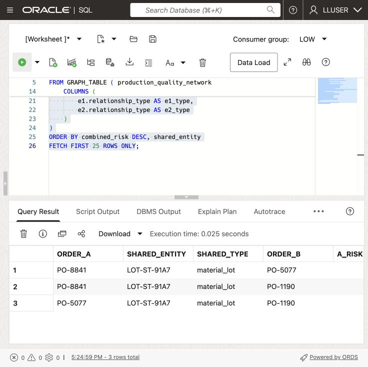

    

    The pattern starts at production order `a`, follows an edge to a shared entity, and follows another edge back to production order `b`. The two production orders can therefore be connected through the same material lot, supplier, inspection record, or material certificate. `a.entity_id < b.entity_id` keeps the result from returning the same pair twice in reverse order.

2. Review the business result.

    The result shows the two production orders, the information they share, the relationship type on each side, and the risk score for each production order. `COMBINED_RISK` helps the analyst review the strongest production order pairs first. A shared traceability record does not prove a defect, but it gives the production quality team a clear reason to investigate the production orders together.

    

## Task 5: Visualize the relationship using Oracle Graph Studio

Oracle Graph Studio displays the production orders and identifiers as an interactive network. Bob can select nodes and follow relationships to find clusters, shared material lots, and links between production orders.

In the following tasks, use Graph Studio to turn the SQL results for `PO-8841` into an investigation map.

1. Start from the Database Actions Launchpad. Confirm that the upper-right corner shows `LLUSER`. If the dark-theme message appears, click **Done**.

    

3. On the **Development** tab, select **Graph Studio** from the left-side tool list and click **Open**.


4. If prompted, sign in with the `LLUSER` and the workshop password supplied.

5. Confirm that the Graph Studio home page opens. The landing page provides **Graphs**, **Notebooks**, **Templates**, and **Jobs**.

    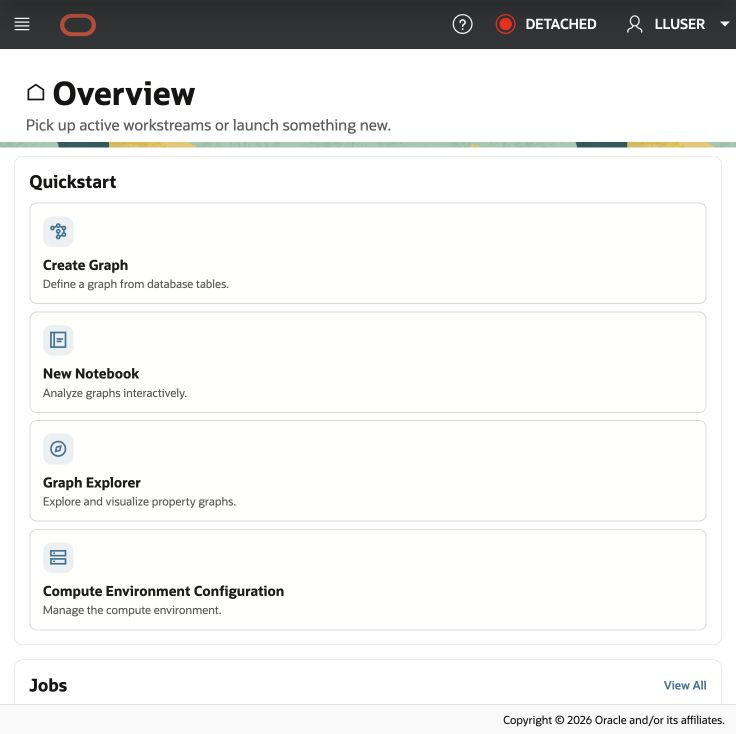

## Task 6: Download and import the manufacturing notebook

The supplied `.dsnb` file is a native Graph Studio notebook: a reusable, runnable investigation guide that combines SQL/PGQ paragraphs and graph visualizations.

1. Download [manufacturing-production-quality-graph-studio.dsnb](files/manufacturing-production-quality-graph-studio.dsnb).

    If the notebook opens in your browser instead of downloading, right-click the link and select **Save Link As**.

2. In Graph Studio, click **Notebooks** in the landing page.

    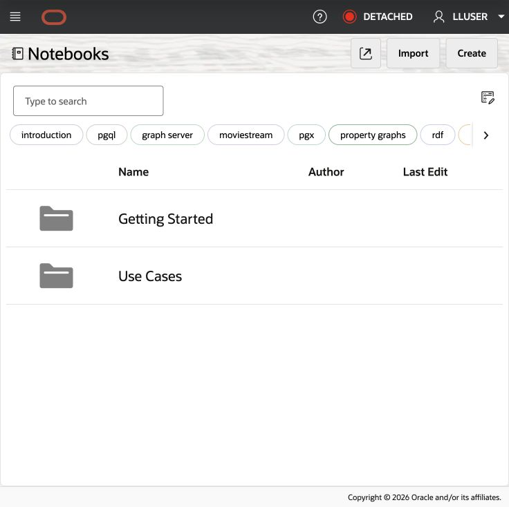

3. Select **Import** in the upper-right corner.

    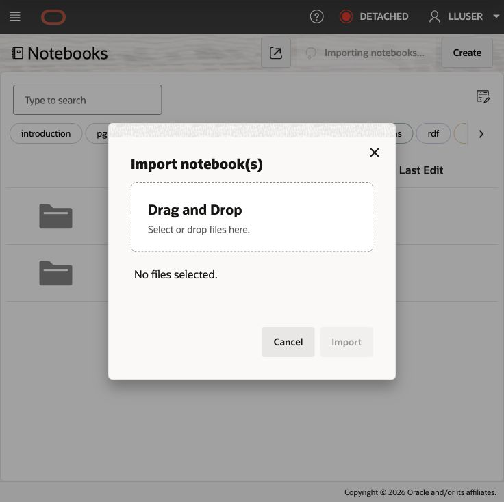

    

4. Once the import notebooks tab opens, drag & drop the `manufacturing-production-quality-graph-studio.dsnb` file from your local computer into the import window, or browse to the file on your computer. Review the selected filename and click **Import**. Open **Production Quality Network** after the import completes.

    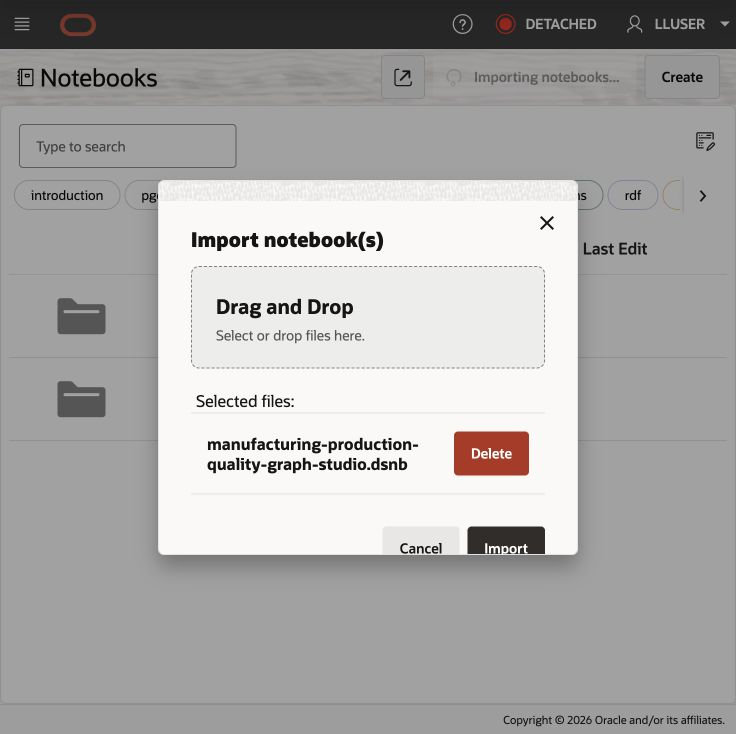

    


## Task 7: Run and interpret the Graph Studio notebook

You already ran the SQL/PGQ patterns in SQL Worksheet. Now run selected parts of that investigation in Graph Studio so you can compare the query results with the visual graph experience. The notebook shows the `PO-8841` path and the `LOT-ST-91A7` shared-material lot view.

Use the table to rank connected entities. Use the graph to follow the paths and shared traceability records that connect them.

1. Start at the top of the **Production Quality Network** notebook. Read the explanation for the `PO-8841` traversal, then run the first SQL paragraph.

    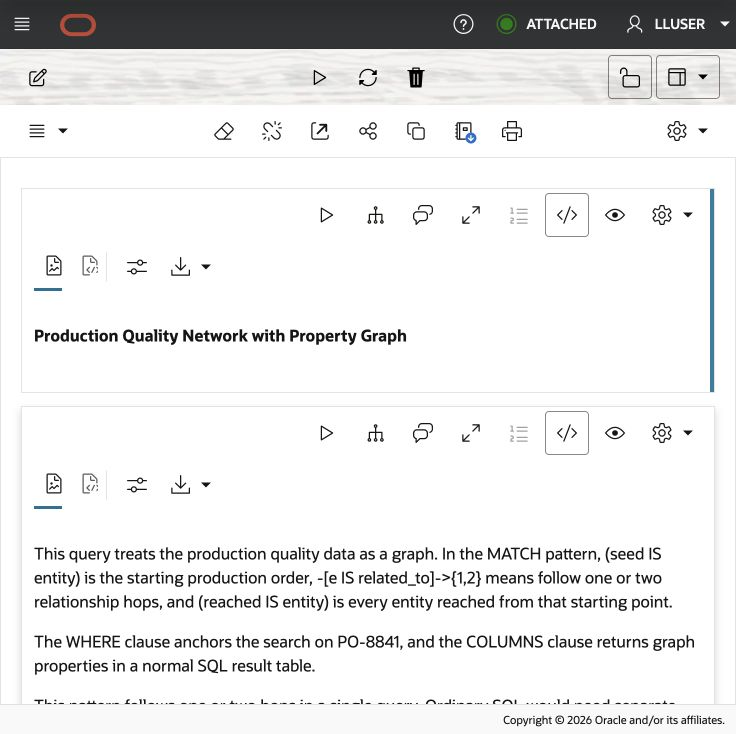

    

2. Review the results in table format in the graph studio notebook:

    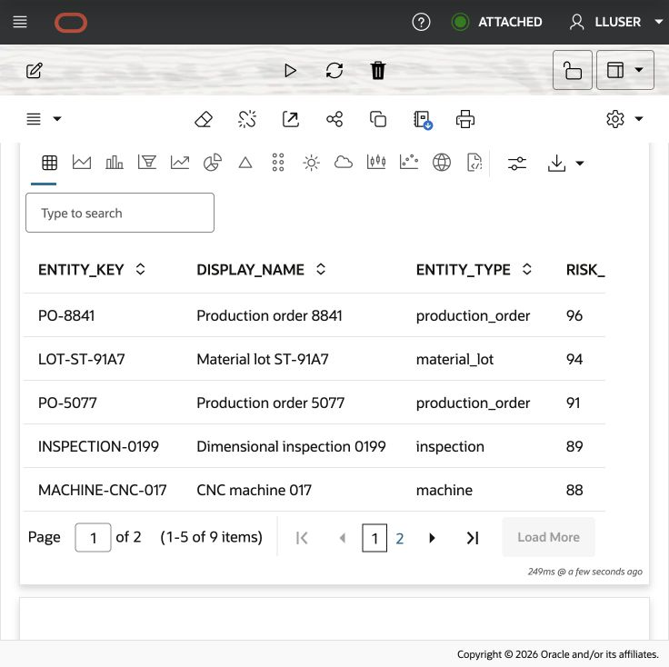

    This uses the investigation pattern from Task 3 with a shorter one-to-two-hop limit: start from `PO-8841`, follow one or two relationship hops, and return the connected entities as a prioritized table.

    | Paragraph | Result | Investigation purpose |
    | --- | --- | --- |
    | `SELECT DISTINCT ... WHERE seed.entity_key = 'PO-8841'` | Table | Ranks entities reached within one or two hops of `PO-8841`. |
    | `Graph Visualization of previous query` | Markdown label | Introduces the visual version of the first traversal. |
    | `SELECT * ... WHERE src.entity_key = 'PO-8841'` | Graph visualization | Draws the one-hop and two-hop path from the flagged production order. |
    | `Shared Entity Connections` | Markdown label and explanation | Introduces the material lot-centered relationship view. |
    | `SELECT * ... WHERE material_lot.entity_key = 'LOT-ST-91A7'` | Graph visualization | Centers on `LOT-ST-91A7` and draws its directly connected production orders. |

3. Under **Graph Visualization of previous query**, run the SQL paragraph that starts with `SELECT *` and anchors on `PO-8841`. Review the graph visualization that appears below the paragraph.

    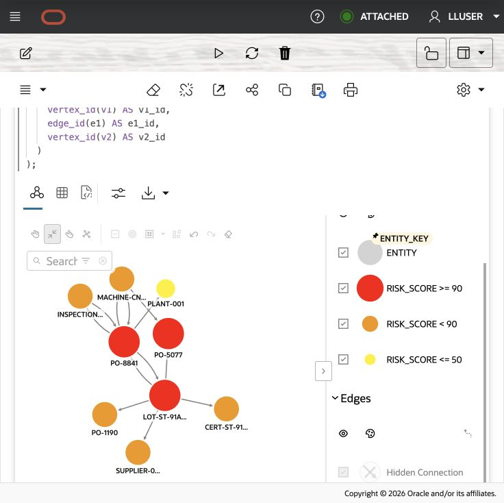
    Note how the production orders and material lots in the previous query were turned into vertices and edges in Graph Studio to display an interactive network.

    

4. Under **Shared Entity Connections**, read the material lot-centered explanation, then run the final SQL paragraph that anchors on `LOT-ST-91A7`. Review the graph visualization that appears below the paragraph. This visualization narrows the investigation to the material lot LOT-ST-91A7.

    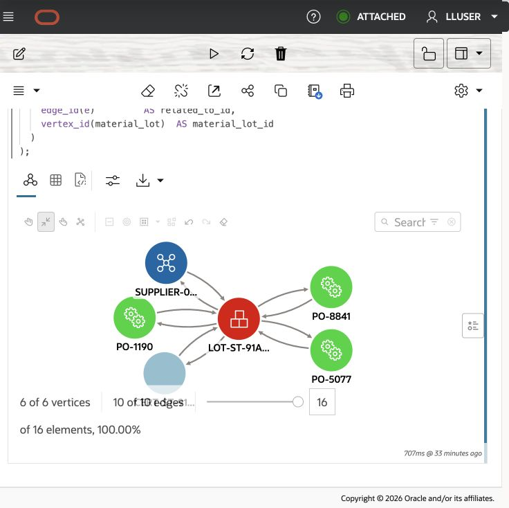

    Review the displayed vertex and edge counts. Remove display filters when checking the full query result.

    
The fixture requires material lot `LOT-ST-91A7` to link production order vertices PO-8841, PO-5077, and PO-1190. These links illustrate how production orders can share a material lot; verify the edges in your loaded data. This graph matters because it shows what the flagged production order touched or shared.

> **Result note:** Graph layouts and node positions can vary between runs. Compare entity keys, relationships, and query results.

You have used SQL/PGQ to list connected entities and Graph Studio to explore their relationships. Together, these views help you explain the connections around `PO-8841`.

### Optional graph-algorithms extension

The companion [material flow graph notebook](files/getting-started-material-flow-graph.dsnb) teaches PGX algorithms: parameterized paths, degree counts, PageRank, shortest paths, personalized PageRank, and hop distance. It uses `MATERIAL_FLOW_GRAPH`, with work centers connected by allowed material transfers. It is separate from `PRODUCTION_QUALITY_NETWORK` and requires the optional PGQL graph and PGX service described in the schema contract. Do not run it until those manual setup prerequisites are ready. Nearby graph records can help the team choose what to inspect; a connection alone does not establish a defect.

## Conclusion: Make Relationships Easy to Review

Bob's graph queries show why a property graph fits production-quality investigations. Bob can start with one flagged production order, follow its relationships, limit the search to a chosen number of hops, and find production order pairs that share traceability records. The queries remain readable as the network grows, while the results still include the review scores and transfer details needed for the investigation.

Graph Studio displayed the same relationships as an interactive network. Bob compared the notebook results with the earlier SQL Worksheet results, then explored clusters, shared material lots, and links between production orders.

## Appendix: Create the Property Graph

Bob creates a property graph by mapping relational tables to graph elements. `TRACE_ENTITIES` becomes the vertex table, and each row receives the `entity` label. `TRACE_RELATIONSHIPS` becomes the edge table, with foreign keys identifying the source and destination vertices. The graph queries in this lab use those two labels.

This statement is provided for reference. The `PRODUCTION_QUALITY_NETWORK` graph has already been created in the workshop database.

```sql
<copy>
CREATE PROPERTY GRAPH production_quality_network
  VERTEX TABLES (
    trace_entities KEY (entity_id)
      LABEL entity
      PROPERTIES (
        entity_id,
        entity_key,
        display_name,
        entity_type,
        risk_score,
        risk_level,
        source_system,
        material_value,
        event_count,
        is_confirmed_defect
      ),
    quality_cases KEY (case_id)
      LABEL quality_case
      PROPERTIES (
        case_id,
        case_ref,
        case_type,
        status,
        risk_score,
        loss_amount,
        event_count
      )
  )
  EDGE TABLES (
    trace_relationships KEY (relationship_id)
      SOURCE KEY (from_entity)
        REFERENCES trace_entities (entity_id)
      DESTINATION KEY (to_entity)
        REFERENCES trace_entities (entity_id)
      LABEL related_to
      PROPERTIES (
        relationship_type,
        strength,
        event_count,
        material_value
      ),
    quality_case_entities KEY (case_entity_id)
      SOURCE KEY (case_id)
        REFERENCES quality_cases (case_id)
      DESTINATION KEY (entity_id)
        REFERENCES trace_entities (entity_id)
      LABEL contains_entity
      PROPERTIES (
        role,
        evidence_score
      )
  );
</copy>
```

The statement defines the graph structure over the relational tables. It does not move the rows to a separate graph database. `PRODUCTION_QUALITY_NETWORK` can then be queried with `GRAPH_TABLE` while the relational tables remain the source of the data.


## Acknowledgements

* **Author** - Matt Kowalik
* **Contributor** - Kevin Lazarz
* **Last Updated By/Date** - Matt Kowalik, September 2026
