# Trace a Production Quality Network

## Introduction

Bob Green, SEER MANUFACTURING’s graph specialist, is investigating production order `PO-8841`. Shared material lots, inspection records, machines, and suppliers may connect it to other orders.

You will follow those connections with SQL/PGQ, then explore the same relationships in Graph Studio. SQL returns tables to compare; Graph Studio displays nodes, edges, and paths.


<details>
<summary><strong>Key terms: property graph, vertex, edge, and SQL Property Graph Queries (SQL/PGQ)</strong></summary>

> - A **property graph** represents things and how they are connected. In this lab, things include production orders, material lots, suppliers, inspection records, machines, plants, and material certificates. A graph makes relationship patterns easier to see than they are in a flat table.
>
> - A **vertex** is a graph node that represents something investigators care about, such as a production order, material lot, supplier, machine, inspection record, or material certificate. In this graph, vertices use the `entity` label and carry properties such as a quality risk score, source system, or material value.
>
> - An **edge** is a connection between vertices, such as a production order using a material lot, being processed on a machine, or linking to an inspection record. In this graph, edges use the `related_to` label and carry properties such as the relationship type.
>
> - A **hop** is one step across an edge from one vertex to another. `PO-8841` to a material lot is one hop. `PO-8841` to that material lot and then to another production order is two hops. The hop count tells investigators how far the search travels from the starting production order; it does not describe physical distance or production order time.
>
> - **SQL Property Graph Queries (SQL/PGQ)** let you describe graph patterns in SQL, such as "start with this production order and follow related entities." That lets investigators ask relationship questions in SQL without moving production quality data into a separate graph-only database.

</details>

### Objectives

- Identify vertices and edges in a property graph.
- Follow connections from a flagged production order.
- Find production order pairs that share traceability records.
- Open Graph Studio from Database Actions.
- Import and run the manufacturing production-quality-network notebook.
- Explain the result in terms a production analyst can act on.

Estimated Time: **10 minutes**

> **SQL Worksheet reminder:** See [Getting Started Task 2: Open SQL Worksheet](?lab=getting-started#Task2:OpenSQLWorksheet) for the steps to paste and run SQL.

## Task 1: Follow a flagged production order with SQL

Jessica’s query finds entities directly connected to `PO-8841`. Bob needs to follow connections farther.

1. Run Jessica's ordinary SQL query:

    ```sql
    <copy>
    SELECT production_order.entity_key AS production_order_key,
           connected.entity_key AS connected_key,
           connected.entity_type AS connected_type,
           rel.relationship_type,
           connected.risk_score AS connected_risk
    FROM trace_entities production_order
    JOIN trace_relationships rel
      ON rel.from_entity = production_order.entity_id
    JOIN trace_entities connected
      ON connected.entity_id = rel.to_entity
    WHERE production_order.entity_key = 'PO-8841'
    ORDER BY connected_risk DESC;
    </copy>
    ```

    The query joins `TRACE_ENTITIES` twice: once for the production order and once for the connected entity. `TRACE_RELATIONSHIPS` supplies the edge between them.

    **Expected output: Direct production order Connections**

    The result lists the material lot, machine, inspection record, and plant directly connected to `PO-8841`. The supplier is reached through the material lot in the later multi-hop query.

2. Extend Jessica's query to follow one through four hops without using a graph query:

    ```sql
    <copy>
    SELECT production_order_key, connected_key, connected_type,
           relationship_path, connected_risk
    FROM (
      SELECT seed.entity_key AS production_order_key,
             reached.entity_key AS connected_key,
             reached.entity_type AS connected_type,
             r1.relationship_type AS relationship_path,
             reached.risk_score AS connected_risk
      FROM trace_entities seed
      JOIN trace_relationships r1
        ON r1.from_entity = seed.entity_id
      JOIN trace_entities reached
        ON reached.entity_id = r1.to_entity
      WHERE seed.entity_key = 'PO-8841'

      UNION

      SELECT seed.entity_key,
             reached.entity_key,
             reached.entity_type,
             r1.relationship_type || ' -> ' || r2.relationship_type,
             reached.risk_score
      FROM trace_entities seed
      JOIN trace_relationships r1
        ON r1.from_entity = seed.entity_id
      JOIN trace_entities v1
        ON v1.entity_id = r1.to_entity
      JOIN trace_relationships r2
        ON r2.from_entity = v1.entity_id
      JOIN trace_entities reached
        ON reached.entity_id = r2.to_entity
      WHERE seed.entity_key = 'PO-8841'

      UNION

      SELECT seed.entity_key,
             reached.entity_key,
             reached.entity_type,
             r1.relationship_type || ' -> ' ||
               r2.relationship_type || ' -> ' ||
               r3.relationship_type,
             reached.risk_score
      FROM trace_entities seed
      JOIN trace_relationships r1
        ON r1.from_entity = seed.entity_id
      JOIN trace_entities v1
        ON v1.entity_id = r1.to_entity
      JOIN trace_relationships r2
        ON r2.from_entity = v1.entity_id
      JOIN trace_entities v2
        ON v2.entity_id = r2.to_entity
      JOIN trace_relationships r3
        ON r3.from_entity = v2.entity_id
      JOIN trace_entities reached
        ON reached.entity_id = r3.to_entity
      WHERE seed.entity_key = 'PO-8841'

      UNION

      SELECT seed.entity_key,
             reached.entity_key,
             reached.entity_type,
             r1.relationship_type || ' -> ' ||
               r2.relationship_type || ' -> ' ||
               r3.relationship_type || ' -> ' ||
               r4.relationship_type,
             reached.risk_score
      FROM trace_entities seed
      JOIN trace_relationships r1
        ON r1.from_entity = seed.entity_id
      JOIN trace_entities v1
        ON v1.entity_id = r1.to_entity
      JOIN trace_relationships r2
        ON r2.from_entity = v1.entity_id
      JOIN trace_entities v2
        ON v2.entity_id = r2.to_entity
      JOIN trace_relationships r3
        ON r3.from_entity = v2.entity_id
      JOIN trace_entities v3
        ON v3.entity_id = r3.to_entity
      JOIN trace_relationships r4
        ON r4.from_entity = v3.entity_id
      JOIN trace_entities reached
        ON reached.entity_id = r4.to_entity
      WHERE seed.entity_key = 'PO-8841'
    ) paths
    ORDER BY connected_risk DESC;
    </copy>
    ```

    Each `UNION` branch follows a different path length, from one through four hops. More hops require more joins; `UNION` removes duplicate rows.

3. Review how the SQL grows more complex when it does not use a graph query.

    Count the joins in the four-hop branch: four relationship joins and five instances of the entity table.

    Bob will express the same paths with a graph pattern.

## Task 2: Read the same connections as a graph

The sandbox already contains `PRODUCTION_QUALITY_NETWORK`, defined over the relational tables. The appendix shows its definition.

1. Run Bob's SQL/PGQ query:

    ```sql
    <copy>
    SELECT production_order_key,
           connected_key,
           connected_type,
           relationship_type,
           connected_risk
    FROM GRAPH_TABLE ( production_quality_network
      MATCH (production_order IS entity) -[edge IS related_to]-> (connected IS entity)
      WHERE production_order.entity_key = 'PO-8841'
      COLUMNS (
        production_order.entity_key AS production_order_key,
        connected.entity_key AS connected_key,
        connected.entity_type AS connected_type,
        edge.relationship_type AS relationship_type,
        connected.risk_score AS connected_risk
      )
    )
    ORDER BY connected_risk DESC;
    </copy>
    ```

    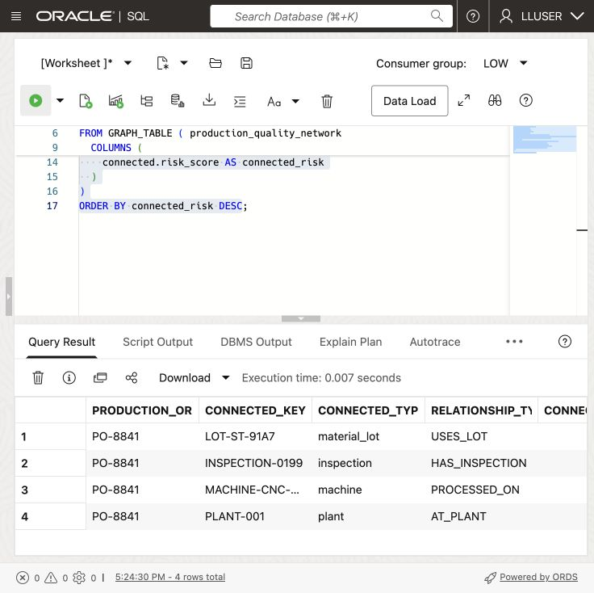

    In the `MATCH` pattern, `production_order` and `connected` are vertices. `edge` is the edge between them, so this pattern follows one hop. `IS entity` and `IS related_to` refer to the labels defined in `PRODUCTION_QUALITY_NETWORK`.

    Compare these columns with Jessica’s query: the result is the same, expressed through a graph pattern.

## Task 3: Trace four-hop quality traceability

Start from flagged production order `PO-8841` and trace the connected entities within four relationship hops.

1. Run the SQL/PGQ traversal from `PO-8841`.

    `seed` is the starting vertex. `-[e IS related_to]->{1,4}` follows one through four edges to `reached`. `COUNT(e.relationship_type)` returns the path length as `relationship_hops`.

    The `WHERE` clause anchors the search on `PO-8841`, and the `COLUMNS` clause returns graph properties in a normal SQL result table.

    ```sql
    <copy>
    SELECT DISTINCT entity_key, display_name, entity_type,
           relationship_hops, risk_score, risk_level,
           material_value, source_system
    FROM GRAPH_TABLE ( production_quality_network
      MATCH (seed IS entity) -[e IS related_to]->{1,4} (reached IS entity)
      WHERE seed.entity_key = 'PO-8841'
      COLUMNS (
        reached.entity_key AS entity_key,
        reached.display_name AS display_name,
        reached.entity_type AS entity_type,
        COUNT(e.relationship_type) AS relationship_hops,
        reached.risk_score AS risk_score,
        reached.risk_level AS risk_level,
        reached.material_value AS material_value,
        reached.source_system AS source_system
      )
    )
    ORDER BY risk_score DESC
    FETCH FIRST 25 ROWS ONLY;
    </copy>
    ```

    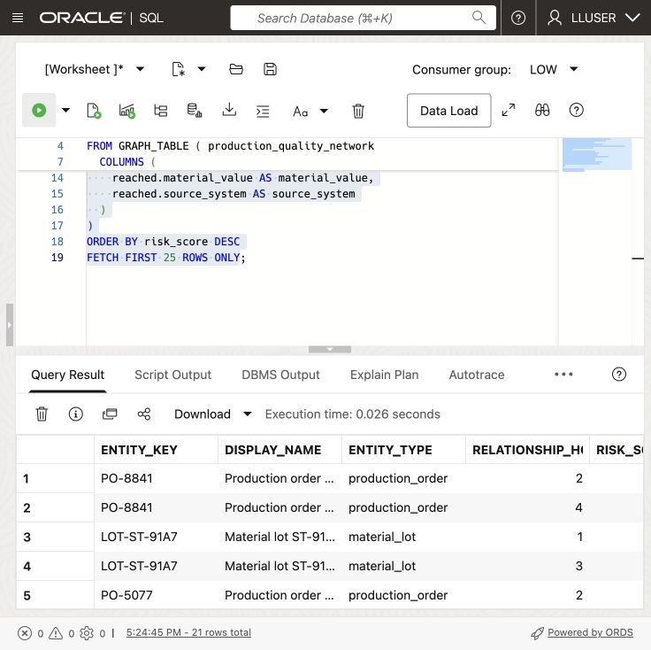

    RELATIONSHIP_HOPS shows the entity's level in the search. A value of `1` means the entity is directly connected to `PO-8841`; a value of `2` means the query reached it after one intermediate vertex; values `3` and `4` show deeper connections.

    **Expected output: High Risk Production quality Entities**

2. Review the high-risk entities.
    Use the risk-sorted table to prioritize connected entities for review.

    The expected rows show the entities connected to flagged production order `PO-8841`. 
    For example:
    * `LOT-ST-91A7` is a material lot 
    * `MACHINE-CNC-017` is a machine identifier reused across production orders
    * `SUPPLIER-044` is a supplier
    * `INSPECTION-0199` is an inspection record

    A high risk score identifies a review candidate; material value estimates the production work involved. Neither establishes a defect’s cause.

## Task 4: Find production orders that share traceability records

Bob asks: **which order pairs share a material lot, supplier, inspection record, or material certificate?**

1. Run Bob's production order-pair query:

    ```sql
    <copy>
    SELECT order_a, shared_entity, shared_type, order_b,
           a_risk, b_risk,
           ROUND((a_risk + b_risk) / 2, 1) AS combined_risk,
           e1_type, e2_type
    FROM GRAPH_TABLE ( production_quality_network
        MATCH (a IS entity)
              -[e1 IS related_to]-> (shared IS entity)
              <-[e2 IS related_to]- (b IS entity)
        WHERE a.entity_type = 'production_order'
          AND b.entity_type = 'production_order'
          AND a.entity_id < b.entity_id
          AND shared.entity_type IN ('material_lot','supplier','inspection','certificate')
          AND (a.risk_score >= 70 OR b.risk_score >= 70)
        COLUMNS (
            a.entity_key AS order_a,
            shared.entity_key AS shared_entity,
            shared.entity_type AS shared_type,
            b.entity_key AS order_b,
            a.risk_score AS a_risk,
            b.risk_score AS b_risk,
            e1.relationship_type AS e1_type,
            e2.relationship_type AS e2_type
        )
    )
    ORDER BY combined_risk DESC, shared_entity
    FETCH FIRST 25 ROWS ONLY;
    </copy>
    ```

    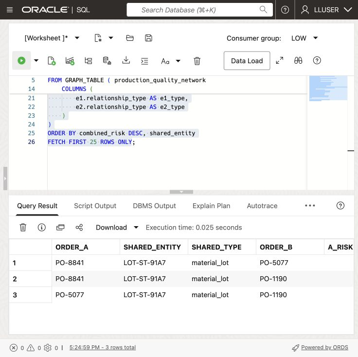

    The pattern starts at production order `a`, follows an edge to a shared entity, and follows another edge back to production order `b`. The two production orders can therefore be connected through the same material lot, supplier, inspection record, or material certificate. `a.entity_id < b.entity_id` keeps the result from returning the same pair twice in reverse order.

2. Review the business result.

    The result shows the two production orders, the information they share, the relationship type on each side, and the risk score for each production order. `COMBINED_RISK` helps the analyst review the strongest production order pairs first. A shared traceability record does not prove a defect, but it gives the production quality team a clear reason to investigate the production orders together.

## Task 5: Visualize the relationship using Oracle Graph Studio

Open Graph Studio to explore the connections around `PO-8841` visually.

1. Start from the Database Actions Launchpad. Confirm that the upper-right corner shows `LLUSER`. If the dark-theme message appears, click **Done**.

    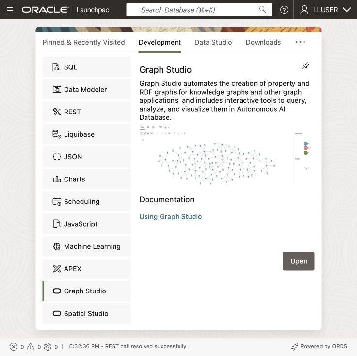

3. On the **Development** tab, select **Graph Studio** from the left-side tool list and click **Open**.

4. If prompted, sign in with the `LLUSER` and the workshop password supplied.

5. Confirm that the Graph Studio home page opens. The landing page provides **Graphs**, **Notebooks**, **Templates**, and **Jobs**.

    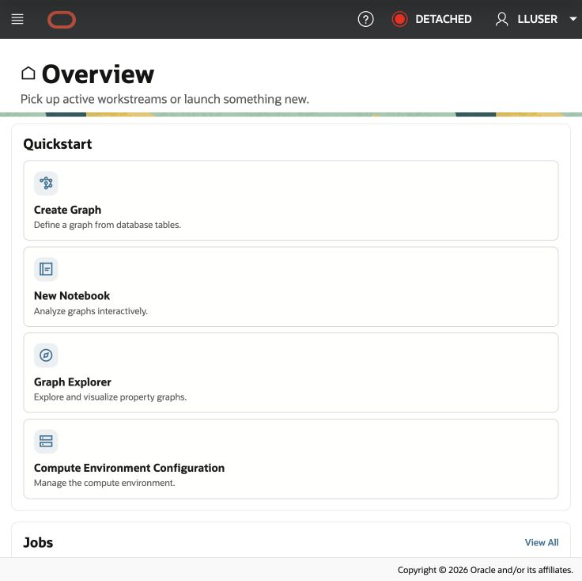

## Task 6: Download and import the manufacturing notebook

The supplied `.dsnb` file is a native Graph Studio notebook: a reusable, runnable investigation guide that combines SQL/PGQ paragraphs and graph visualizations.

1. Download [manufacturing-production-quality-graph-studio.dsnb](files/manufacturing-production-quality-graph-studio.dsnb).

    If the notebook opens in your browser instead of downloading, right-click the link and select **Save Link As**.

2. In Graph Studio, click **Notebooks** in the landing page.

    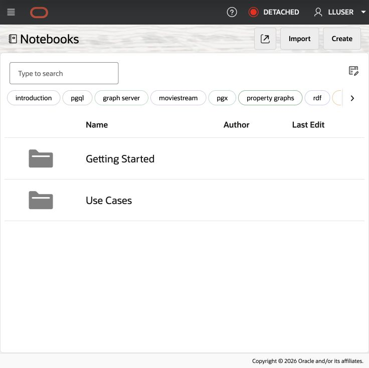

3. Select **Import** in the upper-right corner.

    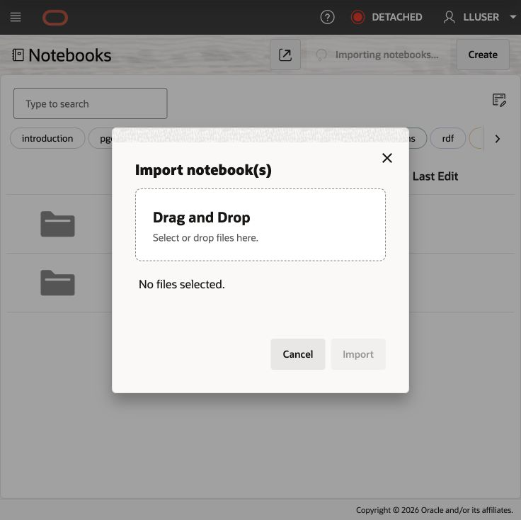

4. Once the import notebooks tab opens, drag & drop the `manufacturing-production-quality-graph-studio.dsnb` file from your local computer into the import window, or browse to the file on your computer. Review the selected filename and click **Import**. Open **Production Quality Network** after the import completes.

    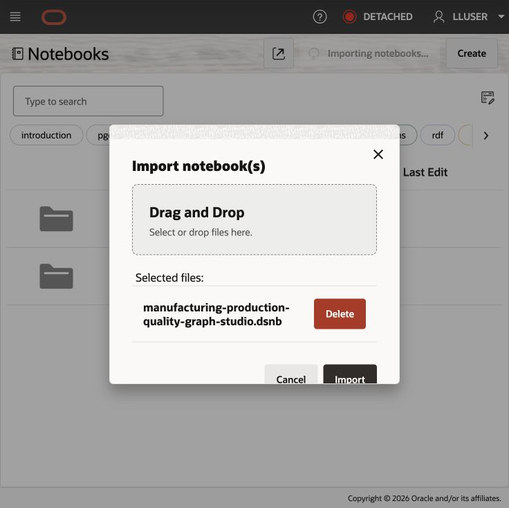

## Task 7: Run and interpret the Graph Studio notebook

Run the notebook’s `PO-8841` traversal and shared-lot view, then compare them with your SQL results.

1. Start at the top of the **Production Quality Network** notebook. Read the explanation for the `PO-8841` traversal, then run the first SQL paragraph.

    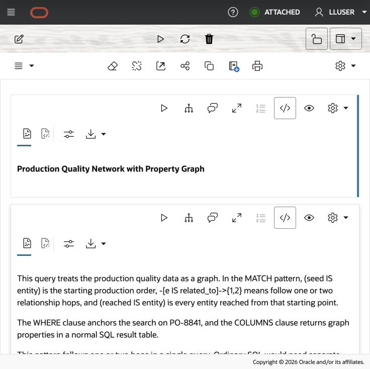

2. Review the results in table format in the graph studio notebook:

    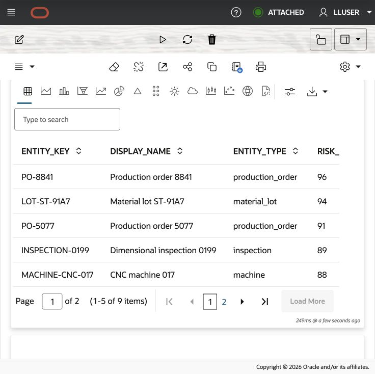

    This traversal uses a one-to-two-hop limit, shorter than Task 3’s four-hop search.

    | Paragraph | Result | Investigation purpose |
    | --- | --- | --- |
    | `SELECT DISTINCT ... WHERE seed.entity_key = 'PO-8841'` | Table | Ranks entities reached within one or two hops of `PO-8841`. |
    | `Graph Visualization of previous query` | Markdown label | Introduces the visual version of the first traversal. |
    | `SELECT * ... WHERE src.entity_key = 'PO-8841'` | Graph visualization | Draws the one-hop and two-hop path from the flagged production order. |
    | `Shared Entity Connections` | Markdown label and explanation | Introduces the material lot-centered relationship view. |
    | `SELECT * ... WHERE material_lot.entity_key = 'LOT-ST-91A7'` | Graph visualization | Centers on `LOT-ST-91A7` and draws its directly connected production orders. |

3. Under **Graph Visualization of previous query**, run the SQL paragraph that starts with `SELECT *` and anchors on `PO-8841`. Review the graph visualization that appears below the paragraph.

    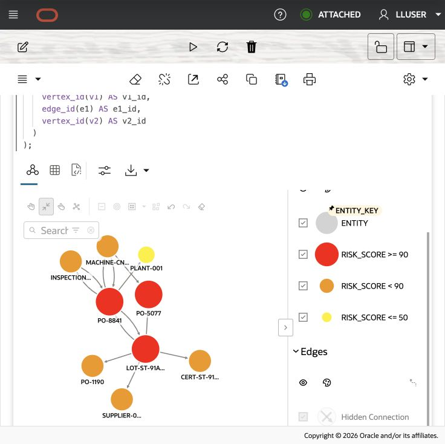

4. Under **Shared Entity Connections**, read the material lot-centered explanation, then run the final SQL paragraph that anchors on `LOT-ST-91A7`. Review the graph visualization that appears below the paragraph. This visualization narrows the investigation to the material lot LOT-ST-91A7.

    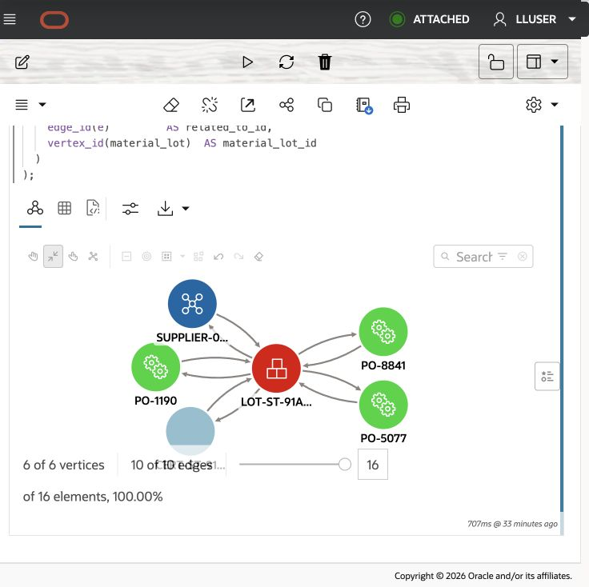

    Review the displayed vertex and edge counts. Remove display filters when checking the full query result.

Check that material lot `LOT-ST-91A7` connects orders `PO-8841`, `PO-5077`, and `PO-1190`.

> **Result note:** Graph layouts and node positions can vary between runs. Compare entity keys, relationships, and query results.

### Optional graph-algorithms extension

The companion [material flow graph notebook](files/getting-started-material-flow-graph.dsnb) lets you practice PGX graph algorithms: parameterized paths, degree counts, PageRank, shortest paths, personalized PageRank, and hop distance. It uses `MATERIAL_FLOW_GRAPH`, with work centers connected by allowed material transfers. It is separate from `PRODUCTION_QUALITY_NETWORK` and requires the optional PGQL graph and PGX service described in the tables and sample-data reference. Nearby graph records can help the team choose what to inspect; a connection alone does not establish a defect.

## Conclusion: Make Relationships Easy to Review

Bob traced connections from a flagged order and found orders sharing traceability records. Use the SQL results and Graph Studio paths to choose what to inspect next; a connection alone does not establish a defect.

## Appendix: Create the Property Graph

Bob creates a property graph by mapping relational tables to graph elements. `TRACE_ENTITIES` becomes the vertex table, and each row receives the `entity` label. `TRACE_RELATIONSHIPS` becomes the edge table, with foreign keys identifying the source and destination vertices. The graph queries in this lab use those two labels.

This statement is provided for reference. The `PRODUCTION_QUALITY_NETWORK` graph has already been created in the workshop database.

```sql
<copy>
CREATE PROPERTY GRAPH production_quality_network
  VERTEX TABLES (
    trace_entities KEY (entity_id)
      LABEL entity
      PROPERTIES (
        entity_id,
        entity_key,
        display_name,
        entity_type,
        risk_score,
        risk_level,
        source_system,
        material_value,
        event_count,
        is_confirmed_defect
      ),
    quality_cases KEY (case_id)
      LABEL quality_case
      PROPERTIES (
        case_id,
        case_ref,
        case_type,
        status,
        risk_score,
        loss_amount,
        event_count
      )
  )
  EDGE TABLES (
    trace_relationships KEY (relationship_id)
      SOURCE KEY (from_entity)
        REFERENCES trace_entities (entity_id)
      DESTINATION KEY (to_entity)
        REFERENCES trace_entities (entity_id)
      LABEL related_to
      PROPERTIES (
        relationship_type,
        strength,
        event_count,
        material_value
      ),
    quality_case_entities KEY (case_entity_id)
      SOURCE KEY (case_id)
        REFERENCES quality_cases (case_id)
      DESTINATION KEY (entity_id)
        REFERENCES trace_entities (entity_id)
      LABEL contains_entity
      PROPERTIES (
        role,
        evidence_score
      )
  );
</copy>
```


## Application Demo

[Try the LiveStack Manufacturing demo](https://livelabs.oracle.com/ords/r/dbpm/livelabs/view-workshop?wid=4442).

Explore the supplier and production-risk graph. Its AX-400 demo dataset differs from the lab data.

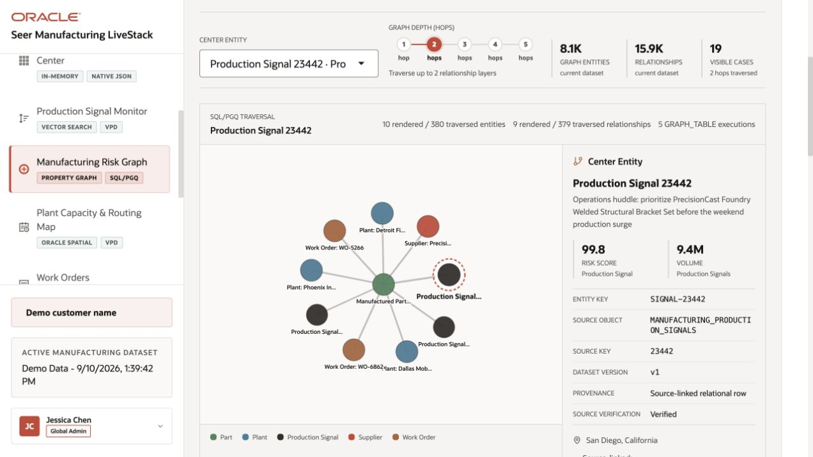

The application also exposes the graph query and supporting records. The lab queries use the workshop traceability dataset.

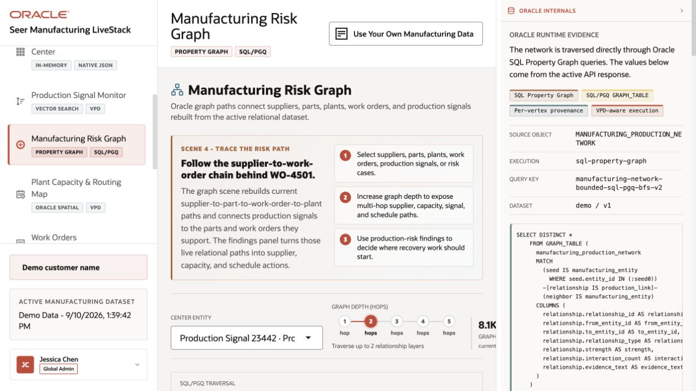

## Acknowledgements

* **Author** - Matt Kowalik
* **Contributor** - Kevin Lazarz
* **Last Updated By/Date** - Matt Kowalik, September 2026
