# Build a Quality Review Watchlist with Oracle Machine Learning

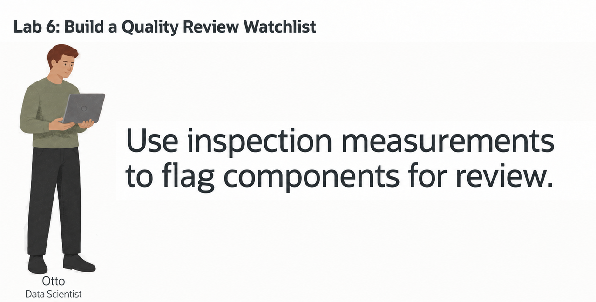

## Introduction

> **Validation status:** The manual LLUSER walkthrough and authentic manufacturing captures are recorded in the [validation report](../validation/validation-report.md). Green-button and Terraform provisioning remain untested.

Otto Spencer is SEER MANUFACTURING’s data scientist. His team supplies the predictions used in analytics charts and dashboards.

The quality team wants a review watchlist. A production analyst should be able to see which components may need more attention, the inspection values behind each score, and which components are already showing high defect rates or repeated production stoppages.

Otto builds and scores the model using the component, production-order, and inspection data already in Oracle AI Database. The model uses component inspection measurements to classify components as `REVIEW` or `STABLE`. SQL then joins the prediction to the component name, production orders, and inspection values that a dashboard needs.

In this lab, you build Otto's quality-review model and turn its output into a review list for a production analyst.


<details>
<summary><strong>Key terms: model, feature, classification, probability, and in-database machine learning</strong></summary>

> - A **model** is a set of learned rules that turns input data into a prediction.
>
> - A **feature** is an input value used by the model. In this lab, features include component category, unit cost, inspection measurements, and production quantities.
>
> - **Classification** predicts a label. Otto's model predicts either `REVIEW` or `STABLE`.
>
> - A **probability** is the model's value for a class. In this lab, the value is displayed as a `REVIEW_SCORE` to rank components for review. It is not a guarantee.
>
> - **In-database machine learning** means the model is trained or scored where the source data already lives. The SQL result can include the prediction and the data used to explain it.

</details>


### Objectives

- Read the prepared training data and identify the model target.
- Optionally use AutoML to compare classification models and inspect their predictions.
- Create the selected Generalized Linear Model inside Oracle AI Database.
- Score components with `PREDICTION` and `PREDICTION_PROBABILITY`.
- Combine model output with component, production-order, and inspection data for a dashboard result.

Estimated Time: **10 minutes**

### Hands-on Scenario

| Step                | Manufacturing focus                                                                                                        |
| ---------------------| ----------------------------------------------------------------------------------------------------------------------|
| Business Problem    | A production analyst needs a short list of components that may require attention.                                           |
| Technical Challenge | Otto needs to train and score a model without copying component inspection measurements to another machine learning system.           |
| Persona Focus       | You follow Otto as he builds the model and checks the result before it reaches a dashboard.                          |
| What You Will See   | Optionally compare models with AutoML, then use SQL Developer Web to create and score the selected model.             |
| Database Capability | AutoML, `DBMS_DATA_MINING`, `PREDICTION`, and `PREDICTION_PROBABILITY` support machine learning inside the database. |
| Outcome             | A watchlist for a dashboard combines the model result with the component and inspection data behind it.                  |

> **SQL Worksheet reminder:** See [Getting Started Task 2: Open SQL Worksheet](?lab=getting-started#Task2:OpenSQLWorksheet) for the steps to paste and run SQL.

## Task 1: Read the training data

Before Otto creates a model, he checks the data that will teach it. The workshop already provides `OML_QUALITY_TRAINING_V`, a view that combines component, inspection, and production-order data into one row per active component.

The view also contains `REVIEW_LABEL`. This is the known label used during training. The fixture assigns `REVIEW` when mean defect rate is at least 3 percent and at least two observations record 60 or more minutes of downtime. Other components are `STABLE`. This same-window rule creates 96 rows of each class; it teaches classification and does not establish how well the model predicts future defects. Quality observations and order lines are aggregated separately before joining to avoid counting either set more than once.

1. Run the training-data query:

    ```sql
    <copy>
    SELECT component_id,
           category,
           unit_cost,
           total_observations,
           avg_defect_rate_pct,
           major_stoppages,
           minor_stoppages,
           planned_units,
           material_value,
           review_label
    FROM oml_quality_training_v
    ORDER BY component_id
    FETCH FIRST 10 ROWS ONLY;
    </copy>
    ```

    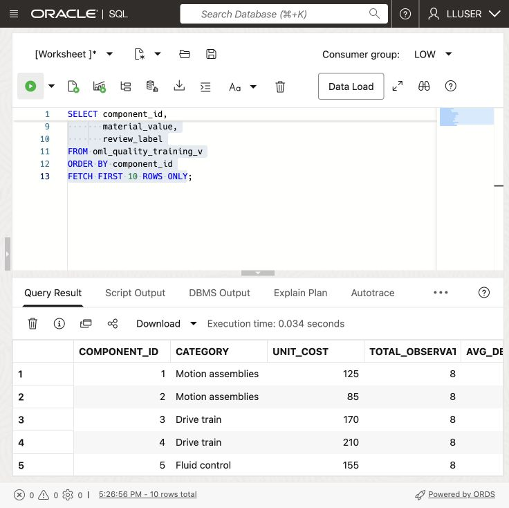

    

2. Identify the parts of each row.

    The numeric and category columns are the model inputs. `REVIEW_LABEL` is the answer the model learns to predict. `COMPONENT_ID` identifies the component but is not a business feature for this example.

    

    Otto is checking that the training data already brings together the values he needs. He does not have to export quality measurements, production orders, and component data into separate files before training.

## Task 2: Compare models with AutoML (optional)

Otto first uses the Oracle Machine Learning AutoML interface to compare candidate models. AutoML can select algorithms, tune them, and show how well each model identifies the two labels.

This shows how a data scientist chooses a model: the leaderboard is a starting point, but Otto also checks whether the model identifies the business outcome he cares about.

This task is optional. AutoML can take several minutes to complete, so you can continue with Task 3 if you want to focus on creating and using the model in SQL Developer Web.

1. Open **Machine Learning** from Database Actions.

    Open **Database Actions**, select **Machine Learning**. Use the username and password you can find on the **View Login Info screen**.
    
    
    
    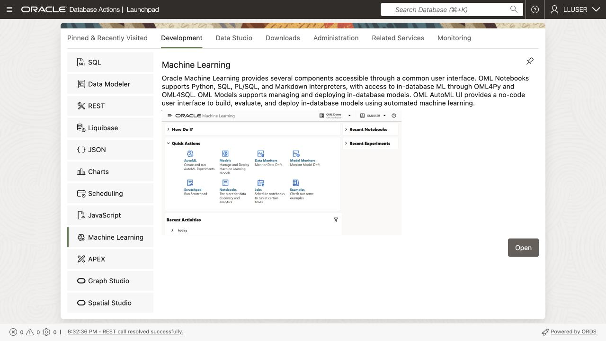

2. Click **AutoML**.

    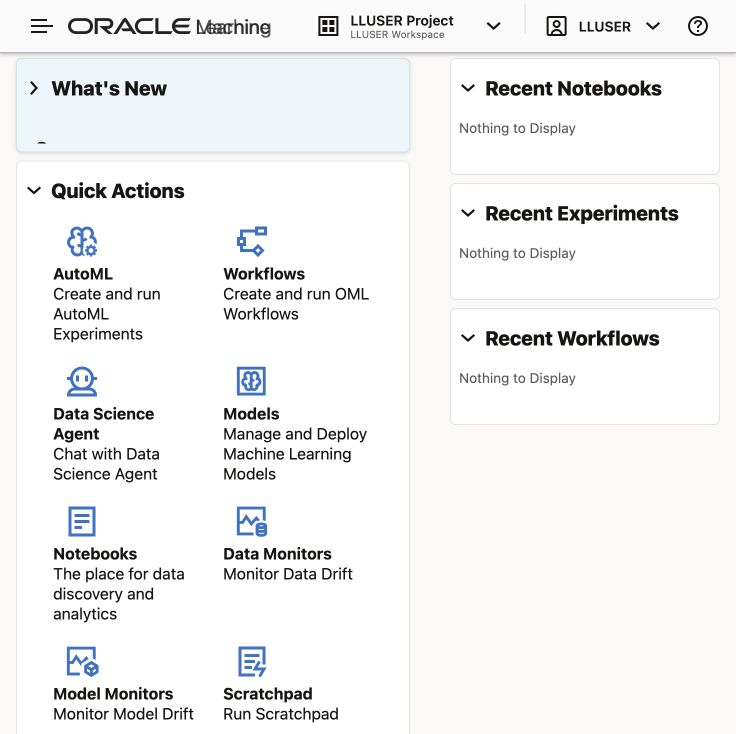 

3. Create a new experiment with these settings:
  
    | Setting         | Value                   |
    | -----------------| -------------------------|
    | Experiment name | `Component Quality Review`  |
    | Data source     | `OML_QUALITY_TRAINING_V` |
    | Predict         | `REVIEW_LABEL`           |
    | Prediction type | `Classification`        |
    | Case ID         | `COMPONENT_ID`            |
  
    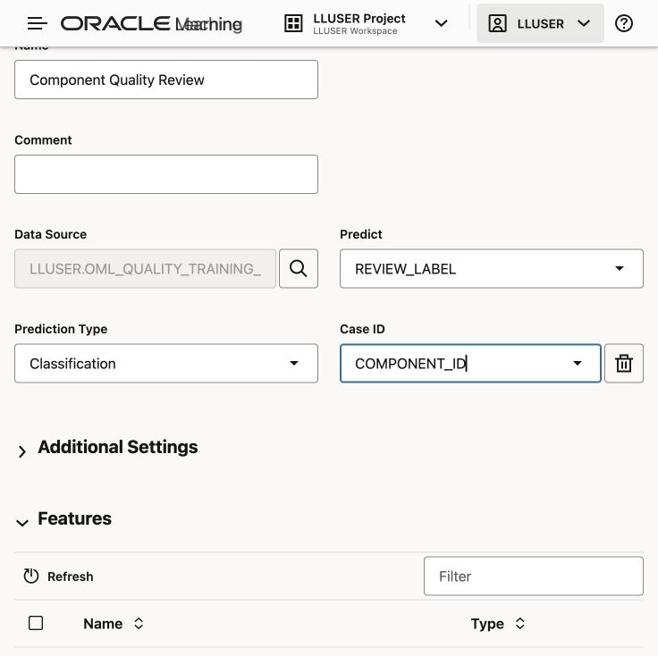

    Choose **Start → Faster Results** and wait for the model leaderboard. Runtime depends on the service and available resources.

    

4. Review the leaderboard and model details.

    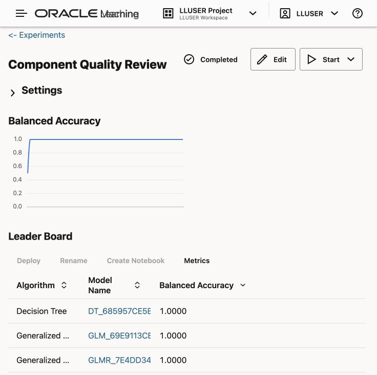

  
  
  The reference run produced five models with balanced accuracy 1.0000. Your run may differ. Otto does not choose from that number alone. Open the different model details and inspect the confusion matrix.

  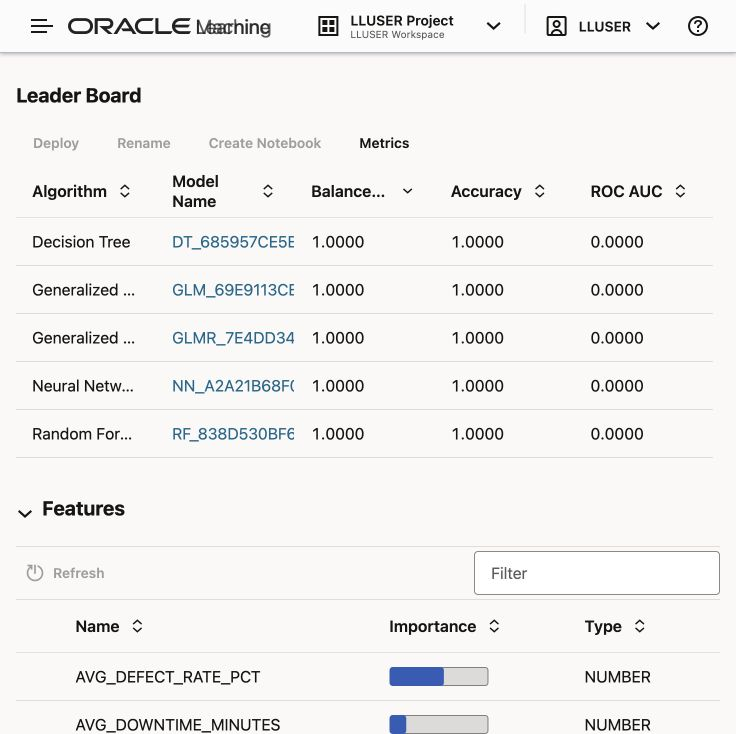

  Inspect the confusion matrix for both `STABLE` and `REVIEW`. A model that predicts only `STABLE` cannot identify quality escalations, even if its overall accuracy looks high. Check false positives and missed quality escalations before choosing a model.

  The reference GLM confusion matrix showed 40.82% REVIEW and 59.18% STABLE, with no off-diagonal entries. The interface also displayed ROC AUC as 0.0000; do not interpret the other perfect scores as validation of that metric or future performance. Record the measured scores for your run. The labels are generated from the same inspection features used for training, so a high score does not demonstrate future predictive quality. The next task creates a separate GLM using SQL.

  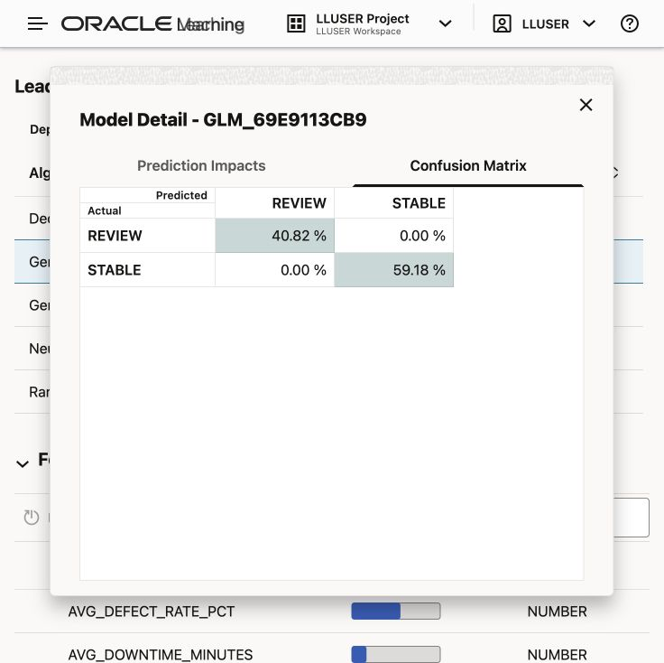

  Review prediction impact for the selected model. A feature’s influence on a prediction does not prove that it causes the outcome.

  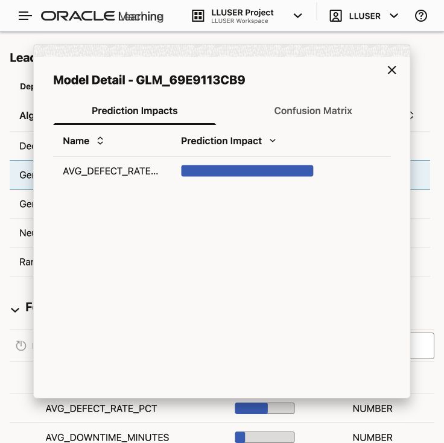

## Task 3: Create the selected model in SQL Developer Web

If you ran AutoML, compare its results with the SQL model. Now create `OTTO_QUALITY_REVIEW_MODEL` in SQL Developer Web so you can call it from a query.

The settings table tells Oracle to use the **Generalized Linear Model** used in this exercise. `PREP_AUTO` lets the database handle standard preparation of the input columns.

If you skipped the optional AutoML task, use this setting as the example model for the workshop.

1. Create the settings table and train the model:

    ```sql
    <copy>
    
    DROP TABLE IF EXISTS otto_quality_review_settings;
    
    CREATE TABLE otto_quality_review_settings (
          setting_name  VARCHAR2(30),
          setting_value VARCHAR2(4000)
        );

    INSERT INTO otto_quality_review_settings (setting_name, setting_value)
    VALUES ('ALGO_NAME', 'ALGO_GENERALIZED_LINEAR_MODEL');

    INSERT INTO otto_quality_review_settings (setting_name, setting_value)
    VALUES ('PREP_AUTO', 'ON');

    INSERT INTO otto_quality_review_settings (setting_name, setting_value)
    VALUES ('ODMS_RANDOM_SEED', '20260604');

    COMMIT;

    DECLARE
      l_model_count NUMBER;
    BEGIN
      SELECT COUNT(*)
      INTO l_model_count
      FROM user_mining_models
      WHERE model_name = 'OTTO_QUALITY_REVIEW_MODEL';

      IF l_model_count > 0 THEN
        DBMS_DATA_MINING.DROP_MODEL('OTTO_QUALITY_REVIEW_MODEL');
      END IF;
    END;
    /

    BEGIN
      DBMS_DATA_MINING.CREATE_MODEL(
        model_name           => 'OTTO_QUALITY_REVIEW_MODEL',
        mining_function      => DBMS_DATA_MINING.CLASSIFICATION,
        data_table_name      => 'OML_QUALITY_TRAINING_V',
        case_id_column_name  => 'COMPONENT_ID',
        target_column_name   => 'REVIEW_LABEL',
        settings_table_name  => 'OTTO_QUALITY_REVIEW_SETTINGS'
      );
    END;
    /
    </copy>
    ```

    The model reads the training view, learns the relationship between the features and `REVIEW_LABEL`, and stores the trained model in the database. No component or quality measurements leave Oracle Database during training.

2. Confirm that Oracle created the model:

    ```sql
    <copy>
    SELECT model_name,
           mining_function,
           algorithm
    FROM user_mining_models
    WHERE model_name = 'OTTO_QUALITY_REVIEW_MODEL';
    </copy>
    ```

    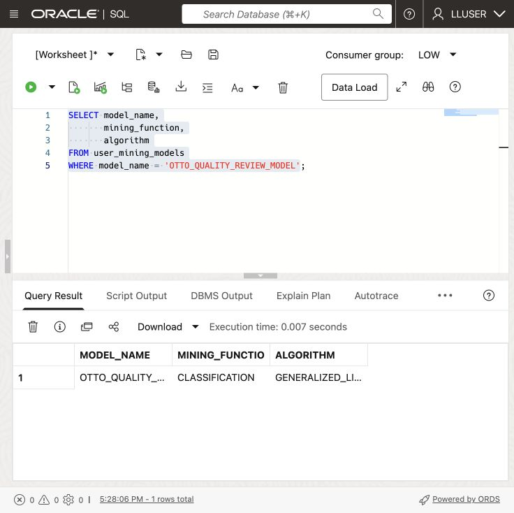

    The result should show `CLASSIFICATION` and `GENERALIZED_LINEAR_MODEL`. Otto now has a database model that SQL can call.

## Task 4: Score new component inspection measurements in SQL

Otto creates sample scoring data by changing values from the training view. This shows how to score a separate table without including the target label. Because the rows come from training data, they cannot measure accuracy on new, independent data.

1. Create the scoring table and add the sample inspection measurements:

    ```sql
    <copy>
    
    DROP TABLE IF EXISTS otto_quality_review_scoring_data;

    CREATE TABLE otto_quality_review_scoring_data (
      component_id    NUMBER,
      category      VARCHAR2(100),
      unit_cost    NUMBER,
      total_observations   NUMBER,
      avg_defect_rate_pct NUMBER,
      total_inspected_units   NUMBER,
      total_rejected_units  NUMBER,
      total_rework_minutes   NUMBER,
      avg_downtime_minutes  NUMBER,
      major_stoppages   NUMBER,
      minor_stoppages  NUMBER,
      planned_units    NUMBER,
      material_value       NUMBER
    );

    INSERT INTO otto_quality_review_scoring_data (
      component_id,
      category,
      unit_cost,
      total_observations,
      avg_defect_rate_pct,
      total_inspected_units,
      total_rejected_units,
      total_rework_minutes,
      avg_downtime_minutes,
      major_stoppages,
      minor_stoppages,
      planned_units,
      material_value
    )
    SELECT component_id,
           category,
           unit_cost,
           total_observations + 4,
           ROUND((total_rejected_units + 12) / (total_inspected_units + 200) * 100, 4),
           total_inspected_units + 200,
           total_rejected_units + 12,
           total_rework_minutes + 500,
           avg_downtime_minutes + 15,
           major_stoppages + 1,
           minor_stoppages + 1,
           planned_units + 3,
           material_value + (unit_cost * 3)
    FROM (
      SELECT component_id,
             category,
             unit_cost,
             total_observations,
             avg_defect_rate_pct,
             total_inspected_units,
             total_rejected_units,
             total_rework_minutes,
             avg_downtime_minutes,
             major_stoppages,
             minor_stoppages,
             planned_units,
             material_value,
             ROW_NUMBER() OVER (ORDER BY component_id) AS row_num
      FROM oml_quality_training_v
    )
    WHERE row_num <= 12;

    COMMIT;
    </copy>
    ```

    This creates a small synthetic scenario from the workshop data, not observed future inspection outcomes. 
    > **Note:** The table has the model inputs, but it does not contain `REVIEW_LABEL`. That label belongs to the historical training data and must not be passed to the model as an input.

2. Run the scoring query:

    ```sql
    <copy>
    WITH scored_components AS (
      SELECT component_id,
             category,
             planned_units,
             material_value,
             total_observations,
             major_stoppages,
             minor_stoppages,
             PREDICTION(
               OTTO_QUALITY_REVIEW_MODEL USING
               category, unit_cost, total_observations, avg_defect_rate_pct,
               total_inspected_units, total_rejected_units, total_rework_minutes, avg_downtime_minutes,
               major_stoppages, minor_stoppages, planned_units, material_value
             ) AS predicted_review,
             ROUND(
               PREDICTION_PROBABILITY(
                 OTTO_QUALITY_REVIEW_MODEL,
                 'REVIEW' USING
                 category, unit_cost, total_observations, avg_defect_rate_pct,
                 total_inspected_units, total_rejected_units, total_rework_minutes, avg_downtime_minutes,
                 major_stoppages, minor_stoppages, planned_units, material_value
               ), 8
             ) AS review_score
      FROM otto_quality_review_scoring_data
    )
    SELECT so.component_id,
           so.component_name,
           scored_component.category,
           scored_component.predicted_review,
           scored_component.review_score,
           ROUND(scored_component.review_score * 100, 2) AS review_pct,
           scored_component.planned_units,
           scored_component.material_value,
           scored_component.total_observations,
           scored_component.major_stoppages,
           scored_component.minor_stoppages
    FROM scored_components scored_component
    JOIN components so
      ON so.component_id = scored_component.component_id
    ORDER BY scored_component.review_score DESC,
             so.component_id;
    </copy>
    ```

    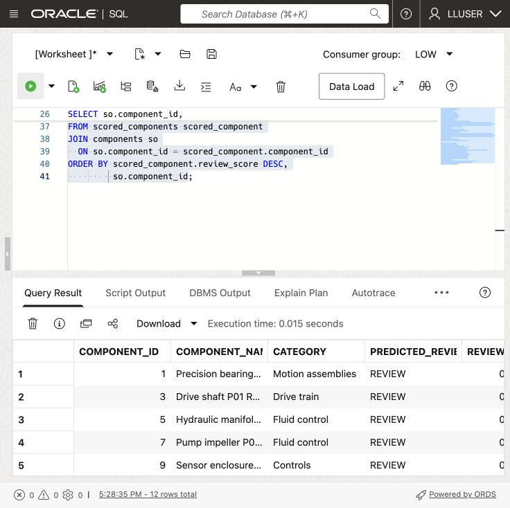

    

3. Read the result as a dashboard user.

  `PREDICTED_REVIEW` tells the dashboard which label the model selected. `REVIEW_SCORE` is the model value between 0 and 1, while `REVIEW_PCT` presents the same value as a percentage for a dashboard user. The production-order and inspection columns give the business user something to review alongside the prediction.

  One SQL result returns the prediction, component name, production orders, and quality measurements. Otto can use the model without moving the data to an external machine learning platform.

  

## Conclusion: Put the Prediction Beside the Business Data

You trained a Generalized Linear Model in SQL Developer Web and scored sample component inspection measurements. If you completed the optional AutoML task, you also compared candidate models. The final query returns a watchlist with the inspection values behind each score.

The model, training data, scores, and component details remain in the database. The dashboard can query them together without combining results from separate systems.

Oracle AI Database makes the model part of the dashboard query. A production analyst can read the watchlist, inspect the supporting values, and repeat the query using the same access controls that protect the source data.

## Acknowledgements

* **Author** - Matt Kowalik
* **Contributor** - Kevin Lazarz
* **Last Updated By/Date** - Matt Kowalik, September 2026
