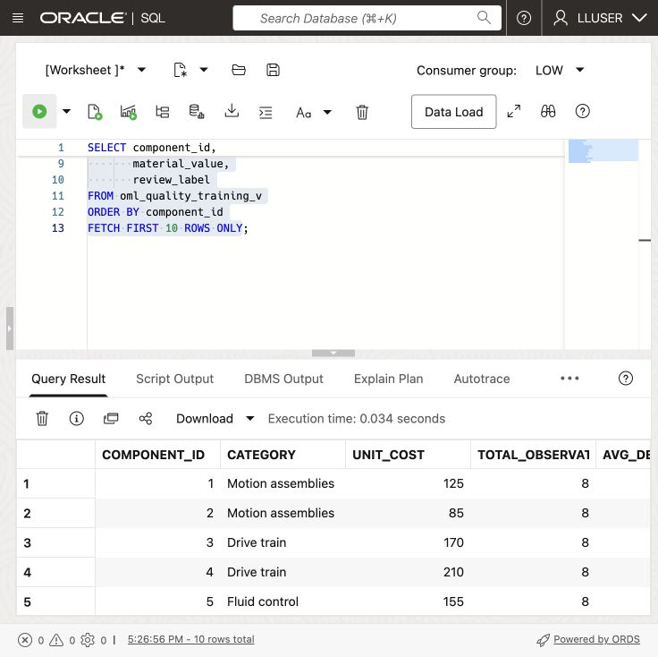
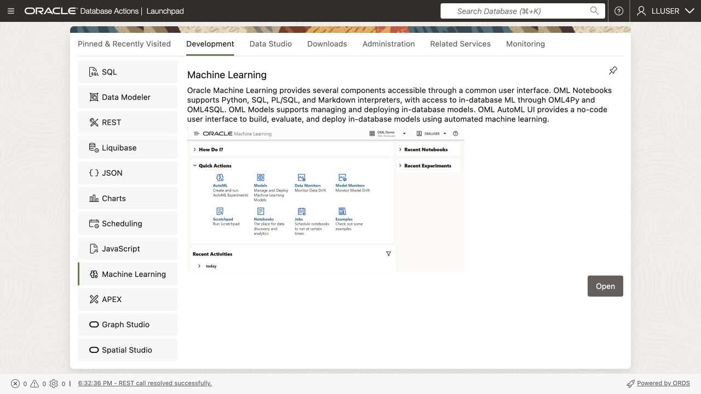
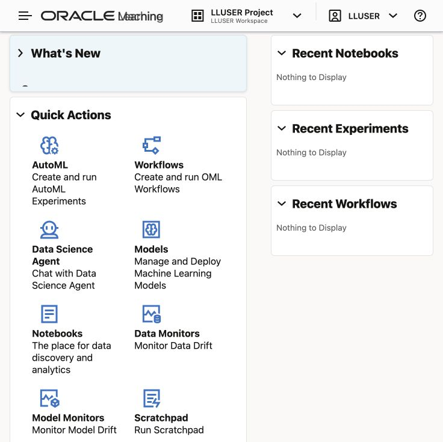
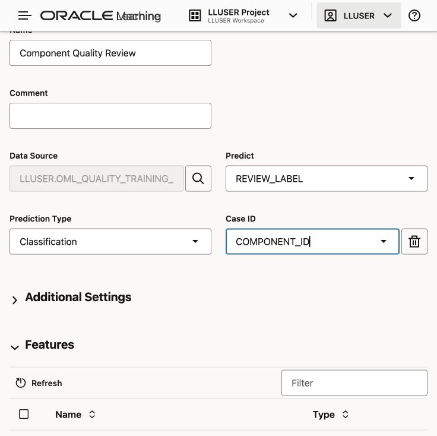
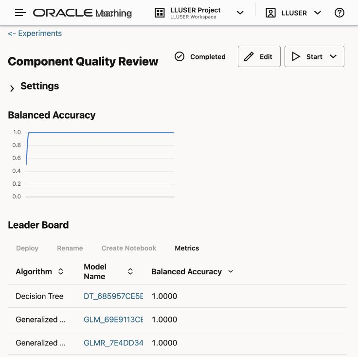
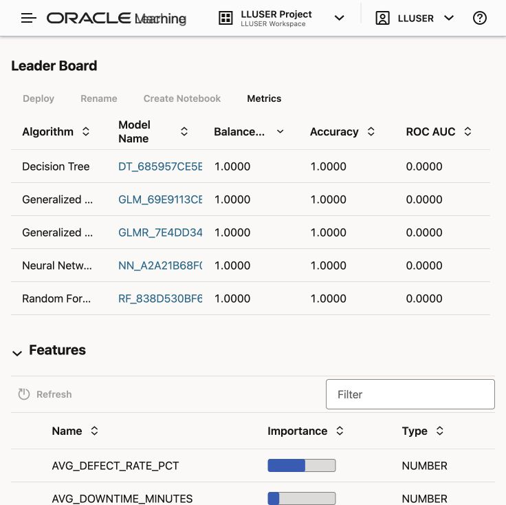
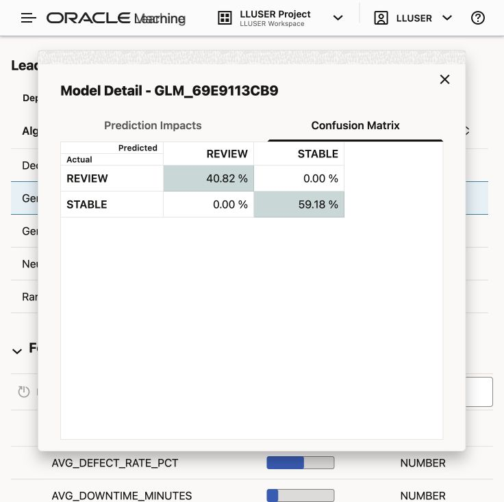
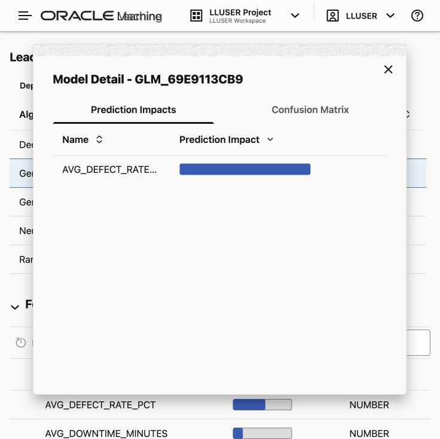
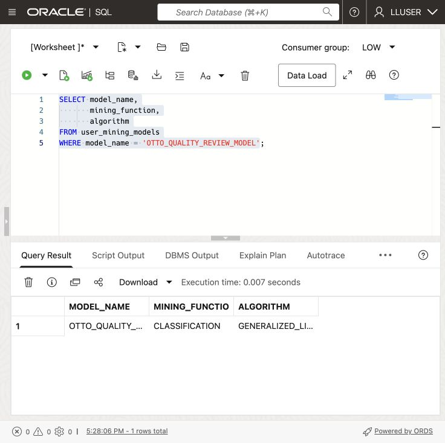
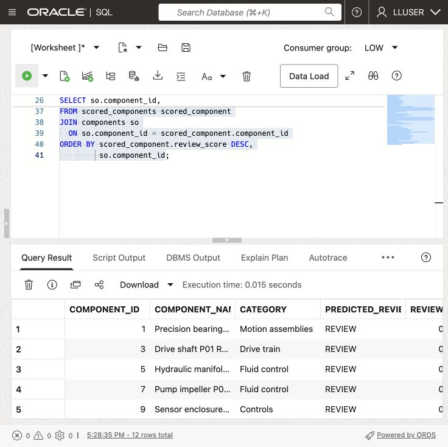

# Build a Quality Review Watchlist with Oracle Machine Learning

## Introduction

Otto Spencer, SEER MANUFACTURING’s data scientist, is building a quality-review watchlist. The team needs to see which components may need attention and the inspection measurements behind each score.

You will train a model to classify components as `REVIEW` or `STABLE`, then join its predictions to component, production-order, and inspection data for the dashboard.


<details>
<summary><strong>Key terms: model, feature, classification, probability, and in-database machine learning</strong></summary>

> - A **model** is a set of learned rules that turns input data into a prediction.
>
> - A **feature** is an input value used by the model. In this lab, features include component category, unit cost, inspection measurements, and production quantities.
>
> - **Classification** predicts a label. Otto's model predicts either `REVIEW` or `STABLE`.
>
> - A **probability** is the model’s estimated value for a particular class. `REVIEW_SCORE` is the probability assigned to `REVIEW`, from 0 to 1. `REVIEW_PCT` shows the same value as a percentage. Use the score to rank components for review, not as a guarantee of a future outcome.
>
> - **In-database machine learning** means the model is trained or scored where the source data already lives. The SQL result can include the prediction and the data used to explain it.

</details>

### Objectives

- Read the prepared training data and identify the model target.
- Optionally use AutoML to compare classification models and inspect their predictions.
- Create the example Generalized Linear Model inside Oracle AI Database.
- Score components with `PREDICTION` and `PREDICTION_PROBABILITY`.
- Combine model output with component, production-order, and inspection data for a dashboard result.

Estimated Time: **10 minutes**

> **SQL Worksheet reminder:** See [Getting Started Task 2: Open SQL Worksheet](?lab=getting-started#Task2:OpenSQLWorksheet) for the steps to paste and run SQL.

## Task 1: Read the training data

Before Otto creates a model, he checks the data that will teach it. The workshop already provides `OML_QUALITY_TRAINING_V`, a view that combines component, inspection, and production-order data into one row per active component.

`REVIEW_LABEL` is the label used for training. A component is marked `REVIEW` when its mean defect rate is at least 3% and at least two observations record 60 minutes or more of downtime. Other components are marked `STABLE`.

This rule produces 96 rows in each class from measurements in the same analysis window. It teaches classification; it does not establish how well the model predicts future defects.

The view aggregates quality observations and order lines separately before joining them. This prevents the join from counting either set more than once.

1. Run the training-data query:

    ```sql
    <copy>
    SELECT component_id,
           category,
           unit_cost,
           total_observations,
           avg_defect_rate_pct,
           major_stoppages,
           minor_stoppages,
           planned_units,
           material_value,
           review_label
    FROM oml_quality_training_v
    ORDER BY component_id
    FETCH FIRST 10 ROWS ONLY;
    </copy>
    ```

    

2. Identify the parts of each row.

    The numeric and category columns are the model inputs. `REVIEW_LABEL` is the answer the model learns to predict. `COMPONENT_ID` identifies the component but is not a business feature for this example.

## Task 2: Compare models with AutoML (optional)

Otto first uses the Oracle Machine Learning AutoML interface to compare candidate models. AutoML can select algorithms, tune them, and show how well each model identifies the two labels.

AutoML can take several minutes. Skip to Task 3 if you want to focus on SQL.

1. Open **Machine Learning** from Database Actions.

    Sign in with the credentials from **View Login Info** if prompted.

    

2. Click **AutoML**.

    

3. Create a new experiment with these settings:
  
    | Setting         | Value                   |
    | -----------------| -------------------------|
    | Experiment name | `Component Quality Review`  |
    | Data source     | `OML_QUALITY_TRAINING_V` |
    | Predict         | `REVIEW_LABEL`           |
    | Prediction type | `Classification`        |
    | Case ID         | `COMPONENT_ID`            |
  
    

    Choose **Start → Faster Results** and wait for the model leaderboard. Runtime depends on the service and available resources.

4. Review the leaderboard and model details.

    

    Compare model details and confusion matrices, not just leaderboard scores. Your results may differ from the example.

    

    Check false positives and missed `REVIEW` cases. A model predicting only `STABLE` may appear accurate while missing quality escalations.

    The example matrix shows 40.82% REVIEW and 59.18% STABLE with no off-diagonal entries, but ROC AUC displays 0.0000. Check your own metrics. Labels derive from the training features, so perfect scores do not demonstrate future predictive quality.

    

    Review prediction impact for the selected model. A feature’s influence on a prediction does not prove that it causes the outcome.

    

## Task 3: Create the selected model in SQL Developer Web

In Database Actions, open SQL Worksheet, called SQL Developer Web in this heading. Create `OTTO_QUALITY_REVIEW_MODEL` using the supplied script. It trains a separate Generalized Linear Model; it does not import an AutoML model. If you completed Task 2, compare the results.

The settings table selects the **Generalized Linear Model** algorithm. `PREP_AUTO` enables automatic preparation of the input columns.

1. Create the settings table and train the model:

    ```sql
    <copy>
    
    DROP TABLE IF EXISTS otto_quality_review_settings;
    
    CREATE TABLE otto_quality_review_settings (
          setting_name  VARCHAR2(30),
          setting_value VARCHAR2(4000)
        );

    INSERT INTO otto_quality_review_settings (setting_name, setting_value)
    VALUES ('ALGO_NAME', 'ALGO_GENERALIZED_LINEAR_MODEL');

    INSERT INTO otto_quality_review_settings (setting_name, setting_value)
    VALUES ('PREP_AUTO', 'ON');

    INSERT INTO otto_quality_review_settings (setting_name, setting_value)
    VALUES ('ODMS_RANDOM_SEED', '20260604');

    COMMIT;

    DECLARE
      l_model_count NUMBER;
    BEGIN
      SELECT COUNT(*)
      INTO l_model_count
      FROM user_mining_models
      WHERE model_name = 'OTTO_QUALITY_REVIEW_MODEL';

      IF l_model_count > 0 THEN
        DBMS_DATA_MINING.DROP_MODEL('OTTO_QUALITY_REVIEW_MODEL');
      END IF;
    END;
    /

    BEGIN
      DBMS_DATA_MINING.CREATE_MODEL(
        model_name           => 'OTTO_QUALITY_REVIEW_MODEL',
        mining_function      => DBMS_DATA_MINING.CLASSIFICATION,
        data_table_name      => 'OML_QUALITY_TRAINING_V',
        case_id_column_name  => 'COMPONENT_ID',
        target_column_name   => 'REVIEW_LABEL',
        settings_table_name  => 'OTTO_QUALITY_REVIEW_SETTINGS'
      );
    END;
    /
    </copy>
    ```

    The model reads the training view, learns the relationship between the features and `REVIEW_LABEL`, and stores the trained model in the database. No component or quality measurements leave Oracle Database during training.

2. Confirm that Oracle created the model:

    ```sql
    <copy>
    SELECT model_name,
           mining_function,
           algorithm
    FROM user_mining_models
    WHERE model_name = 'OTTO_QUALITY_REVIEW_MODEL';
    </copy>
    ```

    

    The result should show `CLASSIFICATION` and `GENERALIZED_LINEAR_MODEL`. Otto now has a database model that SQL can call.

## Task 4: Score new component inspection measurements in SQL

Otto creates sample scoring data by changing values from the training view. This shows how to score a separate table without including the target label. Because the rows come from training data, they cannot measure accuracy on new, independent data.

1. Create the scoring table and add the sample inspection measurements:

    ```sql
    <copy>
    
    DROP TABLE IF EXISTS otto_quality_review_scoring_data;

    CREATE TABLE otto_quality_review_scoring_data (
      component_id    NUMBER,
      category      VARCHAR2(100),
      unit_cost    NUMBER,
      total_observations   NUMBER,
      avg_defect_rate_pct NUMBER,
      total_inspected_units   NUMBER,
      total_rejected_units  NUMBER,
      total_rework_minutes   NUMBER,
      avg_downtime_minutes  NUMBER,
      major_stoppages   NUMBER,
      minor_stoppages  NUMBER,
      planned_units    NUMBER,
      material_value       NUMBER
    );

    INSERT INTO otto_quality_review_scoring_data (
      component_id,
      category,
      unit_cost,
      total_observations,
      avg_defect_rate_pct,
      total_inspected_units,
      total_rejected_units,
      total_rework_minutes,
      avg_downtime_minutes,
      major_stoppages,
      minor_stoppages,
      planned_units,
      material_value
    )
    SELECT component_id,
           category,
           unit_cost,
           total_observations + 4,
           ROUND((total_rejected_units + 12) / (total_inspected_units + 200) * 100, 4),
           total_inspected_units + 200,
           total_rejected_units + 12,
           total_rework_minutes + 500,
           avg_downtime_minutes + 15,
           major_stoppages + 1,
           minor_stoppages + 1,
           planned_units + 3,
           material_value + (unit_cost * 3)
    FROM (
      SELECT component_id,
             category,
             unit_cost,
             total_observations,
             avg_defect_rate_pct,
             total_inspected_units,
             total_rejected_units,
             total_rework_minutes,
             avg_downtime_minutes,
             major_stoppages,
             minor_stoppages,
             planned_units,
             material_value,
             ROW_NUMBER() OVER (ORDER BY component_id) AS row_num
      FROM oml_quality_training_v
    )
    WHERE row_num <= 12;

    COMMIT;
    </copy>
    ```


    > **Note:** The table has the model inputs, but it does not contain `REVIEW_LABEL`. That label belongs to the historical training data and must not be passed to the model as an input.

2. Run the scoring query:

    ```sql
    <copy>
    WITH scored_components AS (
      SELECT component_id,
             category,
             planned_units,
             material_value,
             total_observations,
             major_stoppages,
             minor_stoppages,
             PREDICTION(
               OTTO_QUALITY_REVIEW_MODEL USING
               category, unit_cost, total_observations, avg_defect_rate_pct,
               total_inspected_units, total_rejected_units, total_rework_minutes, avg_downtime_minutes,
               major_stoppages, minor_stoppages, planned_units, material_value
             ) AS predicted_review,
             ROUND(
               PREDICTION_PROBABILITY(
                 OTTO_QUALITY_REVIEW_MODEL,
                 'REVIEW' USING
                 category, unit_cost, total_observations, avg_defect_rate_pct,
                 total_inspected_units, total_rejected_units, total_rework_minutes, avg_downtime_minutes,
                 major_stoppages, minor_stoppages, planned_units, material_value
               ), 8
             ) AS review_score
      FROM otto_quality_review_scoring_data
    )
    SELECT so.component_id,
           so.component_name,
           scored_component.category,
           scored_component.predicted_review,
           scored_component.review_score,
           ROUND(scored_component.review_score * 100, 2) AS review_pct,
           scored_component.planned_units,
           scored_component.material_value,
           scored_component.total_observations,
           scored_component.major_stoppages,
           scored_component.minor_stoppages
    FROM scored_components scored_component
    JOIN components so
      ON so.component_id = scored_component.component_id
    ORDER BY scored_component.review_score DESC,
             so.component_id;
    </copy>
    ```

    

3. Read the result as a dashboard user.

  `PREDICTED_REVIEW` is the class selected by the model. `REVIEW_SCORE` is the probability assigned to `REVIEW`, and `REVIEW_PCT` shows that probability as a percentage. Compare the score with the activity values in the same row before deciding what to review.

## Conclusion: Put the Prediction Beside the Business Data

Otto’s watchlist combines model predictions with the inspection values behind each score. If you ran AutoML, compare its results with the SQL model. Use the measurements to guide review; the synthetic training labels do not establish future predictive performance.

## Acknowledgements

* **Author** - Matt Kowalik
* **Contributor** - Kevin Lazarz
* **Last Updated By/Date** - Matt Kowalik, September 2026
