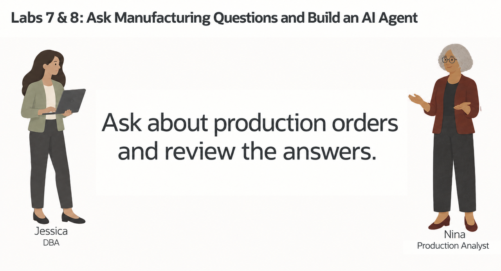
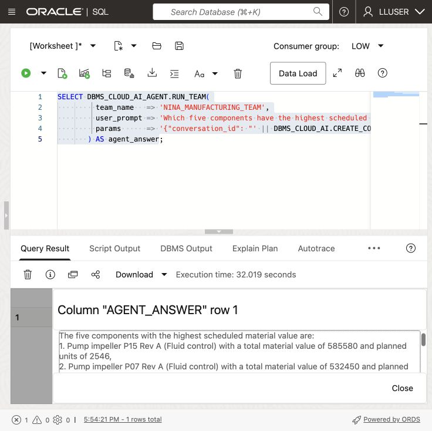
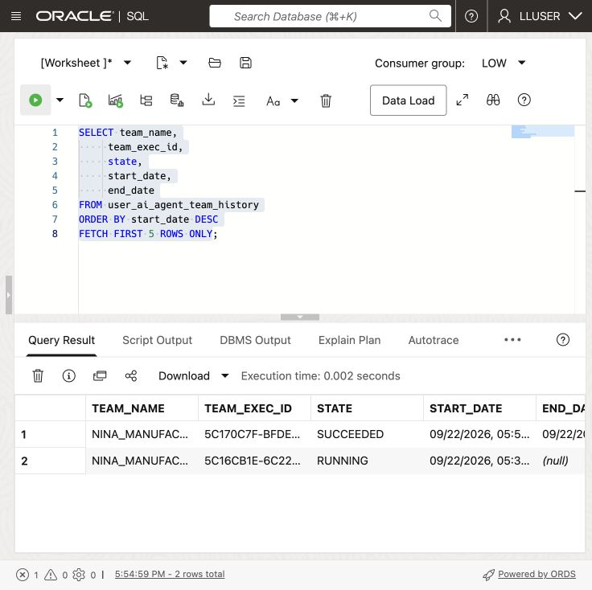
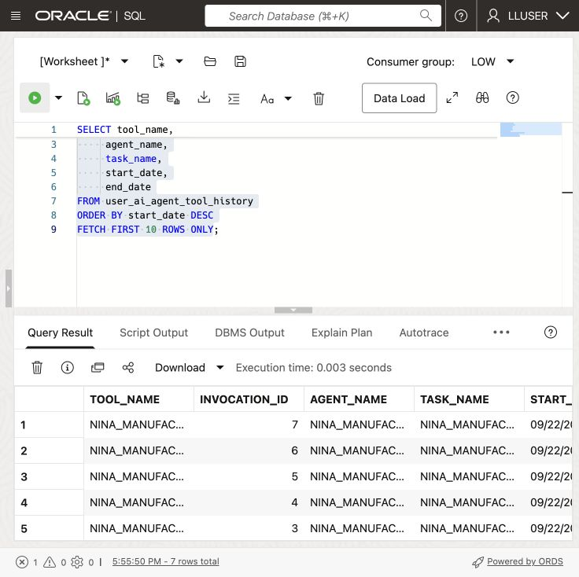

# Build a Manufacturing Agent with Select AI Agent



## Introduction

> **Validation status:** The manual LLUSER walkthrough and authentic manufacturing captures are recorded in the [validation report](../validation/validation-report.md). Green-button and Terraform provisioning remain untested.

Nina Patel has used Select AI for individual questions. Her production-review screen now needs an assistant that can handle a request and follow-up questions.

Jessica, the DBA, does not want to give an AI system unrestricted access to the database. She gives Nina's agent one approved tool: a SQL tool that uses the `GENAI` profile and the manufacturing tables configured in the previous lab.

In this lab, you create an agent, give it the built-in SQL query tool, and run a question through its team. The instructions ask for read-only answers. SQL still runs with the database user’s privileges. `LLUSER` owns the workshop objects, so it is not an example of a production account with restricted access.

<details>
<summary><strong>Key terms: agent, tool, task, and team</strong></summary>

> - An **agent** is a configured role that follows instructions when it handles a request.
>
> - A **tool** is a capability the agent is allowed to call. In this lab, the tool runs SQL through the `GENAI` profile.
>
> - A **task** tells the agent what to do and which tools it may use.
>
> - A **team** connects the agent and task so an application or SQL session can run them together.

</details>

### Objectives

- Confirm that the `GENAI` profile from the previous lab is available.
- Verify which manufacturing tables the SQL tool may use.
- Register a SQL query tool for the manufacturing schema.
- Create an agent, task, and team with `DBMS_CLOUD_AI_AGENT`.
- Run a manufacturing question through the team.
- Review the agent's tool history and explain why the tool boundary matters.

Estimated Time: **15 minutes**

### Hands-on Scenario

| Step                | Manufacturing focus                                                                                  |
| ------------------- | ---------------------------------------------------------------------------------------------- |
| Business Problem    | Nina needs a manufacturing answer that can feed a production-review screen.                            |
| Technical Challenge | The agent must use database data through an approved capability, not unrestricted access.      |
| Persona Focus       | You follow Nina as she turns a Select AI question into a small manufacturing assistant.              |
| What You Will See   | An agent receives a request, calls its SQL tool, and returns a manufacturing answer.                 |
| Database Capability | Select AI Agent, `DBMS_CLOUD_AI_AGENT`, AI profiles, and a built-in SQL tool.                   |
| Outcome             | Nina has a controlled agent that can answer questions from the manufacturing schema.                |

> **Prerequisite:** Complete [Lab 7: Ask Manufacturing Questions with Select AI](?lab=selectai). This lab uses the `GENAI` profile and its `object_list`.

## Task 1: Check the profile and table access

The agent's SQL tool uses the existing `GENAI` profile. The profile's `object_list` limits the tables Select AI may use when it generates SQL. Database privileges provide the second control: the SQL still runs as the current database user and cannot read tables that user cannot access.

1. Check the profile:

    ```sql
    <copy>
    SELECT profile_name,
           status
    FROM user_cloud_ai_profiles
    WHERE profile_name = 'GENAI';
    </copy>
    ```

    The profile should be enabled. If it is not present, complete Lab 7 first or ask the DBA which profile to use.

2. Check the tables listed in the profile:

    ```sql
    <copy>
    SELECT profile_name,
           attribute_name,
           attribute_value
    FROM user_cloud_ai_profile_attributes
    WHERE profile_name = 'GENAI'
      AND attribute_name = 'object_list';
    </copy>
    ```

    The list should contain only the workshop tables needed for this lab: `COMPONENTS`, `PRODUCTION_ORDERS`, `PRODUCTION_ORDER_LINES`, and `CUSTOMER_SITES`. The `object_list` guides SQL generation; it is not a replacement for database grants.

3. Check the agent objects already in your schema:

    ```sql
    <copy>
    SELECT agent_name,
           status
    FROM user_ai_agents
    ORDER BY agent_name;
    </copy>
    ```

  The workshop objects use names beginning with `NINA_MANUFACTURING_`. If you already ran this lab, you can reuse the existing objects or run the reset block in the appendix before starting again.

4. Use the model verified for this agent exercise. First record the current model from `USER_CLOUD_AI_PROFILE_ATTRIBUTES` so you can restore it after Task 5. The supplied stack starts with `cohere.command-a-03-2025`.

    ```sql
    <copy>
    SELECT attribute_value AS original_model
    FROM user_cloud_ai_profile_attributes
    WHERE profile_name = 'GENAI' AND attribute_name = 'model';
    </copy>
    ```

    In the manual walkthrough, Cohere repeated successful SQL tool calls until the browser request timed out. The same question completed with `meta.llama-3.3-70b-instruct`. Use the latter for this exercise with the configured Chicago inference endpoint. This changes the shared `GENAI` profile for concurrent calls too; use the workshop database and restore its previous model afterward.

    Run this block with **Run Script (F5)**:

    ```sql
    <copy>
    BEGIN
      DBMS_CLOUD_AI.SET_ATTRIBUTE(
        profile_name => 'GENAI',
        attribute_name => 'model',
        attribute_value => 'meta.llama-3.3-70b-instruct');
    END;
    /
    </copy>
    ```

## Task 2: Register the SQL tool

The SQL tool is the agent's only database capability in this lab. It uses the `GENAI` profile, so the profile's object list limits the schema metadata available for generated SQL.

1. Register the tool:

    ```sql
    <copy>
    BEGIN
      DBMS_CLOUD_AI_AGENT.CREATE_TOOL(
        tool_name   => 'NINA_MANUFACTURING_SQL_TOOL',
        attributes  => '{"tool_type": "SQL", "tool_params": {"profile_name": "genai"}}',
        description => 'SQL query access to the workshop manufacturing tables; task requests read-only answers'
      );
    END;
    /
    </copy>
    ```

    The tool lets the agent ask Select AI to generate and run SQL. It uses the profile’s table list and the current database user’s privileges.
  
2. Confirm the tool definition:

    ```sql
    <copy>
    SELECT tool_name,
           status,
           description
    FROM user_ai_agent_tools
    WHERE tool_name = 'NINA_MANUFACTURING_SQL_TOOL';
    </copy>
    ```
  
## Task 3: Create Nina's agent, task, and team

Define the agent’s role and task, then connect them in a team that can call the SQL tool.

1. Create the agent:

    ```sql
    <copy>
    BEGIN
      DBMS_CLOUD_AI_AGENT.CREATE_AGENT(
        agent_name  => 'NINA_MANUFACTURING_AGENT',
        attributes  => '{"profile_name": "genai", "role": "You are Nina Patel''s manufacturing data assistant. Answer questions using the approved SQL tool. Use database results for component, production_order, material cost, and customer site facts. Do not invent values."}',
        description => 'Manufacturing assistant for Nina Patel'
      );
    END;
    /
    </copy>
    ```

2. Create the task:

    ```sql
    <copy>
    BEGIN
      DBMS_CLOUD_AI_AGENT.CREATE_TASK(
        task_name  => 'NINA_MANUFACTURING_TASK',
        attributes => '{"instruction": "Answer Nina''s manufacturing question: {query}. Use NINA_MANUFACTURING_SQL_TOOL once to retrieve the required data. Return a concise answer based on the database result. Do not repeat the same tool call and do not make changes to database records.", "tools": ["NINA_MANUFACTURING_SQL_TOOL"], "enable_human_tool": "false"}',
        description => 'Answer read-only component and customer site questions'
      );
    END;
    /
    </copy>
    ```
  
3. Create the team:

    ```sql
    <copy>
    BEGIN
      DBMS_CLOUD_AI_AGENT.CREATE_TEAM(
        team_name  => 'NINA_MANUFACTURING_TEAM',
        attributes => '{"agents": [{"name": "NINA_MANUFACTURING_AGENT", "task": "NINA_MANUFACTURING_TASK"}], "process": "sequential"}',
        description => 'Read-only manufacturing question team'
      );
    END;
    /
    </copy>
    ```

    Run the team to bring together Nina’s role, the task instructions, and the SQL tool.
  
## Task 4: Run a manufacturing question

Database Actions does not support the `SELECT AI AGENT` command directly. Use `DBMS_CLOUD_AI_AGENT.RUN_TEAM` in SQL Worksheet and provide the team name in the function call.

1. Ask the agent:

    ```sql
    <copy>
    SELECT DBMS_CLOUD_AI_AGENT.RUN_TEAM(
             team_name   => 'NINA_MANUFACTURING_TEAM',
             user_prompt => 'Which five components have the highest scheduled material value? Sum production_order_lines.line_total only for released, in_production, or completed production_orders. Include the component name, category, total material_value, and planned units. Status values are case-sensitive lowercase strings: use order_status IN (''released'', ''in_production'', ''completed'') exactly; do not uppercase them.',
             params      => '{"conversation_id": "' || DBMS_CLOUD_AI.CREATE_CONVERSATION() || '"}'
           ) AS agent_answer;
    </copy>
    ```

    

    
  
    Database Actions does not keep an agent conversation ID for this call, so the query creates one and passes it to `RUN_TEAM`. The ID lets Oracle record the prompt and response in the agent conversation history.

    

2. Review the answer.

    Look for the component ranking, category, material value, and planned units. The exact wording may vary because an AI provider generates the response, but the answer should be based on the manufacturing tables available through `GENAI`.
  
    > **Note:** The instructions request read-only answers. They do not revoke the database privileges of `LLUSER`. Use a separately restricted account for a production assistant.

3. Optional challenge: ask a follow-up question that connects the highest-value component to its customer sites and production orders. A more detailed request may take longer because the agent has to interpret more steps.

## Task 5: Inspect what the agent did

Nina needs more than a final answer. She also wants to know whether the agent called the approved tool and how the request was processed.

1. Review the latest team runs:

    ```sql
    <copy>
    SELECT team_name,
         team_exec_id,
         state,
         start_date,
         end_date
    FROM user_ai_agent_team_history
    ORDER BY start_date DESC
    FETCH FIRST 5 ROWS ONLY;
    </copy>
    ```

    

    

    

2. Review the latest tool calls:

    ```sql
    <copy>
    SELECT tool_name,
         invocation_id,
         agent_name,
         task_name,
         start_date,
         end_date
    FROM user_ai_agent_tool_history
    ORDER BY start_date DESC
    FETCH FIRST 10 ROWS ONLY;
    </copy>
    ```

    

    

  

  The history should show `NINA_MANUFACTURING_SQL_TOOL`. Nina and Jessica can use it to check which tool the agent called.

3. Restore the original model, including if the agent request fails. The value below is the supplied stack default; replace it with the value you recorded in Task 1 if yours differs. Run with **Run Script (F5)**.

    ```sql
    <copy>
    BEGIN
      DBMS_CLOUD_AI.SET_ATTRIBUTE(
        profile_name => 'GENAI',
        attribute_name => 'model',
        attribute_value => 'cohere.command-a-03-2025');
    END;
    /
    SELECT attribute_value AS restored_model
    FROM user_cloud_ai_profile_attributes
    WHERE profile_name = 'GENAI' AND attribute_name = 'model';
    </copy>
    ```

    Confirm that `RESTORED_MODEL` matches the value recorded before the test. The successful reference run completed in about 32 seconds with one SQL tool call. Runtime and wording vary. An earlier timed-out request may still appear as `RUNNING` with no end time in history; that row alone does not prove that it is still executing.

## Conclusion: Give the agent a controlled way to work

In Lab 7, Nina used Select AI to turn a question into SQL. In this lab, she gave an agent a role, a task, and one approved SQL tool. The agent can handle a broader request and decide when it needs database information, while the database still controls the profile, object list, privileges, and tool history.

The application can call this assistant with a request. Jessica can review its tools and disable the tool or team when access is no longer needed.

Two controls apply to table access. The profile’s `object_list` guides which tables the tool considers. Database grants and row-level policies determine which data the session can read. Give an application agent only the access it needs.

The example asks the agent to return read-only answers. Before an agent is allowed to change data, the team should add a narrowly defined function tool, clear instructions, and a confirmation step for the user.

## Appendix: Reset the workshop objects

Run this block only if you want to recreate the objects used in this lab. It removes only the four names created here.

```sql
<copy>
BEGIN
  DBMS_CLOUD_AI_AGENT.DROP_TEAM('NINA_MANUFACTURING_TEAM', TRUE);
  DBMS_CLOUD_AI_AGENT.DROP_TASK('NINA_MANUFACTURING_TASK', TRUE);
  DBMS_CLOUD_AI_AGENT.DROP_AGENT('NINA_MANUFACTURING_AGENT', TRUE);
  DBMS_CLOUD_AI_AGENT.DROP_TOOL('NINA_MANUFACTURING_SQL_TOOL', TRUE);
END;
/
</copy>
```

## Next Steps

Read the [Oracle AI Database Select AI Agent documentation](https://docs.oracle.com/en/database/oracle/oracle-database/26/selai/).

## Acknowledgements

* **Author** - Matt Kowalik
* **Contributor** - Kevin Lazarz
* **Last Updated By/Date** - Matt Kowalik, September 2026
