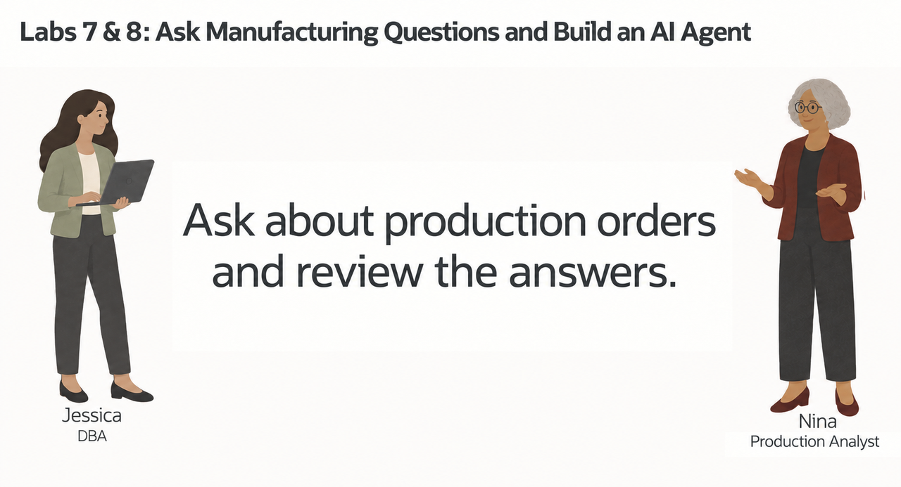
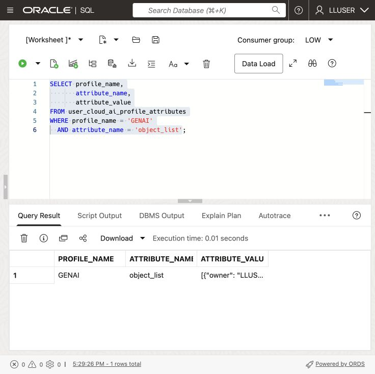
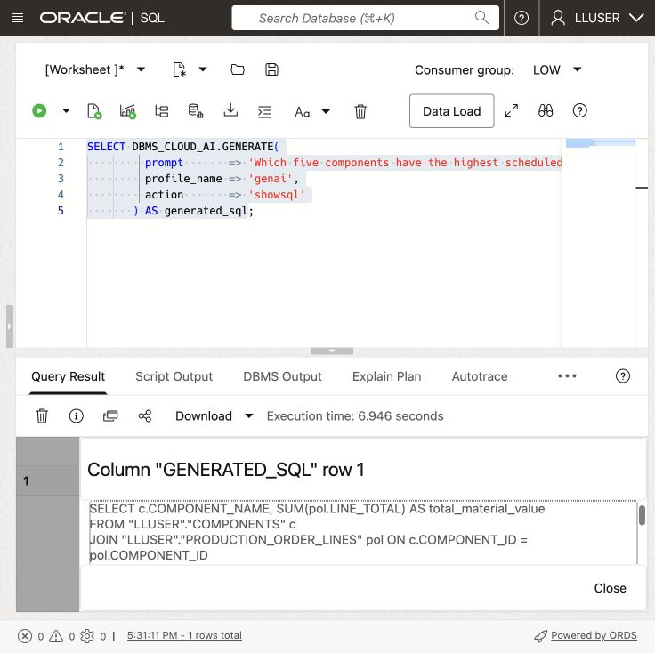
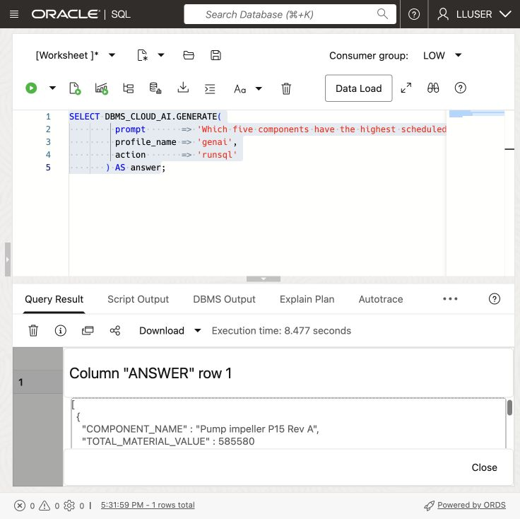
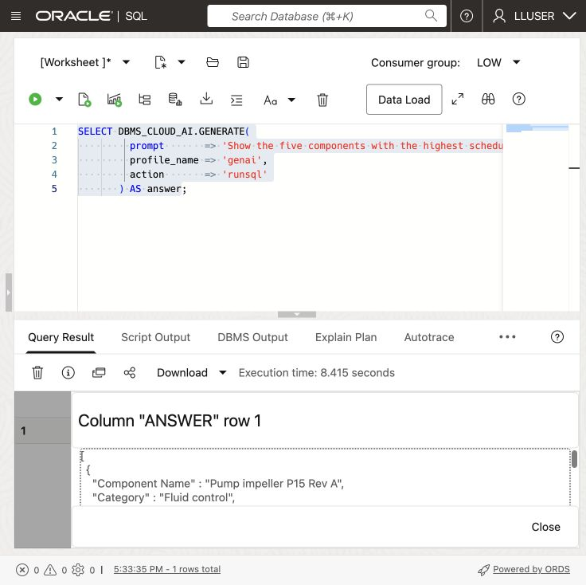
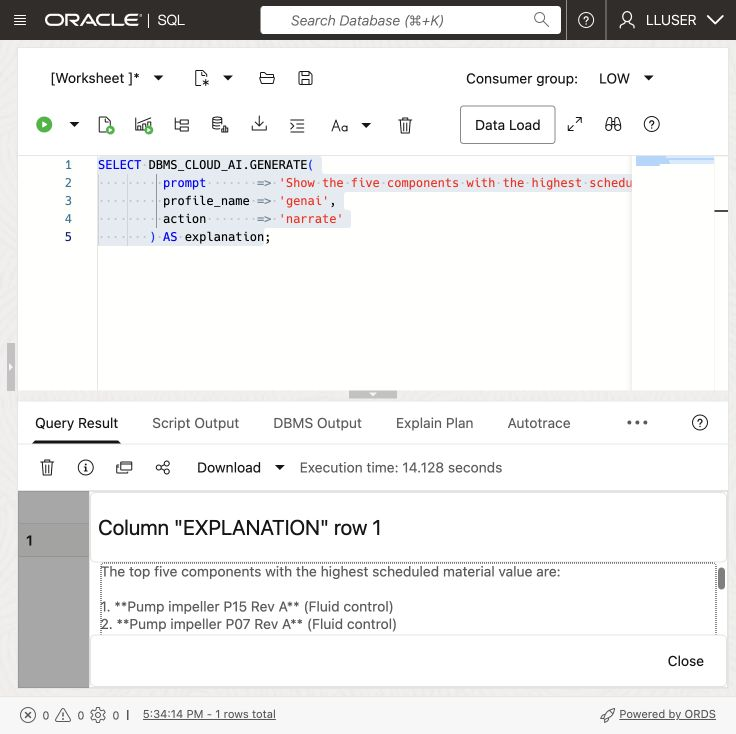

# Ask Manufacturing Questions with Select AI

## Introduction

Nina Patel, SEER MANUFACTURING’s production analyst, wants answers about components and production orders without writing every join and filter. Jessica has configured a Select AI profile for the manufacturing schema.

You will help Nina ask a question, inspect the generated SQL, run it, and refine the result. The model can choose the wrong columns or misunderstand a question, so SQL review remains part of her work.



<details>
<summary><strong>Key terms: Select AI, AI profile, generated SQL, and natural-language prompt</strong></summary>

> - **Select AI** lets a user work with database information through a natural-language question.
>
> - An **AI profile** connects Select AI to an AI provider and identifies the database objects that may be used for the question.
>
> - **Generated SQL** is the SQL statement created from the question. Nina should inspect it before relying on the result.
>
> - A **natural-language prompt** is the question sent to Select AI, such as “Which five components have the highest total material value?”

</details>

### Objectives

- Check which Select AI profile is available in the schema.
- Add the manufacturing tables that Select AI may use to the profile.
- Generate SQL from a manufacturing question and inspect it.
- Run a natural-language question through `DBMS_CLOUD_AI.GENERATE`.
- Refine a question to include the component, order, and cost details Nina needs.
- Explain why generated SQL still requires review.

Estimated Time: **10 minutes**

> **SQL Worksheet reminder:** See [Getting Started Task 2: Open SQL Worksheet](?lab=getting-started#Task2:OpenSQLWorksheet) for the steps to paste and run SQL.

## Task 1: Check the Select AI profile

Check the existing `GENAI` profile in the workshop schema.

1. Run this query:

    ```sql
    <copy>
    SELECT profile_name,
           status,
           description
    FROM user_cloud_ai_profiles
    ORDER BY profile_name;
    </copy>
    ```

    The workshop profile is expected to be named `GENAI`. Confirm that it is enabled. The AI model must also support on-demand inference in the profile’s region. Use the provider, model, and region approved for your workshop environment. Check [Oracle’s regional model availability](https://docs.oracle.com/en-us/iaas/Content/generative-ai/model-endpoint-regions.htm) before deployment; a model appearing in the catalog does not necessarily support on-demand calls in that region. If the query shows a different profile name, use that name in the following tasks.

2. Review the profile attributes:
  
    ```sql
    <copy>
    SELECT profile_name,
           attribute_name,
           attribute_value
    FROM user_cloud_ai_profile_attributes
    ORDER BY profile_name, attribute_name;
    </copy>
    ```

    The attributes show how the profile is configured and which database objects are available to Select AI. Do not copy credentials. In Task 2, you will change only the profile's `object_list`.

## Task 2: Add the manufacturing tables to the profile

Give the profile the four tables needed for Nina’s questions.

1. Add the manufacturing tables to the profile:

    ```sql
    <copy>
    BEGIN
      DBMS_CLOUD_AI.SET_ATTRIBUTE(
        profile_name    => 'genai',
        attribute_name  => 'object_list',
        attribute_value => '[{"owner": "' || USER || '", "name": "COMPONENTS"}, {"owner": "' || USER || '", "name": "PRODUCTION_ORDERS"}, {"owner": "' || USER || '", "name": "PRODUCTION_ORDER_LINES"}, {"owner": "' || USER || '", "name": "CUSTOMER_SITES"}]'
      );
    END;
    /
    </copy>
    ```

2. Confirm the object list:

    ```sql
    <copy>
    SELECT profile_name,
           attribute_name,
           attribute_value
    FROM user_cloud_ai_profile_attributes
    WHERE profile_name = 'GENAI'
      AND attribute_name = 'object_list';
    </copy>
    ```

    

    The result should list `COMPONENTS`, `PRODUCTION_ORDERS`, `PRODUCTION_ORDER_LINES`, and `CUSTOMER_SITES`. Select AI can now use these tables when it translates Nina's questions into SQL.

## Task 3: Ask a question and inspect the SQL

Nina starts with a simple question: which components have the highest scheduled material value? She first asks Select AI to show the SQL without running it.

In SQL Worksheet, submit the question through `DBMS_CLOUD_AI.GENERATE`. The surrounding SQL calls Select AI; the text after `prompt =>` is Nina’s question. She describes what she needs in everyday language and lets Select AI work out the joins, columns, and calculations.

1. Run the question with the `GENAI` profile:

    ```sql
    <copy>
    SELECT DBMS_CLOUD_AI.GENERATE(
             prompt       => 'Which five components have the highest total material value across production orders that are released, in production, or completed? Exclude setup costs.',
             profile_name => 'genai',
             action       => 'showsql'
           ) AS generated_sql;
    </copy>
    ```

    

2. Read the generated SQL before running it.

    Check that the statement joins `COMPONENTS`, `PRODUCTION_ORDER_LINES`, and `PRODUCTION_ORDERS`, groups by component, returns five rows, sums LINE_TOTAL, and filters the stated production order statuses. Exclude `SETUP_COST` from material value. Status values in this dataset are case-sensitive: the filter should use `released`, `in_production`, and `completed`. Select AI can generate a valid-looking statement that does not answer the question precisely, so the generated SQL is part of the result Nina reviews.

## Task 4: Run the question in the database

Nina now submits the same question with `runsql` to return the database result. This generates SQL again; it does not execute the exact statement shown in Task 3.

1. Run the same question with the `runsql` action:

    ```sql
    <copy>
    SELECT DBMS_CLOUD_AI.GENERATE(
             prompt       => 'Which five components have the highest total material value across production orders that are released, in production, or completed? Exclude setup costs.',
             profile_name => 'genai',
             action       => 'runsql'
           ) AS answer;
    </copy>
      ```

    

2. Compare the answer with the SQL you inspected in Task 3.

    The query runs with your database privileges. Check the ranking against the SQL from Task 3.

## Task 5: Improve the business question

Nina's first question gives her a component ranking, but she also needs enough detail to decide what to review. She changes the question to request the component category, total material value, and planned units.

1. Use `showsql` to inspect this revised prompt:

    ```sql
    <copy>
    SELECT DBMS_CLOUD_AI.GENERATE(
             prompt       => 'Which five components have the highest total material value across production orders that are released, in production, or completed? For each component, show its name, category, total material value, and total planned units. Exclude setup costs.',
             profile_name => 'genai',
             action       => 'showsql'
           ) AS generated_sql;
    </copy>
    ```

    

2. Review the generated SQL, then run the revised question with `runsql`:

    ```sql
    <copy>
    SELECT DBMS_CLOUD_AI.GENERATE(
             prompt       => 'Which five components have the highest total material value across production orders that are released, in production, or completed? For each component, show its name, category, total material value, and total planned units. Exclude setup costs.',
             profile_name => 'genai',
             action       => 'runsql'
           ) AS answer;
    </copy>
    ```

    

3. Compare the first and second questions.

  The revised prompt asks for the columns Nina needs in her review. She still checks that the SQL uses the right joins, totals, and production order statuses.

## Task 6: Explain the result

Nina wants a short explanation of the revised result. Select AI can run the SQL and ask the AI provider to describe the returned rows.

1. Run the revised question with the `narrate` action:

    ```sql
    <copy>
    SELECT DBMS_CLOUD_AI.GENERATE(
             prompt       => 'Which five components have the highest total material value across production orders that are released, in production, or completed? For each component, show its name, category, total material value, and total planned units. Exclude setup costs.',
             profile_name => 'genai',
             action       => 'narrate'
           ) AS explanation;
    </copy>
    ```

    

2. Review the explanation against the SQL result.

  Check that the explanation agrees with the returned components, totals, and ranking.

  > **Note:** The `narrate` action sends the query result to the AI provider configured in the profile. Use it only for data approved for that provider.

## Conclusion: Ask, Inspect, and Refine

Nina now has a component ranking she can check against its SQL. Keep the same routine for new questions: inspect the query, run it, and compare the answer with the manufacturing decision.

## Next Steps

For the full list of Select AI actions, profile attributes, and supported providers, see the [Oracle AI Database 26ai Select AI documentation](https://docs.oracle.com/en/database/oracle/oracle-database/26/selai/).

## Acknowledgements

* **Author** - Matt Kowalik
* **Contributor** - Kevin Lazarz
* **Last Updated By/Date** - Matt Kowalik, September 2026
