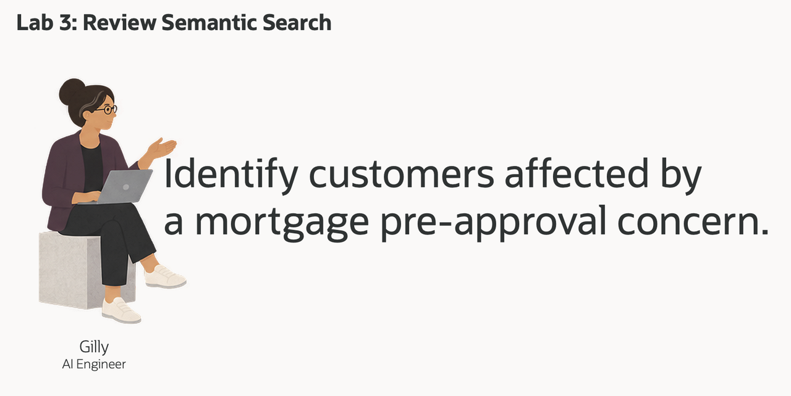
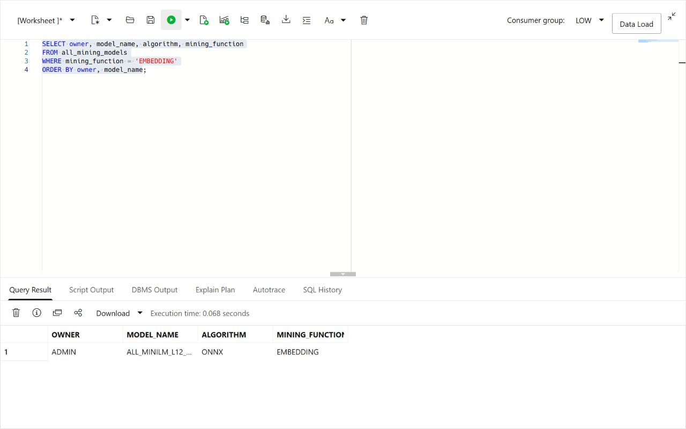
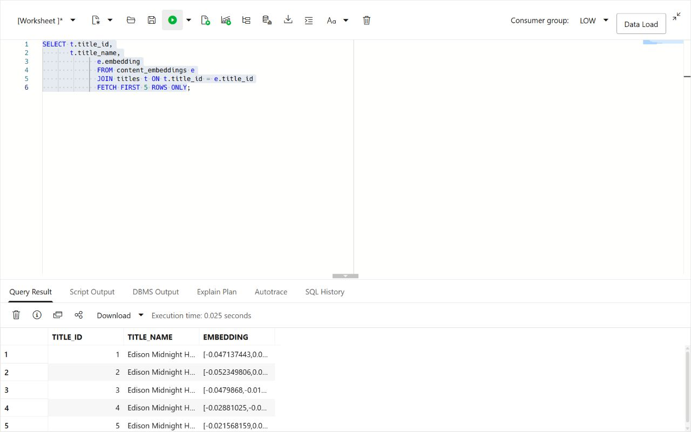
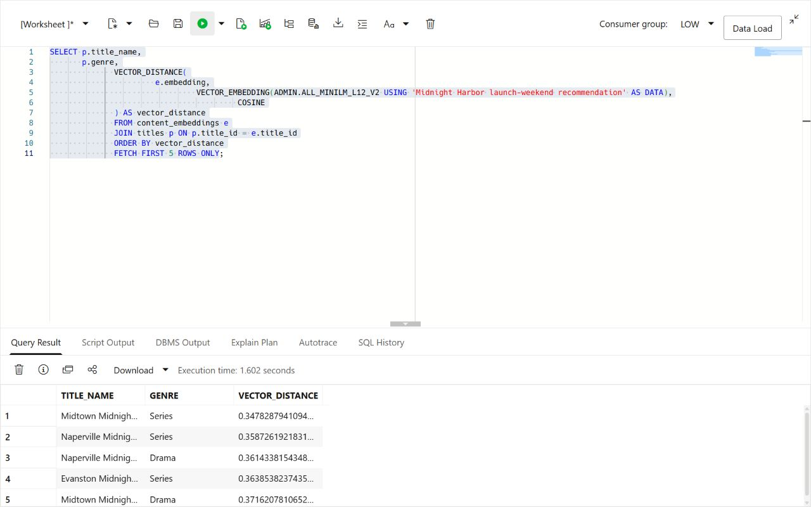
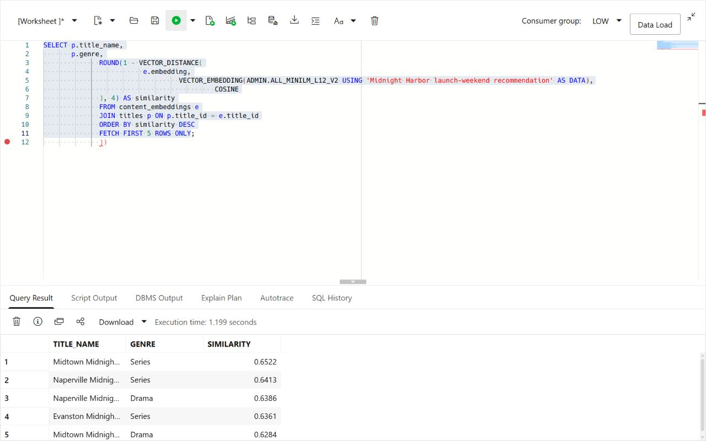
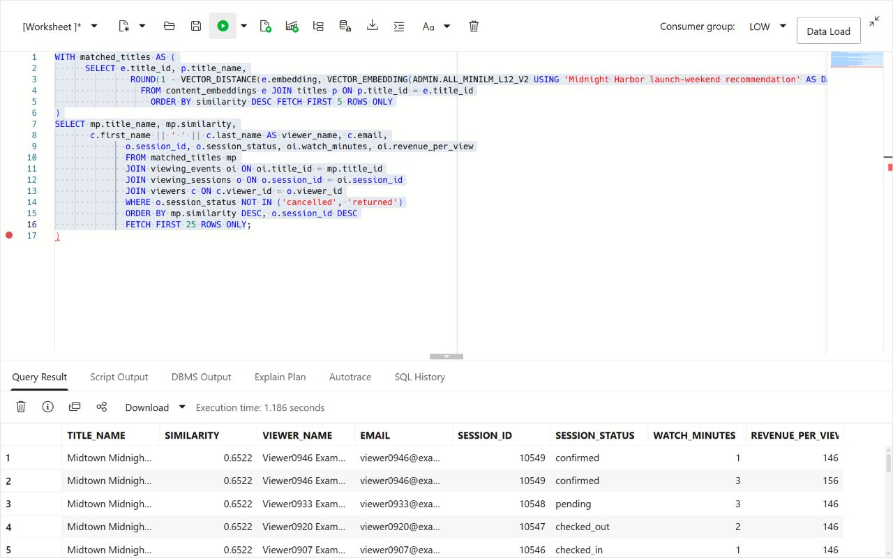

# Discover Related Midnight Harbor Content with Vector Search

## Introduction

> **Screenshot update note:** Vector screenshots should show semantic discovery for Midnight Harbor titles, audience intent, or creator/community content.

Gilly Bourne is an AI engineer at Seer Media. Her team has built a search feature for the launch operations application. A business user can enter a question such as **which viewers may be affected by a Midnight Harbor recommendation concern?** The application should find the relevant titles first, then show the viewers who viewed them.

Gilly already has the title, viewing session, and viewer data in the database. Her design problem is connecting a plain-language question to those existing rows. She needs to turn content catalog data into vectors, rank the closest titles, and join those matches to viewing_sessions and viewers. A useful result must show more than a similarity score. It must give the service team a viewer and order list they can act on.

She could export the text and embeddings to a separate vector service. That would add a second copy of sensitive media language, another index to refresh, and another set of access rules to manage. Gilly wants the search to run where the underlying rows already live, so one SQL statement can compare meaning, join content catalog data to viewing_sessions and viewers, and return a result for the application.

In this lab, you review Gilly's implementation from the embedding model to the final viewer list. You see why Oracle AI Database fits the job: vector search finds the relevant titles, and SQL joins connect them to exact viewing session and viewer data in the same database.



<details>
<summary><strong>Key terms: embedding, vector, vector distance, and semantic search</strong></summary>

> - An **embedding** is a numerical profile of what text means. In this lab, content catalog data is embedded so similar media ideas sit near each other mathematically, even when the wording is different.
>
> - An **ONNX embedding model** is a portable machine-learning model saved in the Open Neural Network Exchange (ONNX) format. It turns text into a vector of numbers that captures meaning. Oracle AI Database can load and run this model inside the database, close to the title rows.
>
> - A **vector** is the stored numerical form of an embedding. Oracle Database can store vectors beside the media rows they describe, so the search stays connected to title names, exposure values, notice counts, and other business columns.
>
> - **Vector distance** measures how close two vectors are. A smaller distance means the meanings are more similar; a larger distance means they are farther apart. In this lab, distance helps rank which titles or launch-weekend audience signals best match a business user's question.
>
> - **Semantic search** means searching by meaning instead of exact words. A search for "Midnight Harbor launch-weekend recommendation" can find related lending titles even when the title names use different wording.

</details>

Gilly has already built the Launch Signal Intelligence page. In this lab, you review how she built the content discovery search. The search area lets a business user enter a concern in ordinary language and receive ranked titles by meaning.

### Objectives

- Check the embedding model Gilly needs for semantic search.
- Create a vector from content catalog data inside the database.
- Review a semantic content discovery search for a business question.
- Turn title matches into a viewer follow-up list.
- Explain why vector search belongs beside media data and access controls.

Estimated Time: **10 minutes**

### Hands-on Scenario

| Step                | Media & Entertainment focus                                                                                                                               |
| ---------------------| ---------------------------------------------------------------------------------------------------------------------------------------------|
| Business Problem    | Business users need to find relevant titles without knowing the exact terms used in the content catalog data.                                     |
| Technical Challenge | Gilly must search by meaning while keeping content catalog data, vectors, viewing_sessions, viewers, and access controls together.                          |
| Persona Focus       | You review Gilly's implementation as she explains how the search connects a business question to titles, viewing_sessions, and viewers.           |
| What You Will See   | Vector search ranks titles by meaning, then SQL adds viewing session and viewer details.                                                          |
| Database Capability | `VECTOR_EMBEDDING`, vector columns, and `VECTOR_DISTANCE` run beside relational media data.                                               |
| Outcome             | The application can turn a plain-language concern into a viewer follow-up list without a separate vector database or copied media text. |

Persona focus: You are reviewing the search tool Gilly built for launch operations.


> **SQL Worksheet reminder:** Need a reminder on how to open and use the SQL Worksheet? Return to [Getting Started Task 2: Open SQL Worksheet](?lab=getting-started#Task2:OpenSQLWorksheet) for the step-by-step guide showing how to run SQL statements.


## Task 1: Check the embedding model

Start with Gilly's first design question: **what does similarity search need?** It needs vectors for the text being searched and an embedding model that converts a question into a vector.

Gilly asks Jessica to load an ONNX embedding model into Oracle AI Database. Oracle AI Database can store and run the ONNX model inside the database, so it creates the question embedding where the content catalog data already live. The application does not have to send media text to a separate service and bring the vector back.

1. Run the following query to see which embedding models are available:

    ```sql
    <copy>
    SELECT owner,
           model_name,
           algorithm,
           mining_function
    FROM all_mining_models
    WHERE mining_function = 'EMBEDDING'
    ORDER BY owner, model_name;
    </copy>
    ```

    **Expected output: Available Embedding Models**

    

    The result should include an embedding model owned by `ADMIN`, such as `ALL_MINILM_L12_V2`. This compact model turns text into 384-number vectors. The `EMBEDDING` value confirms that the model can turn text into vectors for similarity search.

2. Review what this means for Gilly's application.

    Gilly can call the model from SQL with `VECTOR_EMBEDDING(...)`. Jessica manages the model inside the database, while Gilly uses it in her search query. The content catalog data, vectors, and access controls stay in the same database.

    > **Note:** This is the key Oracle AI Database differentiator in this lab. The embedding model runs inside the database, so Gilly does not need a separate embedding service or a data pipeline to move media text between systems.

## Task 2: Review the title vectors

Gilly decides that one vector per title is enough. The Seer Media loader has already created those deterministic vectors in `CONTENT_EMBEDDINGS`, keyed to the title catalog. Each vector represents the title name, genre, and format without changing the launch-weekend source data during the lab.

1. Review the text Gilly will embed:

    ```sql
    <copy>
    SELECT title_id,
           title_name,
           genre,
           format,
           title_name || '. Category: ' || genre ||
             '. Subgenre: ' || format AS embedding_text
    FROM titles
    FETCH FIRST 5 ROWS ONLY;
    </copy>
    ```

    The combined text gives the model the title name and its business classification. Gilly does not need to embed price, dates, or other values that do not describe what the title is.

2. Verify the loaded vectors and their title keys:

    ```sql
    <copy>
    SELECT t.title_id,
           t.title_name,
           e.embedding
    FROM content_embeddings e
    JOIN titles t ON t.title_id = e.title_id
    FETCH FIRST 5 ROWS ONLY;
    </copy>
    ```

    

    Each title has its own 384-dimensional vector. Gilly can use `CONTENT_EMBEDDINGS.EMBEDDING` directly when the application searches for titles by meaning.

    > **Note:** Chunking is not relevant for this data. Each row describes one short title, so splitting it would create several vectors for one title without adding useful detail. Chunking becomes useful for long documents, such as policies or regulatory bulletins, where each section may answer a different question.

## Task 3: Test the title vector

Now Gilly tests the new column with a simple vector query. She asks for titles related to Midnight Harbor launch-weekend recommendation and lets the database rank them by meaning.

1. Run the following query:

    The SQL creates an embedding for the phrase `Midnight Harbor launch-weekend recommendation`, compares it with the vectors in `TITLES.CONTENT_EMBEDDING`, and returns the cosine distance. A smaller distance means the two vectors are closer in meaning, so the query viewing_sessions the smallest distance first.

    <details>
    <summary><strong>Why this matters to Gilly</strong></summary>

    > Gilly could export the text to an external embedding pipeline or search service. That would create extra copies of sensitive media text and make it harder to show which data the application searched.
    >
    > Oracle AI Vector Search keeps the content catalog data, vectors, SQL query, and vector distance with the media data. Gilly can check the search and use the result in the application without adding another data store.

    </details>

    ```sql
    <copy>
    SELECT p.title_name,
           p.genre,
           VECTOR_DISTANCE(
             e.embedding,
             VECTOR_EMBEDDING(ADMIN.ALL_MINILM_L12_V2 USING 'Midnight Harbor launch-weekend recommendation' AS DATA),
             COSINE) AS vector_distance
    FROM content_embeddings e
    JOIN titles p ON p.title_id = e.title_id
    ORDER BY vector_distance
    FETCH FIRST 5 ROWS ONLY;
    </copy>
    ```

    **Expected output: Midnight Harbor Title Matches**

    

2. Review the ranked titles.
    The query embeds the analyst phrase at runtime and compares it to the `TITLES.CONTENT_EMBEDDING` column. `VECTOR_DISTANCE` calculates the distance between the two vectors using the `COSINE` metric. A lower value means a closer match.

    In the broader workflow, these ranked titles can become the next filter for dashboard review and title exposure analysis.

3. Show the result as a similarity score:

    Vector distance is useful for checking the search, but business users may not know what a cosine distance means. Gilly changes the display to a similarity score. She subtracts the distance from `1`, so a higher score means a closer match, and rounds the result to four decimal places.

    ```sql
    <copy>
    SELECT p.title_name,
           p.genre,
           ROUND(1 - VECTOR_DISTANCE(
             e.embedding,
             VECTOR_EMBEDDING(ADMIN.ALL_MINILM_L12_V2 USING 'Midnight Harbor launch-weekend recommendation' AS DATA),
             COSINE), 4) AS similarity
    FROM content_embeddings e
    JOIN titles p ON p.title_id = e.title_id
    ORDER BY similarity DESC
    FETCH FIRST 5 ROWS ONLY;
    </copy>
    ```

    The query uses the same vectors and the same cosine calculation. It only changes how the result is shown to the person using the application.

    

## Task 4: Find viewers affected by a title discovery concern

Gilly now has the business requirement for the application. A business user should be able to enter a concern and find viewers who viewed related titles. The result gives the viewer-service team a short list for follow-up, with the title match, viewing-session status, viewing date, and viewer contact details.

1. Run the following query for the concern `Midnight Harbor launch-weekend recommendation`:

    ```sql
    <copy>
    WITH matched_titles AS (
        SELECT e.title_id,
               p.title_name,
               ROUND(1 - VECTOR_DISTANCE(
                 e.embedding,
                 VECTOR_EMBEDDING(
                   ADMIN.ALL_MINILM_L12_V2
                   USING 'Midnight Harbor launch-weekend recommendation' AS DATA
                 ),
                 COSINE), 4) AS similarity
        FROM content_embeddings e
        JOIN titles p ON p.title_id = e.title_id
        ORDER BY similarity DESC
        FETCH FIRST 5 ROWS ONLY
    )
    SELECT mp.title_name,
           mp.similarity,
           c.first_name || ' ' || c.last_name AS viewer_name,
           c.email,
           o.session_id,
           o.session_status,
           oi.watch_minutes,
           oi.revenue_per_view
    FROM matched_titles mp
    JOIN viewing_events oi ON oi.title_id = mp.title_id
    JOIN viewing_sessions o ON o.session_id = oi.session_id
    JOIN viewers c ON c.viewer_id = o.viewer_id
    WHERE o.session_status NOT IN ('cancelled', 'returned')
    ORDER BY mp.similarity DESC,
             o.session_id DESC
    FETCH FIRST 25 ROWS ONLY;
    </copy>
    ```

    The first part ranks titles by meaning. The remaining joins use ordinary relational keys to find the matching viewing events, viewing_sessions, and viewers.

    **Expected output: Viewer Follow-up List**

    The result shows viewers who viewed titles related to the concern. The similarity score explains why the title was included, while the viewing session and viewer columns give the service team enough information to decide what to do next.


    

2. Review the business result.

    Gilly does not vectorize every order or viewer. She vectorizes the content catalog data once, then builds a converged query that combines vector search with SQL joins for exact viewing session and contact details. This keeps the search flexible while the final viewer list remains precise and easy to act on.

## Conclusion

Gilly has built the search behind the application and connected it to a business action. A plain-language concern can produce ranked titles and a viewer follow-up list using vectors, relational joins, and SQL in Oracle AI Database. 

## Acknowledgements

* **Author** - Kevin Lazarz
* **Contributor** - Eugenio Galiano, Pat Shepherd
* **Last Updated By/Date** - Oracle Database Product Management, September 2026
