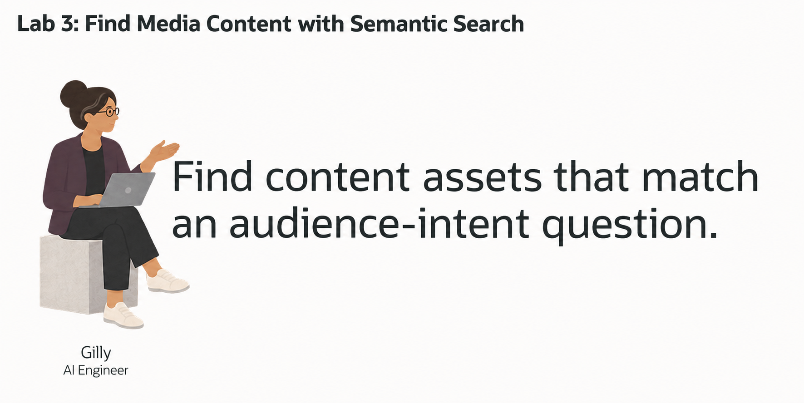
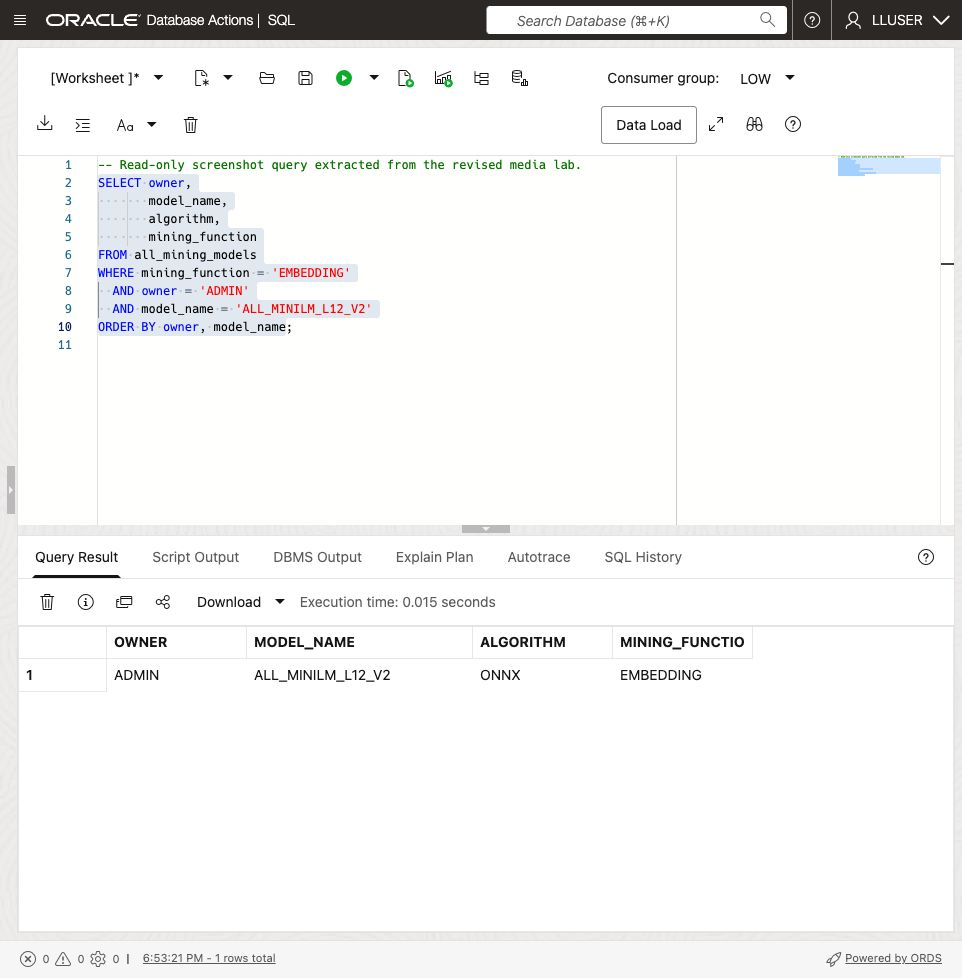
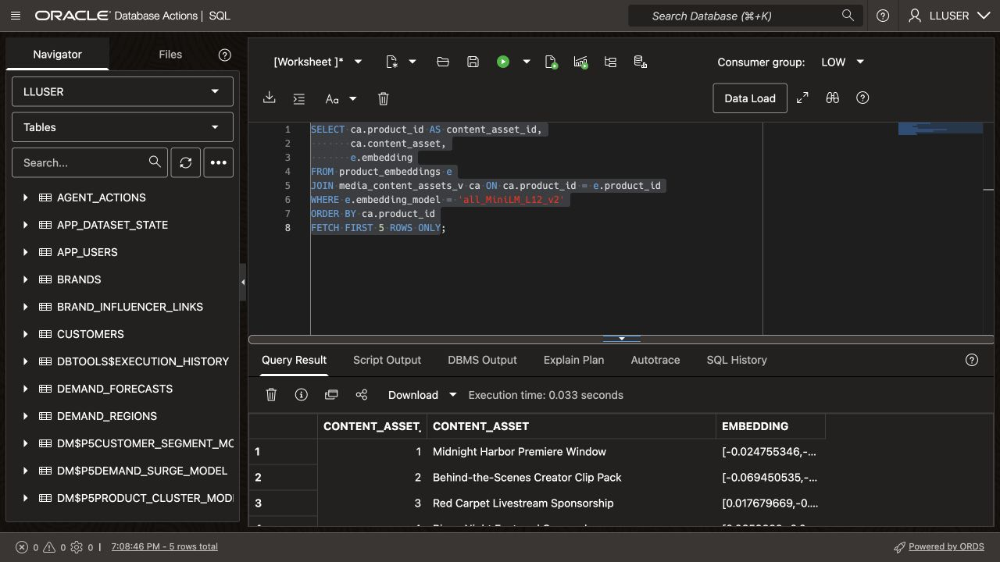
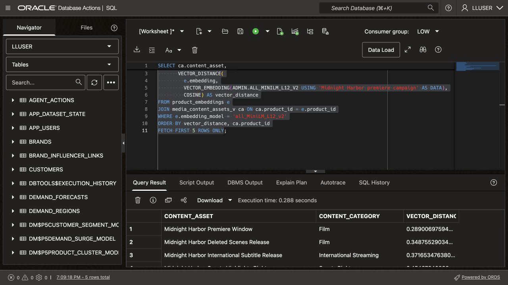
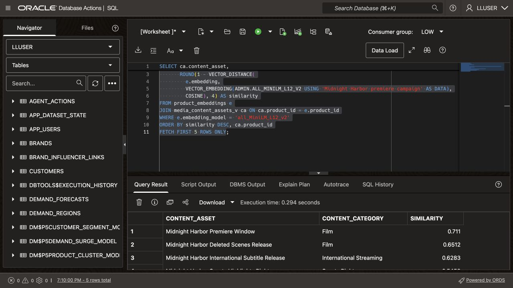
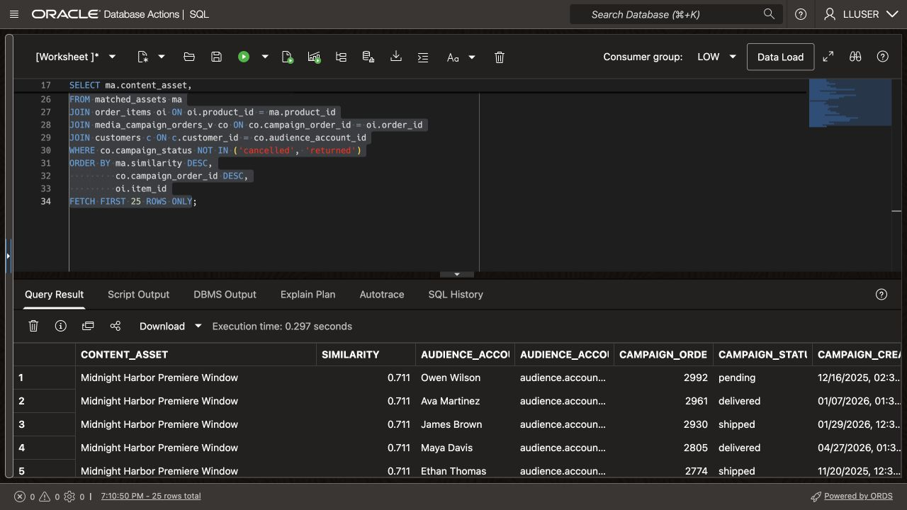

# Discover Related Midnight Harbor Content with Vector Search

## Introduction

Gilly Bourne builds search features for Seer Media's launch operations application. Users ask: **which campaign orders include content related to the Midnight Harbor premiere?** The search must find relevant assets and the audience accounts linked to their campaign orders.

Gilly connects a plain-language question to existing database rows. She compares vectors to rank content assets, then joins the matches to campaign orders and audience accounts. The result gives the campaign team a follow-up list with asset names, order details, and contact information.

The content text and vectors stay in Oracle AI Database. One SQL statement compares meaning and joins the matching assets to their campaign records.

In this lab, you inspect the embedding model and stored vectors, test semantic search, and build the campaign follow-up query.



<details>
<summary><strong>Key terms: embedding, vector, vector distance, and semantic search</strong></summary>

> - An **embedding** is a numerical profile of what text means. In this lab, content catalog data is embedded so similar media ideas sit near each other mathematically, even when the wording is different.
>
> - An **ONNX embedding model** is a portable machine-learning model saved in the Open Neural Network Exchange (ONNX) format. It turns text into a vector of numbers that captures meaning. Oracle AI Database can load and run this model inside the database, close to the content asset rows.
>
> - A **vector** is the stored numerical form of an embedding. Oracle Database can store vectors beside the media rows they describe, so the search stays connected to content asset names, campaign values, audience-signal counts, and other business columns.
>
> - **Vector distance** measures how close two vectors are. A smaller distance means the meanings are more similar; a larger distance means they are farther apart. In this lab, distance helps rank which content assets or launch-weekend audience signals best match a business user's question.
>
> - **Semantic search** means searching by meaning instead of exact words. A search for "Midnight Harbor premiere campaign" can find related content assets even when the content asset names use different wording.

</details>

The application's search field accepts a plain-language question and returns content assets ranked by meaning.

### Objectives

- Check the embedding model Gilly needs for semantic search.
- Create a query vector and inspect stored content vectors inside the database.
- Review a semantic content discovery search for a business question.
- Turn content asset matches into a campaign follow-up list.
- Explain why vector search belongs beside media data and access controls.

Estimated Time: **10 minutes**

### Hands-on Scenario

| Step                | Media & Entertainment focus                                                                                                                               |
| ---------------------| ---------------------------------------------------------------------------------------------------------------------------------------------|
| Business Problem    | Business users need to find relevant content assets without knowing the exact terms used in the content catalog data.                                     |
| Technical Challenge | Gilly must search by meaning while keeping content catalog data, vectors, campaign orders, audience accounts, and access controls together.                          |
| Persona Focus       | You review Gilly's implementation as she explains how the search connects a business question to content assets, campaign orders, and audience accounts.           |
| What You Will See   | Vector search ranks content assets by meaning, then SQL adds campaign order and audience-account details.                                                          |
| Database Capability | `VECTOR_EMBEDDING`, vector columns, and `VECTOR_DISTANCE` run beside relational media data.                                               |
| Outcome             | The application can turn a plain-language concern into a campaign follow-up list without a separate vector database or copied media text. |

Persona focus: You are reviewing the search tool Gilly built for launch operations.


> **SQL Worksheet reminder:** See [Getting Started Task 2: Open SQL Worksheet](?lab=getting-started#Task2:OpenSQLWorksheet) for setup and query instructions.


## Task 1: Check the embedding model

Similarity search needs stored vectors and an embedding model that converts the query text into a comparable vector.

Jessica makes the ONNX model available in Oracle AI Database. The handoff loader requires `ADMIN.ALL_MINILM_L12_V2` and grants `LLUSER` access. This model generates query embeddings inside the database.

1. Run the following query to see which embedding models are available:

    ```sql
    <copy>
    SELECT owner,
           model_name,
           algorithm,
           mining_function
    FROM all_mining_models
    WHERE mining_function = 'EMBEDDING'
      AND owner = 'ADMIN'
      AND model_name = 'ALL_MINILM_L12_V2'
    ORDER BY owner, model_name;
    </copy>
    ```

    **Expected output: Available Embedding Models**

    

    The result should include the model `ADMIN.ALL_MINILM_L12_V2`, which the loader requires. This compact model turns text into 384-number vectors. The `EMBEDDING` value confirms that the model can turn text into vectors for similarity search.

2. Review what this means for Gilly's application.

    Gilly can call the model from SQL with `VECTOR_EMBEDDING(...)`. Jessica manages the model inside the database, while Gilly uses it in her search query. The content catalog data, vectors, and access controls stay in the same database.

    > **Note:** This model runs inside the database. Generating these embeddings does not send the media text to an external model service.

## Task 2: Review the content asset vectors

Gilly decides that one vector per content asset is enough. The media loader has already created vectors in `PRODUCT_EMBEDDINGS`, keyed by `PRODUCT_ID` to the content asset catalog. It embeds each active asset's name, category, up to 1,000 characters of description, and studio or label. The physical names `PRODUCTS`, `ORDERS`, `ORDER_ITEMS`, and `CUSTOMERS` represent media content assets, campaign orders, asset line items, and audience accounts.

1. Review the text the loader embedded:

    ```sql
    <copy>
    SELECT ca.product_id AS content_asset_id,
           ca.content_asset,
           ca.content_category,
           ca.studio_or_label,
           DBMS_LOB.SUBSTR(e.embedding_text, 1800, 1) AS embedding_text
    FROM product_embeddings e
    JOIN media_content_assets_v ca ON ca.product_id = e.product_id
    WHERE e.embedding_model = 'all_MiniLM_L12_v2'
    ORDER BY ca.product_id
    FETCH FIRST 5 ROWS ONLY;
    </copy>
    ```

    The stored `EMBEDDING_TEXT` shows exactly what the loader passed to the model. It includes the asset description and studio or label, rather than only its name and classification.

2. Verify the loaded vectors and their content asset keys:

    ```sql
    <copy>
    SELECT ca.product_id AS content_asset_id,
           ca.content_asset,
           e.embedding
    FROM product_embeddings e
    JOIN media_content_assets_v ca ON ca.product_id = e.product_id
    WHERE e.embedding_model = 'all_MiniLM_L12_v2'
    ORDER BY ca.product_id
    FETCH FIRST 5 ROWS ONLY;
    </copy>
    ```

    

    Each active content asset has a 384-dimensional vector from `ADMIN.ALL_MINILM_L12_V2`. Gilly can use `PRODUCT_EMBEDDINGS.EMBEDDING` directly when the application searches for content assets by meaning.

    > **Note:** The loader creates one vector per short catalog entry. Long production briefs or licensing documents may need chunks so a search can match individual sections.

## Task 3: Test the content asset vector

Gilly tests the stored embeddings with the phrase `Midnight Harbor premiere campaign`.

1. Run the following query:

    The SQL embeds the phrase and compares it with `PRODUCT_EMBEDDINGS.EMBEDDING` using cosine distance. Smaller distances indicate closer matches, so the query sorts them first.

    <details>
    <summary><strong>Why this matters to Gilly</strong></summary>

    > The query uses the catalog's stored vectors and relational keys. Gilly can inspect the ranking and join it to campaign data in the next task.

    </details>

    ```sql
    <copy>
    SELECT ca.content_asset,
           ca.content_category,
           VECTOR_DISTANCE(
             e.embedding,
             VECTOR_EMBEDDING(ADMIN.ALL_MINILM_L12_V2 USING 'Midnight Harbor premiere campaign' AS DATA),
             COSINE) AS vector_distance
    FROM product_embeddings e
    JOIN media_content_assets_v ca ON ca.product_id = e.product_id
    WHERE e.embedding_model = 'all_MiniLM_L12_v2'
    ORDER BY vector_distance, ca.product_id
    FETCH FIRST 5 ROWS ONLY;
    </copy>
    ```

    **Expected output: Midnight Harbor Content Asset Matches**

    

2. Review the ranked content assets.
    `VECTOR_DISTANCE` compares the query vector with each stored vector using the `COSINE` metric. A lower value means a closer match. Rankings depend on the loaded model and embeddings, so scores or positions can vary.

    In the broader workflow, these ranked content assets can become the next filter for dashboard review and campaign demand analysis.

3. Show the result as a similarity score:

    Gilly displays similarity as `1 - distance`, rounded to four decimal places. A higher score means a closer match.

    ```sql
    <copy>
    SELECT ca.content_asset,
           ca.content_category,
           ROUND(1 - VECTOR_DISTANCE(
             e.embedding,
             VECTOR_EMBEDDING(ADMIN.ALL_MINILM_L12_V2 USING 'Midnight Harbor premiere campaign' AS DATA),
             COSINE), 4) AS similarity
    FROM product_embeddings e
    JOIN media_content_assets_v ca ON ca.product_id = e.product_id
    WHERE e.embedding_model = 'all_MiniLM_L12_v2'
    ORDER BY similarity DESC, ca.product_id
    FETCH FIRST 5 ROWS ONLY;
    </copy>
    ```

    The query uses the same vectors and the same cosine calculation. It only changes how the result is shown to the person using the application.

    

## Task 4: Find campaign orders for related content assets

Gilly joins the ranked assets to campaign orders and audience accounts. The follow-up list includes each asset match, campaign status, creation date, and account contact details.

1. Run the following query for the concern `Midnight Harbor premiere campaign`:

    ```sql
    <copy>
    WITH matched_assets AS (
        SELECT e.product_id,
               ca.content_asset,
               ROUND(1 - VECTOR_DISTANCE(
                 e.embedding,
                 VECTOR_EMBEDDING(
                   ADMIN.ALL_MINILM_L12_V2
                   USING 'Midnight Harbor premiere campaign' AS DATA
                 ),
                 COSINE), 4) AS similarity
        FROM product_embeddings e
        JOIN media_content_assets_v ca ON ca.product_id = e.product_id
        WHERE e.embedding_model = 'all_MiniLM_L12_v2'
        ORDER BY similarity DESC, e.product_id
        FETCH FIRST 5 ROWS ONLY
    )
    SELECT ma.content_asset,
           ma.similarity,
           co.audience_account,
           c.email AS audience_account_email,
           co.campaign_order_id,
           co.campaign_status,
           co.campaign_created_at,
           oi.quantity AS requested_units,
           oi.unit_price AS unit_campaign_value
    FROM matched_assets ma
    JOIN order_items oi ON oi.product_id = ma.product_id
    JOIN media_campaign_orders_v co ON co.campaign_order_id = oi.order_id
    JOIN customers c ON c.customer_id = co.audience_account_id
    WHERE co.campaign_status NOT IN ('cancelled', 'returned')
    ORDER BY ma.similarity DESC,
             co.campaign_order_id DESC,
             oi.item_id
    FETCH FIRST 25 ROWS ONLY;
    </copy>
    ```

    The first part ranks content assets by meaning. The remaining joins use ordinary relational keys to find campaign line items, campaign orders, and audience accounts. `MEDIA_CAMPAIGN_ORDERS_V` supplies the media-facing order fields; `CUSTOMERS` supplies the account email.

    **Expected output: Campaign Follow-up List**

    Similarity explains why each asset matched. The campaign and account columns identify the records the team can review next.


    

2. Review the business result.

    The query reuses content embeddings and retrieves campaign details through relational keys. It needs no separate vectors for orders or accounts.

## Conclusion

The search turns a plain-language question into ranked content assets. Relational joins connect those matches to campaign orders and account contacts for follow-up.

## Acknowledgements

* **Author** - Kevin Lazarz
* **Contributor** - Eugenio Galiano, Pat Shepherd
* **Last Updated By/Date** - Oracle Database Product Management, September 2026
