# Investigate a Creator and Community Analysis Network

## Introduction

Bob Green is a seasoned graph specialist at Seer Media. He has worked on creator and community analysis for the past decade. When Seer Media needs to understand how audiences, creators, devices, and titles connect, Bob recommends a property graph.

Bob's starting point is simple: creator and community engagement patterns often hide in relationships, not in one viewing-session row. One community entity may not reveal the full picture, but a shared device, watch-party signal, creator collaboration, or repeated community identifier can reveal coordinated activity around the Midnight Harbor launch.

In this lab, you will use Bob's approach to investigate the creator and community network in two views. You will start with the basic parts of a graph, use SQL/PGQ to follow connections. Then you will open Graph Studio and run the same investigation as a visual graph, where the relationships become easier to explore and explain. Think of the SQL as the evidence trail and Graph Studio as the community analyst’s map.

Graph Studio is Oracle Database's visual workspace for property graphs. It lets an analyst see nodes, edges, and paths as an interactive network while keeping the graph backed by the same governed database data. Bob uses SQL/PGQ when he needs a precise, repeatable result set, such as a ranked list of entities or a filtered path count. He then uses Graph Studio when he needs to explore a network visually, select a node, follow adjacent relationships, and explain a creator-community cluster to another reviewer. Later in this workshop, you use it to turn the SQL evidence for `CREATOR-MH-8841` into an investigation map.


<details>
<summary><strong>Key terms: property graph, vertex, edge, and SQL Property Graph Queries (SQL/PGQ)</strong></summary>

> - A **property graph** represents things and how they are connected. In this lab, things include creator and audience entities, devices, community identifiers, collaborators, titles, and launch-review cases. A graph makes relationship patterns easier to see than they are in a flat table.
>
> - A **vertex** is a graph node that represents something analysts care about, such as a creator, viewer, device, collaborator, community identifier, or case. In this graph, vertices use the `entity` label and carry properties such as engagement priority, channel, or activity volume.
>
> - An **edge** is a connection between vertices, such as a viewer using a device, joining a watch party, collaborating with a creator, or mentioning a title from a community channel. In this graph, edges use the `related_to` label and carry properties such as the relationship type.
>
> - A **hop** is one step across an edge from one vertex to another. `CREATOR-MH-8841` to a device is one hop. `CREATOR-MH-8841` to that device and then to another community entity is two hops. The hop count tells analysts how far the search travels from the starting creator; it does not describe physical distance or viewing-session time.
>
> - **SQL Property Graph Queries (SQL/PGQ)** let you describe graph patterns in SQL, such as "start with this creator and follow related entities." That lets analysts ask relationship questions in SQL without moving community-engagement evidence into a separate graph-only database.

</details>

### Objectives

- Identify vertices and edges in a property graph.
- Follow connections from a focal Midnight Harbor creator.
- Find creator and audience entity pairs that share engagement evidence.
- Open Graph Studio from Database Actions.
- Import and run the media creator-community network notebook.
- Explain the result in terms a business user can act on.

Estimated Time: **10 minutes**

### Hands-on Scenario

| Step                | Media & Entertainment focus                                                                                                  |
| ---------------------| ----------------------------------------------------------------------------------------------------------------|
| Business Problem    | Community teams need to see relationships that are hard to detect from viewing-session tables alone.                   |
| Technical Challenge | Bob needs to follow paths and find shared engagement evidence without writing long chains of self-joins.                  |
| Persona Focus       | You review Bob's graph design and interpret its results for a creator-community review.                                     |
| What You Will See   | A property graph shows connected entities and creator-community pairs with SQL.                                           |
| Database Capability | COMMUNITY\_NETWORK and GRAPH\_TABLE support SQL/PGQ traversal.                                                     |
| Outcome             | A business user can see which creator and audience entities are connected, what they share, and which relationships deserve review. |

Persona focus: You are reviewing Bob's graph solution with a creator and community analyst.

> **SQL Worksheet reminder:** Need a reminder on how to open and use the SQL Worksheet? Return to [Getting Started Task 2: Open SQL Worksheet](?lab=getting-started#Task2:OpenSQLWorksheet) for the step-by-step graphic showing where to paste and run SQL statements.

## Task 1: Follow a suspicious community_profile with SQL

Jessica has already written a query for Bob. It shows the entities directly connected to suspicious community_profile `CREATOR-MH-8841`. The query works, but Jessica is concerned about what happens when investigators need to follow relationships several steps away.

In this lab, a **hop** means one relationship step. The community_profile to a device is one hop. The community_profile to that device and then to another community_profile is two hops. A four-hop search follows four such steps from `CREATOR-MH-8841`, so it can reveal entities that are not directly connected to the community_profile.

1. Run Jessica's ordinary SQL query:

    ```sql
    <copy>
    SELECT community_profile.entity_key AS community_profile_key,
           connected.entity_key AS connected_key,
           connected.entity_type AS connected_type,
           rel.relationship_type,
           connected.risk_score AS connected_risk
    FROM community_entities community_profile
    JOIN community_relationships rel
      ON rel.from_entity = community_profile.entity_id
    JOIN community_entities connected
      ON connected.entity_id = rel.to_entity
    WHERE community_profile.entity_key = 'CREATOR-MH-8841'
    ORDER BY connected_risk DESC;
    </copy>
    ```

    The query joins `COMMUNITY_ENTITIES` twice: once for the community_profile and once for the connected entity. `COMMUNITY_RELATIONSHIPS` supplies the edge between them.

    **Expected output: Direct Community Profile Connections**

    The result lists the device, collaborator creator partner, IP address, phone, or branch directly connected to `CREATOR-MH-8841`.

2. Extend Jessica's query to follow one through four hops without using a graph query:

    ```sql
    <copy>
    SELECT community_profile_key, connected_key, connected_type,
           relationship_path, connected_risk
    FROM (
      SELECT seed.entity_key AS community_profile_key,
             reached.entity_key AS connected_key,
             reached.entity_type AS connected_type,
             r1.relationship_type AS relationship_path,
             reached.risk_score AS connected_risk
      FROM community_entities seed
      JOIN community_relationships r1
        ON r1.from_entity = seed.entity_id
      JOIN community_entities reached
        ON reached.entity_id = r1.to_entity
      WHERE seed.entity_key = 'CREATOR-MH-8841'

      UNION

      SELECT seed.entity_key,
             reached.entity_key,
             reached.entity_type,
             r1.relationship_type || ' -> ' || r2.relationship_type,
             reached.risk_score
      FROM community_entities seed
      JOIN community_relationships r1
        ON r1.from_entity = seed.entity_id
      JOIN community_entities v1
        ON v1.entity_id = r1.to_entity
      JOIN community_relationships r2
        ON r2.from_entity = v1.entity_id
      JOIN community_entities reached
        ON reached.entity_id = r2.to_entity
      WHERE seed.entity_key = 'CREATOR-MH-8841'

      UNION

      SELECT seed.entity_key,
             reached.entity_key,
             reached.entity_type,
             r1.relationship_type || ' -> ' ||
               r2.relationship_type || ' -> ' ||
               r3.relationship_type,
             reached.risk_score
      FROM community_entities seed
      JOIN community_relationships r1
        ON r1.from_entity = seed.entity_id
      JOIN community_entities v1
        ON v1.entity_id = r1.to_entity
      JOIN community_relationships r2
        ON r2.from_entity = v1.entity_id
      JOIN community_entities v2
        ON v2.entity_id = r2.to_entity
      JOIN community_relationships r3
        ON r3.from_entity = v2.entity_id
      JOIN community_entities reached
        ON reached.entity_id = r3.to_entity
      WHERE seed.entity_key = 'CREATOR-MH-8841'

      UNION

      SELECT seed.entity_key,
             reached.entity_key,
             reached.entity_type,
             r1.relationship_type || ' -> ' ||
               r2.relationship_type || ' -> ' ||
               r3.relationship_type || ' -> ' ||
               r4.relationship_type,
             reached.risk_score
      FROM community_entities seed
      JOIN community_relationships r1
        ON r1.from_entity = seed.entity_id
      JOIN community_entities v1
        ON v1.entity_id = r1.to_entity
      JOIN community_relationships r2
        ON r2.from_entity = v1.entity_id
      JOIN community_entities v2
        ON v2.entity_id = r2.to_entity
      JOIN community_relationships r3
        ON r3.from_entity = v2.entity_id
      JOIN community_entities v3
        ON v3.entity_id = r3.to_entity
      JOIN community_relationships r4
        ON r4.from_entity = v3.entity_id
      JOIN community_entities reached
        ON reached.entity_id = r4.to_entity
      WHERE seed.entity_key = 'CREATOR-MH-8841'
    ) paths
    ORDER BY connected_risk DESC;
    </copy>
    ```

    Jessica now needs four separate query branches. The first branch follows one relationship step, the second follows two, the third follows three, and the fourth follows four. Each additional hop adds another relationship join and another entity join. The `UNION` combines the four path lengths and removes duplicate rows. This returns the same one-through-four-hop range as Bob's graph query, but it is much longer and harder to change.

3. Review how the SQL grows more complex when it does not use  graph query.

    Jessica can add another relationship step, but she must join `COMMUNITY_ENTITIES` and `COMMUNITY_RELATIONSHIPS` again. Four hops need four relationship joins and five instances of the entity table. If she wants to support several possible path lengths, the query needs more joins, unions, and duplicate handling. The SQL becomes harder to read just as the investigation becomes more important.

    This is the problem Bob's graph approach is meant to solve. The relationships already exist in relational tables, but a graph query can express the path directly.

## Task 2: Read the same connections as a graph

Bob has already created the `COMMUNITY_NETWORK` property graph for this lab. You do not need to create it before running the queries. The graph definition uses the existing relational tables as its source; it does not create a second copy of the creator-and-community data. Check the appendix to learn how Bob created the graph and mapped the relational tables to vertices and edges.

In graph terms, the community_profile and connected objects are **vertices**. The row in `COMMUNITY_RELATIONSHIPS` between them is an **edge**. `GRAPH_TABLE` lets Bob query those vertices and edges with a graph pattern while Oracle keeps the source data in the database.

1. Run Bob's SQL/PGQ query:

    ```sql
    <copy>
    SELECT community_profile_key,
           connected_key,
           connected_type,
           relationship_type,
           connected_risk
    FROM GRAPH_TABLE ( community_network
      MATCH (community_profile IS entity) -[edge IS related_to]-> (connected IS entity)
      WHERE community_profile.entity_key = 'CREATOR-MH-8841'
      COLUMNS (
        community_profile.entity_key AS community_profile_key,
        connected.entity_key AS connected_key,
        connected.entity_type AS connected_type,
        edge.relationship_type AS relationship_type,
        connected.risk_score AS connected_risk
      )
    )
    ORDER BY connected_risk DESC;
    </copy>
    ```

    In the `MATCH` pattern, `community_profile` and `connected` are vertices. `edge` is the edge between them, so this pattern follows one hop. `IS entity` and `IS related_to` refer to the labels defined in `COMMUNITY_NETWORK`.

    The result has the same shape as Jessica's query. The difference is the way Bob describes the investigation: start at one vertex, follow one edge, and return the connected vertex.

## Task 3: Trace four-hop creator-community reach

Start from suspicious community_profile `CREATOR-MH-8841` and trace the connected entities within four relationship hops.

1. Run the SQL/PGQ traversal from `CREATOR-MH-8841`.

    This query treats the creator-and-community data as a graph. In the `MATCH` pattern, `(seed IS entity)` is the starting creator, `-[e IS related_to]->{1,4}` means follow a path of one, two, three, or four hops, and `(reached IS entity)` is every entity reached from that starting point. The database counts each relationship in the path as one hop. `COUNT(e.relationship_type)` returns that count as `relationship_hops`; `relationship_type` is an edge property exposed by the graph definition.

    The `WHERE` clause anchors the search on `CREATOR-MH-8841`, and the `COLUMNS` clause returns graph properties in a normal SQL result table.

    This is much easier than writing the same logic with ordinary joins. Without SQL/PGQ graph pattern matching, you would need separate self-joins for one-hop and four-hop paths, extra union logic for each hop level, and more code every time investigators want to follow another type of relationship.

    The graph pattern says the investigation in plain terms: start with this community_profile, follow the relationships, and show what is connected.

    ```sql
    <copy>
    SELECT DISTINCT entity_key, display_name, entity_type,
           relationship_hops, risk_score, risk_level,
           total_amount, channel
    FROM GRAPH_TABLE ( community_network
      MATCH (seed IS entity) -[e IS related_to]->{1,4} (reached IS entity)
      WHERE seed.entity_key = 'CREATOR-MH-8841'
      COLUMNS (
        reached.entity_key AS entity_key,
        reached.display_name AS display_name,
        reached.entity_type AS entity_type,
        COUNT(e.relationship_type) AS relationship_hops,
        reached.risk_score AS risk_score,
        reached.risk_level AS risk_level,
        reached.total_amount AS total_amount,
        reached.channel AS channel
      )
    )
    ORDER BY risk_score DESC
    FETCH FIRST 25 ROWS ONLY;
    </copy>
    ```

    RELATIONSHIP_HOPS shows the entity's level in the search. A value of `1` means the entity is directly connected to `CREATOR-MH-8841`; a value of `2` means the query reached it after one intermediate vertex; values `3` and `4` show deeper connections.

    **Expected output: High-Priority Creator and Community Entities**

    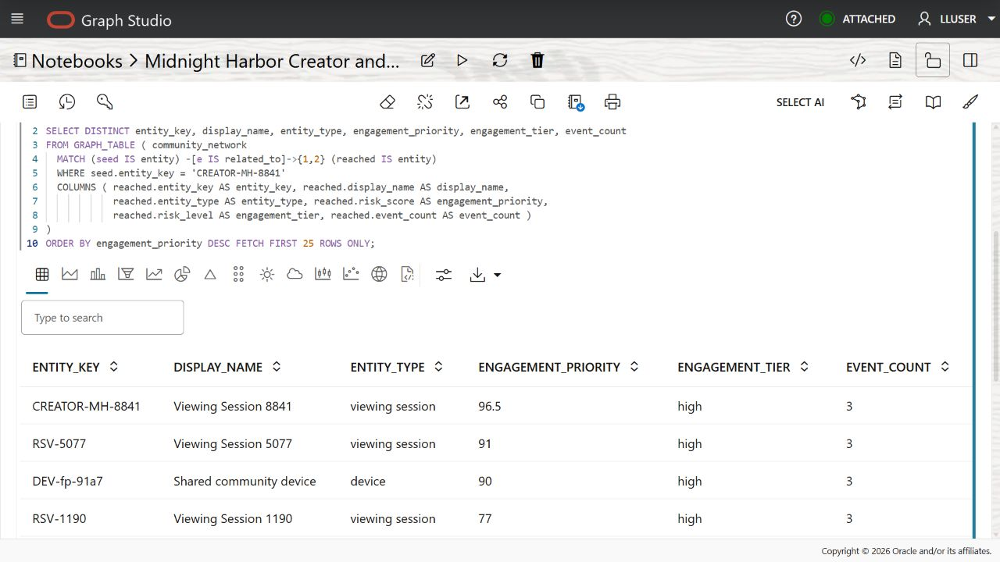

2. Review the high-priority entities.
    The query returns connected entities as an engagement-priority-sorted table, not as a visual network. That makes the graph result usable in the same SQL review workflow as the dashboard, vector search, and viewing-session labs.

    The expected rows show the evidence connected to suspicious community_profile `CREATOR-MH-8841`. 
    For example:
    * `DEV-fp-91a7` is a device 
    * `PAYEE-MULE-017` is a creator partner
    * `IP-198.51.100.44` is an IP address
    * `PHONE-212-0199` is a phone number
    
    These rows matter because they show what the suspicious community_profile touched or shared.

    The result gives analysts an engagement-priority-sorted list of connected entities. Instead of reviewing a tangle of connections, the analyst gets a table sorted by launch-weekend engagement priority. High-priority scores and sustained activity point to entities that may require moderation, creator outreach, or deeper review before looking at lower-priority connections.

## Task 4: Find community_profiles that share identifying information

Bob now moves from one focal creator to a broader community question: **which creator and audience pairs share a device, IP address, phone number, or community identifier?** This is the kind of relationship pattern that can be difficult to find with ordinary joins.

1. Run Bob's community_profile-pair query:

    ```sql
    <copy>
    SELECT community_profile_a, shared_entity, shared_type, community_profile_b,
           a_risk, b_risk,
           ROUND((a_risk + b_risk) / 2, 1) AS combined_risk,
           e1_type, e2_type
    FROM GRAPH_TABLE ( community_network
        MATCH (a IS entity)
              -[e1 IS related_to]-> (shared IS entity)
              <-[e2 IS related_to]- (b IS entity)
        WHERE a.entity_type IN ('creator_profile', 'viewer_session')
          AND b.entity_type IN ('creator_profile', 'viewer_session')
          AND a.entity_id < b.entity_id
          AND shared.entity_type IN ('device','ip_address','phone','email')
          AND (a.risk_score >= 70 OR b.risk_score >= 70)
        COLUMNS (
            a.entity_key AS community_profile_a,
            shared.entity_key AS shared_entity,
            shared.entity_type AS shared_type,
            b.entity_key AS community_profile_b,
            a.risk_score AS a_risk,
            b.risk_score AS b_risk,
            e1.relationship_type AS e1_type,
            e2.relationship_type AS e2_type
        )
    )
    ORDER BY combined_risk DESC, shared_entity
    FETCH FIRST 25 ROWS ONLY;
    </copy>
    ```

    The pattern starts at community entity `a`, follows an edge to shared audience or creator evidence, and follows another edge back to community entity `b`. The two entities can therefore be connected through the same device, IP address, watch-party signal, or community identifier. `a.entity_id < b.entity_id` keeps the result from returning the same pair twice in reverse order.

2. Review the business result.

    The result shows the two community entities, the evidence they share, the relationship type on each side, and the engagement-priority score for each entity. `COMBINED_RISK` is the existing query alias for the combined review priority; it helps the analyst review the strongest entity pairs first. A shared identifier does not prove coordinated community behavior, but it gives the Seer Media community team a clear reason to investigate the entities together.

    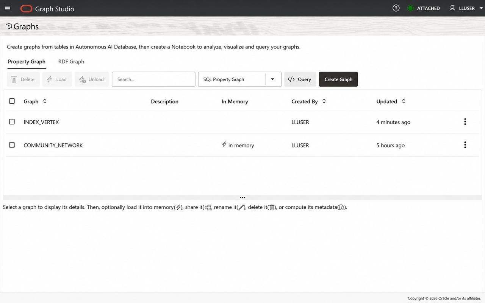

## Task 5: Visualize the relationship using Oracle Graph Studio

Now, Bob needs a visual way to explore the patterns. The SQL above showed which community entities and identifiers are connected; the same relationships can also be shown visually. With Oracle Graph Studio, Bob can turn those entities into an interactive network to spot creator clusters, shared devices, and audience-community links.

In the following tasks, you will use Graph Studio to turn the SQL evidence for `CREATOR-MH-8841` into an investigation map.

1. Start from the Database Actions Launchpad. Confirm that the upper-right corner shows `LLUSER`. If the dark-theme message appears, click **Done**.

    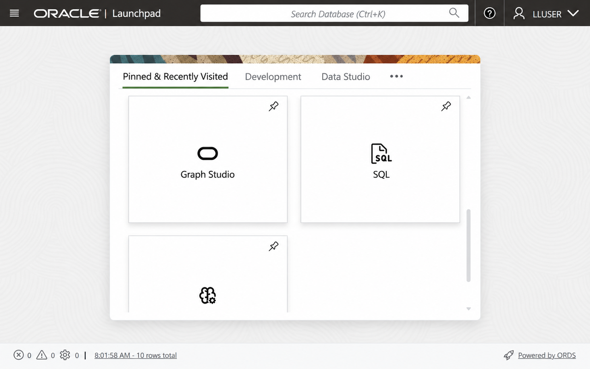

3. On the **Development** tab, select **Graph Studio** from the left-side tool list and click **Open**.

    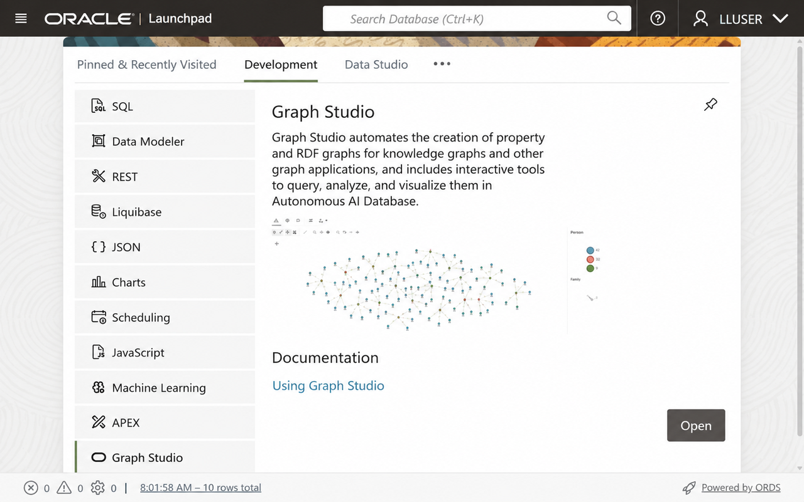

4. If prompted, sign in with the `LLUSER` and the workshop password supplied.

5. Confirm that the Graph Studio home page opens. The landing page provides **Graphs**, **Notebooks**, **Templates**, and **Jobs**.

    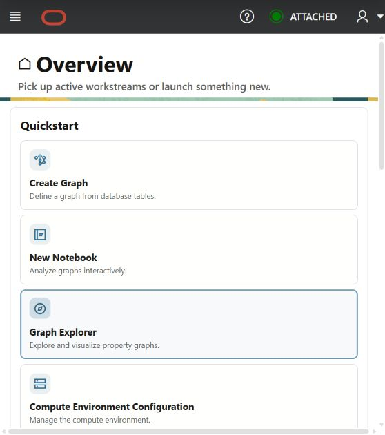

## Task 5: Download and import the media notebook

The supplied `.dsnb` file is a native Graph Studio notebook: a reusable, runnable investigation guide that combines SQL/PGQ paragraphs and graph visualizations.

1. Download [media-community-network-graph-studio.dsnb](files/media-community-network-graph-studio.dsnb).

    If the notebook opens in your browser instead of downloading, right-click the link and select **Save Link As**.

2. In Graph Studio, click **Notebooks** in the landing page.

    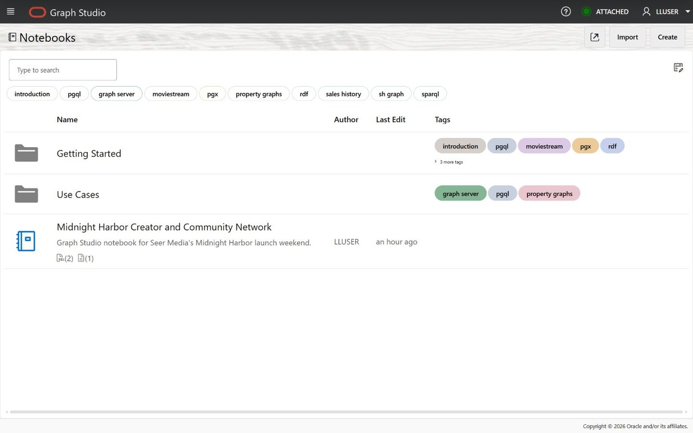

3. Select **Import** in the upper-right corner.

    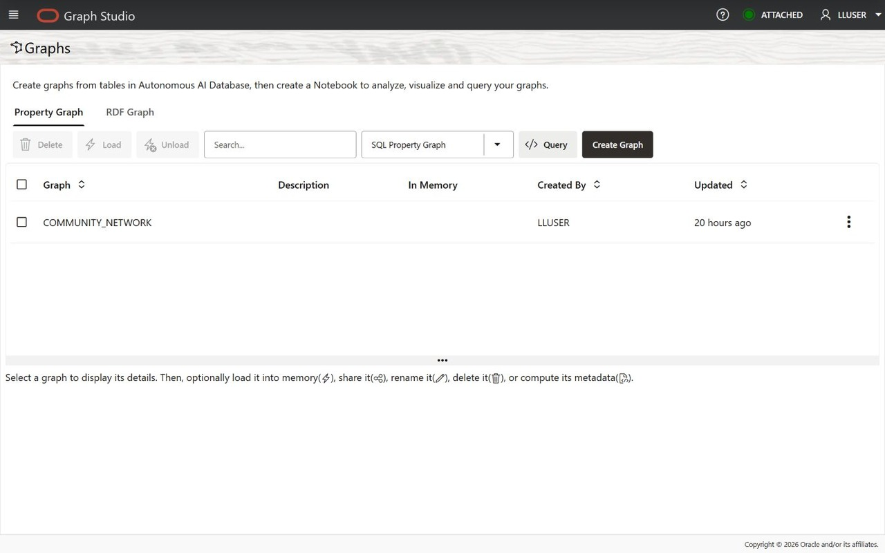

4. Once the import notebooks tab opens, drag & drop the `media-community-network-graph-studio.dsnb` file from your local computer into the import window, or browse to the file on your computer. Review the selected filename and click **Import**. Open **Midnight Harbor Creator and Community Network** after the import completes.

    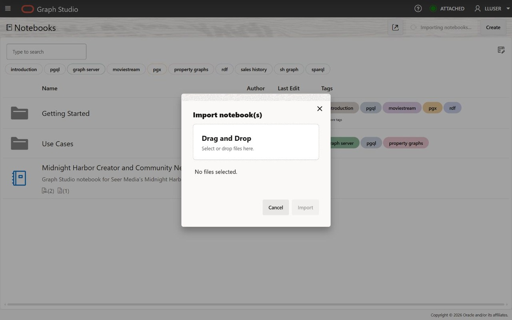


## Task 6: Run and interpret the Graph Studio notebook

You already ran the SQL/PGQ patterns in SQL Worksheet. Now run selected parts of that investigation in Graph Studio so you can compare the query results with the visual graph experience. The notebook shows the `CREATOR-MH-8841` path and the `DEV-fp-91a7` shared-device view.

The advantage of Graph Studio is investigative context: a table ranks the connected entities, while the visual graph reveals the paths and shared infrastructure that explain why they are connected.

1. Start at the top of the **Midnight Harbor Creator and Community Network** notebook. Read the explanation for the `CREATOR-MH-8841` traversal, then run the first SQL paragraph.

    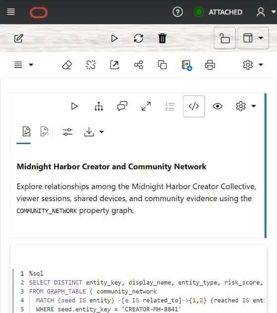

2. Review the results in table format in the graph studio notebook:

    This is the same investigation pattern you ran in SQL Worksheet as task 3 above: start from `CREATOR-MH-8841`, follow one or two relationship hops, and return the connected entities as a prioritized table.

    | Paragraph | Result | Investigation purpose |
    | --- | --- | --- |
    | `SELECT DISTINCT ... WHERE seed.entity_key = 'CREATOR-MH-8841'` | Table | Ranks entities reached within one or two hops of `CREATOR-MH-8841`. |
    | `Graph Visualization of previous query` | Markdown label | Introduces the visual version of the first traversal. |
    | `SELECT * ... WHERE src.entity_key = 'CREATOR-MH-8841'` | Graph visualization | Draws the one-hop and two-hop path from the focal Midnight Harbor creator entity. |
    | `Shared Entity Connections` | Markdown label and explanation | Introduces the device-centered relationship view. |
    | `SELECT * ... WHERE device.entity_key = 'DEV-fp-91a7'` | Graph visualization | Centers on `DEV-fp-91a7` and draws its directly connected creator and audience entities. |

3. Under **Graph Visualization of previous query**, run the SQL paragraph that starts with `SELECT *` and anchors on `CREATOR-MH-8841`. Review the graph visualization that appears below the paragraph. 
    Note how the creator/audience entities and devices in the previous query were turned into vertices and edges in Graph Studio to display an interactive network.

    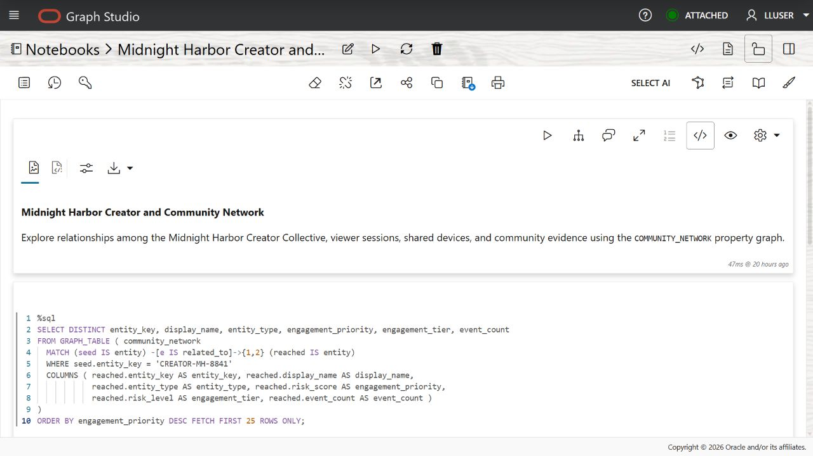

4. Under **Shared Entity Connections**, read the device-centered explanation, then run the final SQL paragraph that anchors on `DEV-fp-91a7`. Review the graph visualization that appears below the paragraph. This visualization narrows the investigation to the device DEV-fp-91a7 and shows every entity directly connected to it.

    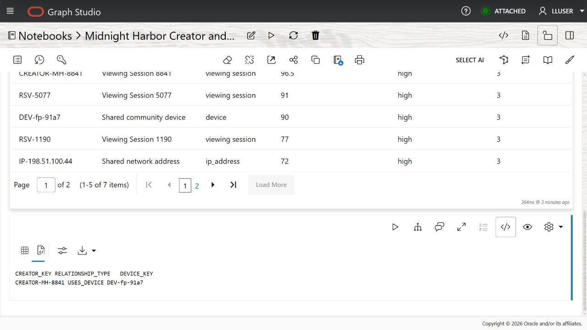
The red device, `DEV-fp-91a7`, at the center links multiple community vertices, including `CREATOR-MH-8841`, `RSV-5077`, and `RSV-1190`, revealing shared access during the Midnight Harbor launch weekend. This graph matters because it shows what the focal creator and connected audience sessions touched or shared.

> **Generated result note:** Graph layouts and node positions can vary between runs. Entity keys, relationship evidence, and query results remain the evidence to compare.

Congratulations, you have successfully navigated Graph Studio. In this workshop, you used SQL/PGQ for a precise, repeatable result set, such as a ranked list of entities or a filtered path count. You then used Graph Studio to explore a network visually, select a node, follow adjacent relationships, and understand a Midnight Harbor creator-community cluster. Finally, you turned the SQL evidence for `CREATOR-MH-8841` into an investigation map.

## Conclusion: Make Relationships Easy to Review

Bob's graph queries show why a property graph fits creator and community analysis. Bob can start with one focal creator or audience entity, follow its relationships, limit the search to a chosen number of hops, and find entity pairs that share engagement evidence. The queries stay readable as the network grows, while the results still include the priority and activity details needed for review.

The same relationships were shown visually in Graph Studio. The graphical interface turned vertices and edges into an interactive network. Bob compared the notebook results with the SQL Worksheet results ran earlier. The SQL showed the evidence trail while Graph Studio showed the same relationships as a visual investigation map. This helps a business user spot clusters, shared devices, and links between community_profiles.

## Appendix: Create the Property Graph

Bob creates a property graph by mapping relational tables to graph elements. `COMMUNITY_ENTITIES` becomes the vertex table, and each row receives the `entity` label. `COMMUNITY_RELATIONSHIPS` becomes the edge table, with foreign keys identifying the source and destination vertices. The graph queries in this lab use those two labels.

This statement is provided for reference. The `COMMUNITY_NETWORK` graph has already been created in the workshop database.

    ```sql
    <copy>
    CREATE PROPERTY GRAPH community_network
  VERTEX TABLES (
    community_entities KEY (entity_id)
      LABEL entity
      PROPERTIES (
        entity_id,
        entity_key,
        display_name,
        entity_type,
        risk_score,
        risk_level,
        channel,
        total_amount,
        event_count,
        is_confirmed_community_risk
      ),
    community_cases KEY (case_id)
      LABEL community_case
      PROPERTIES (
        case_id,
        case_ref,
        case_type,
        status,
        risk_score,
        loss_amount,
        event_count
      )
  )
  EDGE TABLES (
    community_relationships KEY (relationship_id)
      SOURCE KEY (from_entity)
        REFERENCES community_entities (entity_id)
      DESTINATION KEY (to_entity)
        REFERENCES community_entities (entity_id)
      LABEL related_to
      PROPERTIES (
        relationship_type,
        strength,
        event_count,
        total_amount
      ),
    community_case_entities KEY (case_entity_id)
      SOURCE KEY (case_id)
        REFERENCES community_cases (case_id)
      DESTINATION KEY (entity_id)
        REFERENCES community_entities (entity_id)
      LABEL contains_entity
      PROPERTIES (
        role,
        evidence_score
      )
      );
    </copy>
    ```

The statement defines the graph structure over the relational tables. It does not move the rows to a separate graph database. `COMMUNITY_NETWORK` can then be queried with `GRAPH_TABLE` while the relational tables remain the source of the data.


## Acknowledgements

* **Author** - Kevin Lazarz, Linda Foinding
* **Contributor** - Eugenio Galiano, Ramu Murakami Gutierrez
* **Last Updated By/Date** - Oracle Database Product Management, September 2026
