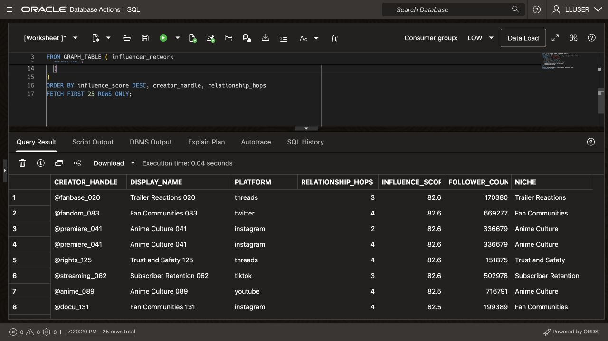
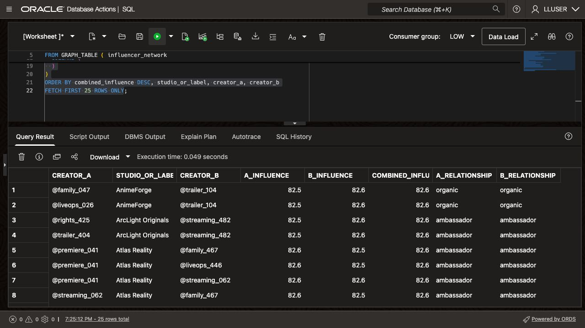
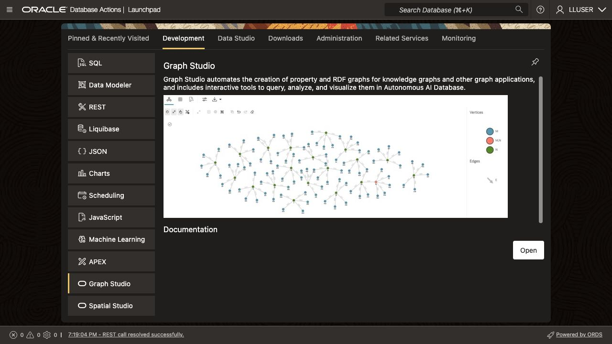
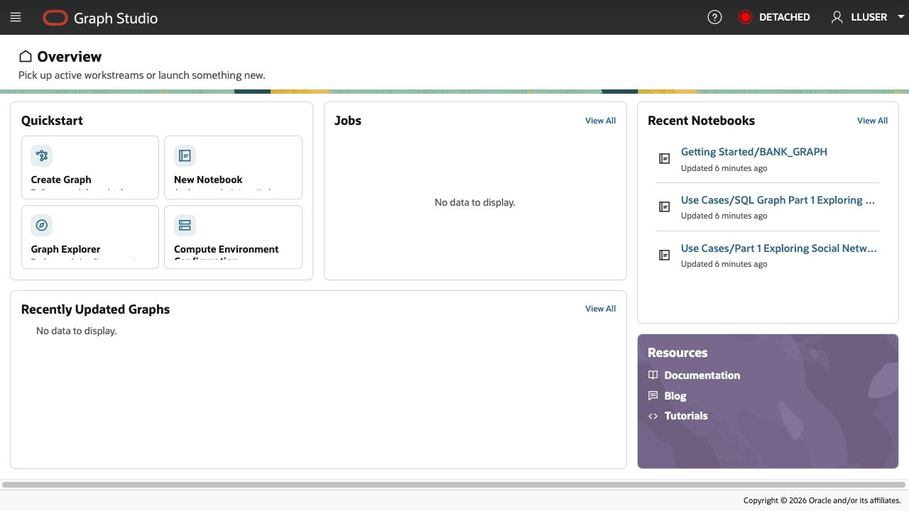
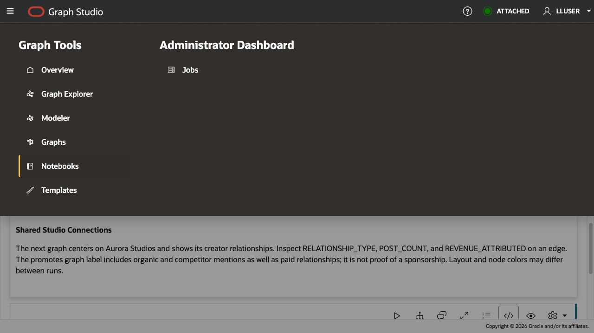
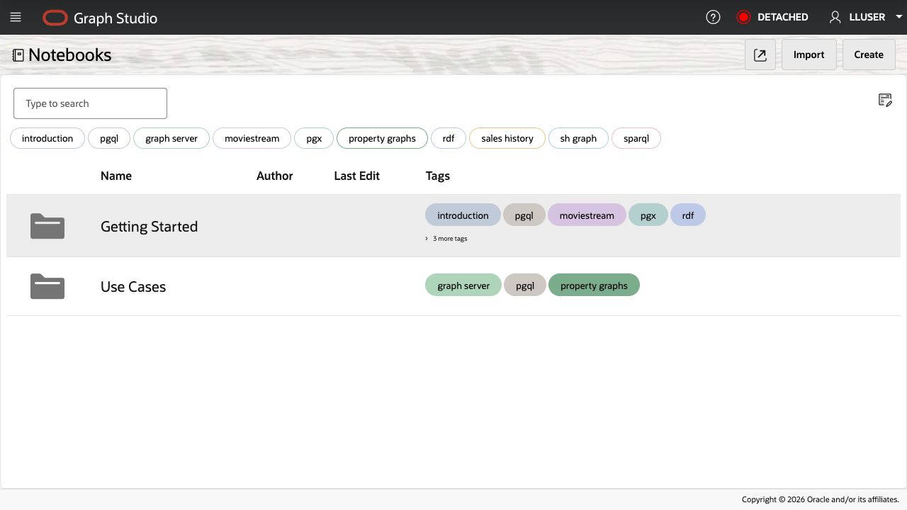
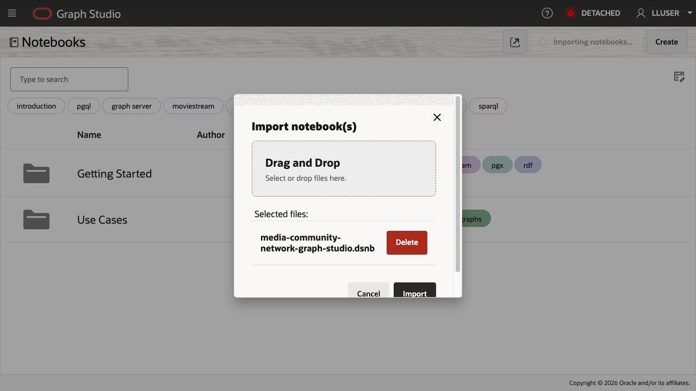
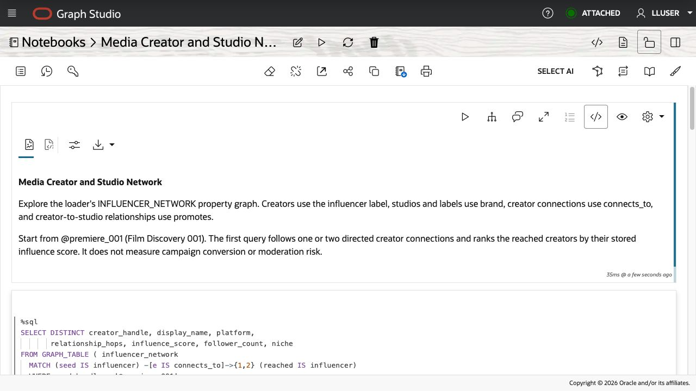
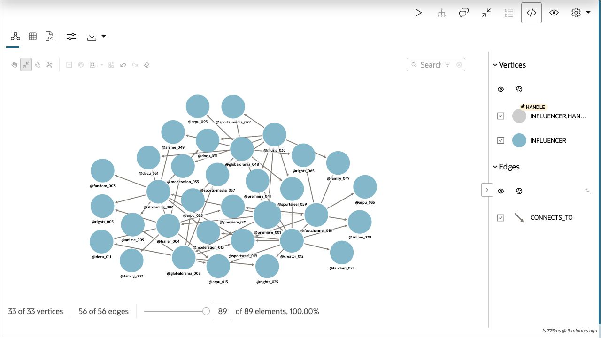
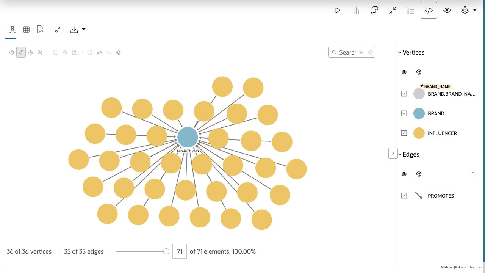

# Explore a Media Creator and Studio Network

## Introduction

Bob Green is a graph specialist at Seer Media. When community teams need to understand how creators connect and which studios or labels they promote, Bob recommends a property graph.

Bob starts with the creator connections and studio relationships loaded in Oracle AI Database. The focal creator is `@premiere_001`, whose display name is `Film Discovery 001`.

Start with relational joins, then use SQL/PGQ to follow creator connections. Open Graph Studio to explore the same paths visually.

Graph Studio displays database vertices, edges, and paths as an interactive network. Bob selects nodes and follows relationships to explain creator communities to the content team.


<details>
<summary><strong>Key terms: property graph, vertex, edge, and SQL Property Graph Queries (SQL/PGQ)</strong></summary>

> - A **property graph** represents things and their relationships. The loader's `INFLUENCER_NETWORK` contains creators, studios or labels, content assets, and audience-signal posts.
>
> - A **vertex** is a graph node. Creator vertices have the `influencer` label and properties such as `handle`, `platform`, `follower_count`, and `influence_score`. Studios and labels have the `brand` label.
>
> - An **edge** connects vertices. `connects_to` links creators and exposes `connection_type`, `strength`, and `interaction_count`. `promotes` links a creator to a studio or label and exposes `relationship_type`, `post_count`, and `revenue_attributed`.
>
> - A **hop** is one edge traversal. From `@premiere_001` to `@streaming_002` is one hop; continuing to `@fandom_003` is two hops. Hops describe relationships, not physical distance or viewing time.
>
> - **SQL Property Graph Queries (SQL/PGQ)** describe graph patterns in SQL. An analyst can follow creator relationships without copying the data into another database.

</details>

### Objectives

- Identify vertices and edges in the loader's property graph.
- Follow creator connections from `@premiere_001`.
- Find creator pairs that share a studio or label relationship.
- Open Graph Studio from Database Actions.
- Import and run the media creator-network notebook.
- Explain the results to a community or content-partnerships team.

Estimated Time: **10 minutes**

### Hands-on Scenario

| Step | Media & Entertainment focus |
| --- | --- |
| Business Problem | Community teams need to see creator relationships and shared studio partnerships. |
| Technical Challenge | Bob needs to follow paths without maintaining long chains of self-joins. |
| Persona Focus | You review Bob's graph design with a creator-community analyst. |
| What You Will See | SQL and Graph Studio show connected creators and shared studios or labels. |
| Database Capability | `INFLUENCER_NETWORK` and `GRAPH_TABLE` support SQL/PGQ traversal. |
| Outcome | A business user can identify creator communities and inspect the relationships behind them. |

The loader retains physical names such as `INFLUENCERS`, `BRANDS`, and `BRAND_INFLUENCER_LINKS`. In this media dataset, they represent creators, studios or labels, and their relationships.

> **SQL Worksheet reminder:** See [Getting Started Task 2: Open SQL Worksheet](?lab=getting-started#Task2:OpenSQLWorksheet) for setup and query instructions.

## Task 1: Follow a creator with SQL

Jessica's query lists the creators directly connected to `@premiere_001`. Following more relationship steps requires more joins.

A four-hop search extends beyond creators connected directly to the starting profile.

1. Run Jessica's ordinary SQL query:

    ```sql
    <copy>
    SELECT creator.handle AS creator_handle,
           connected.handle AS connected_handle,
           connected.platform,
           rel.connection_type,
           connected.influence_score
    FROM influencers creator
    JOIN influencer_connections rel
      ON rel.from_influencer = creator.influencer_id
    JOIN influencers connected
      ON connected.influencer_id = rel.to_influencer
    WHERE creator.handle = '@premiere_001'
    ORDER BY connected.influence_score DESC, connected.handle;
    </copy>
    ```

    The query joins `INFLUENCERS` twice: once for the starting creator and once for the connected creator. `INFLUENCER_CONNECTIONS` supplies the directed edge between them.

    **Expected output: Direct Creator Connections**

    The result contains seven outgoing `follows` connections from `@premiere_001`, including `@streaming_002`. `INFLUENCE_SCORE` is the stored creator score.

2. Extend Jessica's query to follow one through four hops without a graph query:

    ```sql
    <copy>
    SELECT creator_handle, connected_handle, platform,
           relationship_path, influence_score
    FROM (
      SELECT seed.handle AS creator_handle,
             reached.handle AS connected_handle,
             reached.platform AS platform,
             r1.connection_type AS relationship_path,
             reached.influence_score AS influence_score
      FROM influencers seed
      JOIN influencer_connections r1
        ON r1.from_influencer = seed.influencer_id
      JOIN influencers reached
        ON reached.influencer_id = r1.to_influencer
      WHERE seed.handle = '@premiere_001'

      UNION

      SELECT seed.handle,
             reached.handle,
             reached.platform,
             r1.connection_type || ' -> ' || r2.connection_type,
             reached.influence_score
      FROM influencers seed
      JOIN influencer_connections r1
        ON r1.from_influencer = seed.influencer_id
      JOIN influencers v1
        ON v1.influencer_id = r1.to_influencer
      JOIN influencer_connections r2
        ON r2.from_influencer = v1.influencer_id
      JOIN influencers reached
        ON reached.influencer_id = r2.to_influencer
      WHERE seed.handle = '@premiere_001'

      UNION

      SELECT seed.handle,
             reached.handle,
             reached.platform,
             r1.connection_type || ' -> ' ||
               r2.connection_type || ' -> ' ||
               r3.connection_type,
             reached.influence_score
      FROM influencers seed
      JOIN influencer_connections r1
        ON r1.from_influencer = seed.influencer_id
      JOIN influencers v1
        ON v1.influencer_id = r1.to_influencer
      JOIN influencer_connections r2
        ON r2.from_influencer = v1.influencer_id
      JOIN influencers v2
        ON v2.influencer_id = r2.to_influencer
      JOIN influencer_connections r3
        ON r3.from_influencer = v2.influencer_id
      JOIN influencers reached
        ON reached.influencer_id = r3.to_influencer
      WHERE seed.handle = '@premiere_001'

      UNION

      SELECT seed.handle,
             reached.handle,
             reached.platform,
             r1.connection_type || ' -> ' ||
               r2.connection_type || ' -> ' ||
               r3.connection_type || ' -> ' ||
               r4.connection_type,
             reached.influence_score
      FROM influencers seed
      JOIN influencer_connections r1
        ON r1.from_influencer = seed.influencer_id
      JOIN influencers v1
        ON v1.influencer_id = r1.to_influencer
      JOIN influencer_connections r2
        ON r2.from_influencer = v1.influencer_id
      JOIN influencers v2
        ON v2.influencer_id = r2.to_influencer
      JOIN influencer_connections r3
        ON r3.from_influencer = v2.influencer_id
      JOIN influencers v3
        ON v3.influencer_id = r3.to_influencer
      JOIN influencer_connections r4
        ON r4.from_influencer = v3.influencer_id
      JOIN influencers reached
        ON reached.influencer_id = r4.to_influencer
      WHERE seed.handle = '@premiere_001'
    ) paths
    ORDER BY influence_score DESC;
    </copy>
    ```

    Jessica now needs four query branches. They follow one, two, three, and four relationship steps. Each additional hop adds another connection join and another creator join. `UNION` combines the path lengths and removes duplicate result rows.

3. Review how the SQL grows more complex.

    Four hops require four relationship joins and five instances of the creator table. Supporting several path lengths also adds unions and duplicate handling. The relationships already exist in relational tables; Bob's graph query expresses the path directly.

## Task 2: Read the same connections as a graph

The loader created `INFLUENCER_NETWORK` over the existing relational tables. The appendix shows how it maps rows to vertices and edges.

Creator rows become `influencer` vertices, and rows in `INFLUENCER_CONNECTIONS` become `connects_to` edges. `GRAPH_TABLE` returns the graph result as ordinary SQL columns.

1. Run Bob's SQL/PGQ query:

    ```sql
    <copy>
    SELECT creator_handle, connected_handle, platform,
           connection_type, influence_score
    FROM GRAPH_TABLE ( influencer_network
      MATCH (creator IS influencer) -[edge IS connects_to]-> (connected IS influencer)
      WHERE creator.handle = '@premiere_001'
      COLUMNS (
        creator.handle AS creator_handle,
        connected.handle AS connected_handle,
        connected.platform AS platform,
        edge.connection_type AS connection_type,
        connected.influence_score AS influence_score
      )
    )
    ORDER BY influence_score DESC, connected_handle;
    </copy>
    ```

    In `MATCH`, `creator` and `connected` are vertices, and `edge` is the connection between them. `IS influencer` and `IS connects_to` refer to labels defined in the graph. This one-hop result has the same columns and rows as Jessica's first query.

## Task 3: Trace four-hop creator-community reach

Start from `@premiere_001` and trace creators within four directed relationship hops.

1. Run the SQL/PGQ traversal.

    `(seed IS influencer)` identifies the starting creator. `-[e IS connects_to]->{1,4}` follows one through four connections. `COUNT(e.connection_type)` counts the edges in each matched path. The `WHERE` clause anchors the search, and `COLUMNS` returns the graph properties in a SQL table.

    ```sql
    <copy>
    SELECT DISTINCT creator_handle, display_name, platform,
           relationship_hops, influence_score, follower_count, niche
    FROM GRAPH_TABLE ( influencer_network
      MATCH (seed IS influencer) -[e IS connects_to]->{1,4} (reached IS influencer)
      WHERE seed.handle = '@premiere_001'
      COLUMNS (
        reached.handle AS creator_handle,
        reached.display_name AS display_name,
        reached.platform AS platform,
        COUNT(e.connection_type) AS relationship_hops,
        reached.influence_score AS influence_score,
        reached.follower_count AS follower_count,
        reached.niche AS niche
      )
    )
    ORDER BY influence_score DESC, creator_handle, relationship_hops
    FETCH FIRST 25 ROWS ONLY;
    </copy>
    ```

    `RELATIONSHIP_HOPS` describes the matched path. A creator can appear at more than one hop count when several paths reach them. The value is not necessarily the shortest path from the seed.

    **Expected output: Connected Media Creators**

    

2. Review the connected creators.

    The query returns a table ordered by the stored influence score. Each row includes a creator handle, platform, follower count, niche, and path length. The seeded chain includes `@premiere_001` to `@streaming_002`, then `@fandom_003`, `@trailer_004`, and `@rights_005`. Other seeded connections create additional paths.

    Use this result to explore creator reach and possible collaborations. A connection alone does not prove campaign reach or demand.

## Task 4: Find creators that share a studio or label

Bob now asks a broader community question: **which creator pairs have relationships with the same studio or label?** The graph expresses this as two creator vertices pointing to one shared `brand` vertex.

1. Run Bob's creator-pair query:

    ```sql
    <copy>
    SELECT creator_a, studio_or_label, creator_b,
           a_influence, b_influence,
           ROUND((a_influence + b_influence) / 2, 1) AS combined_influence,
           a_relationship, b_relationship
    FROM GRAPH_TABLE ( influencer_network
      MATCH (a IS influencer)
            -[e1 IS promotes]-> (studio IS brand)
            <-[e2 IS promotes]- (b IS influencer)
      WHERE a.influencer_id < b.influencer_id
        AND (a.influence_score >= 80 OR b.influence_score >= 80)
      COLUMNS (
        a.handle AS creator_a,
        studio.brand_name AS studio_or_label,
        b.handle AS creator_b,
        a.influence_score AS a_influence,
        b.influence_score AS b_influence,
        e1.relationship_type AS a_relationship,
        e2.relationship_type AS b_relationship
      )
    )
    ORDER BY combined_influence DESC, studio_or_label, creator_a, creator_b
    FETCH FIRST 25 ROWS ONLY;
    </copy>
    ```

    `a.influencer_id < b.influencer_id` prevents duplicate pairs in reverse order. The `promotes` label includes organic and competitor mentions. Check the relationship columns before interpreting a row as a paid partnership.

2. Review the business result.

    Each row identifies the two creators, their shared studio or label, their stored influence scores, and the relationship on each side. `COMBINED_INFLUENCE` averages the two scores for ranking. Sharing a studio does not prove that the creators collaborated with one another.

    

## Task 5: Visualize the relationship using Oracle Graph Studio

Use Graph Studio to explore creator communities and shared studios as an interactive network, starting from `@premiere_001`.

1. Start from the Database Actions Launchpad. Confirm that the upper-right corner shows `LLUSER`. If the dark-theme message appears, click **Done**.

    

2. On the **Development** tab, select **Graph Studio** from the left-side tool list and click **Open**.

    

3. If prompted, sign in as `LLUSER` with the supplied workshop password.

4. Confirm that the Graph Studio home page opens. The **Overview** page shows Quickstart cards, jobs, recent notebooks, and graphs. Open the navigation menu to reach **Notebooks**.

    

## Task 6: Download and import the media notebook

The supplied `.dsnb` notebook combines SQL/PGQ paragraphs and graph visualizations.

1. Download [media-community-network-graph-studio.dsnb](files/media-community-network-graph-studio.dsnb).

    If the notebook opens in your browser instead of downloading, right-click the link and select **Save Link As**.

2. In Graph Studio, open the navigation menu and select **Notebooks**.

    

3. Select **Import** in the upper-right corner.

    

4. Drag `media-community-network-graph-studio.dsnb` into the import dialog, or browse to the file. Check the filename and click **Import**. Then open **Media Creator and Studio Network**.

    


## Task 7: Run and interpret the Graph Studio notebook

You already ran the SQL/PGQ patterns in SQL Worksheet. Now compare a table with visual paths in **Media Creator and Studio Network**. The notebook uses `@premiere_001` for creator traversal and `Aurora Studios` for the studio-centered view.

1. Start at the top of the notebook. Read the traversal explanation, then run the first SQL paragraph.

    

2. Review the results in table format.

    This is a shorter version of Task 3: start from `@premiere_001`, follow one or two relationship hops, and return connected creators ordered by influence score.

    | Paragraph | Result | Analysis purpose |
    | --- | --- | --- |
    | `SELECT DISTINCT ... WHERE seed.handle = '@premiere_001'` | Table | Lists creators reached within one or two hops. |
    | `Graph Visualization of Creator Reach` | Markdown explanation | Introduces the visual traversal. |
    | `SELECT * ... WHERE src.handle = '@premiere_001'` | Graph visualization | Draws the one-hop and two-hop creator paths. |
    | `Shared Studio Connections` | Markdown explanation | Introduces the studio-centered view. |
    | `SELECT * ... WHERE studio.brand_name = 'Aurora Studios'` | Graph visualization | Shows creator relationships with Aurora Studios. |

3. Under **Graph Visualization of Creator Reach**, run the SQL paragraph anchored on `@premiere_001`.

    The query uses `ONE ROW PER STEP` and returns `VERTEX_ID` and `EDGE_ID` values. Graph Studio uses those identifiers to render the vertices and edges, including intermediate creators. If the table tab opens first, select the graph visualization tab.

    To show creator handles, open the graph **Settings**, then **General → Vertex Captions**, and select **INFLUENCER / HANDLE**. Optionally turn off **Show caption on hover** to keep captions visible and set the caption length to `20`. Use the paragraph **Expand** control for a larger view. The captured seeded result contains **33 vertices and 56 edges**.

    

4. Under **Shared Studio Connections**, run the final SQL paragraph anchored on `Aurora Studios`.

    In **Settings → General → Vertex Captions**, select **BRAND / BRAND_NAME** to label the studio. The captured result contains **36 vertices and 35 edges**: Aurora Studios and its 35 creator relationships.

    

    Select a `promotes` edge and inspect `RELATIONSHIP_TYPE`, `POST_COUNT`, and `REVENUE_ATTRIBUTED`. These properties describe each creator's recorded relationship with the studio.

    > **Generated result note:** Graph layouts and node positions can vary between runs. Compare handles, studio names, edge labels, and relationship properties. The supplied notebook contains runnable paragraphs without cached query results.

You used SQL/PGQ to rank creators and find shared studios, then explored those relationships visually.

## Conclusion: Make Relationships Easy to Review

Bob's queries follow directed creator relationships and find pairs linked to a shared studio or label. SQL/PGQ expresses these paths without adding a join for each hop.

Use the table to rank and compare creators. Use Graph Studio to inspect intermediate paths and shared studio relationships.

## Appendix: Create the Property Graph

The loader maps `INFLUENCERS`, `BRANDS`, `PRODUCTS`, and `SOCIAL_POSTS` to vertices. Three edge tables define creator connections, creator-to-studio relationships, and post-to-content mentions. The exact labels and properties below are the ones available to this lab.

This statement is for reference. The loader already created `INFLUENCER_NETWORK`; do not run it again against the prepared schema.

    ```sql
    CREATE PROPERTY GRAPH influencer_network
        VERTEX TABLES (
            influencers KEY (influencer_id) LABEL influencer PROPERTIES (influencer_id, handle, display_name, platform, follower_count, engagement_rate, influence_score, niche, city, region, is_verified),
            brands KEY (brand_id) LABEL brand PROPERTIES (brand_id, brand_name, brand_category, social_tier),
            products KEY (product_id) LABEL product PROPERTIES (product_id, product_name, category, unit_price),
            social_posts KEY (post_id) LABEL social_post PROPERTIES (post_id, platform, posted_at, virality_score, momentum_flag)
        )
        EDGE TABLES (
            influencer_connections KEY (connection_id) SOURCE KEY (from_influencer) REFERENCES influencers (influencer_id) DESTINATION KEY (to_influencer) REFERENCES influencers (influencer_id) LABEL connects_to PROPERTIES (connection_type, strength, interaction_count),
            brand_influencer_links KEY (link_id) SOURCE KEY (influencer_id) REFERENCES influencers (influencer_id) DESTINATION KEY (brand_id) REFERENCES brands (brand_id) LABEL promotes PROPERTIES (relationship_type, post_count, avg_engagement, revenue_attributed),
            post_product_mentions KEY (mention_id) SOURCE KEY (post_id) REFERENCES social_posts (post_id) DESTINATION KEY (product_id) REFERENCES products (product_id) LABEL mentions_product PROPERTIES (confidence_score, mention_type)
        );
    ```

The statement defines a property graph over the relational tables. `GRAPH_TABLE` queries this graph while the relational rows remain the source of the data.

## Acknowledgements

* **Author** - Kevin Lazarz, Linda Foinding
* **Contributor** - Eugenio Galiano, Ramu Murakami Gutierrez
* **Last Updated By/Date** - Oracle Database Product Management, September 2026
