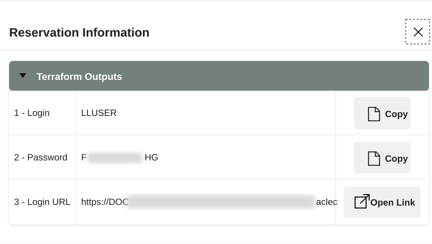
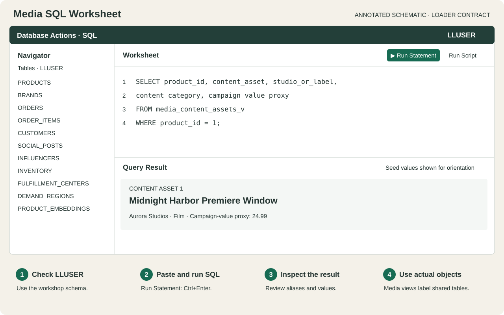
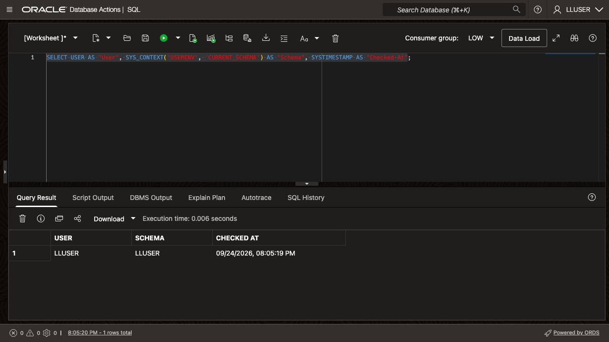

# Getting Started

## Introduction

Open your LiveLabs reservation and its **Autonomous Database 26ai** instance. Then prepare SQL Worksheet to run the Media exercises as the workshop user.

<details>
<summary><strong>Key terms: Database Actions, SQL Worksheet, and LLUSER</strong></summary>

> - **Database Actions** is the browser-based Oracle Database workspace you use in this workshop. Use it to run SQL, browse objects, load data, and develop applications without a desktop database client.
>
> - **SQL Worksheet** is the tool inside Database Actions where you paste and run SQL statements. Its query results, script output, and errors help you check each exercise against database evidence.
>
> - `LLUSER` is the workshop database user and schema owner for the hands-on media objects. The loader creates the workshop tables, views, models, graph, and functions in this schema.

</details>

Estimated Time: **5 minutes**

### Objectives

In this lab, you will:

- Launch the LiveLabs workshop environment.
- Use the reservation login information to open Database Actions.
- Confirm that SQL Worksheet is ready for the media schema.
- Confirm that SQL Worksheet is connected as the workshop schema user.

## Task 1: Launch the LiveLabs environment

Start from your LiveLabs reservation. It provides the database link and sign-in details for the workshop environment.

1. Sign in to [LiveLabs](https://livelabs.oracle.com) with your Oracle account.

2. Open this workshop, select **Start**, and select **Run on LiveLabs Sandbox**.

3. In **My Reservations**, select **Launch Workshop** for this reservation.

4. Select **View Login Info** and keep the database credentials available for the next task.

    

    *Figure 1: The Reservation Information dialog shows the `LLUSER` login, password, and Login URL for Database Actions.*

## Task 2: Open SQL Worksheet

Open SQL Worksheet as the workshop user before running the media queries. SQL Worksheet displays each query's result as a table.

1. In the **Reservation Information** dialog, confirm that **1 - Login** shows `LLUSER`.

2. Select **Copy** for **2 - Password**.

    

    *Figure 2: Copy the `LLUSER` password from the Reservation Information dialog.*

3. Select **Open Link** for **3 - Login URL**.

    

    *Figure 3: Use Open Link for the Login URL, then use the copied password to sign in as `LLUSER`.*

4. On the Database Actions sign-in page, confirm that **Username** shows `LLUSER`, paste the password from the reservation information, and select **Sign in**.

    

    *Figure 4: Sign in to Database Actions as `LLUSER` with the password from the reservation information.*

5. Before SQL Worksheet opens, select **Development**, then select **SQL** from the tools menu.

    

    *Figure 5: Open SQL from the Development tools menu.*

6. Use the same SQL Worksheet pattern throughout the workshop.

    

    *Figure 6: Annotated schematic with loader object names. Use SQL Worksheet to confirm the active user, paste each workshop SQL block, run the statement, and review the result table.*

    - Confirm the user dropdown shows the main workshop user, usually `LLUSER`.
    - Paste each workshop SQL block into the editor.
    - Select **Run Statement** or press **Ctrl+Enter** to run the current SQL statement.
    - Review the output in **Query Result** or **Script Output**, depending on the step.
    - Use **Navigator** only when you want to inspect tables, views, or other objects.

7. Run this check.

    Check the active user before you start. `USER` shows who signed in, while `SYS_CONTEXT('USERENV', 'CURRENT_SCHEMA')` shows where table names resolve. Both values should show `LLUSER`.

    ```sql
    <copy>
    SELECT USER AS "User",
           SYS_CONTEXT('USERENV', 'CURRENT_SCHEMA') AS "Schema",
           SYSTIMESTAMP AS "Checked At";
    </copy>
    ```

    

    **Expected output: Connected SQL Worksheet Session**

    | User | Schema | Checked At |
    | --- | --- | --- |
    | LLUSER | LLUSER | Current SQL Worksheet timestamp |


8. Repeat this check whenever you need to confirm the active user.

## Task 3: Verify the Media loader is ready

1. Confirm that your facilitator has prepared this reservation with the Media handoff loader. The script creates the shared LiveStack tables and the five Media semantic views used throughout this workshop. Physical names such as `PRODUCTS`, `ORDERS`, and `INFLUENCERS` are intentional; the lab results use content-asset, campaign-order, and creator labels.

2. Run the following query before any lab inserts new rows.

    ```sql
    <copy>
    SELECT 'Content assets' AS media_entity, COUNT(*) AS row_count FROM media_content_assets_v
    UNION ALL SELECT 'Campaign orders', COUNT(*) FROM media_campaign_orders_v
    UNION ALL SELECT 'Audience signals', COUNT(*) FROM media_audience_signals_v
    UNION ALL SELECT 'Audience accounts', COUNT(*) FROM customers
    UNION ALL SELECT 'Studios and labels', COUNT(*) FROM brands
    UNION ALL SELECT 'Distribution hubs', COUNT(*) FROM fulfillment_centers
    UNION ALL SELECT 'Creators', COUNT(*) FROM influencers;
    </copy>
    ```

    **Expected initial counts:** 187 content assets, 3,000 campaign orders, 5,000 audience signals, 2,000 audience accounts, 50 studios and labels, 30 distribution hubs, and 483 creators. Lab 2 adds a campaign order, so its count can increase after that exercise.

3. Download [media-readiness-check.sql](files/media-readiness-check.sql), paste it into SQL Worksheet, and select **Run Script**. Review the required objects, prepared model, vector rows, and Media anchor record. A missing object or an invalid status means the environment needs facilitator attention before the corresponding lab.

4. Labs 7 and 8 require an enabled Select AI profile with provider access. Confirm access to `DBMS_CLOUD_AI` and `DBMS_CLOUD_AI_AGENT` with your facilitator. The data loader does not configure those services. The preparation guide includes OCI resource principal setup for `SEER_MEDIA_PROFILE` and the five Media views. Lab 7 checks the profile and granted credential access before testing the provider.

The facilitator can use the [Media platform preparation guide](../media-platform-preparation.md). Participants should not rerun the handoff loader: it resets the workshop schema and its data.

You can now continue to the media labs.

## Acknowledgements

* **Author** - Pat Shepherd, Senior Principal Database Product Manager
* **Contributor** - Linda Foinding, Principal Database Product Manager
* **Last Updated By/Date** - Oracle Database Product Management, September 2026
