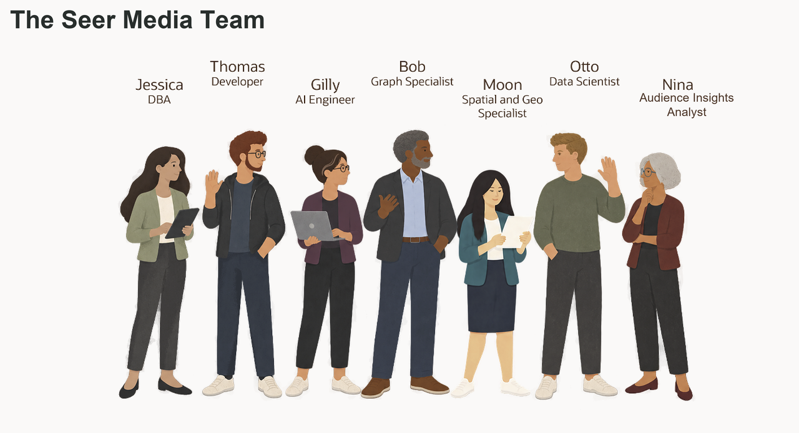

# Build Connected Media & Entertainment Solutions with Oracle AI Database

<!-- markdownlint-configure-file
{
  "MD013": {
    "code_blocks": false,
    "tables": false
  },
  "MD033": {
    "allowed_elements": [
      "details",
      "summary",
      "strong"
    ]
  }
}
-->

## Introduction

Jessica Chan is the database administrator at Seer Media. Her teams are building
new campaign applications, improving creator and community analysis, planning
launch-weekend capacity, and adding AI to media dashboards.

Each team needs a different way to use the media data already stored in Oracle
AI Database:

* Thomas needs campaign orders as JSON for a web and mobile application.
* Gilly needs semantic search that can find content assets by meaning, not only
  by matching words.
* Bob needs to follow creator connections and studio partnerships to understand
  community reach.
* Moon needs to calculate distances between audience accounts, distribution
  hubs, and demand regions.
* Otto needs to train and score a content-demand surge model.
* Nina needs to ask media questions in plain language and turn the answers into
  a useful review.

Jessica's job is to help each team meet its requirement without creating a new
data copy or a separate security model for every feature. She uses Oracle AI
Database as the shared foundation: relational tables remain the source for media
records, while JSON, vectors, graphs, spatial data, machine learning, and AI
services work with those same records.

This workshop follows Jessica and her colleagues as they solve these problems.
Each lab focuses on one business requirement, but the database remains the
common thread. You will see how the teams use different data types and database
capabilities together, and how Jessica keeps access, SQL, and results visible.

### What the team builds

| Team member | Requirement | What you will see |
| ------------------------------- | ----------------------------------------------------------------- | -------------------------------------------------------------------------------------------------------------------------------------------- |
| Jessica, DBA | Build the Midnight Harbor launch command-center query. | One SQL result combines relational launch data, semantic content matching, JSON campaign-order data, and location data. |
| Thomas, application developer | Give the application flexible campaign-order documents. | JSON columns, JSON collections, and JSON Relational Duality Views provide different ways to serve application data. |
| Gilly, AI engineer | Find content assets related to an audience-intent question. | You check the prepared ONNX embedding model and inspect vectors generated from the content catalog. |
| Bob, graph specialist | Find connected creators and their studio partners. | A property graph uses the existing relational data to show paths that become difficult to manage with repeated SQL joins. |
| Moon, spatial expert | Route work using distribution-hub and demand-region locations. | The database calculates distance from geographic data that the application can also display. |
| Otto, data scientist | Identify content assets that may face a demand surge. | Oracle Machine Learning trains a lab model with the loader data and scores a simulated activity snapshot. |
| Nina, audience insights analyst | Ask media questions without writing every query from scratch. | Select AI generates SQL that Nina can inspect, run, and refine. Select AI Agent adds a configured SQL tool and records its activity. |

Jessica can support changing requirements without moving the media records into
a separate database for each feature. The same records can support:

* An application payload.
* A vector search.
* A graph investigation.
* A spatial calculation.
* A model score.
* A natural-language question.

<strong>Learn more: What does "converged database" mean?</strong>

> A converged database supports different data types and workloads on one
> database foundation. In this workshop, that includes relational rows, JSON
> documents, vectors, graphs, geographic data, machine learning models, and
> AI-assisted SQL.
>
> Teams can use the data in the form their applications or analysis need, while
> retaining the same records, privileges, and SQL access. They can query JSON
> documents, vectors, graph relationships, locations, and model scores in Oracle
> AI Database.

### Objectives

* Follow Jessica and her team as they solve different media application and
  analysis requirements.
* Use relational SQL, JSON, vectors, graphs, spatial data, Oracle Machine
  Learning, Select AI, and Select AI Agent in practical tasks.
* See how one Oracle AI Database can support different data types without
  separate copies of the media records.
* Understand how database privileges, restricted AI profiles, approved tools,
  and execution history keep AI-assisted work visible and controlled.
* Connect the database work to the Seer Media launch-operations scenario.

Estimated Workshop Time: **90 minutes**

## Acknowledgements

* **Author** - Kevin Lazarz
* **Contributor** - Eugenio Galiano, Pat Shepherd, Linda Foinding
* **Last Updated By/Date** - Vahn Kessler, September 2026
