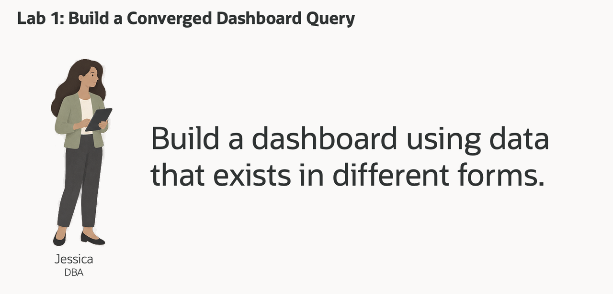
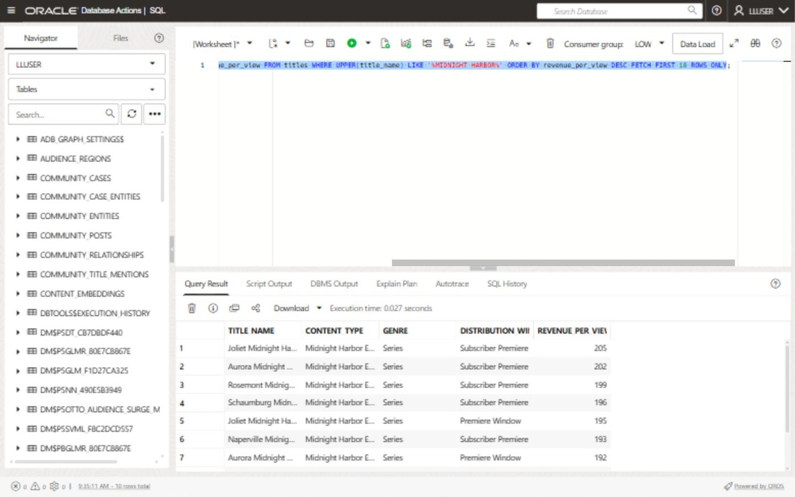
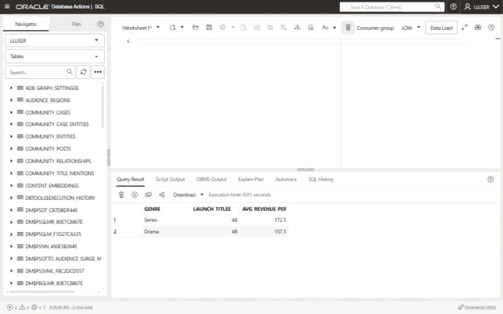

# Build a Midnight Harbor Launch Command Center

## Introduction

Jessica Chan is the database administrator responsible for keeping Seer Media's media data reliable and useful. Every morning, the launch operations team asks her a familiar question: **which title needs attention first, and can Seer Media respond if a launch signal becomes operational work?**

Jessica can see the answer taking shape in the Launch Operations Dashboard, but the supporting data is spread across different forms. Launch signals and title exposure are relational rows. Viewing-session activity is available as JSON viewing-session documents. The AI engineering team has also prepared vector representations of title descriptions for another use case. Location information for live-event operations hubs and audience regions is stored as GeoJSON. The data is connected by business meaning, but that does not automatically make the investigation easy to query.

In the past, Jessica might have had to maintain reporting extracts, coordinate a search index, ask an application team for viewing-session data, and reconcile a separate map or service-capacity system. That creates more copies of sensitive media data, more security boundaries, and more opportunities for the dashboard answer and the operational detail to disagree. Her challenge is not simply finding another database feature. It is giving the launch team one answer they can trace back to the same governed data.

Jessica sees an opportunity in Oracle AI Database's converged architecture. A converged database lets one governed database support different data models and workloads together. Relational tables and views remain the foundation, while JSON documents, vectors, spatial geometry, graphs, machine-learning, and graph results can be queried alongside them. This means Jessica can answer a question that crosses those data types without complex and expensive integration across separate systems.

In this lab, you take Jessica's role as the DBA. You will write the converged SQL query behind the Midnight Harbor Launch Command Center. It combines relational launch signals, vector search, JSON viewing-session data, and spatial venue data in one Oracle AI Database, without separate systems or data copies.



### Objectives

- Explain what Oracle AI Database convergence means in a media decision workflow.
- Run one query that combines relational, vector, JSON, and spatial database capabilities.
- Modify the query to investigate a different launch-performance question and explain the change in results.

Estimated Time: **10 minutes**

### Hands-on Scenario

| Step                | Media & Entertainment focus                                                                                                  |
| ---------------------| ----------------------------------------------------------------------------------------------------------------|
| Business Problem    | Business users need a quick way to find launch-weekend performance priorities, exposure, viewing-session activity, and service information. |
| Technical Challenge | The answer crosses launch signals, title meaning, viewing sessions, and service geography.                         |
| Persona Focus       | Jessica Chan, the DBA, builds the query that gives business users this dashboard view.                         |
| What You Will Do    | Use a single SQL statement that combines several data types.                                                   |
| Database Capability | Relational SQL, AI Vector Search, JSON Relational Duality, and Oracle Spatial work together.                   |
| Outcome             | The learner can explain convergence through a useful business result rather than a feature list.               |

Persona focus: You are Jessica Chan, the DBA. Your job is to build one governed query that gives business users a connected view of launch-weekend performance priorities and operations.

> **SQL Worksheet reminder:** Need a reminder on how to open and use the SQL Worksheet? Return to [Getting Started Task 2: Open SQL Worksheet](?lab=getting-started#Task2:OpenSQLWorksheet) for the step-by-step guide showing how to run SQL statements.

## Task 1: Run a converged launch investigation

The dashboard is a starting point for the decision, not the decision itself. Run the query below to produce a compact investigation view for high-criticality titles.

The query intentionally crosses four data models:

- **Relational:** `LAUNCH_SIGNALS_V`, title mentions, and media views calculate launch-weekend performance priorities and exposure.
- **Vector:** `CONTENT_EMBEDDINGS` and `VECTOR_DISTANCE` find titles related by meaning to the investigation phrase.
- **JSON:** `VIEWING_SESSIONS_DV` is read as a document, and `JSON_TABLE` projects its nested line items into rows so viewing session activity can be counted.
- **Spatial:** `SDO_GEOM.SDO_DISTANCE` finds the closest live-event operations hub to the high-demand Midnight Harbor premiere district region using latitude and longitude information stored as GeoJSON.

    These are four operations in one investigation. Every row combines launch-weekend performance priority with viewing-session activity, semantic relevance, and service-routing context.

1. Open SQL Worksheet as `LLUSER`. 

2. Run the query (note the comments that help to locate the specific use of different data types):

    ```sql
    <copy>
    -- RELATIONAL DATA: aggregate high-criticality records and join them
    -- to governed title and distribution-hub views.
    WITH launch_risk AS (
        SELECT fp.title_id,
               fp.title_name,
               fi.institution_name,
               fp.content_genre,
               COUNT(DISTINCT rs.signal_id) AS high_risk_signals,
               ROUND(AVG(rs.criticality_score), 1) AS avg_criticality,
               SUM(rs.exposure_count) AS exposure_count,
               SUM(rs.cases_opened_count) AS cases_opened
        FROM launch_signals_v rs
        JOIN community_title_mentions ppm
          ON ppm.post_id = rs.signal_id
        JOIN content_titles_v fp
          ON fp.title_id = ppm.title_id
        JOIN distribution_partners_v fi
          ON fi.institution_id = fp.institution_id
        WHERE rs.criticality_score >= 80
        GROUP BY fp.title_id,
                 fp.title_name,
                 fi.institution_name,
                 fp.content_genre
    ),
    -- VECTOR DATA: compare the investigation question with stored
    -- title embeddings to rank titles by meaning, not exact wording.
    semantic_match AS (
        SELECT p.title_id,
               ROUND(1 - VECTOR_DISTANCE(
               pe.embedding,
                   VECTOR_EMBEDDING(
                       ADMIN.ALL_MINILM_L12_V2
                       USING 'Midnight Harbor launch engagement requiring audience operations review' AS DATA
                   ),
                   COSINE
               ), 4) AS semantic_similarity
        FROM content_embeddings pe
        JOIN titles p
          ON p.title_id = pe.title_id
    ),
    -- JSON DATA: read viewing session documents from the duality view and
    -- project nested viewing events into relational rows with JSON_TABLE.
    session_activity AS (
        SELECT jt.title_id,
               COUNT(DISTINCT jt.session_id) AS active_sessions,
               SUM(jt.watch_minutes) AS watch_minutes_in_active_sessions
        FROM viewing_sessions_dv od
        CROSS APPLY JSON_TABLE(
            od.data,
            '$'
            COLUMNS (
                session_id NUMBER PATH '$._id',
                session_status VARCHAR2(30) PATH '$.status',
                NESTED PATH '$.items[*]' COLUMNS (
                    title_id NUMBER PATH '$.titleId',
                    watch_minutes NUMBER PATH '$.watchMinutes'
                )
            )
        ) jt
        WHERE jt.session_status IN ('confirmed', 'checked_in')
        GROUP BY jt.title_id
    ),
    -- SPATIAL DATA: calculate the distance from each launch hub point
    -- to the New York audience-region boundary.
    nearest_hub AS (
        SELECT sc.hub_name,
               sc.city,
               sc.state_province,
               dr.region_name,
               dr.demand_index,
               ROUND(
                   SDO_GEOM.SDO_DISTANCE(
                       sc.location,
                       dr.boundary,
                       0.005,
                       'unit=KM'
                   ),
                   2
               ) AS distance_to_demand_region_km
        FROM live_event_hubs sc
        CROSS JOIN audience_regions dr
        WHERE dr.region_name = 'New York Visitor Region'
        ORDER BY SDO_GEOM.SDO_DISTANCE(
                     sc.location,
                     dr.boundary,
                     0.005,
                     'unit=KM'
                 )
        FETCH FIRST 1 ROW ONLY
    )
    -- CONVERGED RESULT: join the outputs of the four data-model operations
    -- into one dashboard investigation result.
    SELECT pr.title_name,
           pr.institution_name,
           pr.content_genre,
           pr.high_risk_signals,
           pr.avg_criticality,
           pr.exposure_count,
           pr.cases_opened,
           sm.semantic_similarity,
           NVL(ta.active_sessions, 0) AS active_sessions,
           NVL(ta.watch_minutes_in_active_sessions, 0) AS active_watch_minutes,
           nsc.hub_name AS nearest_launch_hub,
           nsc.city || ', ' || nsc.state_province AS hub_location,
           nsc.region_name AS demand_region,
           nsc.demand_index,
           nsc.distance_to_demand_region_km
    FROM launch_risk pr
    LEFT JOIN semantic_match sm
      ON sm.title_id = pr.title_id
    LEFT JOIN session_activity ta
      ON ta.title_id = pr.title_id
    CROSS JOIN nearest_hub nsc
    -- Put titles closest to the investigation question first.
    -- Exposure breaks ties so the result still favors larger business impact.
    ORDER BY sm.semantic_similarity DESC NULLS LAST,
             pr.exposure_count DESC
    FETCH FIRST 10 ROWS ONLY;
    </copy>
    ```

3. Review the result as the title-level data behind Jessica's command center. Each row combines launch signals, semantic match, viewing-session activity, and venue location. This gives the dashboard a ranked title table and the details a business user needs when deciding what to review.

    

    Your numbers may be different if the demo data has changed. Each row should include all four types of data.

Use the first row to explain the business takeaway: the risk and viewing session values show why the title needs attention, the semantic match explains why it fits the question, and the service location shows where follow-up could begin. Jessica now has the query behind the dashboard's ranked title table and detail view, combining relational risk data, vector search, JSON viewing session data, and spatial distance in one result that a business user can inspect.

With separate systems, Jessica would need complex and expensive integration across a risk system, search service, document store, and mapping system before the dashboard could show this view. Oracle AI Database keeps these data types together, so she can build the dashboard with SQL. KPI cards and other dashboard components can use additional SQL over the same database.

## Task 2: Change the investigation question

Jessica meets with a launch analyst to review the results at the data level before she builds the dashboard. They start with titles related to **Midnight Harbor launch engagement requiring audience operations review**. Change the embedded investigation phrase to:


    ```text
    live-event capacity and audience engagement
    ```

    


Run the query again and compare the top rows.

1. Which titles moved into or out of the top ten?
2. Which titles still have high relational exposure but a lower semantic similarity to the new question?
3. Does the viewing session activity make you more or less concerned about the operational impact?

The result is viewed by semantic similarity first, so changing the question changes the review queue. Exposure breaks ties and keeps larger business impact near the top. The same governed query can answer a different business question without rebuilding a search index or moving the content catalog data.


## Next Steps

Next, use JSON Relational Duality to expose the same viewing session data as JSON for an application while keeping SQL access for the database team.

## Acknowledgements

* **Author** - Kevin Lazarz
* **Contributor** - Eugenio Galiano
* **Last Updated By/Date** - Oracle Database Product Management, August 2026
