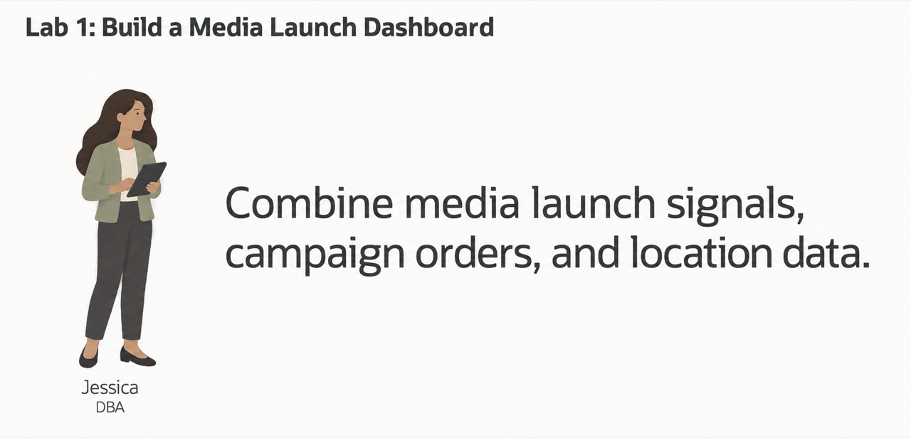
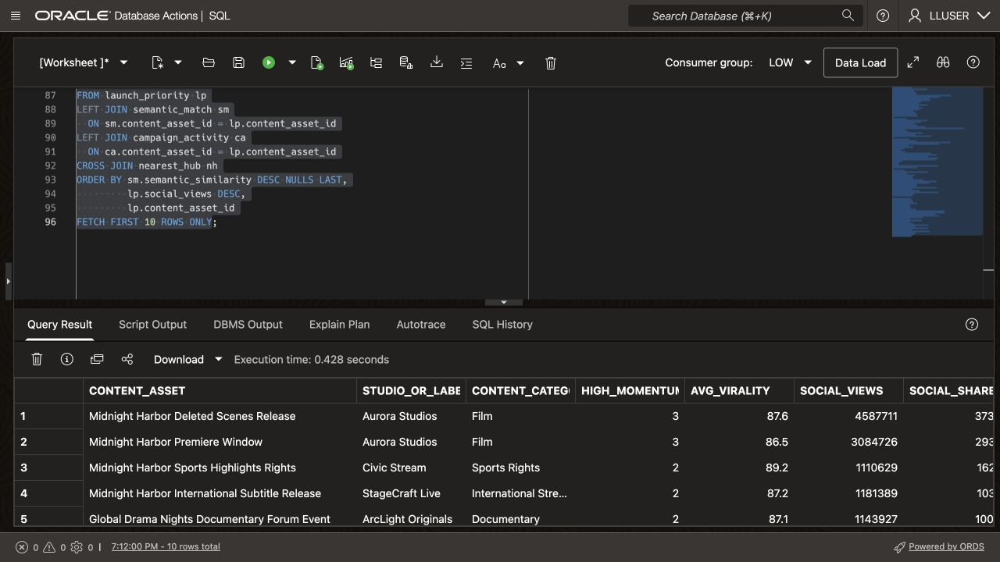
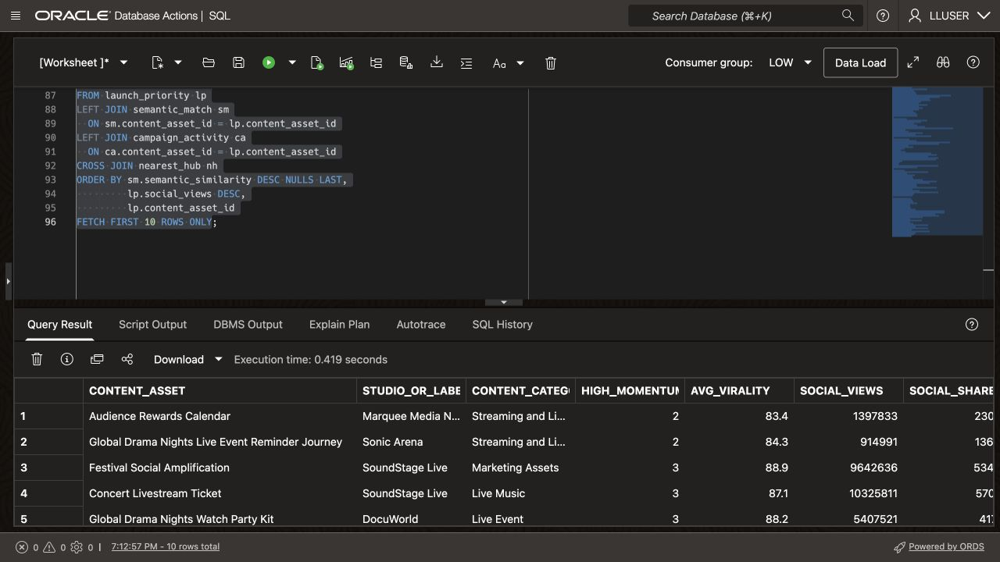

# Build a Midnight Harbor Launch Command Center

## Introduction

Jessica Chan is Seer Media's database administrator. The launch operations team asks her: **which content asset needs attention first, and where can the team respond?**

The answer needs several kinds of data. Relational rows hold audience signals and content-asset reach. JSON documents expose campaign orders. Prepared vectors represent content descriptions, and `SDO_GEOMETRY` stores distribution-hub and audience-region locations.

Jessica needs a query that joins these records and lets the launch team trace each result to its source. Maintaining separate reporting extracts, search indexes, document stores, and maps would add data copies and synchronization work.

Oracle AI Database supports these data models together. Jessica can query relational tables alongside JSON, vectors, and spatial geometry with the same SQL statement.

In this lab, you run the SQL behind the Midnight Harbor Launch Command Center. You then change the investigation phrase and compare the results.



### Objectives

- Explain what Oracle AI Database convergence means in a media decision workflow.
- Run one query that combines relational, vector, JSON, and spatial database capabilities.
- Modify the query to investigate a different launch-performance question and explain the change in results.

Estimated Time: **10 minutes**

### Hands-on Scenario

| Step                | Media & Entertainment focus                                                                                                  |
| ---------------------| ----------------------------------------------------------------------------------------------------------------|
| Business Problem    | Business users need a quick way to find launch-weekend performance priorities, social reach, campaign activity, and distribution information. |
| Technical Challenge | The answer crosses launch signals, content asset meaning, campaign orders, and distribution geography.                         |
| Persona Focus       | Jessica Chan, the DBA, builds the query that gives business users this dashboard view.                         |
| What You Will Do    | Use a single SQL statement that combines several data types.                                                   |
| Database Capability | Relational SQL, AI Vector Search, JSON Relational Duality, and Oracle Spatial work together.                   |
| Outcome             | The learner can explain convergence through a useful business result rather than a feature list.               |

Persona focus: As Jessica, connect launch signals, campaign activity, and distribution geography in one query.

> **SQL Worksheet reminder:** See [Getting Started Task 2: Open SQL Worksheet](?lab=getting-started#Task2:OpenSQLWorksheet) for setup and query instructions.

## Task 1: Run a converged launch investigation

Run the query below to review content assets with high-momentum audience signals.

The query intentionally crosses four data models:

- **Relational:** `MEDIA_AUDIENCE_SIGNALS_V`, `POST_PRODUCT_MENTIONS`, and `MEDIA_CONTENT_ASSETS_V` connect audience momentum to content assets and studios.
- **Vector:** `PRODUCT_EMBEDDINGS` and `VECTOR_DISTANCE` find content assets related by meaning to the investigation phrase.
- **JSON:** `JSON_TABLE` extracts nested line items from `ORDERS_DV` documents to count active campaign orders and requested units.
- **Spatial:** `SDO_GEOM.SDO_DISTANCE` finds the closest distribution hub to the seeded Northeast Streaming Corridor using `FULFILLMENT_CENTERS.LOCATION` and `DEMAND_REGIONS.BOUNDARY` geometry.

    These are four operations in one investigation. Every row combines launch-weekend performance priority with campaign activity, semantic relevance, and distribution context.

1. Open SQL Worksheet as `LLUSER`.

2. Run the query. Its comments identify each data-model operation:

    ```sql
    <copy>
    -- RELATIONAL DATA: aggregate high-momentum audience signals and
    -- join them to content assets and their studios or labels.
    WITH launch_priority AS (
        SELECT ca.product_id AS content_asset_id,
               ca.content_asset,
               ca.studio_or_label,
               ca.content_category,
               COUNT(DISTINCT sig.audience_signal_id) AS high_momentum_signals,
               ROUND(AVG(sig.virality_score), 1) AS avg_virality,
               SUM(sig.views_count) AS social_views,
               SUM(sig.shares_count) AS social_shares
        FROM media_audience_signals_v sig
        JOIN post_product_mentions ppm
          ON ppm.post_id = sig.audience_signal_id
        JOIN media_content_assets_v ca
          ON ca.product_id = ppm.product_id
        WHERE sig.virality_score >= 80
        GROUP BY ca.product_id,
                 ca.content_asset,
                 ca.studio_or_label,
                 ca.content_category
    ),
    -- VECTOR DATA: rank assets by meaning using the loader's embeddings.
    semantic_match AS (
        SELECT pe.product_id AS content_asset_id,
               ROUND(1 - VECTOR_DISTANCE(
                   pe.embedding,
                   VECTOR_EMBEDDING(
                       ADMIN.ALL_MINILM_L12_V2
                       USING 'Midnight Harbor premiere campaign and audience engagement' AS DATA
                   ),
                   COSINE
               ), 4) AS semantic_similarity
        FROM product_embeddings pe
        WHERE pe.embedding_model = 'all_MiniLM_L12_v2'
    ),
    -- JSON DATA: project campaign orders and their nested asset line items.
    -- The loader's JSON contract retains productId and quantity keys.
    campaign_activity AS (
        SELECT jt.content_asset_id,
               COUNT(DISTINCT jt.campaign_order_id) AS active_campaign_orders,
               SUM(jt.requested_units) AS active_requested_units
        FROM orders_dv od
        CROSS APPLY JSON_TABLE(
            od.data,
            '$'
            COLUMNS (
                campaign_order_id NUMBER PATH '$._id',
                campaign_status VARCHAR2(30) PATH '$.status',
                NESTED PATH '$.items[*]' COLUMNS (
                    content_asset_id NUMBER PATH '$.productId',
                    requested_units NUMBER PATH '$.quantity'
                )
            )
        ) jt
        WHERE jt.campaign_status IN ('confirmed', 'processing')
        GROUP BY jt.content_asset_id
    ),
    -- SPATIAL DATA: calculate distance to the audience-region boundary.
    nearest_hub AS (
        SELECT fc.center_name AS distribution_hub,
               fc.city,
               fc.state_province,
               dr.region_name,
               dr.demand_index,
               ROUND(SDO_GEOM.SDO_DISTANCE(
                   fc.location, dr.boundary, 0.005, 'unit=KM'
               ), 2) AS distance_to_demand_region_km
        FROM fulfillment_centers fc
        CROSS JOIN demand_regions dr
        WHERE dr.region_name = 'Northeast Streaming Corridor'
          AND fc.is_active = 1
        ORDER BY SDO_GEOM.SDO_DISTANCE(
                     fc.location, dr.boundary, 0.005, 'unit=KM'
                 ), fc.center_id
        FETCH FIRST 1 ROW ONLY
    )
    -- CONVERGED RESULT: combine the four data-model operations.
    SELECT lp.content_asset,
           lp.studio_or_label,
           lp.content_category,
           lp.high_momentum_signals,
           lp.avg_virality,
           lp.social_views,
           lp.social_shares,
           sm.semantic_similarity,
           NVL(ca.active_campaign_orders, 0) AS active_campaign_orders,
           NVL(ca.active_requested_units, 0) AS active_requested_units,
           nh.distribution_hub AS nearest_distribution_hub,
           nh.city || ', ' || nh.state_province AS hub_location,
           nh.region_name AS demand_region,
           nh.demand_index,
           nh.distance_to_demand_region_km
    FROM launch_priority lp
    LEFT JOIN semantic_match sm
      ON sm.content_asset_id = lp.content_asset_id
    LEFT JOIN campaign_activity ca
      ON ca.content_asset_id = lp.content_asset_id
    CROSS JOIN nearest_hub nh
    ORDER BY sm.semantic_similarity DESC NULLS LAST,
             lp.social_views DESC,
             lp.content_asset_id
    FETCH FIRST 10 ROWS ONLY;
    </copy>
    ```

3. Review the ranked content assets. Each row combines audience signals, semantic similarity, campaign activity, and distribution-hub location.

    

    The seeded region is `Northeast Streaming Corridor`. Each row includes audience signals, a semantic score, campaign activity, and distribution context. Social views measure post reach, not content watch time; requested units measure campaign demand, not viewing minutes. The nearest hub is a geographic candidate; this query does not test asset capacity or rights eligibility.

Use the first row to explain the result. Audience momentum and campaign demand show why the asset may need attention. Similarity connects it to the question, and the hub location suggests where distribution follow-up could begin.

This query supplies the dashboard's ranked table. Other dashboard components can query the same records for summary metrics or campaign details.

## Task 2: Change the investigation question

1. Jessica and a launch analyst review content assets related to **Midnight Harbor premiere campaign and audience engagement**. Change the embedded investigation phrase to:


    ```text
    live-event capacity and audience engagement
    ```

    


2. Run the query again and compare the top rows.

    - Which assets moved into or out of the top ten?
    - Which retain high social reach but have lower similarity to the new question?
    - Does active campaign demand change their operations priority?

The query sorts by similarity first, then social reach. Changing the question can change the review order while using the same stored vectors and campaign data.


## Next Steps

Next, use JSON Relational Duality to expose the same campaign-order data as JSON for an application while keeping SQL access for the database team.

## Acknowledgements

* **Author** - Kevin Lazarz
* **Contributor** - Eugenio Galiano
* **Last Updated By/Date** - Vahn Kessler, September 2026
