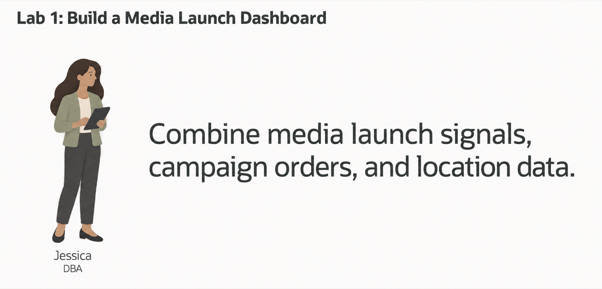
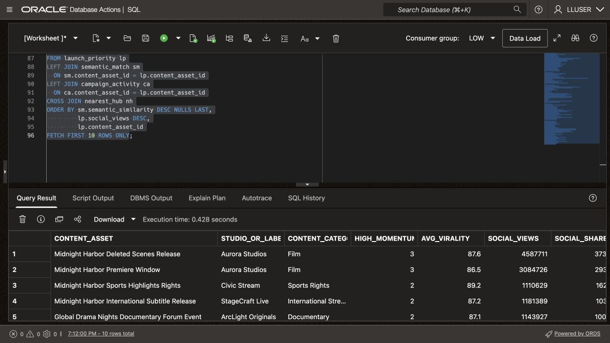
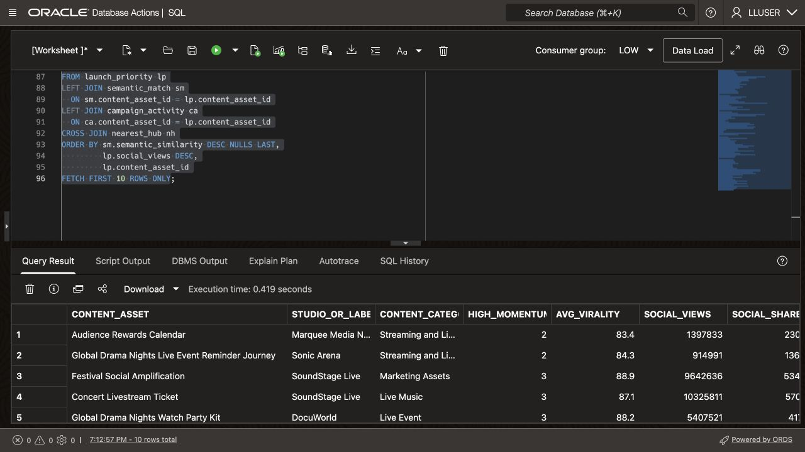

# Build a Midnight Harbor Launch Operations Dashboard

<!-- markdownlint-configure-file
{
  "MD013": {
    "code_blocks": false,
    "tables": false
  }
}
-->

## Introduction

Jessica Chan is Seer Media's database administrator. The launch operations team
asks her: **which content asset needs attention first, and where can the team
respond?**

The dashboard needs data in several forms: relational rows for audience signals
and content reach, JSON documents for campaign orders, and vectors for content
descriptions. Distribution hubs and audience regions use `SDO_GEOMETRY`, which
can also be returned as GeoJSON. Jessica needs to combine these records in one
query.

Jessica needs a query that joins these records and lets the launch team trace
each result to its source. Maintaining separate reporting extracts, search
indexes, document stores, and maps would add more copies of sensitive data, more
security boundaries, and more opportunities for the data to drift.

Oracle AI Database lets Jessica query relational rows, JSON documents, vectors,
and geographic data together. She can join the media records already in the
database to build the dashboard result.

In this lab, you take Jessica's role as the DBA. You will write the converged
SQL query behind the Launch Operations Dashboard. It combines relational data,
vector search, JSON campaign data, and distribution geography in one Oracle AI
Database, without separate systems or data copies.



### Objectives

* Explain what Oracle AI Database convergence means in a media decision workflow.
* Run one query that combines relational, vector, JSON, and spatial database capabilities.
* Modify the query to investigate a different launch-performance question and
  explain the change in results.

Estimated Time: **10 minutes**

### Hands-on Scenario

| Step | Media & Entertainment focus |
| --------------------- | ---------------------------------------------------------------------------------------------------------------- |
| Business Problem | Business users need a quick way to find launch-weekend performance priorities, social reach, campaign activity, and distribution information. |
| Technical Challenge | The answer crosses launch signals, content asset meaning, campaign orders, and distribution geography. |
| Persona Focus | Jessica Chan, the DBA, builds the query that gives business users this dashboard view. |
| What You Will Do | Use a single SQL statement that combines several data types. |
| Database Capability | Relational SQL, AI Vector Search, JSON Relational Duality, and Oracle Spatial work together. |
| Outcome | The launch team can compare content relevance, audience activity, campaign demand, and the nearest distribution hub in one result. |

Persona focus: You are Jessica Chan, the DBA. Your job is to build one governed
query that gives business users a connected view of launch signals, campaign
activity, and distribution geography.

> **SQL Worksheet reminder:** See [Getting Started, Task 2][link-1] for the
> steps to open SQL Worksheet and run SQL.

## Task 1: Run a converged launch investigation

Run the query below to review content assets with high-momentum audience signals.

The query intentionally crosses four data models:

* **Relational:** `MEDIA_AUDIENCE_SIGNALS_V`, `POST_PRODUCT_MENTIONS`, and
  `MEDIA_CONTENT_ASSETS_V` connect audience momentum to content assets and
  studios.
* **Vector:** `PRODUCT_EMBEDDINGS` and `VECTOR_DISTANCE` find content assets
  related by meaning to the investigation phrase.
* **JSON:** `JSON_TABLE` extracts nested line items from `ORDERS_DV` documents
  to count active campaign orders and requested units.
* **Spatial:** `SDO_GEOM.SDO_DISTANCE` finds the closest distribution hub to the
  seeded Northeast Streaming Corridor using `FULFILLMENT_CENTERS.LOCATION` and
  `DEMAND_REGIONS.BOUNDARY` geometry.

    These are four operations in one investigation. Every row combines
    launch-weekend performance priority with campaign activity, semantic
    relevance, and distribution context.

1. Open SQL Worksheet as `LLUSER`.

2. Run the query. Its comments identify each data-model operation:

    ```sql
    <copy>
    -- RELATIONAL DATA: aggregate high-momentum audience signals and
    -- join them to content assets and their studios or labels.
    WITH launch_priority AS (
        SELECT ca.product_id AS content_asset_id,
               ca.content_asset,
               ca.studio_or_label,
               ca.content_category,
               COUNT(DISTINCT sig.audience_signal_id) AS high_momentum_signals,
               ROUND(AVG(sig.virality_score), 1) AS avg_virality,
               SUM(sig.views_count) AS social_views,
               SUM(sig.shares_count) AS social_shares
        FROM media_audience_signals_v sig
        JOIN post_product_mentions ppm
          ON ppm.post_id = sig.audience_signal_id
        JOIN media_content_assets_v ca
          ON ca.product_id = ppm.product_id
        WHERE sig.virality_score >= 80
        GROUP BY ca.product_id,
                 ca.content_asset,
                 ca.studio_or_label,
                 ca.content_category
    ),
    -- VECTOR DATA: rank assets by meaning using the loader's embeddings.
    semantic_match AS (
        SELECT pe.product_id AS content_asset_id,
               ROUND(1 - VECTOR_DISTANCE(
                   pe.embedding,
                   VECTOR_EMBEDDING(
                       ADMIN.ALL_MINILM_L12_V2
                       USING 'Midnight Harbor premiere campaign and audience engagement' AS DATA
                   ),
                   COSINE
               ), 4) AS semantic_similarity
        FROM product_embeddings pe
        WHERE pe.embedding_model = 'all_MiniLM_L12_v2'
    ),
    -- JSON DATA: project campaign orders and their nested asset line items.
    -- The loader's JSON contract retains productId and quantity keys.
    campaign_activity AS (
        SELECT jt.content_asset_id,
               COUNT(DISTINCT jt.campaign_order_id) AS active_campaign_orders,
               SUM(jt.requested_units) AS active_requested_units
        FROM orders_dv od
        CROSS APPLY JSON_TABLE(
            od.data,
            '$'
            COLUMNS (
                campaign_order_id NUMBER PATH '$._id',
                campaign_status VARCHAR2(30) PATH '$.status',
                NESTED PATH '$.items[*]' COLUMNS (
                    content_asset_id NUMBER PATH '$.productId',
                    requested_units NUMBER PATH '$.quantity'
                )
            )
        ) jt
        WHERE jt.campaign_status IN ('confirmed', 'processing')
        GROUP BY jt.content_asset_id
    ),
    -- SPATIAL DATA: calculate distance to the audience-region boundary.
    nearest_hub AS (
        SELECT fc.center_name AS distribution_hub,
               fc.city,
               fc.state_province,
               dr.region_name,
               dr.demand_index,
               ROUND(SDO_GEOM.SDO_DISTANCE(
                   fc.location, dr.boundary, 0.005, 'unit=KM'
               ), 2) AS distance_to_demand_region_km
        FROM fulfillment_centers fc
        CROSS JOIN demand_regions dr
        WHERE dr.region_name = 'Northeast Streaming Corridor'
          AND fc.is_active = 1
        ORDER BY SDO_GEOM.SDO_DISTANCE(
                     fc.location, dr.boundary, 0.005, 'unit=KM'
                 ), fc.center_id
        FETCH FIRST 1 ROW ONLY
    )
    -- CONVERGED RESULT: combine the four data-model operations.
    SELECT lp.content_asset,
           lp.studio_or_label,
           lp.content_category,
           lp.high_momentum_signals,
           lp.avg_virality,
           lp.social_views,
           lp.social_shares,
           sm.semantic_similarity,
           NVL(ca.active_campaign_orders, 0) AS active_campaign_orders,
           NVL(ca.active_requested_units, 0) AS active_requested_units,
           nh.distribution_hub AS nearest_distribution_hub,
           nh.city || ', ' || nh.state_province AS hub_location,
           nh.region_name AS demand_region,
           nh.demand_index,
           nh.distance_to_demand_region_km
    FROM launch_priority lp
    LEFT JOIN semantic_match sm
      ON sm.content_asset_id = lp.content_asset_id
    LEFT JOIN campaign_activity ca
      ON ca.content_asset_id = lp.content_asset_id
    CROSS JOIN nearest_hub nh
    ORDER BY sm.semantic_similarity DESC NULLS LAST,
             lp.social_views DESC,
             lp.content_asset_id
    FETCH FIRST 10 ROWS ONLY;
    </copy>
    ```

3. Review the ranked content assets. Each row combines audience signals,
    semantic similarity, campaign activity, and distribution-hub location.

    

    Your numbers may be different if the demo data has changed. Each row should
    include all four types of data.

Use the first row to explain the result. Audience activity and campaign demand
help the team decide what to review; similarity shows how closely the asset
matches the question. The hub is the closest active hub to the selected demand
region and repeats across the returned assets. The query ranks assets by
similarity, then social views; it does not calculate a combined
operations-priority score.

The query supplies a dashboard view without assembling results from separate
audience, search, document, and mapping systems. Other dashboard components can
use additional SQL over the same database.

## Task 2: Change the investigation question

1. Jessica and a launch analyst review content assets related to **Midnight
    Harbor premiere campaign and audience engagement**. Change the embedded
    investigation phrase to:

    ```text
    live-event capacity and audience engagement
    ```

    

2. Run the query again and compare the top rows.

    * Which assets moved into or out of the top ten?
    * Which retain high social reach but have lower similarity to the new question?
    * Does active campaign demand change their operations priority?

The query sorts by similarity first, then social reach. Changing the question
can change the review order while using the same stored vectors and campaign
data.

## Next Steps

Next, use JSON Relational Duality to expose the same campaign-order data as JSON
for an application while keeping SQL access for the database team.

## Acknowledgements

* **Author** - Teodor Constantin Nechita
* **Contributor** - Vahn Kessler
* **Last Updated By/Date** - Teodor Constantin Nechita, October 2026

[link-1]: ?lab=getting-started#Task2:OpenSQLWorksheet
