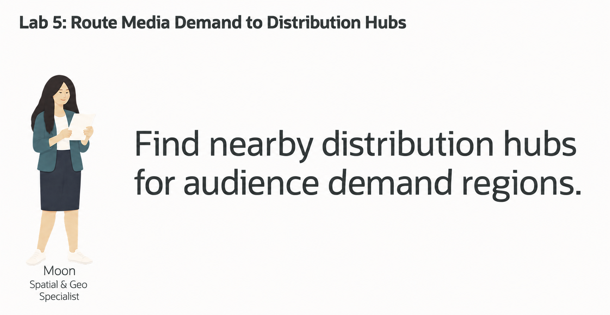
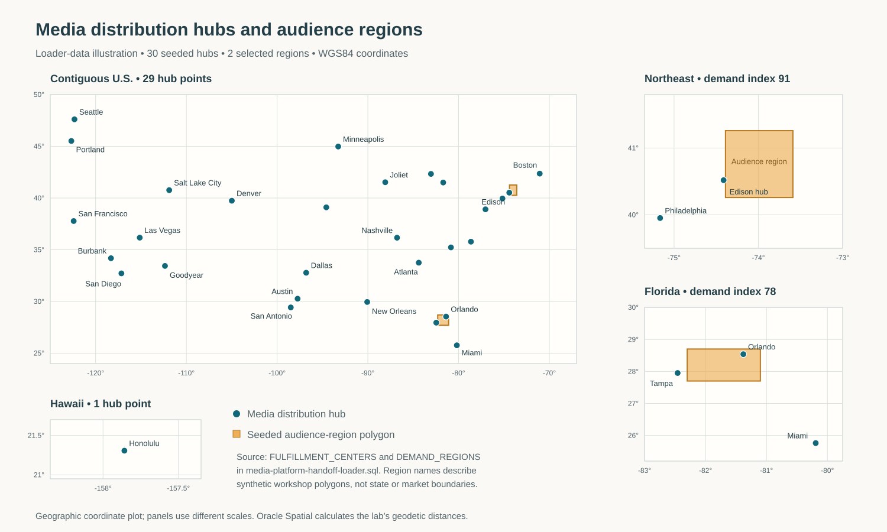
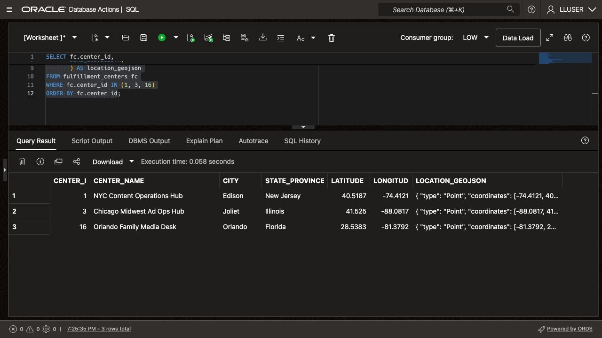
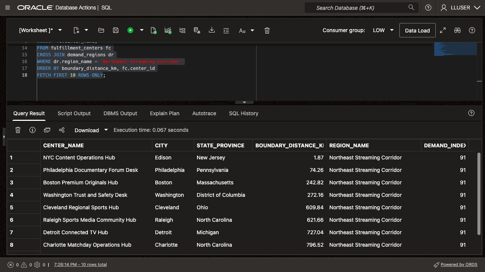
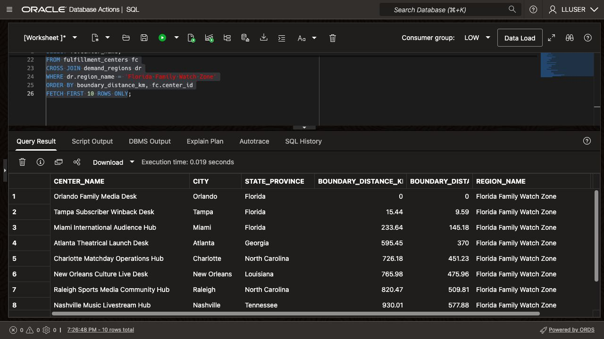
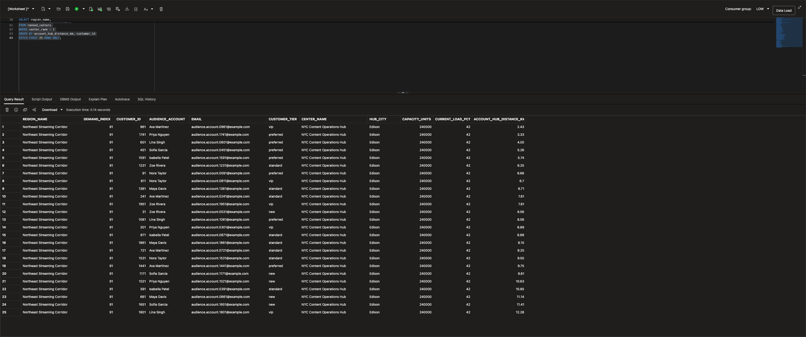
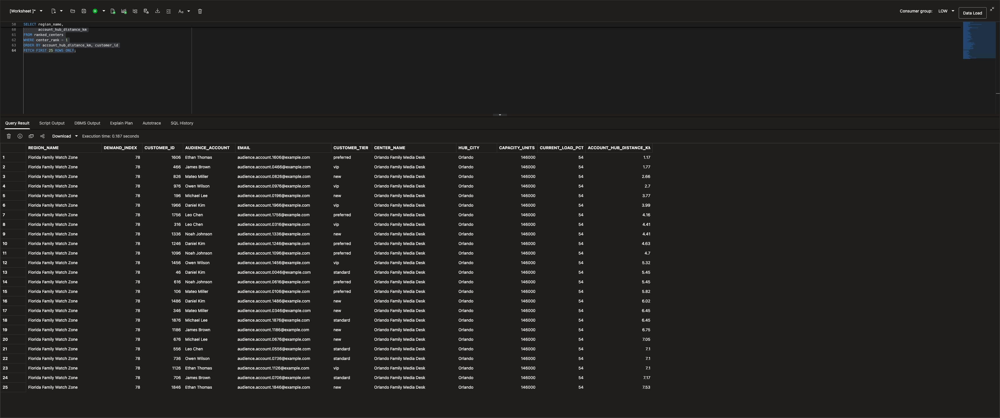

# Route Audience Accounts to the Closest Media Distribution Hub

## Introduction

Moon Kai is Seer Media's spatial specialist. Launch operations asks her to find nearby distribution hubs and audience accounts when regional demand grows.

Oracle AI Database stores distribution hubs and audience accounts as points. Audience regions are polygons, each with a demand score.

Moon uses SQL to answer the operations team's question:

> A region needs more distribution capacity. **Which audience accounts are in that region, and which distribution hub is closest to each one?**

Start with a point, measure its distance to a region, then find audience accounts inside that region. Match each account to its closest active distribution hub.



<details>
<summary><strong>Key terms: point, polygon, distance, spatial relationship, and GeoJSON</strong></summary>

> - A **point** is one location, represented by longitude and latitude. In this lab, a media distribution hub is stored as an `SDO_GEOMETRY` point.
>
> - A **polygon** is an area made from connected points. Audience regions are stored as polygons.
>
> - **Distance** measures how far two spatial objects are from each other. Here, it shows how far a media distribution hub is from an audience-region polygon. A distance of zero means the hub is inside or touching the region.
>
> - A **spatial relationship** describes how two shapes relate to each other. `SDO_GEOM.RELATE` can test whether an audience-account point is inside or touches an audience region.
>
> - **GeoJSON** is a JSON format for map locations and shapes. `SDO_UTIL.TO_GEOJSON` lets an application display the same database location on a map.
>
</details>

The loader stores media distribution hubs in `FULFILLMENT_CENTERS`, audience accounts in `CUSTOMERS`, and audience regions in `DEMAND_REGIONS`. `CAPACITY_UNITS` represents distribution capacity. The illustration below plots the loader’s 30 hub coordinates and the two audience-region polygons used in this lab. The Hawaii panel and region details use separate scales.



*Loader-data illustration from `FULFILLMENT_CENTERS` and `DEMAND_REGIONS`, not an application screenshot. The polygons are synthetic workshop regions; Oracle Spatial calculates the distances used in the tasks.*

### Objectives

- Identify spatial points and polygons in the media data.
- Convert a database point to GeoJSON for an application map.
- Measure which media distribution hubs are closest to an audience region.
- Find audience accounts inside an audience region.
- Match each audience account to the closest active media distribution hub.

Estimated Time: **10 minutes**

### Hands-on Scenario

| Step | Media & Entertainment focus |
| --- | --- |
| Business Problem | Operations needs to route distribution requests to a center that can respond to regional demand. |
| Technical Challenge | Moon needs to compare audience-account points with a region, then find the closest center for each audience account. |
| Persona Focus | You review Moon's spatial approach and interpret the result for an operations user. |
| What You Will See | Oracle Spatial turns location data into audience-account routing results with SQL. |
| Database Capability | `SDO_GEOMETRY`, `SDO_GEOM.SDO_DISTANCE`, `SDO_GEOM.RELATE`, and GeoJSON conversion support the analysis. |
| Outcome | An operations user can see which audience accounts are in a region and which center is closest to each one. |

> **SQL Worksheet reminder:** See [Getting Started Task 2: Open SQL Worksheet](?lab=getting-started#Task2:OpenSQLWorksheet) for setup and query instructions.

## Task 1: Look at the locations as points

Moon first locates the media distribution hubs. The database stores each center as an `SDO_GEOMETRY` point and can return it as GeoJSON.

The Edison center uses the WGS84 coordinate system, with longitude `-74.4121` and latitude `40.5187`. Oracle Spatial uses this geometry to calculate distance and test location relationships.

`SDO_UTIL.TO_GEOJSON` converts that geometry into a standard JSON map object such as `{ "type": "Point", "coordinates": [-74.4121, 40.5187] }`. An application can display that object on a map. SQL analysis and map output use the same stored geometry.

1. Run this query:

    ```sql
    <copy>
    SELECT fc.center_id,
           fc.center_name,
           fc.city,
           fc.state_province,
           fc.latitude,
           fc.longitude,
           DBMS_LOB.SUBSTR(
             SDO_UTIL.TO_GEOJSON(fc.location), 120, 1
           ) AS location_geojson
    FROM fulfillment_centers fc
    WHERE fc.center_id IN (1, 3, 16)
    ORDER BY fc.center_id;
    </copy>
    ```

    `LOCATION` stores the point; `LATITUDE` and `LONGITUDE` expose its coordinates. `LOCATION_GEOJSON` returns the same point for a map, with longitude before latitude. `SDO_UTIL.TO_GEOJSON` returns a CLOB. `DBMS_LOB.SUBSTR` limits its displayed text to 120 characters while preserving the stored geometry.

    **Expected output: Media Distribution Hub Points**

    

2. Review the point data.

    Check the hub names, coordinates, and GeoJSON values. The same row stores the hub's location, capacity, operating status, and current load. SQL can return those details with a distance calculation or a map point.

## Task 2: Find the closest centers to an audience region

The Northeast Streaming Corridor has a demand index of `91`. Measure the distance from each hub point to its region polygon.

1. Run the distance query:

    ```sql
    <copy>
    SELECT fc.center_name,
           fc.city,
           fc.state_province,
           ROUND(
             SDO_GEOM.SDO_DISTANCE(
               fc.location,
               dr.boundary,
               0.005,
               'unit=KM'
             ), 2
           ) AS boundary_distance_km,
           dr.region_name,
           dr.demand_index
    FROM fulfillment_centers fc
    CROSS JOIN demand_regions dr
    WHERE dr.region_name = 'Northeast Streaming Corridor'
    ORDER BY boundary_distance_km, fc.center_id
    FETCH FIRST 10 ROWS ONLY;
    </copy>
    ```

    `SDO_GEOM.SDO_DISTANCE` compares the distribution-hub point with the audience-region polygon. The function returns the shortest distance between the two shapes. A value of `0` means the point is inside or touching the region.

    The function takes four arguments:

    - `fc.location` is the first geometry: the distribution-hub point.
    - `dr.boundary` is the second geometry: the audience-region polygon.
    - `0.005` is the tolerance used when Oracle compares the geometries. It helps Oracle handle small differences in the stored coordinates.
    - `'unit=KM'` tells Oracle to return the distance in kilometers. Change it to `'unit=MILE'` when the application needs miles.

    The `ROUND(..., 2)` around the function result only formats the answer to two decimal places. It does not change the spatial calculation.

    The query also returns `DEMAND_INDEX`, so Moon can read location and demand together. The center with the smallest distance is the first center operations should check for available capacity.

    **Expected output: Northeast Streaming Coverage**

    The first row is the closest Seer Media hub to the Northeast Streaming Corridor. The region has a demand index of `91`.

    

2. Try another region.

    Change the region name to `Florida Family Watch Zone`, add a miles calculation, and run the modified query:

    ```sql
    <copy>
    SELECT fc.center_name,
           fc.city,
           fc.state_province,
           ROUND(
             SDO_GEOM.SDO_DISTANCE(
               fc.location,
               dr.boundary,
               0.005,
               'unit=KM'
             ), 2
           ) AS boundary_distance_km,
           ROUND(
             SDO_GEOM.SDO_DISTANCE(
               fc.location,
               dr.boundary,
               0.005,
               'unit=MILE'
             ), 2
           ) AS boundary_distance_miles,
           dr.region_name,
           dr.demand_index
    FROM fulfillment_centers fc
    CROSS JOIN demand_regions dr
    WHERE dr.region_name = 'Florida Family Watch Zone'
    ORDER BY boundary_distance_km, fc.center_id
    FETCH FIRST 10 ROWS ONLY;
    </copy>
    ```

    

    The `unit` parameter controls the measurement unit. The closest Seer Media hub may be inside the Florida Family Watch Zone boundary, producing a distance of `0`. Florida Family Watch Zone has a demand index of `78`.

    Next, use the region polygon to find audience accounts inside it. Rank active hubs by distance for each account.

## Task 3: Route audience accounts to the closest center

Find audience accounts inside the Northeast Streaming Corridor and match each to its closest active hub. The query first compares account points (**`c.location`**) with the region polygon (**`dr.boundary`**). It then compares each matching account with every active center and keeps the closest one.

1. Run the audience-account routing query:

    ```sql
    <copy>
    WITH regional_audience_accounts AS (
      SELECT dr.region_name,
             dr.demand_index,
             c.customer_id,
             c.first_name || ' ' || c.last_name AS audience_account,
             c.email,
             c.customer_tier,
             c.location
      FROM customers c
      CROSS JOIN demand_regions dr
      WHERE dr.region_name = 'Northeast Streaming Corridor'
        AND SDO_GEOM.RELATE(
              dr.boundary,
              'ANYINTERACT',
              c.location,
              0.005
            ) = 'TRUE'
    ), ranked_centers AS (
      SELECT rc.region_name,
             rc.demand_index,
             rc.customer_id,
             rc.audience_account,
             rc.email,
             rc.customer_tier,
             fc.center_name,
             fc.city AS hub_city,
             fc.capacity_units,
             fc.current_load_pct,
             ROUND(
               SDO_GEOM.SDO_DISTANCE(
                 rc.location,
                 fc.location,
                 0.005,
                 'unit=KM'
               ), 2
             ) AS account_hub_distance_km,
             ROW_NUMBER() OVER (
               PARTITION BY rc.customer_id
               ORDER BY SDO_GEOM.SDO_DISTANCE(
                          rc.location,
                          fc.location,
                          0.005,
                          'unit=KM'
                        ), fc.center_id
             ) AS center_rank
      FROM regional_audience_accounts rc
      CROSS JOIN fulfillment_centers fc
      WHERE fc.is_active = 1
    )
    SELECT region_name,
           demand_index,
           customer_id,
           audience_account,
           email,
           customer_tier,
           center_name,
           hub_city,
           capacity_units,
           current_load_pct,
           account_hub_distance_km
    FROM ranked_centers
    WHERE center_rank = 1
    ORDER BY account_hub_distance_km, customer_id
    FETCH FIRST 25 ROWS ONLY;
    </copy>
    ```

    `SDO_GEOM.RELATE` keeps audience accounts whose point falls inside or touches the Northeast Streaming Corridor polygon. `SDO_GEOM.SDO_DISTANCE` then measures the distance from each matching audience account to every active center. `ROW_NUMBER` keeps the nearest center for each audience account.

2. Review the result as an operations decision.

    Each row combines an audience account, regional demand, the closest active hub, its capacity and load, and distance. The query recommends a nearby hub; it does not reserve capacity or assign campaign orders. A dashboard can present this result when an operations user selects a region.

    

3. Change the query to `Florida Family Watch Zone`.

    Compare the audience accounts and recommended hubs with the Northeast result. The spatial predicates stay the same; only the region changes.

    

## Conclusion: Turn Location into a Distribution Decision

Moon's query identifies audience accounts in a selected region and their closest active distribution hubs. Operations can review hub capacity and load before assigning distribution work.

Spatial functions, relational joins, and GeoJSON output use the same database locations. A dashboard can use these results to display locations and operational details.

## Next Steps

You used Oracle Spatial to turn points and polygons into a routing decision. For a deeper hands-on workshop focused on Oracle Spatial, open the [Oracle Spatial LiveLabs workshop](https://livelabs.oracle.com/ords/r/dbpm/livelabs/view-workshop?clear=RR,180&wid=800).

## Acknowledgements

* **Author** - Kevin Lazarz
* **Contributor** - Eugenio Galiano, Linda Foinding
* **Last Updated By/Date** - Oracle Database Product Management, September 2026
