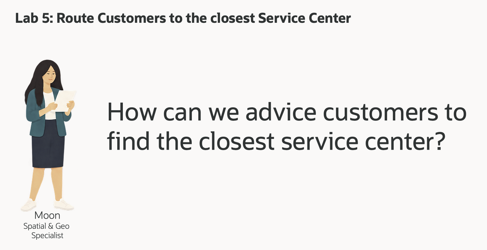
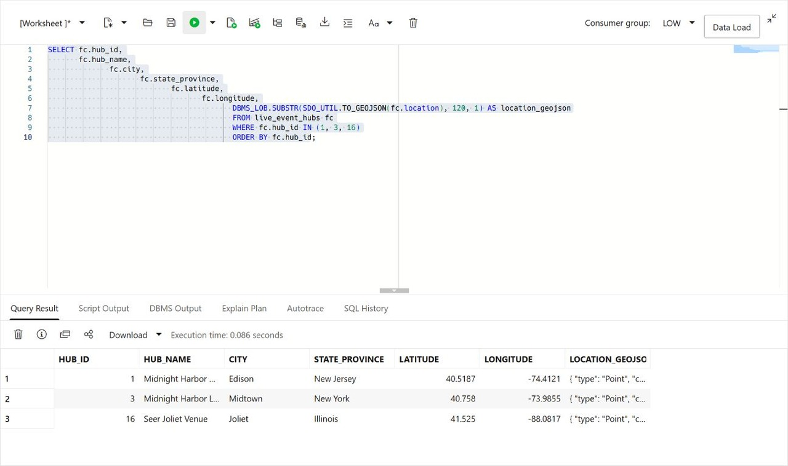
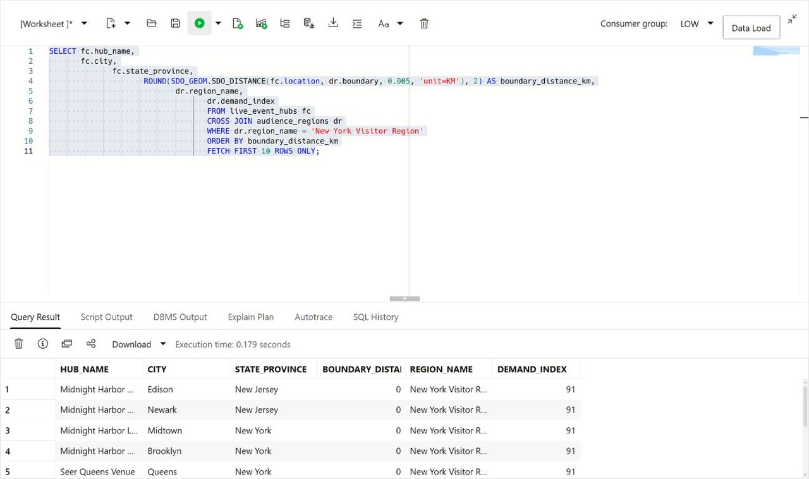
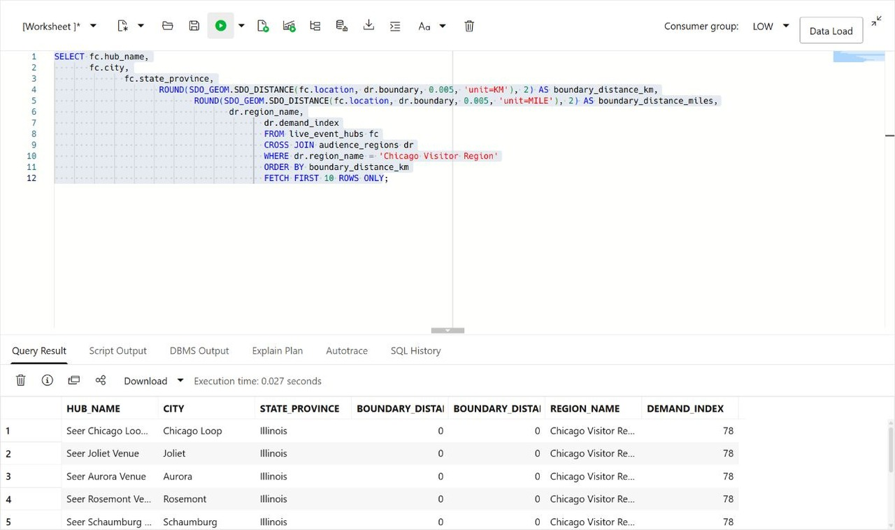
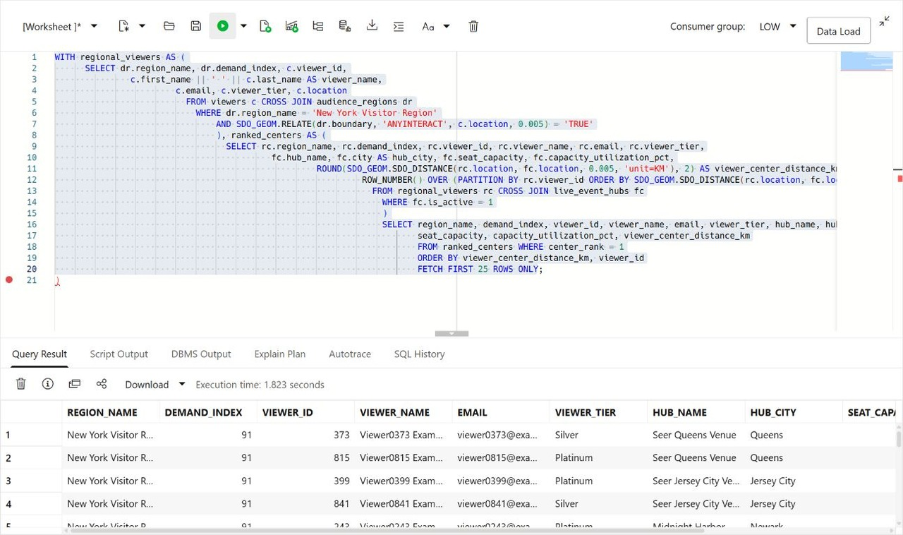

# Route Viewers to the Closest Midnight Harbor Event Hub

## Introduction

Moon Kai is Seer Media's spatial specialist. Launch operations teams ask Moon for help when location affects a capacity decision: which event hub is closest to a region with growing demand, and which viewers should it serve?

Seer Media already stores the required data in Oracle AI Database. Service centers and viewers are stored as map points. Audience regions are stored as map areas, and each region has a demand score.

Moon wants operations users to answer a simple question with SQL that can power a business-user dashboard and map:

> A region needs more launch capacity. **Which viewers are in that region, and which event hub is closest to each one?**

In this lab, you follow Moon's approach. You start with a single point, measure distance to a region, find viewers inside that region, and finish with a viewer routing result that combines location and service data.



<details>
<summary><strong>Key terms: point, polygon, distance, spatial relationship, and GeoJSON</strong></summary>

> - A **point** is one location, represented by longitude and latitude. In this lab, a live-event operations hub is stored as an `SDO_GEOMETRY` point.
>
> - A **polygon** is an area made from connected points. Audience regions are stored as polygons.
>
> - **Distance** measures how far two spatial objects are from each other. Here, it shows how far a live-event operations hub is from a audience-region boundary. A distance of zero means the center is inside or touching the region.
>
> - A **spatial relationship** describes how two shapes relate to each other. `SDO_GEOM.RELATE` can test whether a viewer point is inside or touches a audience region.
>
> - **GeoJSON** is a JSON format for map locations and shapes. `SDO_UTIL.TO_GEOJSON` lets an application display the same database location on a map.
>
</details>

The Seer Media Media & Entertainment LiveStack Demo uses the same data in its service coverage page. The map helps users see the result; the SQL in this lab shows how Oracle calculates it.


### Objectives

- Identify spatial points and polygons in the media data.
- Convert a database point to GeoJSON for an application map.
- Measure which live-event hubs are closest to an audience region.
- Find viewers inside a audience region.
- Match each viewer to the closest active live-event operations hub.

Estimated Time: **10 minutes**

### Hands-on Scenario

| Step | Media & Entertainment focus |
| --- | --- |
| Business Problem | Operations needs to route service work to a center that can respond to regional demand. |
| Technical Challenge | Moon needs to compare viewer points with a region, then find the closest center for each viewer. |
| Persona Focus | You review Moon's spatial approach and interpret the result for an operations user. |
| What You Will See | Oracle Spatial turns location data into viewer routing results with SQL. |
| Database Capability | `SDO_GEOMETRY`, `SDO_GEOM.SDO_DISTANCE`, `SDO_GEOM.RELATE`, and GeoJSON conversion support the analysis. |
| Outcome | An operations user can see which viewers need service in a region and which center is closest to each one. |

> **SQL Worksheet reminder:** Need a reminder on how to open and use the SQL Worksheet? Return to [Getting Started Task 2: Open SQL Worksheet](?lab=getting-started#Task2:OpenSQLWorksheet) for the step-by-step graphic showing where to paste and run SQL statements.

## Task 1: Look at the locations as points

Moon starts with the simplest spatial question: **where are the live-event operations hubs?** The database stores each center as an `SDO_GEOMETRY` point, while the application can use the same point as GeoJSON.

An `SDO_GEOMETRY` point is Oracle Spatial's structured representation of one location. For example, the Edison center is stored with a point type, the WGS84 coordinate system, and a coordinate pair: longitude `-74.4121` and latitude `40.5187`. Because Oracle stores the location as geometry, Spatial functions can calculate distance and test spatial relationships instead of treating the coordinates as two unrelated numbers.

`SDO_UTIL.TO_GEOJSON` converts that geometry into a standard JSON map object such as `{ "type": "Point", "coordinates": [-74.4121, 40.5187] }`. The application can send this object to a map without maintaining a second location format or a separate conversion service. Oracle uses the same stored geometry for SQL analysis and application display.

That is the Oracle AI Database advantage in this lab: one location supports spatial calculations, relational joins, and JSON map output without copying the data between systems.

1. Run this query:

    ```sql
    <copy>
    SELECT fc.hub_id,
           fc.hub_name,
           fc.city,
           fc.state_province,
           fc.latitude,
           fc.longitude,
           DBMS_LOB.SUBSTR(
             SDO_UTIL.TO_GEOJSON(fc.location), 120, 1
           ) AS location_geojson
    FROM live_event_hubs fc
    WHERE fc.hub_id IN (1, 3, 16)
    ORDER BY fc.hub_id;
    </copy>
    ```

    `LOCATION` is the database point. `LATITUDE` and `LONGITUDE` make the value easy to read, and `LOCATION_GEOJSON` gives an application a map-ready representation of the same point. GeoJSON lists longitude first and latitude second. `SDO_UTIL.TO_GEOJSON` returns a CLOB, so `DBMS_LOB.SUBSTR` limits the displayed text to 120 characters; it does not change the stored geometry.

    **Expected output: Live-Event Operations Hub Points**

    

2. Review the point data.

    Moon has not created a second map database. The point used by the application and the point used by SQL are the same value. The database can calculate with it, and the application can display it.

    This is the converged-database advantage. Moon can keep the center's location beside its name, capacity, operating status, and current load. SQL can calculate distance and return those center details, while `SDO_UTIL.TO_GEOJSON` gives the application the same location for a map. The team does not have to copy coordinates into a separate mapping system and keep the copies synchronized.

## Task 2: Find the closest centers to a audience region

The New York Visitor Region is the Midnight Harbor launch audience region and has a demand index of `91`, making it a useful region for the first routing review. Moon now measures the distance from each live-event-hub point to the region boundary.

1. Run the distance query:

    ```sql
    <copy>
    SELECT fc.hub_name,
           fc.city,
           fc.state_province,
           ROUND(
             SDO_GEOM.SDO_DISTANCE(
               fc.location,
               dr.boundary,
               0.005,
               'unit=KM'
             ), 2
           ) AS boundary_distance_km,
           dr.region_name,
           dr.demand_index
    FROM live_event_hubs fc
    CROSS JOIN audience_regions dr
    WHERE dr.region_name = 'New York Visitor Region'
    ORDER BY boundary_distance_km
    FETCH FIRST 10 ROWS ONLY;
    </copy>
    ```

    `SDO_GEOM.SDO_DISTANCE` compares the live-event-operations-hub point with the audience-region polygon. The function returns the shortest distance between the two shapes. A value of `0` means the point is inside or touching the region.

    The four arguments in this query have simple roles:

    - `fc.location` is the first geometry: the live-event-operations-hub point.
    - `dr.boundary` is the second geometry: the audience-region polygon.
    - `0.005` is the tolerance used when Oracle compares the geometries. It helps Oracle handle small differences in the stored coordinates.
    - `'unit=KM'` tells Oracle to return the distance in kilometers. Change it to `'unit=MILE'` when the application needs miles.

    The `ROUND(..., 2)` around the function result only formats the answer to two decimal places. It does not change the spatial calculation.

    The query also returns `DEMAND_INDEX`, so Moon can read location and demand together. The center with the smallest distance is the first center operations should check for available capacity.

    **Expected output: New York Service Coverage**

    The first row is the closest Seer Media hub to the New York launch audience region. The region has a demand index of `91`.

    

2. Try another region.

    Change the region name to `Chicago Metro`, add a miles calculation, and run the modified query:

    ```sql
    <copy>
    SELECT fc.hub_name,
           fc.city,
           fc.state_province,
           ROUND(
             SDO_GEOM.SDO_DISTANCE(
               fc.location,
               dr.boundary,
               0.005,
               'unit=KM'
             ), 2
           ) AS boundary_distance_km,
           ROUND(
             SDO_GEOM.SDO_DISTANCE(
               fc.location,
               dr.boundary,
               0.005,
               'unit=MILE'
             ), 2
           ) AS boundary_distance_miles,
           dr.region_name,
           dr.demand_index
    FROM live_event_hubs fc
    CROSS JOIN audience_regions dr
    WHERE dr.region_name = 'Chicago Visitor Region'
    ORDER BY boundary_distance_km
    FETCH FIRST 10 ROWS ONLY;
    </copy>
    ```

    

    The `unit` parameter controls the measurement unit. The closest Seer Media hub may be inside the Chicago Visitor Region boundary, producing a distance of `0`. Chicago has a demand index of `78`.

    This is a useful regional result, but distance to the region boundary does not identify the viewers who need service. Moon now uses the region polygon to find those viewers and then assigns each one to the closest active center.

## Task 3: Route viewers to the closest center

Moon now needs a result that an operations application can use: viewers inside Midnight Harbor premiere district, their audience region, and the closest active live-event operations hub. The query uses the viewer point (**`c.location`**) and audience-region polygon (**`dr.boundary`**) to find the viewers first. It then compares each viewer point with every active center and keeps the closest one.

1. Run the viewer routing query:

    ```sql
    <copy>
    WITH regional_viewers AS (
      SELECT dr.region_name,
             dr.demand_index,
             c.viewer_id,
             c.first_name || ' ' || c.last_name AS viewer_name,
             c.email,
             c.viewer_tier,
             c.location
      FROM viewers c
      CROSS JOIN audience_regions dr
      WHERE dr.region_name = 'New York Visitor Region'
        AND SDO_GEOM.RELATE(
              dr.boundary,
              'ANYINTERACT',
              c.location,
              0.005
            ) = 'TRUE'
    ), ranked_centers AS (
      SELECT rc.region_name,
             rc.demand_index,
             rc.viewer_id,
             rc.viewer_name,
             rc.email,
             rc.viewer_tier,
             fc.hub_name,
             fc.city AS hub_city,
             fc.seat_capacity,
             fc.capacity_utilization_pct,
             ROUND(
               SDO_GEOM.SDO_DISTANCE(
                 rc.location,
                 fc.location,
                 0.005,
                 'unit=KM'
               ), 2
             ) AS viewer_center_distance_km,
             ROW_NUMBER() OVER (
               PARTITION BY rc.viewer_id
               ORDER BY SDO_GEOM.SDO_DISTANCE(
                          rc.location,
                          fc.location,
                          0.005,
                          'unit=KM'
                        )
             ) AS center_rank
      FROM regional_viewers rc
      CROSS JOIN live_event_hubs fc
      WHERE fc.is_active = 1
    )
    SELECT region_name,
           demand_index,
           viewer_id,
           viewer_name,
           email,
           viewer_tier,
           hub_name,
           hub_city,
           seat_capacity,
           capacity_utilization_pct,
           viewer_center_distance_km
    FROM ranked_centers
    WHERE center_rank = 1
    ORDER BY viewer_center_distance_km, viewer_id
    FETCH FIRST 25 ROWS ONLY;
    </copy>
    ```

    `SDO_GEOM.RELATE` keeps viewers whose point falls inside or touches the Midnight Harbor premiere district polygon. `SDO_GEOM.SDO_DISTANCE` then measures the distance from each matching viewer to every active center. `ROW_NUMBER` keeps the nearest center for each viewer.

2. Review the result as an operations decision.

    Each row gives a business user a viewer to contact, the closest center, and the information needed to decide where the work should go. The result combines the region's demand score, viewer details, center capacity, current load, and spatial distance in one SQL result.

    This is the business outcome. A dashboard can let a user select a region and immediately show the viewers affected, the center that should handle each request, and the distance involved. The user does not need to compare a map with a separate viewer list or operations report.

    

3. Change the query to `Chicago Visitor Region`.

    Compare the viewers and assigned centers with the New York result. The spatial predicates stay the same; only the region changes. This is the kind of query an operations dashboard can run when a business user selects a different audience region.

    

## Conclusion: Turn Location into a Service Decision

Moon's analysis moves from a point, to distance, to viewer routing. A business user can select a high-audience region and get a list of viewers, their closest live-event operations hub, and the distance to that center. That is a useful dashboard result because it tells the user what action to take, not just where the data is located.

This shows why Spatial in Oracle AI Database matters. One convergent query can identify viewers with spatial functions, join them to relational viewer and center data, and include capacity and current load in the same result. The dashboard can show the map and the business details from one database, without moving data between a mapping system, a viewer system, and an operations system.

## Next Steps

You used Oracle Spatial to turn points and polygons into a routing decision. For a deeper hands-on workshop focused on Oracle Spatial, open the [Oracle Spatial LiveLabs workshop](https://livelabs.oracle.com/ords/r/dbpm/livelabs/view-workshop?clear=RR,180&wid=800).

## Acknowledgements

* **Author** - Kevin Lazarz
* **Contributor** - Eugenio Galiano, Linda Foinding
* **Last Updated By/Date** - Oracle Database Product Management, September 2026
