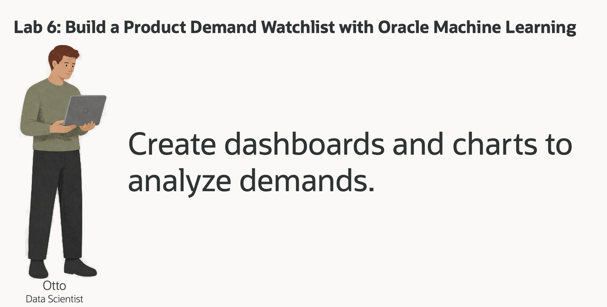
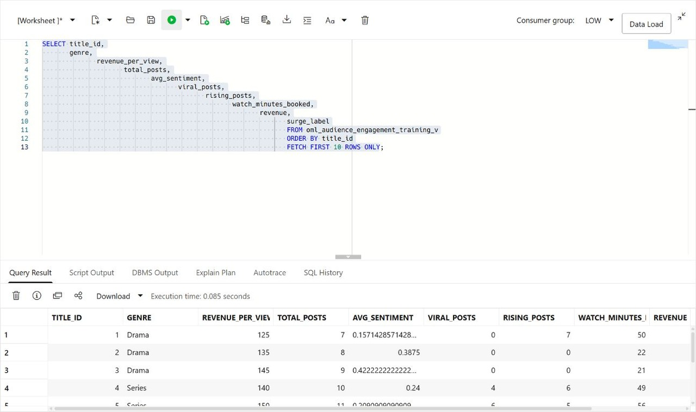
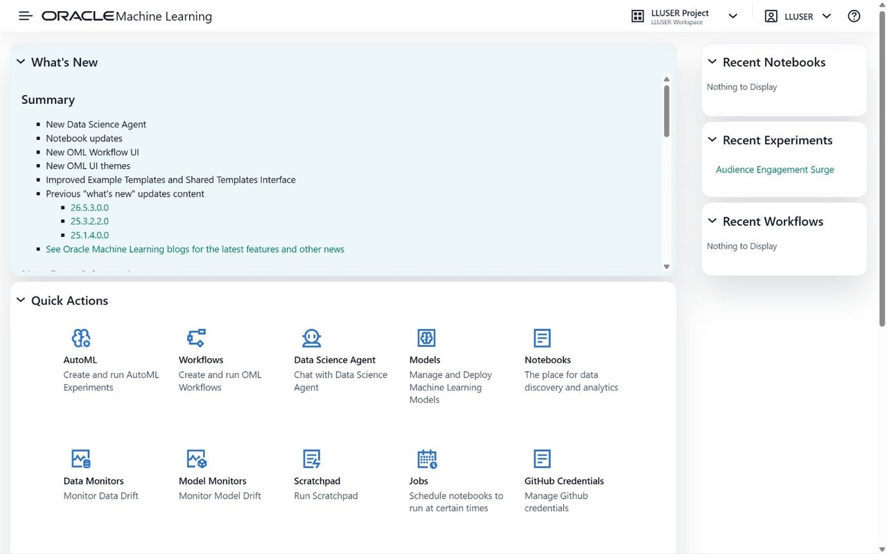
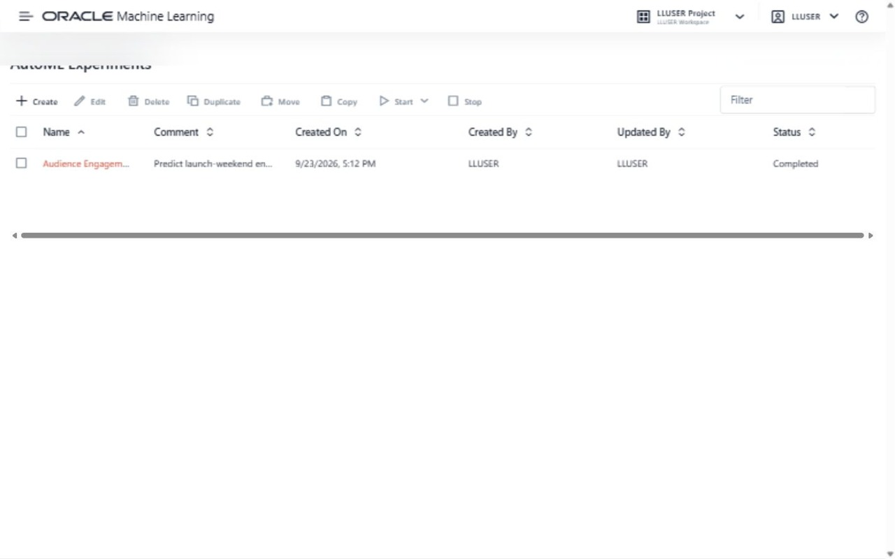
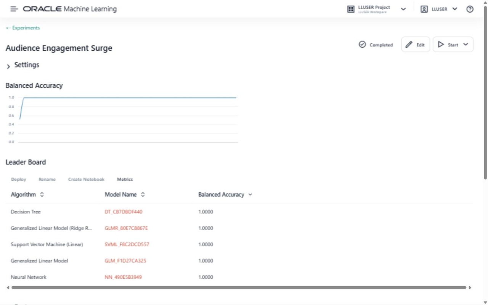
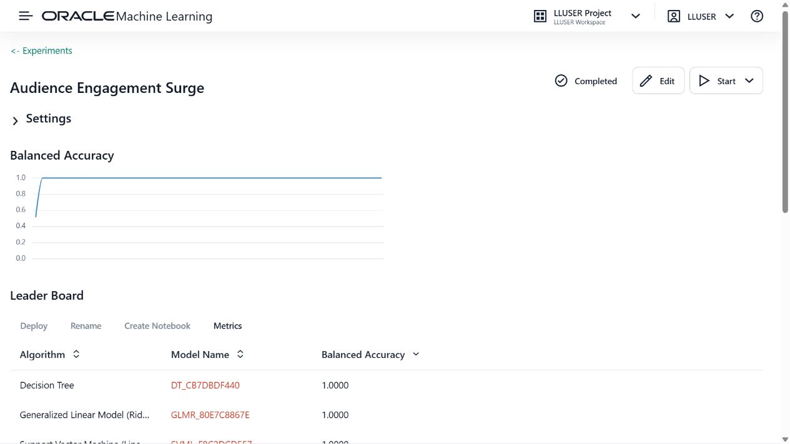
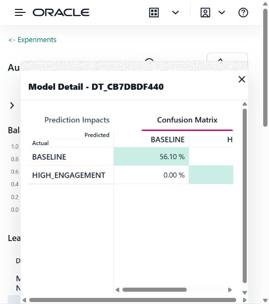
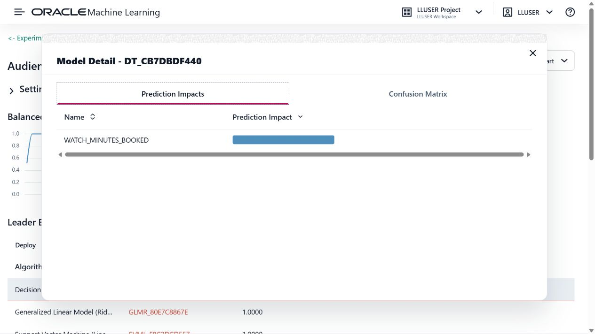
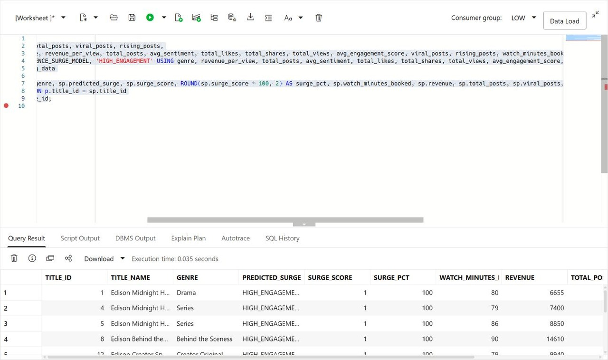

# Build a Audience Engagement Watchlist with Oracle Machine Learning

## Introduction

> **Screenshot update note:** OML screenshots should show Midnight Harbor audience engagement, subscription/advertising revenue, or retention predictions.

Otto Spencer is Seer Media's data scientist. His team supplies the predictions used in analytics charts and dashboards.

The title team wants a demand watchlist. A business user should be able to see which titles may need more attention, why the model flagged them, and which titles are already showing strong sales or viewer activity.

Otto has the title, sales, and social activity data in Oracle AI Database. He could copy the data to a separate machine learning platform, train a model there, and copy the scores back. That would create another copy of media data and another process for keeping scores current.

Instead, Otto builds and scores the model in the database. The model uses audience and title activity to classify titles as `HIGH_ENGAGEMENT` or `BASELINE`. SQL then joins the prediction to the title name, viewing revenue, and engagement values that a dashboard needs.

In this lab, you build Otto's demand-surge model and turn its output into a review list for a business user.



<details>
<summary><strong>Key terms: model, feature, classification, probability, and in-database machine learning</strong></summary>

> - A **model** is a set of learned rules that turns input data into a prediction.
>
> - A **feature** is an input value used by the model. In this lab, features include title genre, price, social activity, and sales.
>
> - **Classification** predicts a label. Otto's model predicts either `HIGH_ENGAGEMENT` or `BASELINE`.
>
> - A **probability** is the model's value for a class. In this lab, the value is displayed as a `HIGH_ENGAGEMENT_SCORE` to rank titles for review. It is not a guarantee.
>
> - **In-database machine learning** means the model is trained or scored where the source data already lives. The SQL result can include the prediction and the data used to explain it.

</details>


### Objectives

- Read the prepared training data and identify the model target.
- Optionally use AutoML to compare classification models and inspect their predictions.
- Create the selected Generalized Linear Model inside Oracle AI Database.
- Score titles with `PREDICTION` and `PREDICTION_PROBABILITY`.
- Combine model output with title, sales, and engagement data for a dashboard result.

Estimated Time: **10 minutes**

### Hands-on Scenario

| Step                | Media & Entertainment focus                                                                                                        |
| ---------------------| ----------------------------------------------------------------------------------------------------------------------|
| Business Problem    | A business user needs a short list of titles that may require attention.                                           |
| Technical Challenge | Otto needs to train and score a model without copying title activity to another machine learning system.           |
| Persona Focus       | You follow Otto as he builds the model and checks the result before it reaches a dashboard.                          |
| What You Will See   | Optionally compare models with AutoML, then use SQL Developer Web to create and score the selected model.             |
| Database Capability | AutoML, `DBMS_DATA_MINING`, `PREDICTION`, and `PREDICTION_PROBABILITY` support machine learning inside the database. |
| Outcome             | A watchlist for a dashboard combines the model result with the title and activity data behind it.                  |

> **SQL Worksheet reminder:** Need a reminder on how to open and use the SQL Worksheet? Return to [Getting Started Task 2: Open SQL Worksheet](?lab=getting-started#Task2:OpenSQLWorksheet) for the step-by-step graphic showing where to paste and run SQL statements.

## Task 1: Read the training data

Before Otto creates a model, he checks the data that will teach it. The workshop already provides `OML_AUDIENCE_ENGAGEMENT_TRAINING_V`, a view that combines title, social activity, and sales data into one row per active title.

The view also contains `SURGE_LABEL`. This is the known label used during training. The demo data assigns each title `SURGE` or `STABLE` from its activity values so the SQL pattern can be tested without waiting for new business outcomes.

1. Run the training-data query:

    ```sql
    <copy>
    SELECT title_id,
           genre,
           revenue_per_view,
           total_posts,
           avg_sentiment,
           viral_posts,
           rising_posts,
           watch_minutes_booked,
           revenue,
           surge_label
    FROM oml_audience_engagement_training_v
    ORDER BY title_id
    FETCH FIRST 10 ROWS ONLY;
    </copy>
    ```

2. Identify the parts of each row.

    The numeric and genre columns are the model inputs. `SURGE_LABEL` is the answer the model learns to predict. `TITLE_ID` identifies the title but is not a business feature for this example.

    

    Otto is checking that the training data already brings together the values he needs. He does not have to export social activity, sales, and content catalog data into separate files before training.

## Task 2: Compare models with AutoML (optional)

Otto first uses the Oracle Machine Learning AutoML interface to compare candidate models. AutoML can select algorithms, tune them, and show how well each model identifies the two labels.

This shows how a data scientist chooses a model: the leaderboard is a starting point, but Otto also checks whether the model identifies the business outcome he cares about.

This task is optional. AutoML can take several minutes to complete, so you can continue with Task 3 if you want to focus on creating and using the model in SQL Developer Web.

1. Open **Machine Learning** from Database Actions.

    Open **Database Actions**, select **Machine Learning**. Use the username and password you can find on the **View Login Info screen**.
    
    
    
2. Click **AutoML**.

    

3. Create a new experiment with these settings:
  
    | Setting         | Value                   |
    | -----------------| -------------------------|
    | Experiment name | `Audience Engagement Surge`  |
    | Data source     | `OML_AUDIENCE_ENGAGEMENT_TRAINING_V` |
    | Predict         | `SURGE_LABEL`           |
    | Prediction type | `Classification`        |
    | Case ID         | `TITLE_ID`            |
  
    Start the experiment and wait for the model leaderboard (this can take between 5-10 minutes).

    

    > **Environment note:** The captured LLUSER development database currently reports **Resource usage exceeded for free tier** when AutoML starts. The screenshot therefore records the real failed status rather than inventing a leaderboard. If your environment has OML AutoML capacity, continue with step 4. Otherwise, skip to Task 3, which creates and evaluates the same Media model with SQL.

4. Review the leaderboard and model details when AutoML capacity is available.

    
  
  The leaderboard may show several models with a higher balanced-accuracy value than the Generalized Linear Model. Otto does not choose from that number alone. Open the different model details and inspect the confusion matrix.

  In the workshop results, a model that scores every title as `STABLE` cannot build the watchlist Otto needs. If every row receives the same label, the model cannot help Otto prioritize titles for review.
  
  The Generalized Linear Model is useful when its confusion matrix contains both `STABLE` and `SURGE` predictions. It identifies likely surge titles while accepting some false positives for business review.

  Here is an example of the confusion matrix for the Generalized Linear Model:

    

  The model details also show prediction impact. `VIRAL_POSTS`, `AVG_VIRALITY`, `CATEGORY`, and `TOTAL_POSTS` have the strongest impact for the selected model. These values give Otto a starting point for explaining the result to the title team. They show which inputs influenced the prediction; they do not prove that one input causes demand.

  Here is an example:

    

  This is Otto's decision: **select the Generalized Linear Model because it can identify the business outcome that matters**. A model that predicts every title as `STABLE` is not useful.

## Task 3: Create the selected model in SQL Developer Web

AutoML helped Otto compare models. He now moves to SQL Developer Web to create a named model that a SQL query can call repeatedly. The model is stored in Oracle AI Database under the name `OTTO_AUDIENCE_SURGE_MODEL`.

The settings table tells Oracle to use the **Generalized Linear Model** that Otto selected in AutoML. `PREP_AUTO` lets the database handle standard preparation of the input columns.

If you skipped the optional AutoML task, use this setting as the model selected for the workshop.

1. Create the settings table and train the model:

    ```sql
    <copy>
    
    DROP TABLE IF EXISTS otto_audience_settings;
    
    CREATE TABLE otto_audience_settings (
          setting_name  VARCHAR2(30),
          setting_value VARCHAR2(4000)
        );

    INSERT INTO otto_audience_settings (setting_name, setting_value)
    VALUES ('ALGO_NAME', 'ALGO_GENERALIZED_LINEAR_MODEL');

    INSERT INTO otto_audience_settings (setting_name, setting_value)
    VALUES ('PREP_AUTO', 'ON');

    INSERT INTO otto_audience_settings (setting_name, setting_value)
    VALUES ('ODMS_RANDOM_SEED', '20260604');

    COMMIT;

    DECLARE
      l_model_count NUMBER;
    BEGIN
      SELECT COUNT(*)
      INTO l_model_count
      FROM user_mining_models
      WHERE model_name = 'OTTO_AUDIENCE_SURGE_MODEL';

      IF l_model_count > 0 THEN
        DBMS_DATA_MINING.DROP_MODEL('OTTO_AUDIENCE_SURGE_MODEL');
      END IF;
    END;
    /

    BEGIN
      DBMS_DATA_MINING.CREATE_MODEL(
        model_name           => 'OTTO_AUDIENCE_SURGE_MODEL',
        mining_function      => DBMS_DATA_MINING.CLASSIFICATION,
        data_table_name      => 'OML_AUDIENCE_ENGAGEMENT_TRAINING_V',
        case_id_column_name  => 'TITLE_ID',
        target_column_name   => 'SURGE_LABEL',
        settings_table_name  => 'OTTO_AUDIENCE_SETTINGS'
      );
    END;
    /
    </copy>
    ```

    The model reads the training view, learns the relationship between the features and `SURGE_LABEL`, and stores the trained model in the database. No title or social data leaves Oracle Database during training.

2. Confirm that Oracle created the model:

    ```sql
    <copy>
    SELECT model_name,
           mining_function,
           algorithm
    FROM user_mining_models
    WHERE model_name = 'OTTO_AUDIENCE_SURGE_MODEL';
    </copy>
    ```

    The result should show `CLASSIFICATION` and `GENERALIZED_LINEAR_MODEL`. Otto now has a database model that SQL can call.

## Task 4: Score new title activity in SQL

Otto now receives a new activity snapshot for the next reporting period. He stores it in a separate scoring table. The model was trained with historical rows from `OML_AUDIENCE_ENGAGEMENT_TRAINING_V`; it will now score rows it did not see during training.

1. Create the scoring table and add the new activity snapshot:

    ```sql
    <copy>
    
    DROP TABLE IF EXISTS otto_audience_engagement_scoring_data;

    CREATE TABLE otto_audience_engagement_scoring_data (
      title_id    NUMBER,
      genre      VARCHAR2(100),
      revenue_per_view    NUMBER,
      total_posts   NUMBER,
      avg_sentiment NUMBER,
      total_likes   NUMBER,
      total_shares  NUMBER,
      total_views   NUMBER,
      avg_engagement_score  NUMBER,
      viral_posts   NUMBER,
      rising_posts  NUMBER,
      watch_minutes_booked NUMBER,
      revenue       NUMBER
    );

    INSERT INTO otto_audience_engagement_scoring_data (
      title_id,
      genre,
      revenue_per_view,
      total_posts,
      avg_sentiment,
      total_likes,
      total_shares,
      total_views,
      avg_engagement_score,
      viral_posts,
      rising_posts,
      watch_minutes_booked,
      revenue
    )
    SELECT title_id,
           genre,
           revenue_per_view,
           total_posts + 4,
           avg_sentiment,
           total_likes + 25,
           total_shares + 10,
           total_views + 500,
           avg_engagement_score + 0.05,
           viral_posts + 1,
           rising_posts + 1,
           watch_minutes_booked + 30,
           revenue + (revenue_per_view * 3)
    FROM (
      SELECT title_id,
             genre,
             revenue_per_view,
             total_posts,
             avg_sentiment,
             total_likes,
             total_shares,
             total_views,
             avg_engagement_score,
             viral_posts,
             rising_posts,
             watch_minutes_booked,
             revenue,
             ROW_NUMBER() OVER (ORDER BY title_id) AS row_num
      FROM oml_audience_engagement_training_v
    )
    WHERE row_num <= 12;

    COMMIT;
    </copy>
    ```

    This creates a small next-period snapshot from the workshop data. 
    >Note: The table has the model inputs, but it does not contain `SURGE_LABEL`. That label belongs to the historical training data and must not be passed to the model as an input.

2. Run the scoring query:

    ```sql
    <copy>
    WITH scored_titles AS (
      SELECT title_id,
             genre,
             watch_minutes_booked,
             revenue,
             total_posts,
             viral_posts,
             rising_posts,
             PREDICTION(
               OTTO_AUDIENCE_SURGE_MODEL USING
               genre, revenue_per_view, total_posts, avg_sentiment,
               total_likes, total_shares, total_views, avg_engagement_score,
               viral_posts, rising_posts, watch_minutes_booked, revenue
             ) AS predicted_surge,
             ROUND(
               PREDICTION_PROBABILITY(
                 OTTO_AUDIENCE_SURGE_MODEL,
                 'HIGH_ENGAGEMENT' USING
                 genre, revenue_per_view, total_posts, avg_sentiment,
                 total_likes, total_shares, total_views, avg_engagement_score,
                 viral_posts, rising_posts, watch_minutes_booked, revenue
               ), 8
             ) AS surge_score
      FROM otto_audience_engagement_scoring_data
    )
    SELECT p.title_id,
           p.title_name,
           sp.genre,
           sp.predicted_surge,
           sp.surge_score,
           ROUND(sp.surge_score * 100, 2) AS surge_pct,
           sp.watch_minutes_booked,
           sp.revenue,
           sp.total_posts,
           sp.viral_posts,
           sp.rising_posts
    FROM scored_titles sp
    JOIN titles p
      ON p.title_id = sp.title_id
    ORDER BY sp.surge_score DESC,
             p.title_id;
    </copy>
    ```

3. Read the result as a dashboard user.

  `PREDICTED_SURGE` tells the dashboard which label the model selected. `SURGE_SCORE` is the model value between 0 and 1, while `SURGE_PCT` presents the same value as a percentage for a dashboard user. The sales and activity columns give the business user something to review alongside the prediction.

  This is the value of in-database machine learning. Otto can return a prediction, the title name, sales, and social activity in one SQL result. There is no need to move data to an external machine learning platform.

    

## Conclusion: Put the Prediction Beside the Business Data

Otto used AutoML to compare models, selected the Generalized Linear Model because it identifies both classes, recreated it in SQL Developer Web, and scored a new activity snapshot. The query returns a watchlist that a dashboard can show alongside the title activity behind each score.

This is the business benefit of OML in the database. The model, the training data, the prediction, and the title details stay together. Otto does not have to copy sensitive media data to a separate machine learning platform, and the dashboard does not have to combine scores from one system with business data from another.

Oracle AI Database makes the model part of the dashboard query. A business user can read the watchlist, inspect the supporting values, and repeat the query using the same access controls that protect the source data.

## Acknowledgements

* **Author** - Kevin Lazarz
* **Contributor** - Eugenio Galiano, Linda Foinding
* **Last Updated By/Date** - Oracle Database Product Management, September 2026
