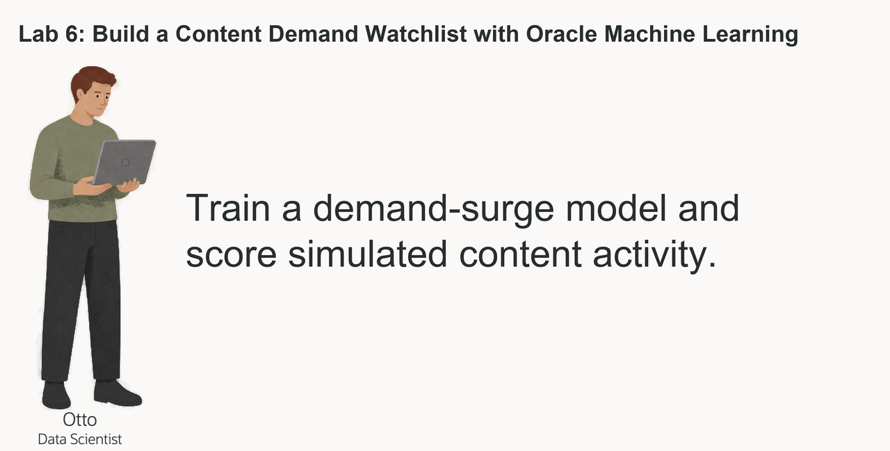
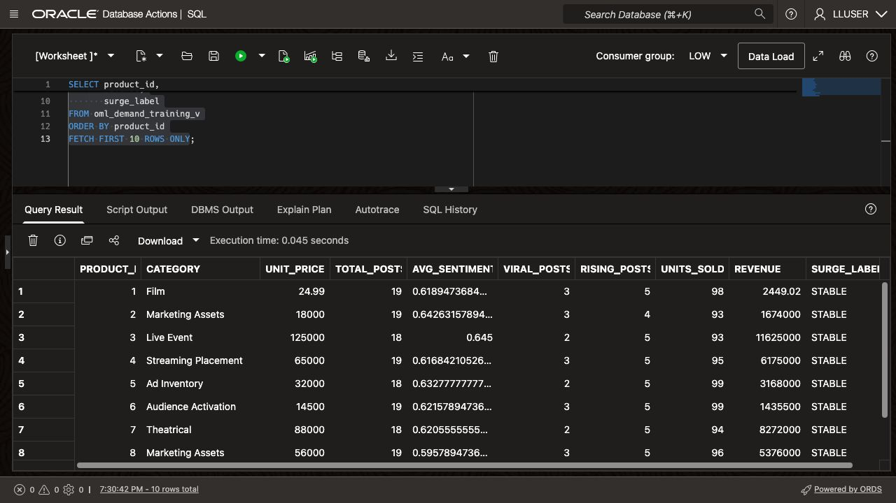
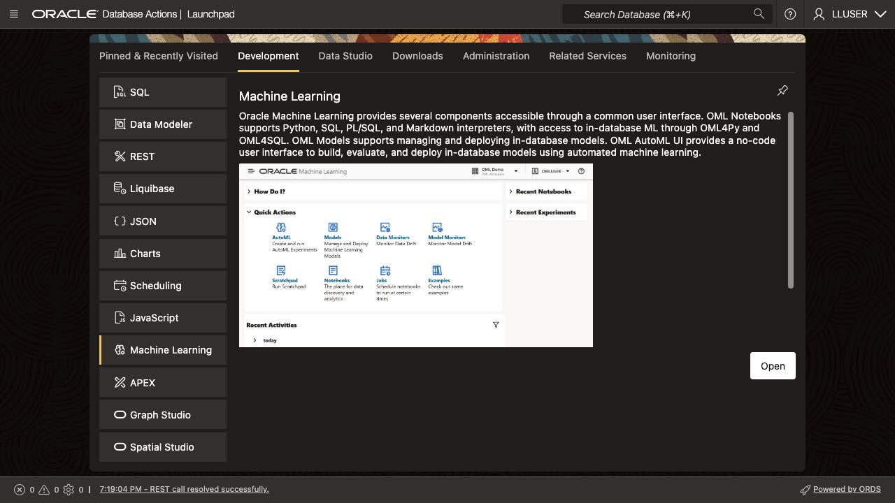
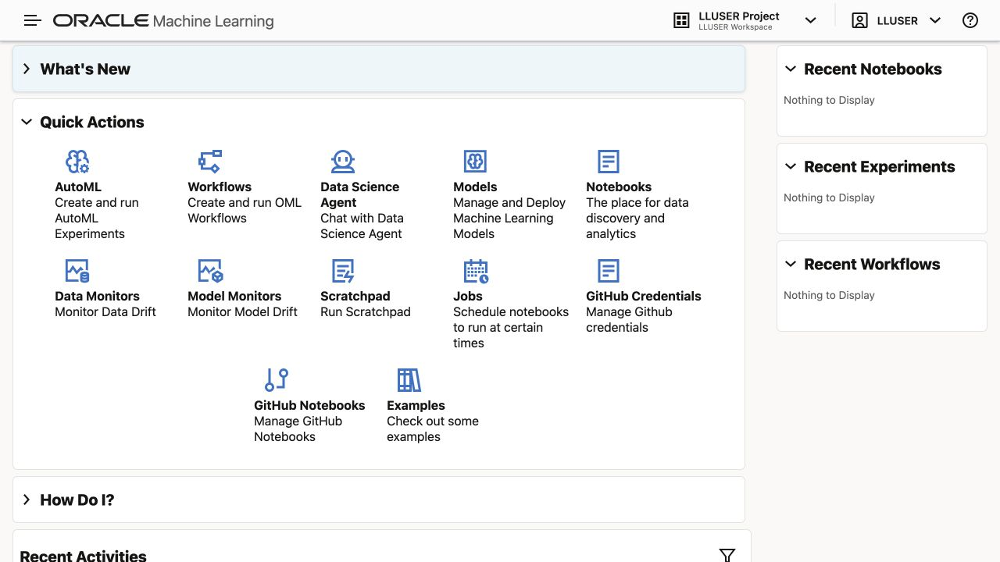
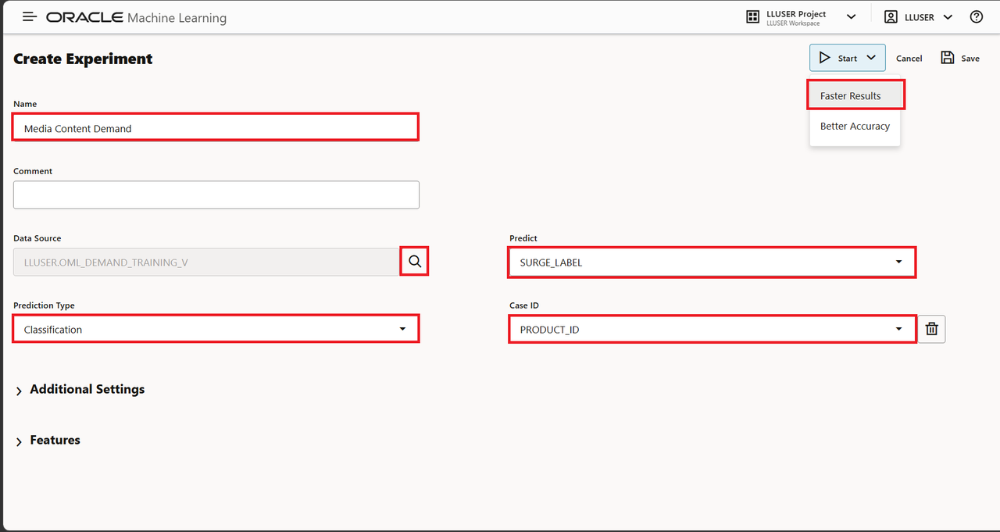
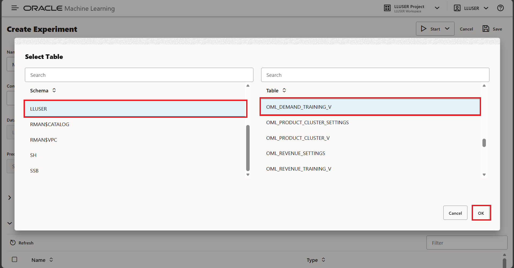
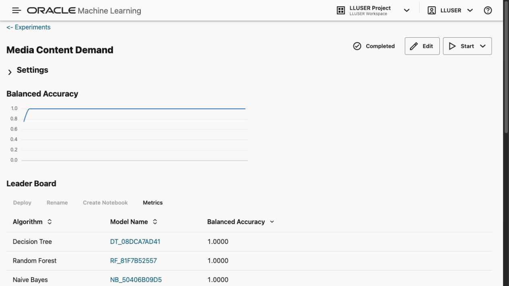
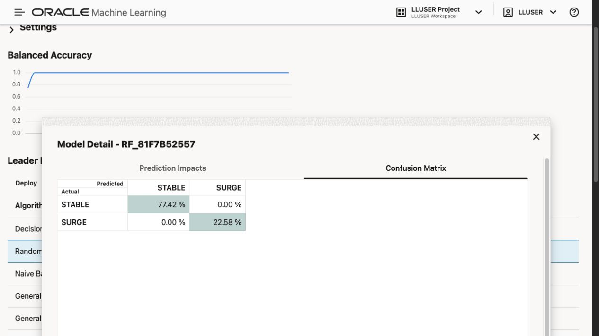
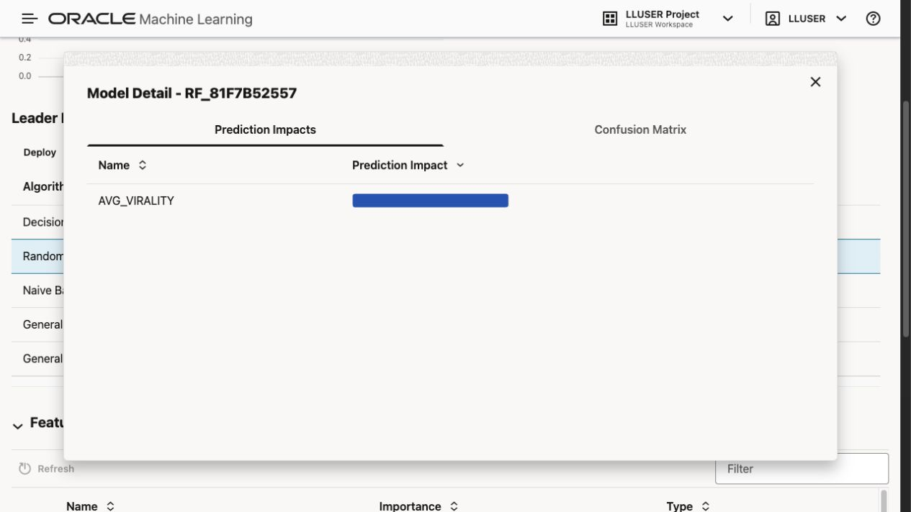
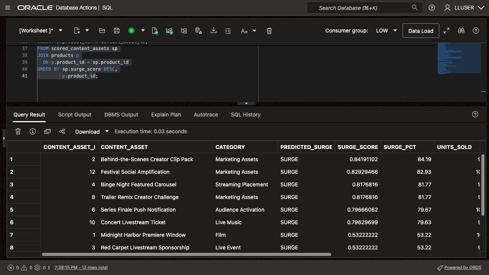

# Build a Content Demand Watchlist with Oracle Machine Learning

## Introduction

Otto Spencer is Seer Media's data scientist. His team supplies the predictions used in analytics charts and dashboards.

The content team wants a demand watchlist. A business user should be able to see which content assets may need more attention, which inputs influenced the model, and which assets already show strong campaign-order or audience activity.

Otto already has the content, campaign, and social activity data in Oracle AI Database. He trains and scores the model there, keeping the model beside its source data and the dashboard query.

The model uses content activity to classify assets as `SURGE` or `STABLE`. SQL then joins the prediction to the content name, campaign revenue, and engagement values that a dashboard needs.

In this lab, you build Otto's demand-surge model and turn its output into a review list for a business user.



<details>
<summary><strong>Key terms: model, feature, classification, probability, and in-database machine learning</strong></summary>

> - A **model** is a set of learned rules that turns input data into a prediction.
>
> - A **feature** is an input value used by the model. In this lab, features include content category, campaign value proxy, audience signals, and campaign orders.
>
> - **Classification** predicts a label. Otto's model predicts either `SURGE` or `STABLE`.
>
> - A **probability** is the model's value for a class. In this lab, the value is displayed as a `SURGE_SCORE` to rank content assets for review. It is a model score, not a measured future outcome.
>
> - **In-database machine learning** means the model is trained or scored where the source data already lives. The SQL result can include the prediction and the data used to explain it.

</details>


### Objectives

- Read the prepared training data and identify the model target.
- Optionally use AutoML to compare classification models and inspect their predictions.
- Create a Random Forest model using the loader's algorithm and features inside Oracle AI Database.
- Score content assets with `PREDICTION` and `PREDICTION_PROBABILITY`.
- Combine model output with content-asset, campaign-order, and engagement data for a dashboard result.

Estimated Time: **10 minutes**

### Hands-on Scenario

| Step                | Media & Entertainment focus                                                                                                        |
| ---------------------| ----------------------------------------------------------------------------------------------------------------------|
| Business Problem    | A business user needs a short list of content assets that may require attention.                                           |
| Technical Challenge | Otto needs to train and score a model without copying content-asset activity to another machine learning system.           |
| Persona Focus       | You follow Otto as he builds the model and checks the result before it reaches a dashboard.                          |
| What You Will See   | Optionally compare models with AutoML, then use SQL Developer Web to create and score a Random Forest model.             |
| Database Capability | AutoML, `DBMS_DATA_MINING`, `PREDICTION`, and `PREDICTION_PROBABILITY` support machine learning inside the database. |
| Outcome             | A watchlist for a dashboard combines the model result with the content-asset and activity data behind it.                  |

> **SQL Worksheet reminder:** Return to [Getting Started Task 2: Open SQL Worksheet](?lab=getting-started#Task2:OpenSQLWorksheet) for the guide showing where to paste and run SQL. Use **Run Statement** for a single query. The setup blocks in Tasks 3 and 4 contain multiple statements and require **Run Script**.

## Task 1: Read the training data

Before Otto creates a model, he checks the data that will teach it. The workshop already provides `OML_DEMAND_TRAINING_V`, a view that combines content-asset, audience-signal, and campaign-order data into one row per active content asset.

`SURGE_LABEL` is the training target. The loader ranks a weighted activity score and labels the highest quartile `SURGE`; the remaining rows receive `STABLE`. These are synthetic labels derived from current features, so model performance here does not establish future forecasting accuracy. The physical `PRODUCT_ID`, `UNIT_PRICE`, `UNITS_SOLD`, and `REVENUE` columns represent a content asset, its campaign value proxy, requested units, and campaign-order revenue in this dataset.

1. Run the training-data query:

    ```sql
    <copy>
    SELECT product_id,
           category,
           unit_price,
           total_posts,
           avg_sentiment,
           viral_posts,
           rising_posts,
           units_sold,
           revenue,
           surge_label
    FROM oml_demand_training_v
    ORDER BY product_id
    FETCH FIRST 10 ROWS ONLY;
    </copy>
    ```

2. Identify the parts of each row.

    The numeric and category columns are the model inputs. `SURGE_LABEL` is the answer the model learns to predict. `PRODUCT_ID` identifies the content asset but is not a business feature for this example.

    

    Otto checks that each training row brings together the category and activity values the model needs. The view supplies content, audience-signal, and campaign-order data directly to the training process.

## Task 2: Compare models with AutoML (optional)

Otto first uses the Oracle Machine Learning AutoML interface to compare candidate models. AutoML can select algorithms, tune them, and show how well each model distinguishes `SURGE` from `STABLE`.

The leaderboard is a starting point. Otto also checks whether the model identifies the class he needs for the watchlist.

This task is optional. AutoML can take several minutes to complete, so continue to Task 3 if you want to focus on creating and using the model in SQL Developer Web.

1. Open **Machine Learning** from Database Actions.

    Select **Machine Learning** in Database Actions. Sign in with the credentials from **View Login Info**.
    
    
    
2. Click **AutoML**.

    

3. Create a new experiment with these settings:
  
    | Setting         | Value                   |
    | -----------------| -------------------------|
    | Experiment name | `Media Content Demand`  |
    | Data source     | `OML_DEMAND_TRAINING_V` |
    | Predict         | `SURGE_LABEL`           |
    | Prediction type | `Classification`        |
    | Case ID         | `PRODUCT_ID`            |

    **Note:** The Predict, Prediction Type, and Case ID fields become available after a data source has been entered. Select `SURGE_LABEL`, `Classification`, and `PRODUCT_ID`, respectively.

     To enter the **Data Source** value:
    1. Enter *Media Content Demand* in the Name field.
    2. Select the magnifying-glass icon next to **Data Source**.

    

    3. In the **Select Table** window, select *LLUSER* from the **Schema** list.
    4. Select `OML_DEMAND_TRAINING_V` from the **Table** list.

    

    5. Select **OK**.

    Start the experiment and wait for the leaderboard. Runtime depends on service capacity.


    > **Environment note:** AutoML requires available service capacity. If the experiment cannot start, record the returned message and continue to Task 3. The loader does not include saved AutoML experiment results.

4. Review the leaderboard and model details when AutoML capacity is available.

    
  
    Compare the balanced accuracy and confusion matrix for the models in your run. A model that assigns every content asset `STABLE` cannot distinguish the watchlist candidates. Look for both predicted classes and inspect the false positives and false negatives.

    

    Review prediction impact for the selected candidate. Features such as `VIRAL_POSTS`, `AVG_VIRALITY`, `CATEGORY`, and `TOTAL_POSTS` are available, but their ranking depends on the trained model. Feature impact describes model behavior; it does not establish a cause of demand.

    

    The captured experiment reported balanced accuracy of `1.0000` for all five candidates. The selected Random Forest candidate shows `AVG_VIRALITY` as its prediction impact and no off-diagonal errors in the displayed confusion matrix. The loader derives `SURGE_LABEL` from the highest quartile of a weighted activity score. Virality, post counts, views, and units sold contribute to that score and also serve as input features. The results demonstrate the synthetic rule; they do not establish future forecasting accuracy. Your run can produce different model identifiers or rankings.

    The required SQL task uses Random Forest, matching the loader's `DEMAND_SURGE_MODEL` configuration.

## Task 3: Create the media demand model in SQL Developer Web

Otto now moves to SQL Developer Web to create a named model that a SQL query can call repeatedly. The loader already creates `DEMAND_SURGE_MODEL` from `OML_DEMAND_TRAINING_V`. This task trains a separate model, `OTTO_MEDIA_DEMAND_MODEL`, for the workshop scoring query.

The settings table tells Oracle to use the loader's **Random Forest** algorithm, 50 trees, and random seed. `PREP_AUTO` lets the database prepare the input columns.

If you skipped the optional AutoML task, use these settings as the model configuration for the workshop.

1. Create the settings table and train the model. Paste the complete block into an empty worksheet and click **Run Script**. The script contains SQL statements and PL/SQL blocks; keep each `/` terminator on its own line.

    ```sql
    <copy>
    
    DROP TABLE IF EXISTS otto_media_demand_settings;
    
    CREATE TABLE otto_media_demand_settings (
          setting_name  VARCHAR2(30),
          setting_value VARCHAR2(4000)
        );

    INSERT INTO otto_media_demand_settings (setting_name, setting_value)
    VALUES ('ALGO_NAME', 'ALGO_RANDOM_FOREST');

    INSERT INTO otto_media_demand_settings (setting_name, setting_value)
    VALUES ('PREP_AUTO', 'ON');

    INSERT INTO otto_media_demand_settings (setting_name, setting_value)
    VALUES ('RFOR_NUM_TREES', '50');

    INSERT INTO otto_media_demand_settings (setting_name, setting_value)
    VALUES ('ODMS_RANDOM_SEED', '20260505');

    COMMIT;

    DECLARE
      l_model_count NUMBER;
    BEGIN
      SELECT COUNT(*)
      INTO l_model_count
      FROM user_mining_models
      WHERE model_name = 'OTTO_MEDIA_DEMAND_MODEL';

      IF l_model_count > 0 THEN
        DBMS_DATA_MINING.DROP_MODEL('OTTO_MEDIA_DEMAND_MODEL');
      END IF;
    END;
    /

    BEGIN
      DBMS_DATA_MINING.CREATE_MODEL(
        model_name           => 'OTTO_MEDIA_DEMAND_MODEL',
        mining_function      => DBMS_DATA_MINING.CLASSIFICATION,
        data_table_name      => 'OML_DEMAND_TRAINING_V',
        case_id_column_name  => 'PRODUCT_ID',
        target_column_name   => 'SURGE_LABEL',
        settings_table_name  => 'OTTO_MEDIA_DEMAND_SETTINGS'
      );
    END;
    /
    </copy>
    ```

    The model reads the training view, learns the relationship between the features and `SURGE_LABEL`, and stores the trained model in the database. Training uses the content and activity data where they already reside.

2. Confirm that Oracle created the model. Replace the worksheet contents with this query and click **Run Statement**:

    ```sql
    <copy>
    SELECT model_name,
           mining_function,
           algorithm
    FROM user_mining_models
    WHERE model_name = 'OTTO_MEDIA_DEMAND_MODEL';
    </copy>
    ```

    The result should show `CLASSIFICATION` and `RANDOM_FOREST`. Otto now has a database model that SQL can call.

## Task 4: Score a simulated media activity snapshot in SQL

Otto now needs to score an activity snapshot for the watchlist. Create a separate scoring table by adjusting twelve feature rows from `OML_DEMAND_TRAINING_V`. These simulated scenarios demonstrate the scoring workflow; they are not independent holdout data or measured future activity.

1. Create the scoring table and add the simulated activity snapshot. Paste the complete block into an empty worksheet and click **Run Script** so the table creation, insert, and commit all execute:

    ```sql
    <copy>
    
    DROP TABLE IF EXISTS otto_media_demand_scoring_data;

    CREATE TABLE otto_media_demand_scoring_data (
      product_id    NUMBER,
      category      VARCHAR2(100),
      unit_price    NUMBER,
      total_posts   NUMBER,
      avg_sentiment NUMBER,
      total_likes   NUMBER,
      total_shares  NUMBER,
      total_views   NUMBER,
      avg_virality  NUMBER,
      viral_posts   NUMBER,
      rising_posts  NUMBER,
      units_sold NUMBER,
      revenue       NUMBER
    );

    INSERT INTO otto_media_demand_scoring_data (
      product_id,
      category,
      unit_price,
      total_posts,
      avg_sentiment,
      total_likes,
      total_shares,
      total_views,
      avg_virality,
      viral_posts,
      rising_posts,
      units_sold,
      revenue
    )
    SELECT product_id,
           category,
           unit_price,
           total_posts + 4,
           avg_sentiment,
           total_likes + 25,
           total_shares + 10,
           total_views + 500,
           LEAST(avg_virality + 5, 100),
           viral_posts + 1,
           rising_posts + 1,
           units_sold + 3,
           revenue + (unit_price * 3)
    FROM (
      SELECT product_id,
             category,
             unit_price,
             total_posts,
             avg_sentiment,
             total_likes,
             total_shares,
             total_views,
             avg_virality,
             viral_posts,
             rising_posts,
             units_sold,
             revenue,
             ROW_NUMBER() OVER (ORDER BY product_id) AS row_num
      FROM oml_demand_training_v
    )
    WHERE row_num <= 12;

    COMMIT;
    </copy>
    ```

    This creates a small simulated snapshot from the workshop data.
    > **Note:** The table has the model inputs, but it does not contain `SURGE_LABEL`. That label is the training target and is excluded from the scoring inputs.

2. Replace the worksheet contents with the scoring query and click **Run Statement**:

    ```sql
    <copy>
    WITH scored_content_assets AS (
      SELECT product_id,
             category,
             units_sold,
             revenue,
             total_posts,
             viral_posts,
             rising_posts,
             PREDICTION(
               OTTO_MEDIA_DEMAND_MODEL USING
               category, unit_price, total_posts, avg_sentiment,
               total_likes, total_shares, total_views, avg_virality,
               viral_posts, rising_posts, units_sold, revenue
             ) AS predicted_surge,
             ROUND(
               PREDICTION_PROBABILITY(
                 OTTO_MEDIA_DEMAND_MODEL,
                 'SURGE' USING
                 category, unit_price, total_posts, avg_sentiment,
                 total_likes, total_shares, total_views, avg_virality,
                 viral_posts, rising_posts, units_sold, revenue
               ), 8
             ) AS surge_score
      FROM otto_media_demand_scoring_data
    )
    SELECT p.product_id AS content_asset_id,
           p.product_name AS content_asset,
           sp.category,
           sp.predicted_surge,
           sp.surge_score,
           ROUND(sp.surge_score * 100, 2) AS surge_pct,
           sp.units_sold,
           sp.revenue,
           sp.total_posts,
           sp.viral_posts,
           sp.rising_posts
    FROM scored_content_assets sp
    JOIN products p
      ON p.product_id = sp.product_id
    ORDER BY sp.surge_score DESC,
             p.product_id;
    </copy>
    ```

3. Read the result as a dashboard user.

    `PREDICTED_SURGE` tells the dashboard which label the model selected. `SURGE_SCORE` is the model score for `SURGE`, between 0 and 1, while `SURGE_PCT` presents the same value as a percentage. The campaign-order and activity columns give the business user supporting values to review alongside the prediction.

    Otto can return a prediction, the content name, campaign-order values, and audience activity in one SQL result. The model and the data used by the dashboard remain in the same database.

    

## Conclusion: Put the Prediction Beside the Business Data

Otto used the loader's Random Forest configuration to train a model in SQL Developer Web and score a simulated activity snapshot. The optional AutoML task compared candidate models. The scoring query returns a watchlist that a dashboard can show alongside the content activity behind each score.

The model, training data, predictions, and content details stay together in Oracle AI Database. A business user can read the watchlist, inspect the supporting values, and repeat the query under the database's access controls. Read exact probabilities from your model run and interpret them as scores for the synthetic workshop labels.

## Acknowledgements

* **Author** - Kevin Lazarz
* **Contributor** - Eugenio Galiano, Linda Foinding
* **Last Updated By/Date** - Vahn Kessler, September 2026
