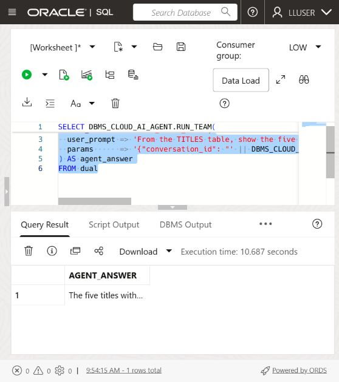
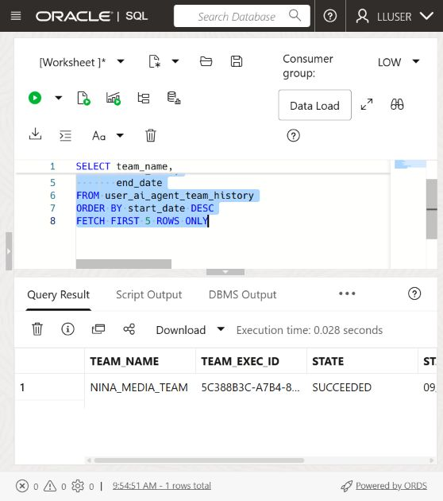
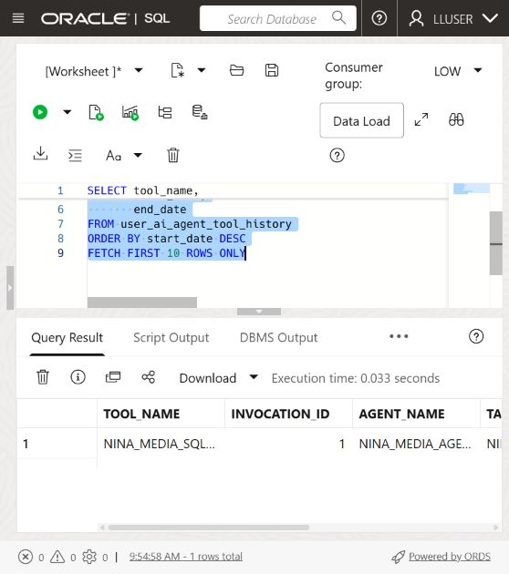

# Build a Media Operations Agent with Select AI Agent

## Introduction

> **Screenshot update note:** The `NINA_MEDIA_TEAM` setup, team-history capture, and provider-backed answer captures use the Seer Media schema and the `SEER_MEDIA_PROFILE` profile. Generated wording can vary slightly by model run.

Nina Patel has used Select AI to ask one media question at a time. That works for a quick answer, but her new viewer-review screen needs a repeatable media operations assistant that can answer a question and support follow-up requests.

Jessica, the DBA, does not want to give an AI system unrestricted access to the database. She gives Nina's agent one approved tool: a SQL tool that uses the `SEER_MEDIA_PROFILE` profile and the media tables configured in the previous lab.

In this lab, you create the agent objects, connect the agent to the SQL tool, and run a question through the team. The agent uses the approved tool and returns an answer. The tool remains read-only, and the SQL still runs with the database user's privileges.

<details>
<summary><strong>Key terms: agent, tool, task, and team</strong></summary>

> - An **agent** is a configured role that follows instructions when it handles a request.
>
> - A **tool** is a capability the agent is allowed to call. In this lab, the tool runs SQL through the `SEER_MEDIA_PROFILE` profile.
>
> - A **task** tells the agent what to do and which tools it may use.
>
> - A **team** connects the agent and task so an application or SQL session can run them together.

</details>

### Objectives

- Confirm that the `GENAI` profile from the previous lab is available.
- Verify which media tables the SQL tool may use.
- Register a read-only SQL tool for the media schema.
- Create an agent, task, and team with `DBMS_CLOUD_AI_AGENT`.
- Run a media question through the team.
- Review the agent's tool history and explain why the tool boundary matters.

Estimated Time: **15 minutes**

### Hands-on Scenario

| Step                | Media & Entertainment focus                                                                                  |
| ------------------- | ---------------------------------------------------------------------------------------------- |
| Business Problem    | Nina needs a media answer that can feed a viewer-review screen.                            |
| Technical Challenge | The agent must use database data through an approved capability, not unrestricted access.      |
| Persona Focus       | You follow Nina as she turns a Select AI question into a small media operations assistant.              |
| What You Will See   | An agent receives a request, calls its SQL tool, and returns a media answer.                 |
| Database Capability | Select AI Agent, `DBMS_CLOUD_AI_AGENT`, AI profiles, and a built-in SQL tool.                   |
| Outcome             | Nina has a controlled agent that can answer questions from the media schema.                |

> **Prerequisite:** Complete [Lab 7: Ask Media Questions with Select AI](?lab=selectai). This lab uses the `SEER_MEDIA_PROFILE` profile and its `object_list`.

## Task 1: Check the profile and table access

The agent's SQL tool uses the existing `SEER_MEDIA_PROFILE` profile. The profile's `object_list` limits the tables Select AI may use when it generates SQL. Database privileges provide the second control: the SQL still runs as the current database user and cannot read tables that user cannot access.

1. Check the profile:

    ```sql
    <copy>
    SELECT profile_name,
           status
    FROM user_cloud_ai_profiles
    WHERE profile_name = 'SEER_MEDIA_PROFILE';
    </copy>
    ```

    The profile should be enabled. If it is not present, complete Lab 7 first or ask the DBA which profile to use.

2. Check the tables listed in the profile:

    ```sql
    <copy>
    SELECT profile_name,
           attribute_name,
           attribute_value
    FROM user_cloud_ai_profile_attributes
    WHERE profile_name = 'SEER_MEDIA_PROFILE'
      AND attribute_name = 'object_list';
    </copy>
    ```

    The list should contain only the workshop tables needed for this lab: `TITLES`, `VIEWING_SESSIONS`, `VIEWING_EVENTS`, and `VIEWERS`. The `object_list` guides SQL generation; it is not a replacement for database grants.

3. Check the agent objects already in your schema:

    ```sql
    <copy>
    SELECT agent_name,
           status
    FROM user_ai_agents
    ORDER BY agent_name;
    </copy>
    ```

  The workshop objects use names beginning with `NINA_MEDIA_`. If you already ran this lab, you can reuse the existing objects or run the reset block in the appendix before starting again.

## Task 2: Register the SQL tool

The SQL tool is the agent's only database capability in this lab. It uses the `SEER_MEDIA_PROFILE` profile, so the profile's object list limits the schema metadata available for generated SQL.

1. Register the tool:

    ```sql
    <copy>
    BEGIN
      DBMS_CLOUD_AI_AGENT.CREATE_TOOL(
        tool_name   => 'NINA_MEDIA_SQL_TOOL',
        attributes  => '{"tool_type": "SQL", "tool_params": {"profile_name": "SEER_MEDIA_PROFILE"}}',
        description => 'Read-only SQL access to the workshop media tables'
      );
    END;
    /
    </copy>
    ```

    The tool does not create a second data store. It gives the agent a named, controlled way to ask Select AI to generate and run SQL against the existing media tables. The tool uses the profile's table list, and the database user's privileges still apply when the SQL runs.
  
2. Confirm the tool definition:

    ```sql
    <copy>
    SELECT tool_name,
           status,
           description
    FROM user_ai_agent_tools
    WHERE tool_name = 'NINA_MEDIA_SQL_TOOL';
    </copy>
    ```
  
## Task 3: Create Nina's agent, task, and team

The tool by itself does nothing. Nina's agent needs a role, a task needs instructions, and a team connects the two.

1. Create the agent:

    ```sql
    <copy>
    BEGIN
      DBMS_CLOUD_AI_AGENT.CREATE_AGENT(
        agent_name  => 'NINA_MEDIA_AGENT',
        attributes  => '{"profile_name": "SEER_MEDIA_PROFILE", "role": "You are Nina Patel''s Seer Media data assistant. Answer questions using the approved SQL tool. Use database results for title, viewing session, viewing event, and viewer facts. Do not invent values."}',
        description => 'Media & Entertainment assistant for Nina Patel'
      );
    END;
    /
    </copy>
    ```

2. Create the task:

    ```sql
    <copy>
    BEGIN
      DBMS_CLOUD_AI_AGENT.CREATE_TASK(
        task_name  => 'NINA_MEDIA_TASK',
        attributes => '{"instruction": "Answer Nina''s media question: {query}. Use NINA_MEDIA_SQL_TOOL once to retrieve the required data. Return a concise answer based on the database result. Do not repeat the same tool call and do not make changes to database records.", "tools": ["NINA_MEDIA_SQL_TOOL"], "enable_human_tool": "false"}',
        description => 'Answer read-only title and viewer questions'
      );
    END;
    /
    </copy>
    ```
  
3. Create the team:

    ```sql
    <copy>
    BEGIN
      DBMS_CLOUD_AI_AGENT.CREATE_TEAM(
        team_name  => 'NINA_MEDIA_TEAM',
        attributes => '{"agents": [{"name": "NINA_MEDIA_AGENT", "task": "NINA_MEDIA_TASK"}], "process": "sequential"}',
        description => 'Read-only media question team'
      );
    END;
    /
    </copy>
    ```

    The team is the runnable unit. It connects Nina's role, the task instructions, and the SQL tool.
  
## Task 4: Run a media question

Database Actions does not support the `SELECT AI AGENT` command directly. Use `DBMS_CLOUD_AI_AGENT.RUN_TEAM` in SQL Worksheet and provide the team name in the function call.

1. Ask the agent:

    ```sql
    <copy>
    SELECT DBMS_CLOUD_AI_AGENT.RUN_TEAM(
             team_name   => 'NINA_MEDIA_TEAM',
             user_prompt => 'From the TITLES table, show the five titles with the highest revenue per view. Include title name, content type, genre, distribution window, and revenue per view.',
             params      => '{"conversation_id": "' || DBMS_CLOUD_AI.CREATE_CONVERSATION() || '"}'
           ) AS agent_answer;
    </copy>
    ```
  
    Database Actions does not keep an agent conversation ID for this call, so the query creates one and passes it to `RUN_TEAM`. The ID lets Oracle record the prompt and response in the agent conversation history.

    

2. Review the answer.

    Look for the title ranking, content type, genre, distribution window, and revenue per view. The exact wording may vary because an AI provider generates the response, but the answer should be based on the media tables available through `SEER_MEDIA_PROFILE`.
  
    > **Note:** This team has a read-only SQL tool. It can query the data, but the task instructions do not give it a tool for inserting, updating, or deleting records.

3. Optional challenge: ask a follow-up question that connects the highest-revenue title to its viewers and viewing_sessions. A more detailed request may take longer because the agent has to interpret more steps.

## Task 5: Inspect what the agent did

Nina needs more than a final answer. She also wants to know whether the agent called the approved tool and how the request was processed.

1. Review the latest team runs:

    ```sql
    <copy>
    SELECT team_name,
         team_exec_id,
         state,
         start_date,
         end_date
    FROM user_ai_agent_team_history
    ORDER BY start_date DESC
    FETCH FIRST 5 ROWS ONLY;
    </copy>
    ```

    

    The captured workshop environment shows the database history row for `NINA_MEDIA_TEAM`. A completed run confirms that the team reached its approved SQL tool; generated response wording can vary by model run.

2. Review the latest tool calls:

    ```sql
    <copy>
    SELECT tool_name,
         invocation_id,
         agent_name,
         task_name,
         start_date,
         end_date
    FROM user_ai_agent_tool_history
    ORDER BY start_date DESC
    FETCH FIRST 10 ROWS ONLY;
    </copy>
    ```

    

  The history should show `NINA_MEDIA_SQL_TOOL`. This gives Nina and Jessica a database record of the agent activity instead of treating the answer as an unexplained chat response.

## Conclusion: Give the agent a controlled way to work

In Lab 7, Nina used Select AI to turn a question into SQL. In this lab, she gave an agent a role, a task, and one approved SQL tool. The agent can handle a broader request and decide when it needs database information, while the database still controls the profile, object list, privileges, and tool history.

That is the next step from Select AI to Select AI Agent: the application can call a defined media operations assistant instead of assembling every question and database call itself. Jessica can review the tools available to the agent and remove access by disabling the tool or team.

The table boundary has two parts. The profile's `object_list` tells the SQL tool which tables to consider, while database grants decide which rows the session can actually read. Both should be kept narrow when an agent is used by an application.

The example remains read-only on purpose. Before an agent is allowed to change data, the team should add a narrowly defined function tool, clear instructions, and a confirmation step for the user.

## Appendix: Reset the workshop objects

Run this block only if you want to recreate the objects used in this lab. It removes only the four names created here.

    ```sql
    <copy>
    BEGIN
      DBMS_CLOUD_AI_AGENT.DROP_TEAM('NINA_MEDIA_TEAM', TRUE);
      DBMS_CLOUD_AI_AGENT.DROP_TASK('NINA_MEDIA_TASK', TRUE);
      DBMS_CLOUD_AI_AGENT.DROP_AGENT('NINA_MEDIA_AGENT', TRUE);
      DBMS_CLOUD_AI_AGENT.DROP_TOOL('NINA_MEDIA_SQL_TOOL', TRUE);
    END;
    /
    </copy>
    ```

## Next Steps

Read the [Oracle AI Database Select AI Agent documentation](https://docs.oracle.com/en/database/oracle/oracle-database/26/selai/).

## Acknowledgements

* **Author** - Kevin Lazarz
* **Contributor** - Eugenio Galiano
* **Last Updated By/Date** - Oracle Database Product Management, August 2026
