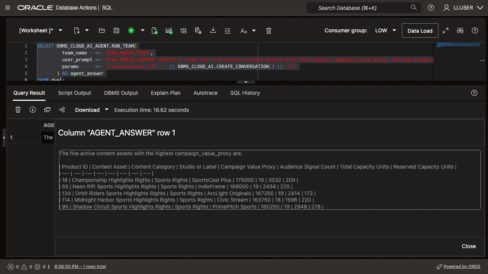
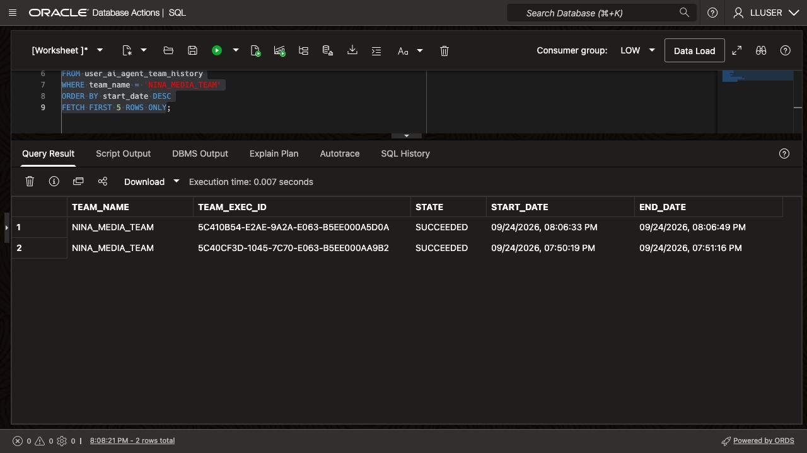
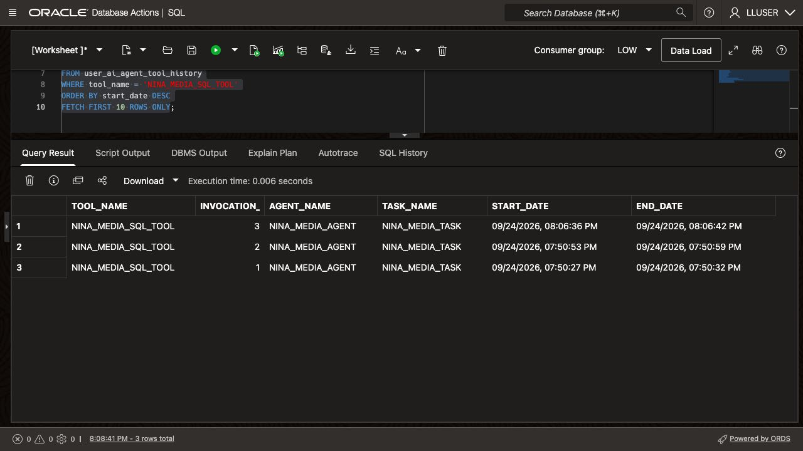

# Build a Media Operations Agent with Select AI Agent

## Introduction

> **Screenshots:** These examples show live Media results. Model responses and execution times can vary; compare your returned values with the direct SQL baseline from Lab 7.

Nina Patel used Select AI to ask one media question at a time. Her campaign review screen now needs an assistant that can answer questions and handle follow-up requests.

Jessica, the DBA, gives the agent one approved SQL tool. It uses `SEER_MEDIA_PROFILE` and the Media semantic views from the previous lab.

In this lab, you create an agent, task, and team, then run a question through the SQL tool. You check the answer and the tool history. SQL runs with the database user's privileges; `LLUSER` owns the workshop data and can modify it.

<details>
<summary><strong>Key terms: agent, tool, task, and team</strong></summary>

> - An **agent** is a configured role that follows instructions when it handles a request.
>
> - A **tool** is a capability the agent is allowed to call. In this lab, the tool runs SQL through the `SEER_MEDIA_PROFILE` profile.
>
> - A **task** tells the agent what to do and which tools it may use.
>
> - A **team** connects the agent and task so an application or SQL session can run them together.

</details>

### Objectives

- Confirm that the `SEER_MEDIA_PROFILE` profile from the previous lab is available.
- Verify which Media semantic views the SQL tool may use.
- Register a SQL tool for querying the Media semantic views.
- Create an agent, task, and team with `DBMS_CLOUD_AI_AGENT`.
- Run a media question through the team.
- Review the agent's tool history and explain why the tool boundary matters.

Estimated Time: **15 minutes**

### Hands-on Scenario

| Step                | Media & Entertainment focus                                                                                  |
| ------------------- | ---------------------------------------------------------------------------------------------- |
| Business Problem    | Nina needs a media answer that can feed a campaign-review screen.                            |
| Technical Challenge | The agent must use database data through an approved capability, not unrestricted access.      |
| Persona Focus       | You follow Nina as she turns a Select AI question into a small media operations assistant.              |
| What You Will See   | An agent receives a request, calls its SQL tool, and returns a media answer.                 |
| Database Capability | Select AI Agent, `DBMS_CLOUD_AI_AGENT`, AI profiles, and a built-in SQL tool.                   |
| Outcome             | Nina has a controlled agent that can answer questions from the media schema.                |

> **Prerequisite:** Complete [Lab 7: Ask Media Questions with Select AI](?lab=selectai). This lab uses the enabled `SEER_MEDIA_PROFILE` profile and its enforced `object_list`. If the administrator supplied another profile name, use it throughout. The administrator must also grant `EXECUTE` on `DBMS_CLOUD_AI_AGENT` to `LLUSER`; the handoff loader does not include that grant.

## Task 1: Check the profile and view access

`SEER_MEDIA_PROFILE` lists five Media semantic views and enables `enforce_object_list`. Database privileges determine what the current user can access. A prompt or tool description does not change those privileges.

1. Check the profile:

    ```sql
    <copy>
    SELECT profile_name,
           status
    FROM user_cloud_ai_profiles
    WHERE profile_name = 'SEER_MEDIA_PROFILE';
    </copy>
    ```

    The profile should be enabled. If it is not present, complete Lab 7 first or ask the DBA which profile to use.

2. Check the views and enforcement setting in the profile:

    ```sql
    <copy>
    SELECT profile_name,
           attribute_name,
           attribute_value
    FROM user_cloud_ai_profile_attributes
    WHERE profile_name = 'SEER_MEDIA_PROFILE'
      AND attribute_name IN ('object_list', 'enforce_object_list')
    ORDER BY attribute_name;
    </copy>
    ```

    The list should contain `MEDIA_CONTENT_ASSETS_V`, `MEDIA_CAMPAIGN_ORDERS_V`, `MEDIA_AUDIENCE_SIGNALS_V`, `MEDIA_DISTRIBUTION_CAPACITY_V`, and `MEDIA_CREATOR_RELATIONSHIPS_V`. Confirm that `enforce_object_list` is `true`. The views expose Media names over the loader's physical tables; enforcement is not a replacement for database grants.

3. Check the agent objects already in your schema:

    ```sql
    <copy>
    SELECT agent_name,
           status
    FROM user_ai_agents
    ORDER BY agent_name;
    </copy>
    ```

    The workshop objects use names beginning with `NINA_MEDIA_`. If you already ran this lab, you can reuse the existing objects or run the reset block in the appendix before starting again.

## Task 2: Register the SQL tool

The SQL tool is the agent's only database capability in this lab. It uses the `SEER_MEDIA_PROFILE` profile, so its enforced object list limits the objects used by generated SQL.

1. Register the tool:

    ```sql
    <copy>
    BEGIN
      DBMS_CLOUD_AI_AGENT.CREATE_TOOL(
        tool_name   => 'NINA_MEDIA_SQL_TOOL',
        attributes  => '{"tool_type": "SQL", "tool_params": {"profile_name": "SEER_MEDIA_PROFILE"}, "instruction": "Use this built-in SQL tool to translate a natural-language question into a database query. Set ACTION to RUNSQL when asked for data. QUERY must contain the original natural-language question unchanged, including every requested column, filter, ordering rule and row limit. Do not write a SQL SELECT statement in QUERY. Use only the five Media views configured in SEER_MEDIA_PROFILE. Do not request data changes."}',
        description => 'Query Media semantic views through Select AI'
      );
    END;
    /
    </copy>
    ```

    The [built-in SQL tool](https://docs.oracle.com/en/cloud/paas/autonomous-database/serverless/adbsb/dbms-cloud-ai-agent-package.html) uses actions such as `runsql` and `showsql` to query the Media views. The profile's object list and the database user's privileges apply when it runs SQL.

    The instructions tell the agent to pass the complete question to `QUERY` and choose `RUNSQL` for data requests. This preserves the requested columns, filter, ordering, and row limit. Check the returned answer to confirm that the agent followed those instructions.
  
2. Confirm the tool definition:

    ```sql
    <copy>
    SELECT tool_name,
           status,
           description
    FROM user_ai_agent_tools
    WHERE tool_name = 'NINA_MEDIA_SQL_TOOL';
    </copy>
    ```
  
## Task 3: Create Nina's agent, task, and team

Define the agent's role and task instructions, then connect them in a team.

1. Create the agent:

    ```sql
    <copy>
    BEGIN
      DBMS_CLOUD_AI_AGENT.CREATE_AGENT(
        agent_name  => 'NINA_MEDIA_AGENT',
        attributes  => '{"profile_name": "SEER_MEDIA_PROFILE", "role": "You are Nina Patel''s Seer Media data assistant. Use NINA_MEDIA_SQL_TOOL to obtain database evidence. The tool accepts a natural-language QUERY, not SQL text. For data questions choose ACTION RUNSQL. Preserve all returned values and row order; do not calculate a different ranking or replace rows. Distinguish campaign_value_proxy, an asset unit-price proxy, from actual campaign_value. Do not invent values."}',
        description => 'Media & Entertainment assistant for Nina Patel'
      );
    END;
    /
    </copy>
    ```

2. Create the task:

    ```sql
    <copy>
    BEGIN
      DBMS_CLOUD_AI_AGENT.CREATE_TASK(
        task_name  => 'NINA_MEDIA_TASK',
        attributes => '{"instruction": "Answer Nina''s question below. Call NINA_MEDIA_SQL_TOOL once with ACTION RUNSQL and copy the complete question between QUESTION_BEGIN and QUESTION_END unchanged into QUERY. Do not convert the question into SQL. Return all requested columns for every returned row in a table, preserving the tool result values and order. Do not re-sort, re-rank, select alternative rows, or omit columns. For a five-row request, if the tool returns a different number of rows or omits a requested column, report the discrepancy instead of guessing. Do not repeat the same tool call or change database records. QUESTION_BEGIN {query} QUESTION_END", "tools": ["NINA_MEDIA_SQL_TOOL"], "enable_human_tool": "false"}',
        description => 'Answer Media content and campaign questions'
      );
    END;
    /
    </copy>
    ```
  
3. Create the team:

    ```sql
    <copy>
    BEGIN
      DBMS_CLOUD_AI_AGENT.CREATE_TEAM(
        team_name  => 'NINA_MEDIA_TEAM',
        attributes => '{"agents": [{"name": "NINA_MEDIA_AGENT", "task": "NINA_MEDIA_TASK"}], "process": "sequential"}',
        description => 'Media question team with one SQL tool'
      );
    END;
    /
    </copy>
    ```

    The team is the runnable unit. It connects Nina's role, the task instructions, and the SQL tool.
  
## Task 4: Run a media question

Database Actions does not support the `SELECT AI AGENT` command directly. Use `DBMS_CLOUD_AI_AGENT.RUN_TEAM` in SQL Worksheet and provide the team name in the function call.

1. Ask the agent:

    ```sql
    <copy>
    SELECT DBMS_CLOUD_AI_AGENT.RUN_TEAM(
             team_name   => 'NINA_MEDIA_TEAM',
             user_prompt => 'From MEDIA_CONTENT_ASSETS_V, show the five active content assets with the highest campaign_value_proxy. Include product_id, content_asset, content_category, studio_or_label, campaign_value_proxy, audience_signal_count, total_capacity_units, and reserved_capacity_units. Filter is_active = 1. Order by campaign_value_proxy descending and product_id ascending.',
             params      => '{"conversation_id": "' || DBMS_CLOUD_AI.CREATE_CONVERSATION() || '"}'
           ) AS agent_answer
    FROM dual;
    </copy>
    ```
  
    The query creates a conversation ID and passes it to `RUN_TEAM`. Oracle uses the ID to record the prompt and response in conversation history.

    

    Optional recovery: if SQL Worksheet reports a timeout or `Code execution failed`, the team may still be running. Check its latest execution with the Task 5 history query before resubmitting. Wait for a running team to finish. Once its state is `SUCCEEDED`, retrieve the saved answer below.

    ```sql
    <copy>
    WITH latest_team AS (
      SELECT team_exec_id, state
      FROM user_ai_agent_team_history
      WHERE team_name = 'NINA_MEDIA_TEAM'
      ORDER BY start_date DESC
      FETCH FIRST 1 ROW ONLY
    )
    SELECT h.team_exec_id,
           h.state AS team_state,
           t.state AS task_state,
           t.result AS agent_answer
    FROM latest_team h
    JOIN user_ai_agent_task_history t
      ON t.team_exec_id = h.team_exec_id
    WHERE t.task_name = 'NINA_MEDIA_TASK'
    ORDER BY t.task_order;
    </copy>
    ```

2. Review the answer.

    Check the five assets and all eight requested columns against the Lab 7 result. The model may use different wording, but the values and row order should match.
  
    > **Note:** `LLUSER` retains write privileges for other workshop labs. For an application, use a separate account with `SELECT` grants on only the approved views to enforce read-only access. Prompt instructions alone do not enforce it.

3. Optional challenge: use `PRODUCT_ID` from the ranking as `CONTENT_ASSET_ID` in `MEDIA_DISTRIBUTION_CAPACITY_V`. Ask which distribution hubs have the lowest unreserved capacity, calculated as `CAPACITY_UNITS_AVAILABLE - CAPACITY_UNITS_RESERVED`. A more detailed request may take longer because the agent has to interpret more steps.

## Task 5: Inspect what the agent did

Nina checks which tool the agent called and whether the request finished.

1. Review the latest team runs:

    ```sql
    <copy>
    SELECT team_name,
         team_exec_id,
         state,
         start_date,
         end_date
    FROM user_ai_agent_team_history
    WHERE team_name = 'NINA_MEDIA_TEAM'
    ORDER BY start_date DESC
    FETCH FIRST 5 ROWS ONLY;
    </copy>
    ```

    

    A completed history row shows that the team finished. The next step checks whether it invoked the SQL tool.

2. Review the latest tool calls:

    ```sql
    <copy>
    SELECT tool_name,
         invocation_id,
         agent_name,
         task_name,
         start_date,
         end_date
    FROM user_ai_agent_tool_history
    WHERE tool_name = 'NINA_MEDIA_SQL_TOOL'
    ORDER BY start_date DESC
    FETCH FIRST 10 ROWS ONLY;
    </copy>
    ```

    

    Look for `NINA_MEDIA_SQL_TOOL`. The [history views](https://docs.oracle.com/en/cloud/paas/autonomous-database/serverless/adbsb/dbms-cloud-ai-agent-views-history.html) also expose the team execution ID, tool input, and tool output.

    The history includes an earlier run with two tool calls, despite an instruction to call the tool once. That instruction guides the model; it does not enforce a call limit. Match each call to its team execution in the next step.

3. Match the tool calls to the latest team execution:

    ```sql
    <copy>
    WITH latest_team AS (
      SELECT team_exec_id, team_name, state, start_date, end_date
      FROM user_ai_agent_team_history
      WHERE team_name = 'NINA_MEDIA_TEAM'
      ORDER BY start_date DESC
      FETCH FIRST 1 ROW ONLY
    )
    SELECT h.team_name, h.team_exec_id, h.state,
           h.start_date AS team_start,
           h.end_date AS team_end,
           t.tool_name, t.invocation_id,
           t.start_date AS tool_start,
           t.end_date AS tool_end
    FROM latest_team h
    LEFT JOIN user_ai_agent_tool_history t
      ON t.team_exec_id = h.team_exec_id
    ORDER BY t.start_date;
    </copy>
    ```

    Check for a successful team and matching `NINA_MEDIA_SQL_TOOL` calls. Empty tool columns mean this query found no matching invocation. Compare the answer with the Lab 7 baseline to check its accuracy.

## Conclusion: Give the agent a controlled way to work

Nina created an agent with a role, a task, and one SQL tool. She checked its answer against database results and linked its tool call to a successful team execution.

The enforced `object_list` limits generated SQL, while database grants and row-level policies control data access. Jessica can disable the tool or team when it is no longer needed. An application that allows data changes would need suitable privileges and a tool designed for that operation.

## Appendix: Reset the workshop objects

1. Run this block only if you want to recreate the objects used in this lab. It removes only the four names created here.

    ```sql
    <copy>
    BEGIN
      DBMS_CLOUD_AI_AGENT.DROP_TEAM('NINA_MEDIA_TEAM', TRUE);
      DBMS_CLOUD_AI_AGENT.DROP_TASK('NINA_MEDIA_TASK', TRUE);
      DBMS_CLOUD_AI_AGENT.DROP_AGENT('NINA_MEDIA_AGENT', TRUE);
      DBMS_CLOUD_AI_AGENT.DROP_TOOL('NINA_MEDIA_SQL_TOOL', TRUE);
    END;
    /
    </copy>
    ```

## Next Steps

Read the [Oracle AI Database Select AI Agent documentation](https://docs.oracle.com/en/database/oracle/oracle-database/26/selai/).

## Acknowledgements

* **Author** - Kevin Lazarz
* **Contributor** - Eugenio Galiano
* **Last Updated By/Date** - Oracle Database Product Management, September 2026
