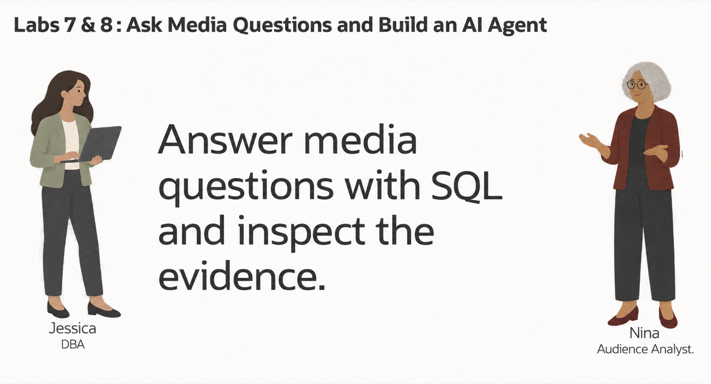
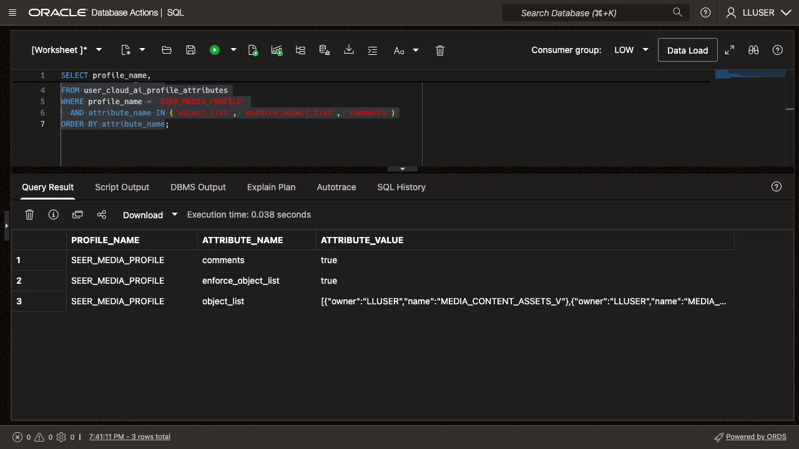
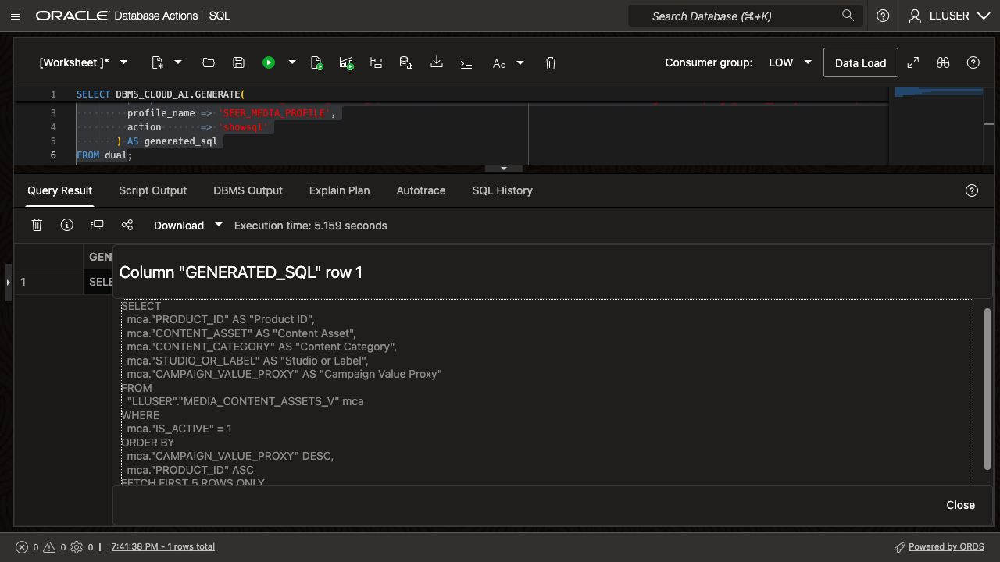
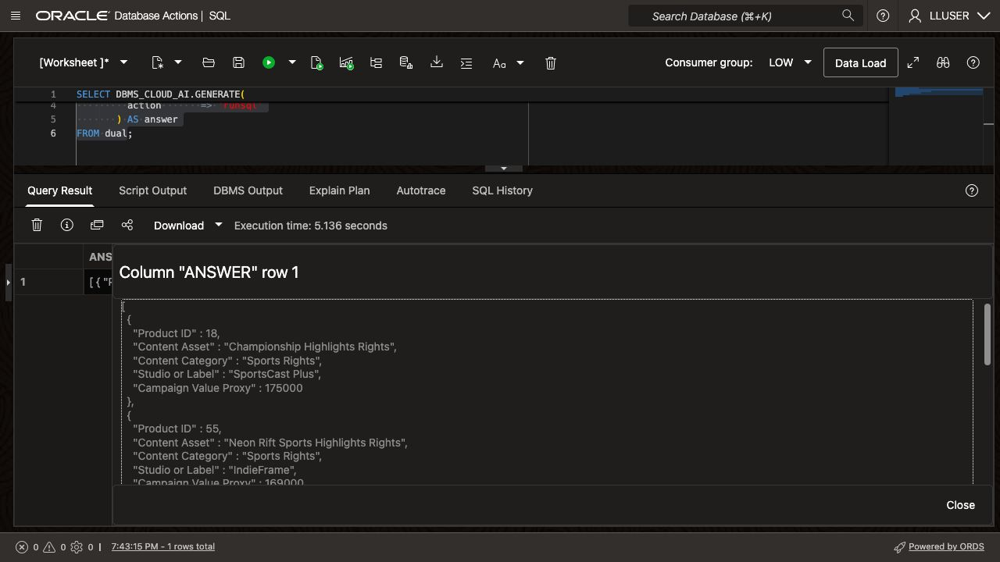
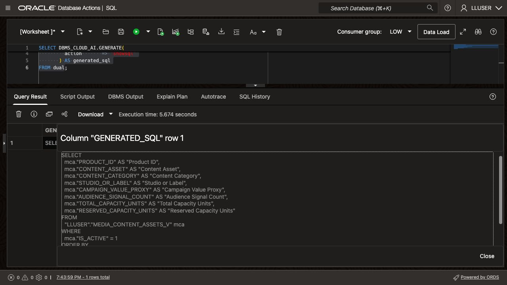
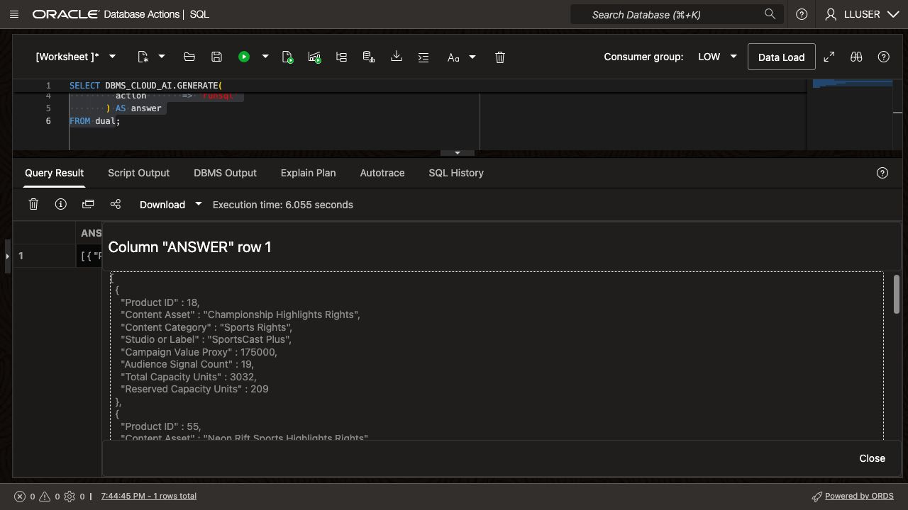
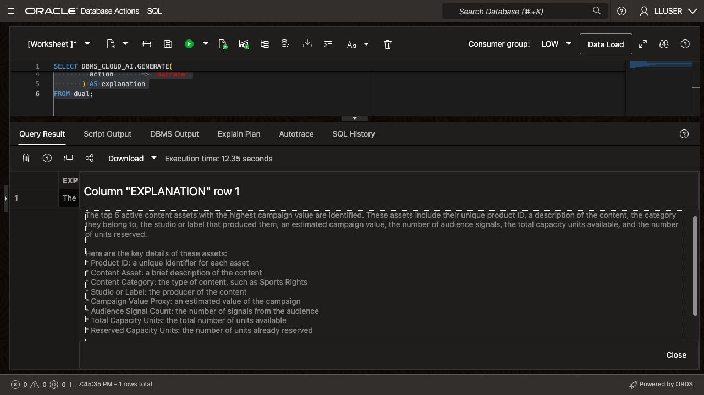

# Ask Media Questions with Select AI

## Introduction

> **Screenshots:** These examples show live Media results. Screenshots show excerpts; open the CLOB value in SQL Worksheet to inspect the full SQL, JSON result, or explanation. Model responses can vary between runs.

Nina Patel is an audience insights analyst at Seer Media. She wants to ask business questions without first finding the right tables, columns, joins, and filters.

Jessica, the DBA, configures a Select AI profile for the media schema before this lab. The handoff loader creates the data and semantic views; it does not create provider credentials or an AI profile. Nina can ask a question in ordinary language. Select AI uses the profile and the database metadata to generate SQL, run it, or explain the result.

Nina reviews the generated SQL because the model can misunderstand a question or choose the wrong columns. She checks the statement before running it and refines her question when the result lacks useful details.

In this lab, you check the Select AI profile, ask a media question, inspect the generated SQL, and refine the question.



<details>
<summary><strong>Key terms: Select AI, AI profile, generated SQL, and natural-language prompt</strong></summary>

> - **Select AI** lets a user work with database information through a natural-language question.
>
> - An **AI profile** connects Select AI to an AI provider and identifies the database objects that may be used for the question.
>
> - **Generated SQL** is the SQL statement created from the question. Nina should inspect it before relying on the result.
>
> - A **natural-language prompt** is the question sent to Select AI, such as `Which five content assets have the highest campaign value proxy?`

</details>

### Objectives

- Check which Select AI profile is available in the schema.
- Add the five Media semantic views to the profile and enforce its object list.
- Generate SQL from a media question and inspect it.
- Run a natural-language question through `DBMS_CLOUD_AI.GENERATE`.
- Improve a question so the result contains the business details Nina needs.
- Explain why generated SQL still requires review.

Estimated Time: **10 minutes**

### Hands-on Scenario

| Step                | Media & Entertainment focus                                                                                |
| ---------------------| ----------------------------------------------------------------------------------------------|
| Business Problem    | Nina needs answers from media data without writing every query from scratch.               |
| Technical Challenge | The question must be translated into SQL against the governed media schema.                |
| Persona Focus       | You follow Nina as she checks, reviews, and improves a Select AI question.                   |
| What You Will See   | A natural-language question becomes SQL that can be inspected and run in the database.       |
| Database Capability | Select AI, `DBMS_CLOUD_AI`, AI profiles, and natural-language-to-SQL generation.             |
| Outcome             | Nina gets a repeatable way to ask media questions while keeping SQL review in the process. |

> **SQL Worksheet reminder:** [Getting Started Task 2: Open SQL Worksheet](?lab=getting-started#Task2:OpenSQLWorksheet) shows where to paste and run SQL statements.

## Task 1: Check the Select AI profile

An AI profile identifies the provider and the database objects available for questions. Before starting, confirm that the administrator has enabled provider access, granted `EXECUTE` on `DBMS_CLOUD_AI` to `LLUSER`, and created an enabled profile. The [Media platform preparation guide](../media-platform-preparation.md) configures `SEER_MEDIA_PROFILE` with an OCI resource principal. It uses the database identity and existing OCI authorization.

1. Run this query:

    ```sql
    <copy>
    SELECT profile_name,
           status,
           description
    FROM user_cloud_ai_profiles
    ORDER BY profile_name;
    </copy>
    ```

    The examples use `SEER_MEDIA_PROFILE`. Confirm that it is enabled. If the administrator supplied an enabled profile such as `GENAI`, substitute that name in every example in this lab and the Select AI Agent lab. If no enabled profile exists, complete the provider setup with the administrator before continuing.

2. Review the profile attributes:
  
    ```sql
    <copy>
    SELECT profile_name,
           attribute_name,
           attribute_value
    FROM user_cloud_ai_profile_attributes
    ORDER BY profile_name, attribute_name;
    </copy>
    ```

    The attributes show the provider configuration and available database objects. Task 2 updates the object list, enforcement setting, and metadata comments setting.

    If `credential_name` is `OCI$RESOURCE_PRINCIPAL`, check the grant below. The credential belongs to `ADMIN`, so an empty `USER_CREDENTIALS` result does not mean it is missing.

    ```sql
    <copy>
    SELECT table_schema,
           table_name,
           grantee,
           privilege,
           grantable
    FROM all_tab_privs
    WHERE table_schema = 'ADMIN'
      AND table_name = 'OCI$RESOURCE_PRINCIPAL'
      AND grantee = USER
      AND privilege = 'EXECUTE';
    </copy>
    ```

    Expect an `EXECUTE` grant for `LLUSER`. Profile and grant metadata establish configuration; Task 3 tests whether the selected model can answer a request. For another provider, retain the facilitator's approved credential and network configuration.

## Task 2: Add the Media semantic views to the profile

The loader keeps physical names such as `PRODUCTS`, `ORDERS`, and `CUSTOMERS` for application compatibility. Its five `MEDIA_*` views expose content assets, campaign orders, audience signals, distribution capacity, and creator relationships using Media business terms. Jessica adds these views to `SEER_MEDIA_PROFILE`.

1. Add the Media semantic views and enable object-list enforcement:

    ```sql
    <copy>
    BEGIN
      DBMS_CLOUD_AI.SET_ATTRIBUTE(
        profile_name    => 'SEER_MEDIA_PROFILE',
        attribute_name  => 'object_list',
        attribute_value => '[{"owner":"' || USER || '","name":"MEDIA_CONTENT_ASSETS_V"},' ||
                           '{"owner":"' || USER || '","name":"MEDIA_CAMPAIGN_ORDERS_V"},' ||
                           '{"owner":"' || USER || '","name":"MEDIA_AUDIENCE_SIGNALS_V"},' ||
                           '{"owner":"' || USER || '","name":"MEDIA_DISTRIBUTION_CAPACITY_V"},' ||
                           '{"owner":"' || USER || '","name":"MEDIA_CREATOR_RELATIONSHIPS_V"}]'
      );
      DBMS_CLOUD_AI.SET_ATTRIBUTE(
        profile_name    => 'SEER_MEDIA_PROFILE',
        attribute_name  => 'enforce_object_list',
        attribute_value => 'true'
      );
      DBMS_CLOUD_AI.SET_ATTRIBUTE(
        profile_name    => 'SEER_MEDIA_PROFILE',
        attribute_name  => 'comments',
        attribute_value => 'true'
      );
    END;
    /
    </copy>
    ```

2. Confirm the object list:

    ```sql
    <copy>
    SELECT profile_name,
           attribute_name,
           attribute_value
    FROM user_cloud_ai_profile_attributes
    WHERE profile_name = 'SEER_MEDIA_PROFILE'
      AND attribute_name IN ('object_list', 'enforce_object_list', 'comments')
    ORDER BY attribute_name;
    </copy>
    ```

    The result should list the five `MEDIA_*` views and show `true` for `enforce_object_list` and `comments`. The loader supplies descriptions for those views. Object-list enforcement restricts generated SQL to listed objects; database privileges still apply. See [Oracle profile attributes](https://docs.oracle.com/en/cloud/paas/autonomous-database/serverless/adbsb/dbms-cloud-ai-package.html).
  
    

## Task 3: Ask a question and inspect the SQL

Nina starts with a simple question: which active content assets have the highest campaign value proxy? She first asks Select AI to show the SQL without running it. The proxy is the loader's `PRODUCTS.UNIT_PRICE` exposed as `CAMPAIGN_VALUE_PROXY`; it is not measured campaign revenue.

Database Actions does not support the `SELECT AI` keyword. In SQL Worksheet, use `DBMS_CLOUD_AI.GENERATE` and provide the profile name directly.

1. Run the question with the `SEER_MEDIA_PROFILE` profile:

    ```sql
    <copy>
    SELECT DBMS_CLOUD_AI.GENERATE(
             prompt       => 'From MEDIA_CONTENT_ASSETS_V, show the five active content assets with the highest campaign_value_proxy. Include product_id, content_asset, content_category, studio_or_label, and campaign_value_proxy. Filter is_active = 1. Order by campaign_value_proxy descending and product_id ascending.',
             profile_name => 'SEER_MEDIA_PROFILE',
             action       => 'showsql'
           ) AS generated_sql
    FROM dual;
    </copy>
    ```
  
    

2. Read the generated SQL before running it.

    Check whether the statement uses `MEDIA_CONTENT_ASSETS_V`, filters `IS_ACTIVE = 1`, and returns five rows. The expected ordering is `CAMPAIGN_VALUE_PROXY DESC, PRODUCT_ID ASC`. A statement can be valid SQL and still answer the wrong question.

## Task 4: Run the question in the database

Nina has reviewed the SQL. She now asks Select AI to run the question and return the database result.

1. Run the same question with the `runsql` action:

    ```sql
    <copy>
    SELECT DBMS_CLOUD_AI.GENERATE(
             prompt       => 'From MEDIA_CONTENT_ASSETS_V, show the five active content assets with the highest campaign_value_proxy. Include product_id, content_asset, content_category, studio_or_label, and campaign_value_proxy. Filter is_active = 1. Order by campaign_value_proxy descending and product_id ascending.',
             profile_name => 'SEER_MEDIA_PROFILE',
             action       => 'runsql'
           ) AS answer
    FROM dual;
    </copy>
    ```
  
    

2. Compare the answer with the SQL you inspected in Task 3.

    Compare the response with this direct SQL check:

    ```sql
    <copy>
    SELECT product_id,
           content_asset,
           content_category,
           studio_or_label,
           campaign_value_proxy
    FROM media_content_assets_v
    WHERE is_active = 1
    ORDER BY campaign_value_proxy DESC, product_id ASC
    FETCH FIRST 5 ROWS ONLY;
    </copy>
    ```

    Select AI runs the generated SQL against the media schema using Nina's database privileges.

    > **Note:** Separate `showsql` and `runsql` calls may generate different SQL. To execute the exact statement you inspected, copy that SQL into the worksheet and run it directly. Compare the `runsql` response with the direct check above.

## Task 5: Improve the business question

Nina adds audience signal count, total capacity units, and reserved capacity units to the ranking. These fields help her review each asset. The value proxy still represents unit price, not actual revenue.

1. Use `showsql` to inspect this revised prompt:

    ```sql
    <copy>
    SELECT DBMS_CLOUD_AI.GENERATE(
             prompt       => 'From MEDIA_CONTENT_ASSETS_V, show the five active content assets with the highest campaign_value_proxy. Include product_id, content_asset, content_category, studio_or_label, campaign_value_proxy, audience_signal_count, total_capacity_units, and reserved_capacity_units. Filter is_active = 1. Order by campaign_value_proxy descending and product_id ascending.',
             profile_name => 'SEER_MEDIA_PROFILE',
             action       => 'showsql'
           ) AS generated_sql
    FROM dual;
    </copy>
    ```
  
    

2. Review the generated SQL, then run the revised question with `runsql`:

    ```sql
    <copy>
    SELECT DBMS_CLOUD_AI.GENERATE(
             prompt       => 'From MEDIA_CONTENT_ASSETS_V, show the five active content assets with the highest campaign_value_proxy. Include product_id, content_asset, content_category, studio_or_label, campaign_value_proxy, audience_signal_count, total_capacity_units, and reserved_capacity_units. Filter is_active = 1. Order by campaign_value_proxy descending and product_id ascending.',
             profile_name => 'SEER_MEDIA_PROFILE',
             action       => 'runsql'
           ) AS answer
    FROM dual;
    </copy>
    ```
  
    

3. Compare the first and second questions.

    Check that the second result includes the audience and capacity fields. Nina uses view and column names to make her request precise, then checks whether the generated SQL includes them.

## Task 6: Explain the result

Nina wants a short explanation of the revised result. Select AI can run the SQL and ask the AI provider to describe the returned rows.

1. Run the revised question with the `narrate` action:

    ```sql
    <copy>
    SELECT DBMS_CLOUD_AI.GENERATE(
             prompt       => 'From MEDIA_CONTENT_ASSETS_V, show the five active content assets with the highest campaign_value_proxy. Include product_id, content_asset, content_category, studio_or_label, campaign_value_proxy, audience_signal_count, total_capacity_units, and reserved_capacity_units. Filter is_active = 1. Order by campaign_value_proxy descending and product_id ascending.',
             profile_name => 'SEER_MEDIA_PROFILE',
             action       => 'narrate'
           ) AS explanation
    FROM dual;
    </copy>
    ```
  
    

2. Review the explanation against the SQL result.

    The captured response describes the columns but omits the five asset names and their values. It also says "highest campaign value," although the question ranks `campaign_value_proxy`. That proxy is an asset's unit price, not actual campaign order value. Nina cannot use this response as a complete business answer.

    Compare your explanation with the `runsql` output from Task 5. Check the asset names, row order, proxy values, audience signal counts, and both capacity columns. In the captured result, Championship Highlights Rights ranks first. Its proxy is 175000, with 19 audience signals, 3032 total capacity units, and 209 reserved capacity units. Check that any explanation of this row preserves those values and meanings.

    Use your returned rows to evaluate the explanation. Model wording can vary, and missing values must be checked in the SQL result.

    > **Note:** The `narrate` action sends the query result to the AI provider configured in the profile. Use it only for data approved for that provider.

## Conclusion: Ask, Inspect, and Refine

Nina generated SQL from a media question, checked it, ran it, and added audience and capacity fields. She also found an explanation that omitted the requested values.

Use the same review process for other questions: inspect the SQL, check its source and filters, and compare the returned rows with the answer. Database privileges apply throughout.

## Next Steps

For the full list of Select AI actions, profile attributes, and supported providers, see the [Oracle AI Database 26ai Select AI documentation](https://docs.oracle.com/en/database/oracle/oracle-database/26/selai/).

## Acknowledgements

* **Author** - Kevin Lazarz
* **Contributor** - Eugenio Galiano
* **Last Updated By/Date** - Vahn Kessler, September 2026
