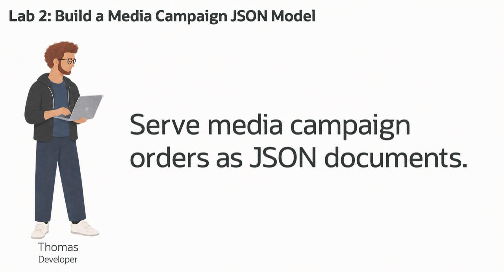
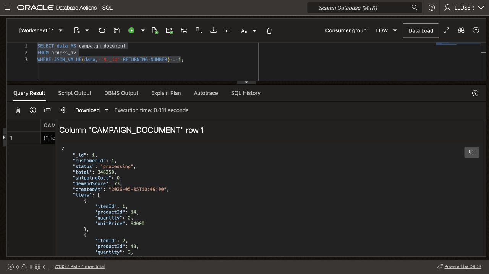
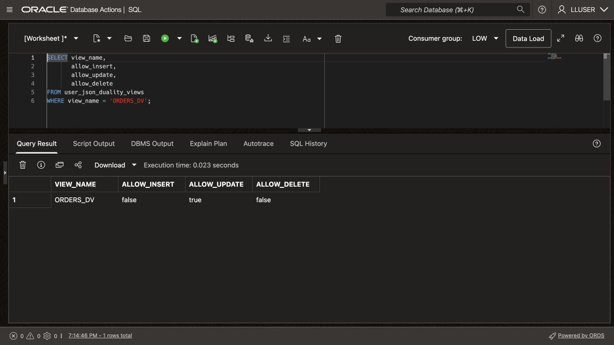
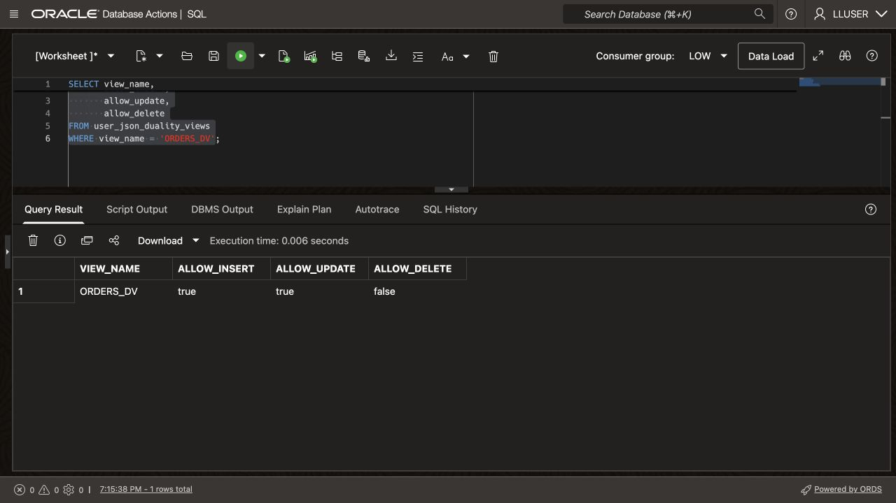
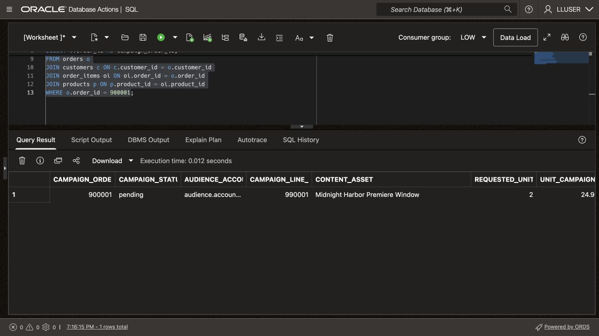
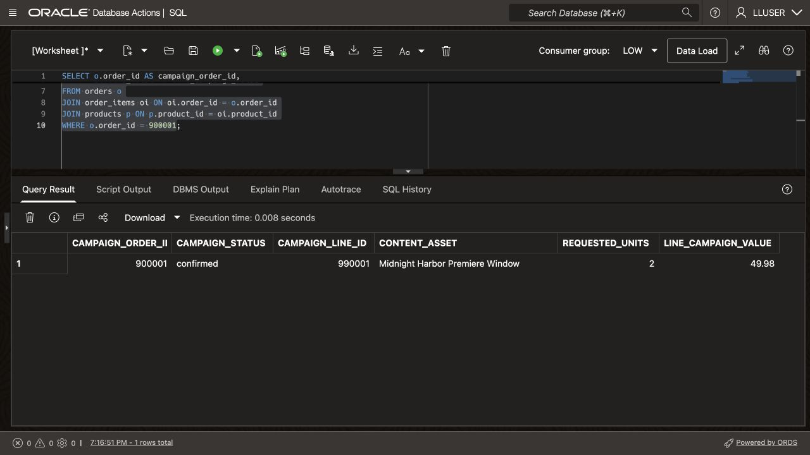
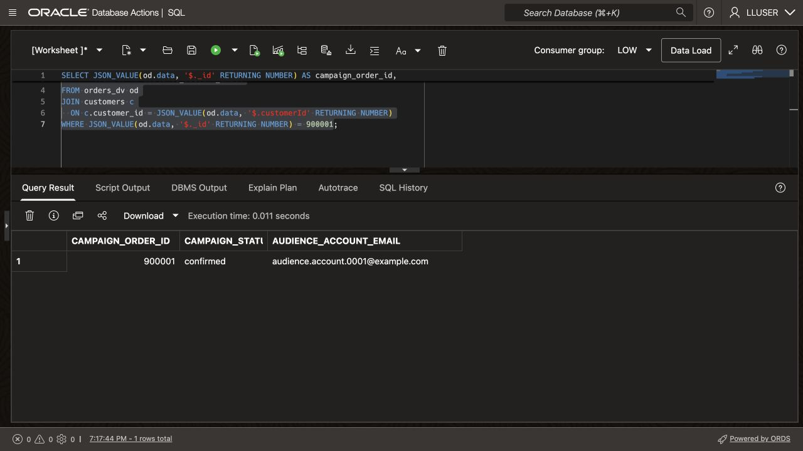
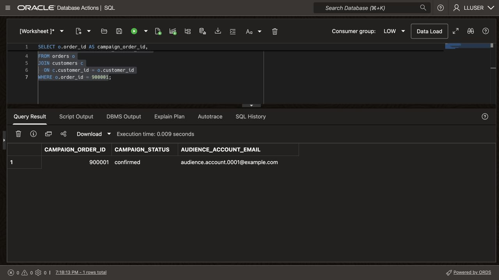

# Build a JSON Campaign Application Model

## Introduction

Thomas Brune develops Seer Media's web and mobile campaign application. His team wants fewer database round trips and payloads that match its screens and services.

One JSON payload can group an audience account, campaign status, asset line items, and optional application attributes. Thomas needs that flexibility while preserving the existing relational keys, SQL transactions, and database controls.

Thomas and Jessica, the DBA, compare three JSON approaches. They try a JSON column, a document collection, and a JSON Relational Duality View over existing relational rows. You will use each approach and decide which fits a campaign feature.



<details>
<summary><strong>Key terms: JSON columns, JSON collections, and JSON Relational Duality</strong></summary>

> - A **JSON column** stores a JSON value in a relational table alongside normal typed columns, keys, and constraints. Thomas can use it for optional or changing application attributes without turning every new attribute into a schema change.
>
> - A **JSON collection** is a special table or view that provides a set of JSON documents through one `JSON`-typed `DATA` column. Each document can have a top-level `_id` used to identify it.
>
> - **JSON Relational Duality** lets Oracle Database expose relational data as JSON documents without copying it into a separate document database. The application gets the document shape Thomas wants for its API. The database keeps the relational rows and controls.
>

</details>

Thomas's application needs a payload with the campaign order and its line items together, such as this:

```json
{
  "_id": 900001,
  "customerId": 1,
  "status": "pending",
  "total": 49.98,
  "shippingCost": 0,
  "items": [
    { "itemId": 990001, "productId": 1, "quantity": 2, "unitPrice": 24.99 }
  ]
}
```

The loader retains physical names such as `ORDERS`, `CUSTOMERS`, and `PRODUCTS`. In this media dataset, they represent campaign orders, audience accounts, and content assets. The JSON keys `customerId`, `productId`, `quantity`, `total`, and `shippingCost` follow that existing contract. They represent the audience account, content asset, requested units, campaign value, and distribution cost. The application can use media-facing labels without changing those stored keys.

The application uses this document shape, while the database keeps the campaign order and line items in relational form. In this lab, you build and read this type of payload in three ways.

### Objectives

- Store flexible application attributes as JSON in a relational table.
- Create and query a JSON Collection Table of campaign-order documents.
- Read and update relational campaign order data through `ORDERS_DV`.
- Compare the three JSON approaches and choose the right one for an application feature.

Estimated Time: **10 minutes**

### Hands-on Scenario

| Step | Media & Entertainment focus |
| --- | --- |
| Business Problem | Thomas's team needs flexible JSON payloads for a new campaign-operations web and mobile application. |
| Technical Challenge | The team needs application-friendly documents while the database keeps relational keys, joins, and controls. |
| Persona Focus | Thomas tests JSON storage, collections, and duality with Jessica's database guidance. |
| What You Will See | One Oracle AI Database supports several JSON access patterns over the media data. |
| Database Capability | Native JSON, SQL/JSON functions, and JSON Relational Duality work together. |
| Outcome | Thomas can choose a document shape over the existing campaign data. |

Persona focus: You are Thomas, working with Jessica to decide how the new application should store, assemble, and read campaign order data.

### Thomas's three JSON choices

Thomas does not need one JSON pattern for every feature. A JSON column holds optional application attributes in a relational table. A JSON Collection Table holds documents owned by the application. A duality view assembles a document from existing relational tables. Thomas uses the document shape in the application, while Jessica works with the underlying rows using SQL.

Each approach supports SQL access. The choice depends on whether Thomas needs flexible attributes, independent documents, or documents over existing relational rows.

> **SQL Worksheet reminder:** See [Getting Started Task 2: Open SQL Worksheet](?lab=getting-started#Task2:OpenSQLWorksheet) for setup and query instructions.

## Task 1: Store flexible application data as JSON

Thomas adds a table with a native `JSON` column for optional screen settings. A relational campaign-order key connects those settings to the existing campaign data.

1. Create the application-data table and add one sample payload.

    ```sql
    <copy>
    CREATE TABLE thomas_app_data (
        campaign_order_id NUMBER PRIMARY KEY,
        app_data          JSON NOT NULL
    );

    INSERT INTO thomas_app_data (campaign_order_id, app_data)
    SELECT order_id,
           JSON_OBJECT(
               'screen'    VALUE 'campaign-detail',
               'showTotal' VALUE 'true' FORMAT JSON,
               'features'  VALUE JSON_ARRAY('campaign-status', 'saved-audience')
               RETURNING JSON
           )
    FROM (
        SELECT order_id
        FROM orders
        ORDER BY order_id
        FETCH FIRST 1 ROW ONLY
    );

    COMMIT;
    </copy>
    ```

2. Read values from the JSON column.

    ```sql
    <copy>
    SELECT campaign_order_id,
           JSON_VALUE(app_data, '$.screen') AS screen_name,
           JSON_VALUE(app_data, '$.showTotal' RETURNING BOOLEAN) AS show_total,
           JSON_QUERY(app_data, '$.features') AS app_features
    FROM thomas_app_data;
    </copy>
    ```

    `CAMPAIGN_ORDER_ID` remains a relational key. `APP_DATA` can change as the application changes. Thomas can query both with SQL in one table.

## Task 2: Create a JSON Collection Table

Thomas now creates a document collection. Each row stores a document in `DATA`, and `_id` identifies it.

1. Create the collection and add the sample campaign order document.

    ```sql
    <copy>
    CREATE JSON COLLECTION TABLE thomas_campaign_docs
    WITH ETAG;

    INSERT INTO thomas_campaign_docs (data)
    SELECT JSON_OBJECT(
               '_id'        VALUE o.order_id,
               'customerId' VALUE o.customer_id,
               'status'     VALUE o.order_status,
               'items'      VALUE (
                   SELECT JSON_ARRAYAGG(
                              JSON_OBJECT(
                                  'itemId'    VALUE oi.item_id,
                                  'productId' VALUE oi.product_id,
                                  'quantity'  VALUE oi.quantity,
                                  'unitPrice' VALUE oi.unit_price
                                  RETURNING JSON
                              ) ORDER BY oi.item_id RETURNING JSON
                          )
                   FROM order_items oi
                   WHERE oi.order_id = o.order_id
               ) FORMAT JSON
               RETURNING JSON
           )
    FROM orders o
    JOIN thomas_app_data t ON t.campaign_order_id = o.order_id;

    COMMIT;
    </copy>
    ```

    `WITH ETAG` adds an `_metadata.etag` value that changes with the document. An application can compare the tag it last read with the current tag before updating. A mismatch identifies an intervening change and helps the application avoid overwriting it.

2. Query the collection as documents.

    ```sql
    <copy>
    SELECT JSON_SERIALIZE(data PRETTY) AS campaign_document
    FROM thomas_campaign_docs
    WHERE JSON_VALUE(data, '$._id' RETURNING NUMBER) =
          (SELECT campaign_order_id FROM thomas_app_data);
    </copy>
    ```

    Document APIs and SQL can read the same `DATA` column. This collection stores independent documents, separate from `ORDERS` and `ORDER_ITEMS`.

## Task 3: Read a campaign document from relational data

Thomas now tests the document shape his application can consume directly.

1. Run this query:

    This query selects the JSON `DATA` column from `ORDERS_DV` so Thomas can inspect the document shape in SQL Worksheet.

    <details>
    <summary><strong>Why this matters to Thomas</strong></summary>

    > Thomas can use a JSON Collection Table when the application owns the document. But the campaign order already has relational tables that Jessica and other teams rely on.
    > The duality view gives Thomas a document over those existing rows. He can choose the application shape without copying the campaign order into another store.

    </details>

    ```sql
    <copy>
    SELECT data AS campaign_document
    FROM orders_dv
    WHERE JSON_VALUE(data, '$._id' RETURNING NUMBER) = 1;
    </copy>
    ```

    **Expected output: Campaign Order 1**

    The seeded document has `_id` `1`, `customerId` `1`, status `processing`, and total `348250`. Its three line items refer to content assets `14`, `43`, and `72`.

    

2. Expand the document in SQL Worksheet.
    Oracle constructs this document from the relational rows. Its `_id`, `customerId`, status, totals, timestamps, and line items form the application payload. The same campaign order remains available as relational rows for analysis.

    > **Note:** Look for `_metadata.etag` in the document. The ETAG changes when the document changes, so Thomas's application can detect a newer version before updating the campaign order and avoid overwriting another request.

## Task 4: Enable document inserts and updates

The existing `ORDERS_DV` allows campaign updates. You will extend it to accept new documents while preserving relational keys and constraints. In a deployed application, Jessica can grant view access while withholding direct table access. Here, `LLUSER` owns the view and its tables.

1. Check the current document-write capabilities.

    ```sql
    <copy>
    SELECT view_name,
           allow_insert,
           allow_update,
           allow_delete
    FROM user_json_duality_views
    WHERE view_name = 'ORDERS_DV';
    </copy>
    ```

    **Expected output: Current Document Capabilities**

    

    Immediately after the loader runs, the view allows updates but not new top-level documents. If you repeat this lab, insertion may already be enabled. The root `ORDERS` table controls document insertion. The nested `ORDER_ITEMS` rows must also allow inserts so the document can include line items.

2. Enable insert and update for the document and its line items.

    Change the duality-view definition with two `WITH INSERT UPDATE` clauses. These allow document creation and updates while Oracle enforces relational keys and data types.

    ```sql
    <copy>
    CREATE OR REPLACE JSON RELATIONAL DUALITY VIEW orders_dv AS
    SELECT JSON {
        '_id'         : o.order_id,
        'customerId'  : o.customer_id,
        'status'      : o.order_status,
        'total'       : o.order_total,
        'shippingCost': o.shipping_cost,
        'demandScore' : o.demand_score,
        'createdAt'   : o.created_at,
        'items' : [
            SELECT JSON {
                'itemId'    : oi.item_id,
                'productId' : oi.product_id,
                'quantity'  : oi.quantity,
                'unitPrice' : oi.unit_price
            }
            FROM order_items oi WITH INSERT UPDATE
            WHERE oi.order_id = o.order_id
        ]
    }
    FROM orders o WITH INSERT UPDATE;
    </copy>
    ```

    This duality view uses two relational tables. `ORDERS` provides the document root. Related `ORDER_ITEMS` rows become the nested `items` collection. The `WITH INSERT UPDATE` clauses let Thomas write the complete JSON document while Oracle maintains the rows and relationships.

    **Expected output: View Definition Updated**

    Oracle created or replaced the duality view. Verify the new capabilities in the next step.

3. Run the capability query again.

    ```sql
    <copy>
    SELECT view_name,
           allow_insert,
           allow_update,
           allow_delete
    FROM user_json_duality_views
    WHERE view_name = 'ORDERS_DV';
    </copy>
    ```

    **Expected output: Document Capabilities Enabled**

    

    The view now accepts new campaign documents and updates. The application sends one document, and Oracle writes its order and line items to the relational tables.

## Task 5: Create and update a JSON campaign order

Thomas creates a campaign document, changes its status, and checks the resulting relational rows.

1. Insert the supplied workshop campaign order document.

    Insert through `ORDERS_DV`; Oracle writes the underlying `ORDERS` and `ORDER_ITEMS` rows. Campaign `900001` uses account `1` and asset `1`, **Midnight Harbor Premiere Window**. It requests two units at `24.99` each, totaling `49.98`, with status `pending`.

    Order ID `900001` and line-item ID `990001` fall outside the seeded ranges. On repeat runs, `NOT EXISTS` preserves the existing campaign.

    ```sql
    <copy>
    INSERT INTO orders_dv (data)
    SELECT JSON(
      '{
        "_id": 900001,
        "customerId": 1,
        "status": "pending",
        "total": 49.98,
        "shippingCost": 0,
        "demandScore": 80,
        "createdAt": "2026-05-05T16:30:00",
        "items": [
          {
            "itemId": 990001,
            "productId": 1,
            "quantity": 2,
            "unitPrice": 24.99
          }
        ]
      }'
    )
    WHERE NOT EXISTS (
      SELECT 1
      FROM orders
      WHERE order_id = 900001
    );

    COMMIT;
    </copy>
    ```

    **Expected output: Campaign Order Document Created**

    On the first run, you insert one document. On later runs, the `NOT EXISTS` check returns zero rows because the workshop campaign order is already present.

2. Confirm the JSON document became relational rows.

    > **Note:** This query reads the relational tables `ORDERS` and `ORDER_ITEMS`.

    ```sql
    <copy>
    SELECT o.order_id AS campaign_order_id,
           o.order_status AS campaign_status,
           c.email AS audience_account_email,
           oi.item_id AS campaign_line_id,
           p.product_name AS content_asset,
           oi.quantity AS requested_units,
           oi.unit_price AS unit_campaign_value,
           oi.line_total AS line_campaign_value
    FROM orders o
    JOIN customers c ON c.customer_id = o.customer_id
    JOIN order_items oi ON oi.order_id = o.order_id
    JOIN products p ON p.product_id = oi.product_id
    WHERE o.order_id = 900001;
    </copy>
    ```

    **Expected output: Created Campaign Order Rows**

    On the first run, campaign `900001` has status `pending`, audience email `audience.account.0001@example.com`, asset `Midnight Harbor Premiere Window`, two requested units, and line campaign value `49.98`.

    

3. Update the document status through the duality view.

    Change the document's `status` from `pending` to `confirmed`. Oracle maps that field to `ORDERS.ORDER_STATUS`; the remaining fields stay unchanged.

    ```sql
    <copy>
    UPDATE orders_dv
    SET data = JSON_TRANSFORM(data, SET '$.status' = 'confirmed')
    WHERE JSON_VALUE(data, '$._id' RETURNING NUMBER) = 900001;

    COMMIT;
    </copy>
    ```

    **Expected output: Campaign Order Status Updated**

    Oracle updates one document. The following query confirms that the relational campaign-order row now has status `confirmed`.

4. Verify the updated relational status.

    ```sql
    <copy>
    SELECT o.order_id AS campaign_order_id,
           o.order_status AS campaign_status,
           oi.item_id AS campaign_line_id,
           p.product_name AS content_asset,
           oi.quantity AS requested_units,
           oi.line_total AS line_campaign_value
    FROM orders o
    JOIN order_items oi ON oi.order_id = o.order_id
    JOIN products p ON p.product_id = oi.product_id
    WHERE o.order_id = 900001;
    </copy>
    ```

    **Expected output: Updated Campaign Order Rows**

    

## Task 6: Project JSON fields with SQL

Jessica now checks the JSON contract that Thomas's application receives. She projects selected document fields into SQL columns, then compares them with the relational rows. This also tests the fields used by campaign searches and status filters.

1. Run this SQL/JSON projection query:

    `JSON_VALUE` extracts the campaign ID, status, and audience-account identifier. The query joins that identifier to `CUSTOMERS` to retrieve the account email.

    ```sql
    <copy>
    SELECT JSON_VALUE(od.data, '$._id' RETURNING NUMBER) AS campaign_order_id,
           JSON_VALUE(od.data, '$.status') AS campaign_status,
           c.email AS audience_account_email
    FROM orders_dv od
    JOIN customers c
      ON c.customer_id = JSON_VALUE(od.data, '$.customerId' RETURNING NUMBER)
    WHERE JSON_VALUE(od.data, '$._id' RETURNING NUMBER) = 900001;
    </copy>
    ```

    **Expected output: JSON Field Projection**

    

2. Run the equivalent query against the relational tables.

    ```sql
    <copy>
    SELECT o.order_id AS campaign_order_id,
           o.order_status AS campaign_status,
           c.email AS audience_account_email
    FROM orders o
    JOIN customers c
      ON c.customer_id = o.customer_id
    WHERE o.order_id = 900001;
    </copy>
    ```

    

    Compare the result with the previous query. The campaign order ID, status, and audience-account email should match. Thomas's application is reading the JSON document, while Jessica's relational query reads the underlying rows.

## Conclusion: Choose the right JSON approach

Thomas does not have to choose one JSON model for the whole application. He can choose based on who owns the data and whether the application needs a document over existing relational rows.

| Approach                          | Use it when                                                                                 | Example in Thomas's application                                                                            | Where the data lives                                                                                           |
| -----------------------------------| ---------------------------------------------------------------------------------------------| ------------------------------------------------------------------------------------------------------------| ----------------------------------------------------------------------------------------------------------------|
| JSON column in a relational table | A relational record needs optional or changing attributes.                                  | Store screen settings or campaign-management options alongside a campaign order key.                          | A normal relational table with a native `JSON` column.                                                         |
| JSON Collection Table             | The application owns a set of JSON documents and needs document-style access.               | Store saved campaign drafts that may change as planners add or remove assets.                              | A JSON Collection Table with one document in each `DATA` row.                                                  |
| JSON Relational Duality View      | The data already belongs in relational tables, but the application needs one JSON document. | Return a campaign order with its status and line items, or accept a new campaign-order document from the app. | Relational tables such as `ORDERS` and `ORDER_ITEMS`; the duality view defines the JSON shape for Thomas's app. |

For Thomas, `ORDERS_DV` is the right choice for the campaign order feature because `ORDERS` and `ORDER_ITEMS` already hold governed media data. The application gets the JSON payload it needs, while Jessica keeps SQL, relational constraints, and controlled access to the same data.


## Acknowledgements

* **Author** - Kevin Lazarz
* **Contributor** - Eugenio Galiano
* **Last Updated By/Date** - Vahn Kessler, September 2026
