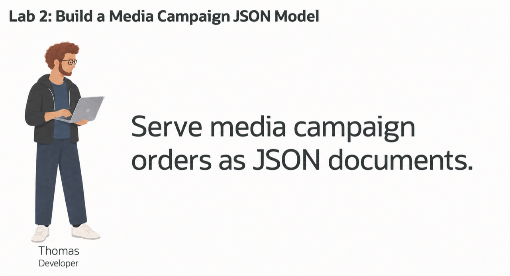
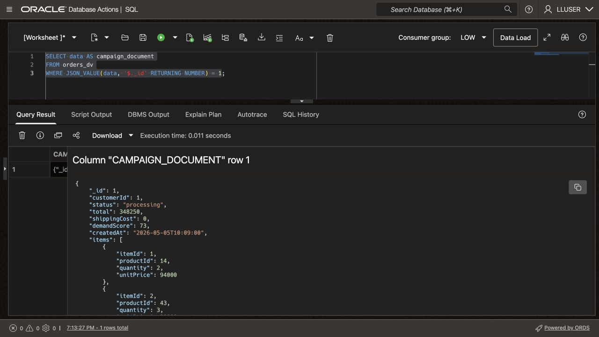
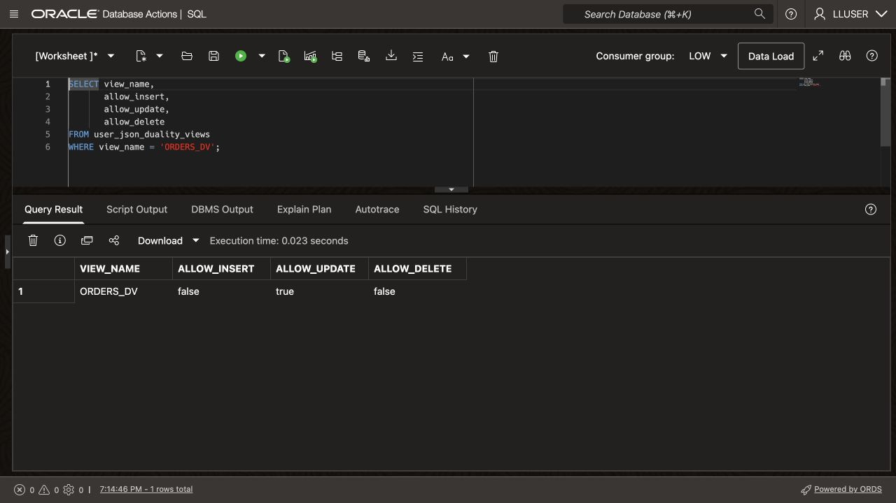
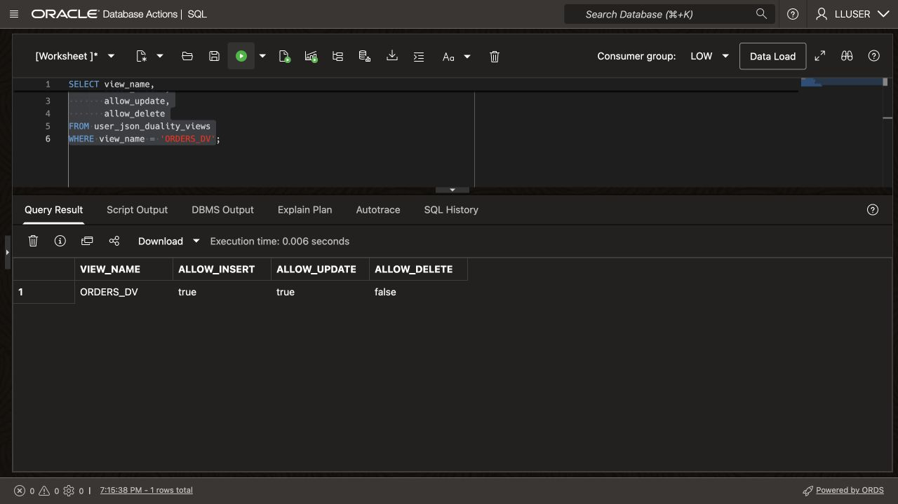
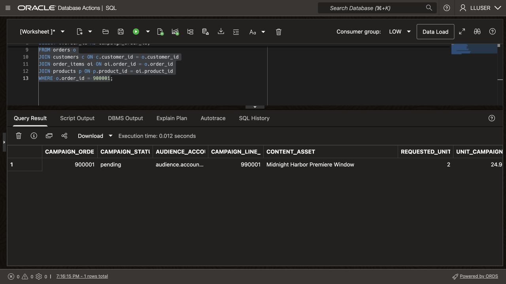
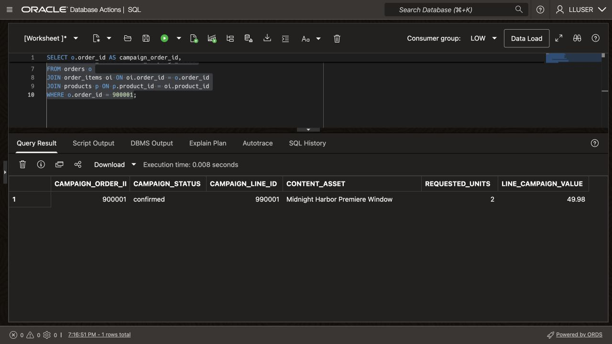
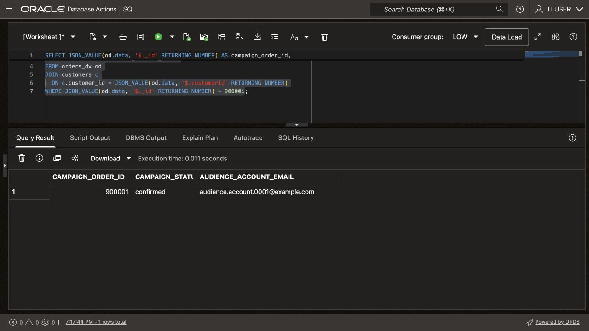
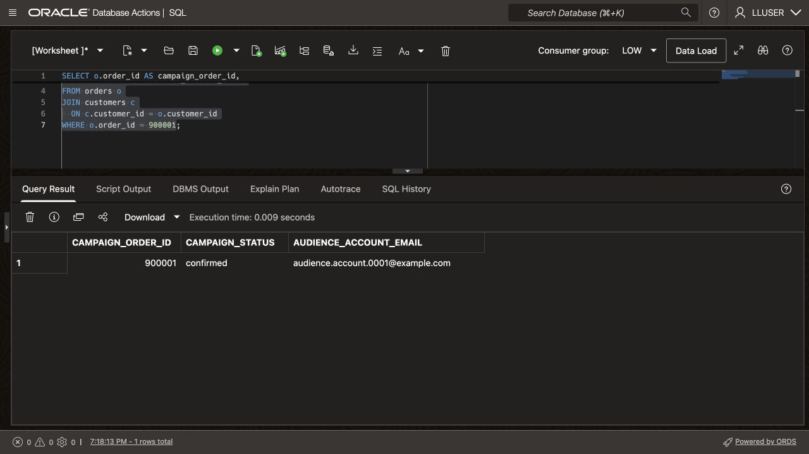

# Build a JSON Campaign Application Model

<!-- markdownlint-configure-file
{
  "MD013": {
    "code_blocks": false,
    "tables": false
  },
  "MD033": {
    "allowed_elements": [
      "details",
      "summary",
      "strong"
    ]
  }
}
-->

## Introduction

Thomas Brune is an application developer at Seer Media. He and his team are
building a new web and mobile application for campaigns. The team wants a faster
user experience, with fewer round trips and payloads that match the screens and
services they are building.

Thomas needs campaign order data as a JSON payload that a web or mobile
application can consume directly. One payload can group an audience account,
campaign status, asset line items, and optional application attributes. JSON
lets him evolve that payload as the product changes. The data already lives in
Oracle AI Database, so his question is how to use JSON without giving up
relational keys, SQL, transactions, and database controls.

Thomas and Jessica compare three ways to work with JSON: a JSON column for
application attributes, a collection that stores documents, and a JSON
Relational Duality View over existing relational rows. The collection exercise
stores a separate sample document; the duality view exposes existing campaign
data without copying it.



<details>
<!-- markdownlint-disable-next-line MD013 -->
<summary><strong>Key terms: JSON columns, JSON collections, and JSON Relational Duality</strong></summary>

> * A **JSON column** stores a JSON value in a relational table alongside normal
>   typed columns, keys, and constraints. Thomas can use it for optional or
>   changing application attributes without turning every new attribute into a
>   schema change.
>
> * A **JSON collection** is a special table or view that provides a set of JSON
>   documents through one `JSON`-typed `DATA` column. Each document can have a
>   top-level `_id` used to identify it.
>
> * **JSON Relational Duality** lets Oracle Database expose relational data as
>   JSON documents without copying it into a separate document database. The
>   application gets the document shape Thomas wants for its API. The database
>   keeps the relational rows and controls.
>

</details>

Thomas's application needs a payload with the campaign order and its line items
together, such as this:

```json
{
  "_id": 900001,
  "customerId": 1,
  "status": "pending",
  "total": 49.98,
  "shippingCost": 0,
  "items": [
    { "itemId": 990001, "productId": 1, "quantity": 2, "unitPrice": 24.99 }
  ]
}
```

The loader retains physical names such as `ORDERS`, `CUSTOMERS`, and `PRODUCTS`.
In this media dataset, they represent campaign orders, audience accounts, and
content assets. The JSON keys `customerId`, `productId`, `quantity`, `total`,
and `shippingCost` follow that existing contract. They represent the audience
account, content asset, requested units, campaign value, and distribution cost.
The application can use media-facing labels without changing those stored keys.

The application uses this document shape, while the database keeps the campaign
order and line items in relational form. In this lab, you build and read this
type of payload in three ways.

### Objectives

* Store flexible application attributes as JSON in a relational table.
* Create and query a JSON Collection Table of campaign-order documents.
* Read and update relational campaign order data through `ORDERS_DV`.
* Compare the three JSON approaches and choose the right one for an application
  feature.

Estimated Time: **10 minutes**

### Hands-on Scenario

| Step | Media & Entertainment focus |
| --- | --- |
| Business Problem | Thomas's team needs flexible JSON payloads for a new campaign-operations web and mobile application. |
| Technical Challenge | The team needs application-friendly documents while the database keeps relational keys, joins, and controls. |
| Persona Focus | Thomas tests JSON storage, collections, and duality with Jessica's database guidance. |
| What You Will See | One Oracle AI Database supports several JSON access patterns over the media data. |
| Database Capability | Native JSON, SQL/JSON functions, and JSON Relational Duality work together. |
| Outcome | Thomas can choose an application shape without creating a second campaign-data store. |

Persona focus: You are Thomas, working with Jessica to decide how the new
application should store, assemble, and read campaign order data.

### Thomas's three JSON choices

Thomas does not need one JSON pattern for every feature. A JSON column holds
optional application attributes in a relational table. A JSON Collection Table
holds documents owned by the application. A duality view assembles a document
from existing relational tables. Thomas uses the document shape in the
application, while Jessica works with the underlying rows using SQL.

The three approaches serve different needs. A JSON column adds flexible
attributes, a collection stores application-owned documents, and a duality view
presents existing campaign rows as JSON. All three remain accessible through
SQL.

> **SQL Worksheet reminder:** See [Getting Started, Task 2][link-1] for the
> steps to open SQL Worksheet and run SQL.

Use **Run Script** for blocks containing several statements, including the setup
and insert/update blocks with `COMMIT`. Replace the editor contents with the
complete block, clear any text selection, and review **Script Output** for
errors before continuing. Use **Run Statement** for the single `SELECT` queries
so their rows appear in **Query Result**.

## Task 1: Store flexible application data as JSON

Thomas starts with data that belongs to the application but does not need its
own relational columns. He adds a table with a native `JSON` column for optional
screen settings. A relational campaign-order key connects those settings to the
existing campaign data.

1. Create the application-data table and add one sample payload. Paste the
    entire block and select **Run Script**.

    **Run Statement** executes only the current statement. If the cursor is on
    `COMMIT`, it will not create `THOMAS_APP_DATA`, and the next query will fail
    with `ORA-00942`.

    ```sql
    <copy>
    CREATE TABLE thomas_app_data (
        campaign_order_id NUMBER PRIMARY KEY,
        app_data          JSON NOT NULL
    );

    INSERT INTO thomas_app_data (campaign_order_id, app_data)
    SELECT order_id,
           JSON_OBJECT(
               'screen'    VALUE 'campaign-detail',
               'showTotal' VALUE 'true' FORMAT JSON,
               'features'  VALUE JSON_ARRAY('campaign-status', 'saved-audience')
               RETURNING JSON
           )
    FROM (
        SELECT order_id
        FROM orders
        ORDER BY order_id
        FETCH FIRST 1 ROW ONLY
    );

    COMMIT;
    </copy>
    ```

    **Expected output:** The table is created, one row is inserted, and the
    commit completes. If only the commit ran and the next query reported
    `ORA-00942`, return here and run this complete block as a script. Once the
    table exists, continue with the query below instead of repeating the
    `CREATE TABLE` statement.

2. Read values from the JSON column with **Run Statement**.

    ```sql
    <copy>
    SELECT campaign_order_id,
           JSON_VALUE(app_data, '$.screen') AS screen_name,
           JSON_VALUE(app_data, '$.showTotal' RETURNING BOOLEAN) AS show_total,
           JSON_QUERY(app_data, '$.features') AS app_features
    FROM thomas_app_data;
    </copy>
    ```

    `CAMPAIGN_ORDER_ID` remains a relational key. `APP_DATA` can change as the
    application changes. Thomas can query both with SQL in one table.

## Task 2: Create a JSON Collection Table

Thomas now needs a collection of application documents. Unlike the JSON column
in Task 1, this object is a JSON Collection Table: each row is a document, the
document is stored in `DATA`, and `_id` identifies the document.

1. Create the collection and add the sample campaign order document. Replace the
    editor contents with this complete block and select **Run Script**.

    ```sql
    <copy>
    CREATE JSON COLLECTION TABLE thomas_campaign_docs
    WITH ETAG;

    INSERT INTO thomas_campaign_docs (data)
    SELECT JSON_OBJECT(
               '_id'        VALUE o.order_id,
               'customerId' VALUE o.customer_id,
               'status'     VALUE o.order_status,
               'items'      VALUE (
                   SELECT JSON_ARRAYAGG(
                              JSON_OBJECT(
                                  'itemId'    VALUE oi.item_id,
                                  'productId' VALUE oi.product_id,
                                  'quantity'  VALUE oi.quantity,
                                  'unitPrice' VALUE oi.unit_price
                                  RETURNING JSON
                              ) ORDER BY oi.item_id RETURNING JSON
                          )
                   FROM order_items oi
                   WHERE oi.order_id = o.order_id
               ) FORMAT JSON
               RETURNING JSON
           )
    FROM orders o
    JOIN thomas_app_data t ON t.campaign_order_id = o.order_id;

    COMMIT;
    </copy>
    ```

    **Expected output:** The collection is created, one document is inserted,
    and the commit completes. Resolve any error in **Script Output** before
    querying the collection.

    `WITH ETAG` adds an `_metadata.etag` value to each document. Oracle changes
    the tag whenever the document changes. Thomas's application can send the tag
    it last read when it updates a document. If the tag no longer matches, the
    application knows that someone else changed the document first and can avoid
    overwriting the newer version. This protects campaign data when web and
    mobile requests try updating the same document at the same time.

2. Query the collection as documents.

    ```sql
    <copy>
    SELECT JSON_SERIALIZE(data PRETTY) AS campaign_document
    FROM thomas_campaign_docs
    WHERE JSON_VALUE(data, '$._id' RETURNING NUMBER) =
          (SELECT campaign_order_id FROM thomas_app_data);
    </copy>
    ```

    Thomas now has a document collection that a document API can access, and SQL
    can query the same `DATA` column. The collection stores the documents; it is
    separate from the relational `ORDERS` and `ORDER_ITEMS` tables.

## Task 3: Read a campaign document from relational data

Thomas now tests the document shape his application can consume directly.

1. Run this query:

    This query selects the JSON `DATA` column from `ORDERS_DV` so Thomas can
    inspect the document shape in SQL Worksheet.

    <details>
    <summary><strong>Why this matters to Thomas</strong></summary>

    > Thomas can use a JSON Collection Table when the application owns the
    > document. But the campaign order already has relational tables that
    > Jessica and other teams rely on.
    > The duality view gives Thomas a document over those existing rows. He can
    > choose the application shape without copying the campaign order into
    > another store.

    </details>

    ```sql
    <copy>
    SELECT data AS campaign_document
    FROM orders_dv
    WHERE JSON_VALUE(data, '$._id' RETURNING NUMBER) = 1;
    </copy>
    ```

    **Expected output: Campaign Order 1**

    

2. Expand the document in SQL Worksheet.
    The query reads the duality view as a document source. Oracle constructs the
    JSON shape from relational data, so the application gets a campaign payload
    without a second copy of the campaign record.

    The document includes `_id`, `customerId`, `status`, totals, timestamps, and
    line items. These fields come from the existing relational rows.

    The same campaign order now has two useful forms: API-ready JSON for the
    application and relational rows for analysis.
    > **Note:** Look for `_metadata.etag` in the document. The ETAG changes when
    > the document changes, so Thomas's application can detect a newer version
    > before updating the campaign order and avoid overwriting another request.

## Task 4: Enable document inserts and updates

The existing `ORDERS_DV` lets an application update an existing campaign
document. In this task, you extend that contract so the application can also
create one. The database continues to control the relational tables, keys, and
constraints. The duality view can also act as a security boundary. An
application granted access only to the view receives its exposed document fields
and write operations without direct access to the underlying tables.

1. Check the current document-write capabilities.

    ```sql
    <copy>
    SELECT view_name,
           allow_insert,
           allow_update,
           allow_delete
    FROM user_json_duality_views
    WHERE view_name = 'ORDERS_DV';
    </copy>
    ```

    **Expected output: Current Document Capabilities**

    

    The view currently allows updates but not new top-level documents. The root
    `ORDERS` table controls document insertion. The nested `ORDER_ITEMS` rows
    must also allow inserts so the document can include line items.

2. Enable insert and update for the document and its line items.

    You are changing the duality-view definition, not creating a second API
    store. The two `WITH INSERT UPDATE` clauses allow developers to create and
    update the JSON document. Oracle still enforces the relational keys and data
    types.

    ```sql
    <copy>
    CREATE OR REPLACE JSON RELATIONAL DUALITY VIEW orders_dv AS
    SELECT JSON {
        '_id'         : o.order_id,
        'customerId'  : o.customer_id,
        'status'      : o.order_status,
        'total'       : o.order_total,
        'shippingCost': o.shipping_cost,
        'demandScore' : o.demand_score,
        'createdAt'   : o.created_at,
        'items' : [
            SELECT JSON {
                'itemId'    : oi.item_id,
                'productId' : oi.product_id,
                'quantity'  : oi.quantity,
                'unitPrice' : oi.unit_price
            }
            FROM order_items oi WITH INSERT UPDATE
            WHERE oi.order_id = o.order_id
        ]
    }
    FROM orders o WITH INSERT UPDATE;
    </copy>
    ```

    This duality view uses two relational tables. `ORDERS` provides the document
    root. Related `ORDER_ITEMS` rows become the nested `items` collection. The
    `WITH INSERT UPDATE` clauses let Thomas write the complete JSON document
    while Oracle maintains the rows and relationships.

    **Expected output: View Definition Updated**

    Oracle created or replaced the duality view. Verify the new capabilities in
    the next step.

3. Run the capability query again.

    ```sql
    <copy>
    SELECT view_name,
           allow_insert,
           allow_update,
           allow_delete
    FROM user_json_duality_views
    WHERE view_name = 'ORDERS_DV';
    </copy>
    ```

    **Expected output: Document Capabilities Enabled**

    

    The view can now receive a new JSON campaign document and apply a document
    update. Thomas has a document API over the existing relational campaign
    data. He can use it for an application feature such as submitting a new
    campaign order. The application sends one document, and the database writes
    the order and its line items to the relational tables.

## Task 5: Create and update a JSON campaign order

Thomas now tests a complete campaign order. He creates it as one nested JSON
document, then confirms that Jessica can immediately see the same data as
structured relational rows.

1. Insert the supplied workshop campaign order document with **Run Script** so
    the insert and commit both execute.

    Insert through `ORDERS_DV`; Oracle writes the underlying `ORDERS` and
    `ORDER_ITEMS` rows. Campaign `900001` uses account `1` and asset `1`,
    **Midnight Harbor Premiere Window**. It requests two units at `24.99` each,
    totaling `49.98`, with status `pending`.

    Order ID `900001` and line-item ID `990001` fall outside the seeded ranges.
    On repeat runs, `NOT EXISTS` preserves the existing campaign.

    ```sql
    <copy>
    INSERT INTO orders_dv (data)
    SELECT JSON(
      '{
        "_id": 900001,
        "customerId": 1,
        "status": "pending",
        "total": 49.98,
        "shippingCost": 0,
        "demandScore": 80,
        "createdAt": "2026-05-05T16:30:00",
        "items": [
          {
            "itemId": 990001,
            "productId": 1,
            "quantity": 2,
            "unitPrice": 24.99
          }
        ]
      }'
    )
    WHERE NOT EXISTS (
      SELECT 1
      FROM orders
      WHERE order_id = 900001
    );

    COMMIT;
    </copy>
    ```

    **Expected output: Campaign Order Document Created**

    On the first run, you insert one document. On later runs, the `NOT EXISTS`
    check returns zero rows because the workshop campaign order is already
    present.

2. Confirm the JSON document became relational rows.

    > **Note:** This query reads the relational tables `ORDERS` and `ORDER_ITEMS`.

    ```sql
    <copy>
    SELECT o.order_id AS campaign_order_id,
           o.order_status AS campaign_status,
           c.email AS audience_account_email,
           oi.item_id AS campaign_line_id,
           p.product_name AS content_asset,
           oi.quantity AS requested_units,
           oi.unit_price AS unit_campaign_value,
           oi.line_total AS line_campaign_value
    FROM orders o
    JOIN customers c ON c.customer_id = o.customer_id
    JOIN order_items oi ON oi.order_id = o.order_id
    JOIN products p ON p.product_id = oi.product_id
    WHERE o.order_id = 900001;
    </copy>
    ```

    **Expected output: Created Campaign Order Rows**

    On the first run, campaign `900001` has status `pending`, audience email
    `audience.account.0001@example.com`, asset
    `Midnight Harbor Premiere Window`, two requested units, and line campaign
    value `49.98`.

    

3. Update the document status through the duality view. Use **Run Script** to
    execute both the update and commit.

    Change the document's `status` from `pending` to `confirmed`. Oracle maps
    that field to `ORDERS.ORDER_STATUS`; the remaining fields stay unchanged.

    ```sql
    <copy>
    UPDATE orders_dv
    SET data = JSON_TRANSFORM(data, SET '$.status' = 'confirmed')
    WHERE JSON_VALUE(data, '$._id' RETURNING NUMBER) = 900001;

    COMMIT;
    </copy>
    ```

    **Expected output: Campaign Order Status Updated**

    Oracle updates one document. The following query confirms that the
    relational campaign-order row now has status `confirmed`.

4. Verify the updated relational status.

    ```sql
    <copy>
    SELECT o.order_id AS campaign_order_id,
           o.order_status AS campaign_status,
           oi.item_id AS campaign_line_id,
           p.product_name AS content_asset,
           oi.quantity AS requested_units,
           oi.line_total AS line_campaign_value
    FROM orders o
    JOIN order_items oi ON oi.order_id = o.order_id
    JOIN products p ON p.product_id = oi.product_id
    WHERE o.order_id = 900001;
    </copy>
    ```

    **Expected output: Updated Campaign Order Rows**

    

## Task 6: Project JSON fields with SQL

Thomas has confirmed that the application can display and update the document.
Jessica now checks the same campaign order with SQL before the feature goes
live. She uses the relational tables for normal reporting and analysis. Here,
she queries `ORDERS_DV` to verify the exact JSON contract that Thomas's
application receives. She can also project fields from the document to test
campaign searches and status filters. In this context, "project" means pulling
selected values out of the JSON document and displaying them as SQL result
columns.

1. Run this SQL/JSON projection query:

    Thomas's document is still available for SQL analysis. The same campaign
    shape can be queried, filtered, and joined to relational audience-account
    data.

    The SQL uses `JSON_VALUE` to extract campaign fields from the duality
    document. That is the projection step. It returns the campaign ID and
    status, reads the embedded audience-account identifier, and joins that
    identifier to `CUSTOMERS` to retrieve the account email.

    Thomas does not need to hand-build this document in the application or copy
    the campaign order to a separate document store. The application gets JSON,
    while Jessica still has SQL access to the same campaign rows.

    ```sql
    <copy>
    SELECT JSON_VALUE(od.data, '$._id' RETURNING NUMBER) AS campaign_order_id,
           JSON_VALUE(od.data, '$.status') AS campaign_status,
           c.email AS audience_account_email
    FROM orders_dv od
    JOIN customers c
      ON c.customer_id = JSON_VALUE(od.data, '$.customerId' RETURNING NUMBER)
    WHERE JSON_VALUE(od.data, '$._id' RETURNING NUMBER) = 900001;
    </copy>
    ```

    **Expected output: JSON Field Projection**

    

2. Run the equivalent query against the relational tables.

    ```sql
    <copy>
    SELECT o.order_id AS campaign_order_id,
           o.order_status AS campaign_status,
           c.email AS audience_account_email
    FROM orders o
    JOIN customers c
      ON c.customer_id = o.customer_id
    WHERE o.order_id = 900001;
    </copy>
    ```

    

    Compare the result with the previous query. The campaign order ID, status,
    and audience-account email should match. Thomas's application is reading the
    JSON document, while Jessica's relational query reads the underlying rows.

## Conclusion: Choose the right JSON approach

Thomas does not have to choose one JSON model for the whole application. He can
choose based on who owns the data and whether the application needs a document
over existing relational rows.

| Approach | Use it when | Example in Thomas's application | Where the data lives |
| ----------------------------------- | --------------------------------------------------------------------------------------------- | ------------------------------------------------------------------------------------------------------------ | ---------------------------------------------------------------------------------------------------------------- |
| JSON column in a relational table | A relational record needs optional or changing attributes. | Store screen settings or campaign-management options alongside a campaign order key. | A normal relational table with a native `JSON` column. |
| JSON Collection Table | The application owns a set of JSON documents and needs document-style access. | Store saved campaign drafts that may change as planners add or remove assets. | A JSON Collection Table with one document in each `DATA` row. |
| JSON Relational Duality View | The data already belongs in relational tables, but the application needs one JSON document. | Return a campaign order with its status and line items, or accept a new campaign-order document from the app. | Relational tables such as `ORDERS` and `ORDER_ITEMS`; the duality view defines the JSON shape for Thomas's app. |

For Thomas, `ORDERS_DV` is the right choice for the campaign order feature
because `ORDERS` and `ORDER_ITEMS` already hold governed media data. The
application gets the JSON payload it needs, while Jessica keeps SQL, relational
constraints, and controlled access to the same data.

## Acknowledgements

* **Author** - Teodor Constantin Nechita
* **Contributor** - Vahn Kessler
* **Last Updated By/Date** - Teodor Constantin Nechita, October 2026

[link-1]: ?lab=getting-started#Task2:OpenSQLWorksheet
