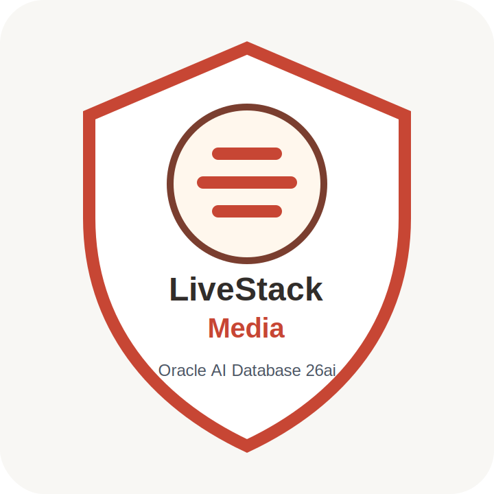

# Final Quiz

```quiz-config
passing: 75
badge: images/badge.svg
```

## Introduction

Use this scored quiz to check whether you can connect each Seer Media outcome to the database evidence you inspected in the labs.

### Objectives

- Review the main database capabilities used in the workshop.
- Connect each media outcome to supporting database evidence.
- Earn the workshop badge by answering the scored questions.

Estimated Time: **5 minutes**

## Task 1: Answer the quiz questions

1. Complete the scored quiz.

    ```quiz score
    Q: Why does the workshop begin with the media data foundation?
    - To manually install every media table.
    * To map the shared data used by each later media workflow.
    - To replace the application dashboard with catalog reports.
    - To move the media records into external analysis files.
    > The foundation lab orients you to the shared database objects behind the application. Later labs reuse that foundation for dashboard evidence, campaign documents, vector search, graph analysis, spatial coverage, and OML scoring.

    Q: What is the main business value of recreating dashboard evidence with SQL?
    - It hides supporting rows from the launch operations review process.
    - It treats dashboard screenshots as the final evidence source.
    * It connects KPI summaries to reviewable database evidence.
    - It removes the need for media semantic views.
    > The dashboard lab is about explainability. SQL aggregates connect the application summary to reviewable campaign, audience, content, and capacity evidence.

    Q: Which persona benefit does JSON Relational Duality provide in the campaign order lab?
    - Operations teams lose SQL access to campaign details.
    - Application teams must copy each campaign order into another store.
    - Business users must manually parse raw JSON strings for review.
    * Developers can serve JSON while preserving relational control.
    > The business outcome is API-friendly campaign access without sacrificing relational integrity, governance, or SQL projection.

    Q: Why is in-database AI Vector Search valuable for audience signal intelligence?
    * Analysts can search by meaning inside governed media data.
    - Analysts must export signal text into a separate search service.
    - Search results come only from table and column metadata.
    - Reviewable SQL is replaced by hidden prompt output.
    > The vector lab shows semantic search by intent, not just keywords. The governance value is that embedding and similarity scoring stay near the media data.

    Q: What business problem does the property graph lab solve for media analysts?
    - It scores future revenue for content assets and regions.
    * It explains connections across creators, studios, and signals.
    - It stores distribution coverage regions for rights planners.
    - It replaces relationship evidence with flat content totals.
    > The graph lab focuses on relationship evidence. An analyst can prioritize connected creators and influence pathways without relying on fragile chains of manual joins.

    Q: Why does the rights coverage lab use spatial data?
    - To make coverage decisions outside the governed database.
    - To hide capacity evidence from media operations leaders.
    * To compare distance, demand regions, hubs, and coverage.
    - To replace spatial queries with static labels.
    > Spatial data lets operations teams reason about distance and coverage from database evidence, which supports mapping, spatial queries, and location-aware applications.

    Q: What outcome does in-database OML scoring support?
    - Media records must be exported into a separate prediction store.
    - Model output can only be reviewed inside the application UI.
    - Models can be trusted without showing SQL evidence.
    * Predictions can be scored where governed data already lives.
    > The OML lab is not only about model names. It shows how deployed models produce reviewable predictions close to the data that drives them.

    Q: What is the main advantage of using Oracle Database as the converged foundation for this workshop?
    - Each media capability must use a separate specialized data store.
    * SQL, JSON, vector, graph, spatial, and OML evidence stay connected.
    - Application screenshots replace the need for database evidence.
    - Media teams must reconcile copied data before every investigation.
    > The workshop uses different database capabilities for different media questions, but the value is that they operate from connected governed data. That reduces copying, reconciliation, and fragmented explanations.
    ```

2. Review the completion badge.

    

## Acknowledgements

* **Author** - Oracle LiveLabs Team
* **Contributor** - Oracle Database Product Management
* **Last Updated By/Date** - Oracle Database Product Management, July 2026
