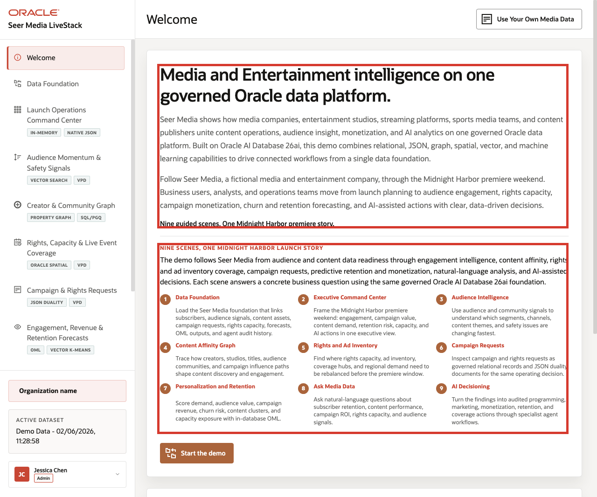
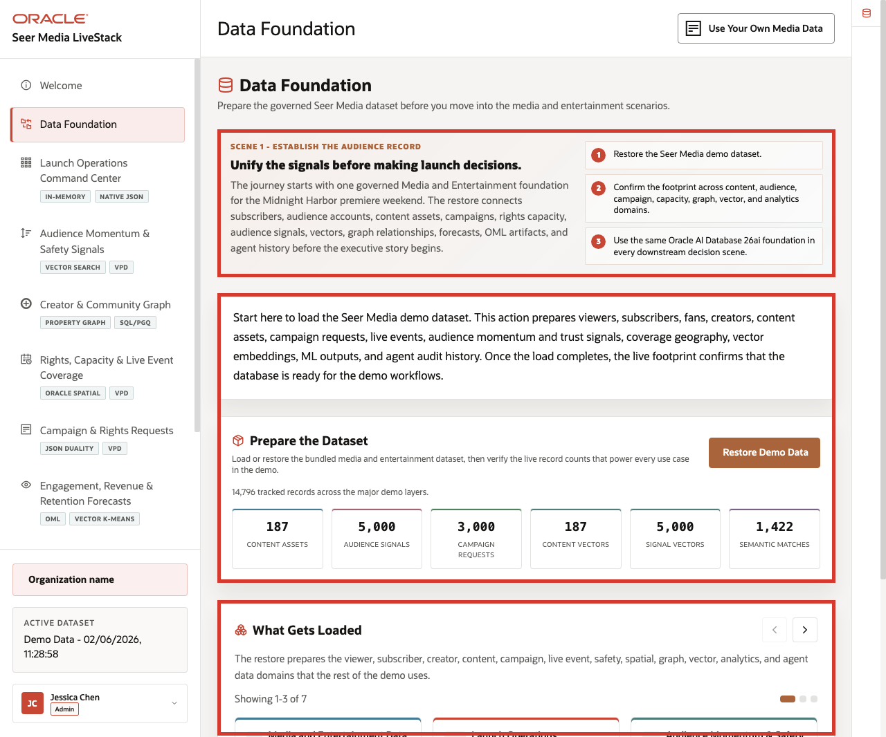

# Build Media Launch Intelligence with Oracle Database 26ai

## Introduction

**Seer Media** is managing the **Midnight Harbor** launch weekend across audience demand, creator momentum, rights coverage, campaign requests, revenue pressure, and AI-assisted follow-up. The challenge is not seeing one signal. The challenge is keeping every launch decision tied to the same governed evidence so the team can move quickly without losing trust in the result.

### Operating Story

| Step | Media launch focus |
| --- | --- |
| Business Problem | Seer Media needs faster launch decisions without spreading audience, rights, campaign, creator, and analytics evidence across disconnected systems. |
| Technical Challenge | The stack must keep relational rows, JSON documents, vectors, graph paths, spatial coverage, ML forecasts, and AI tools on one governed Oracle foundation. |
| Persona Focus | Media operations leader, rights planner, application developer, database developer, or analytics engineer. |
| What You Will Prove | One Oracle AI Database can support the full media decision loop from signal to trusted action. |
| Database Capability | Relational SQL, JSON Relational Duality, AI Vector Search, Property Graph, Oracle Spatial, Oracle Machine Learning, semantic views, PL/SQL tools, and audit records. |
| Outcome | The Midnight Harbor team can move from audience pressure to a defended business action without copying data into side systems. |
{: title="Media Launch Operating Story Table"}

Persona focus: this workshop is for both the business team that needs a faster operating decision and the technical team that has to deliver that decision path safely.

### Objectives

In this workshop, you will:

- Inspect the current Media LiveStack data foundation before you trust any later workflow.
- Trace launch KPIs, audience signals, creator influence, rights capacity, campaign requests, and OML forecasts back to database evidence.
- Verify how trusted answers and trusted actions stay grounded in approved views, PL/SQL tools, and audit history.

Estimated Workshop Time: **100 minutes**

*Figure 1: The Seer Media Control Tower frames the launch-weekend operating story before the learner enters the SQL workflow.*

*Figure 2: The runbook shows the same transition from the launch story into the governed data foundation.*

## Acknowledgements

* **Author** - Oracle LiveLabs Team
* **Last Updated By/Date** - Oracle Database Product Management, June 2026
