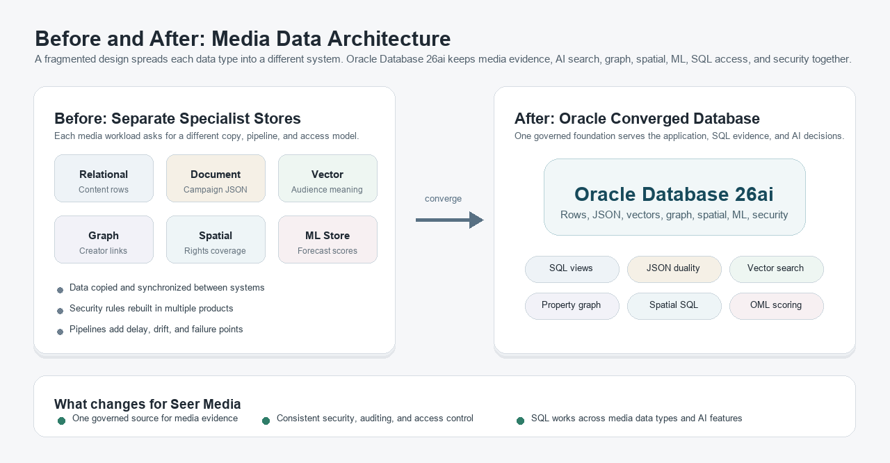
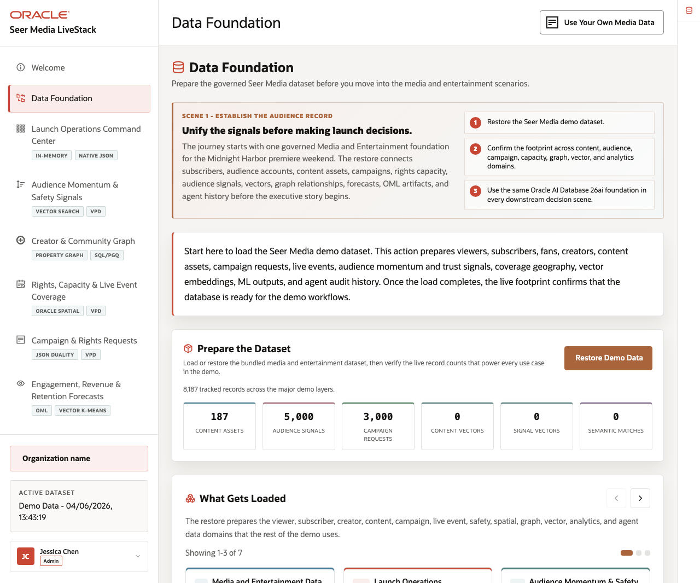

# Media Data Foundation

## Introduction

This lab confirms that the current Seer Media data foundation is present before any launch, audience, campaign, rights, or forecast result is trusted. You inspect semantic views, core data groups, vectors, graphs, spatial objects, and Oracle Machine Learning (OML) models as the shared evidence base for the rest of the workshop.

The goal is simple: see how different media decisions connect to one database before you start using the data.

The point is to understand what is available before you start asking business questions. Dashboard metrics, campaign documents, vector matches, creator graph paths, spatial distances, and OML scores all connect back to this shared database foundation.

Think of this lab as the map of the media environment. The same schema supports the launch dashboard, campaign order API, semantic audience search, creator influence graph, rights coverage, and predictive planning.

**Oracle AI Database 26ai** is a converged database: it lets these different media workloads use one governed database foundation instead of forcing each data type into a separate specialist system.



<details>
<summary><strong>Key terms: schema, semantic view, vector, graph, spatial, OML, and PL/SQL</strong></summary>

> - A **schema** is a named workspace inside the database. It owns objects such as tables, views, functions, models, vectors, and graph definitions. In this workshop, LLUSER is the schema you use, so it is the place where the media evidence is organized and secured.
>
> - A **semantic view** is a saved SQL query that presents data in a useful business shape. MEDIA_CONTENT_ASSETS_V and MEDIA_AUDIENCE_SIGNALS_V hide lower-level joins so later labs can focus on media decisions.
>
> - A **vector** is a numerical representation of meaning. In this workshop, content descriptions and audience-signal text can be converted into vectors so the database can compare ideas, not only exact words.
>
> - A **property graph** represents entities and relationships. Creators, studios, content assets, and audience posts become graph vertices and edges so you can inspect influence pathways.
>
> - **Spatial** data stores location and shape information. Distribution hubs can be points, demand regions can be boundaries, and Oracle Spatial can calculate distance with SQL.
>
> - **Oracle Machine Learning (OML)** lets you build, store, and score models inside Oracle Database, where the media records already live.
>
> - **Procedural Language/Structured Query Language (PL/SQL)** is Oracle's procedural language for database logic. Teams use it for reusable business rules and approved operations that should run close to governed data.

</details>

The image below is the Data Foundation page from the Seer Media application. It shows the shared media data domains that support the rest of the experience: content assets, campaign orders, creators, audience signals, distribution hubs, vectors, spatial regions, and model outputs. In this lab, you use SQL to inspect that foundation directly instead of treating the application screen as a black box.



### Objectives

- Review the Media semantic views.
- Check the scale of the current data.
- Map each application page to the Oracle AI Database 26ai capability that supports the related media decision.

Estimated Time: **10 minutes**

### Business Scenario

| Step | Media focus |
| --- | --- |
| Business Problem | Launch, audience, rights, and prediction workflows need a shared view of the media data they use to make decisions. |
| Technical Challenge | Platform teams must show how the same schema supports semantic views, vectors, graphs, spatial data, OML models, and application documents. |
| Persona Focus | Database developers and platform engineers map the foundation that business users rely on for downstream evidence. |
| What You Will See | The current Media LiveStack application uses connected views and object families in one database schema. |
| Database Capability | Oracle catalog views and media semantic views expose the governed object inventory. |
| Outcome | Each media result can be traced back to the same queryable data foundation. |

Persona focus: You are the database developer showing how Seer Media's shared foundation supports content operations, audience intelligence, rights planning, and predictive workflows.

## Task 1: Inventory the media object families

Start by inventorying the semantic views and database capabilities that the rest of the workshop depends on:

1. Run this inventory query:

    > **SQL Worksheet reminder:** Need a reminder on how to open and use the SQL Worksheet? Return to [Getting Started Task 2: Open SQL Worksheet](/workshops/sandbox/index.html?lab=getting-started#Task2:OpenSQLWorksheet) for the step-by-step graphic showing where to paste and run SQL statements.

    You are building a simple capability map before making any media decisions. You do not need to memorize this catalog SQL. The purpose is to ask Oracle Database, "What media capabilities are available in this schema?"

    Each section counts one kind of capability: approved media views for reporting, JSON Relational Duality views for application documents, property graphs for relationship analysis, vector columns for meaning-based search, and OML models for prediction. The UNION ALL lines stack those counts into one easy-to-read table.

    The names ending in _V are database views. A view is a saved SQL query that presents governed data in a business-ready shape. In this lesson, MEDIA_CONTENT_ASSETS_V, MEDIA_CAMPAIGN_ORDERS_V, MEDIA_AUDIENCE_SIGNALS_V, MEDIA_DISTRIBUTION_CAPACITY_V, and MEDIA_CREATOR_RELATIONSHIPS_V describe the media catalog, campaign orders, audience signals, distribution capacity, and creator relationships.

    <details>
    <summary><strong>Why this matters: easier in a converged database</strong></summary>

    > In a fractured environment, you might look in one system for reporting views, another for graph objects, another for vector indexes, another for machine learning models, and another for JSON document APIs. Each system can have its own security, metadata, and operational rules.
    >
    > Oracle Database lets you inspect these object families from one schema using SQL catalog views. That makes it easier to understand what is available before you start making media decisions.

    </details>

    ```sql
    <copy>
    SELECT 'Media semantic views' AS "Area", COUNT(*) AS "Count"
    FROM user_views
    WHERE view_name IN (
      'MEDIA_CONTENT_ASSETS_V','MEDIA_CAMPAIGN_ORDERS_V',
      'MEDIA_AUDIENCE_SIGNALS_V','MEDIA_DISTRIBUTION_CAPACITY_V',
      'MEDIA_CREATOR_RELATIONSHIPS_V'
    )
    UNION ALL
    SELECT 'Media duality views', COUNT(*)
    FROM user_json_duality_views
    WHERE view_name IN ('ORDERS_DV','PRODUCTS_INVENTORY_DV')
    UNION ALL
    SELECT 'Media property graphs', COUNT(*)
    FROM user_property_graphs
    WHERE graph_name = 'INFLUENCER_NETWORK'
    UNION ALL
    SELECT 'MiniLM vector columns', COUNT(*)
    FROM user_tab_cols
    WHERE data_type = 'VECTOR'
      AND table_name IN ('PRODUCT_EMBEDDINGS','POST_EMBEDDINGS')
    UNION ALL
    SELECT 'OML mining models', COUNT(*)
    FROM user_mining_models
    WHERE model_name IN (
      'DEMAND_SURGE_MODEL','CUSTOMER_SEGMENT_MODEL',
      'REVENUE_PREDICT_MODEL','PRODUCT_CLUSTER_MODEL'
    );
    </copy>
    ```

    **Expected output: Foundation Object Inventory**

    | Area | Count |
    | --- | --- |
    | Media semantic views | 5 |
    | Media duality views | 2 |
    | Media property graphs | 1 |
    | MiniLM vector columns | 2 |
    | OML mining models | 4 |

2. Review the counts.
    Read the result as a capability checklist. The query reads Oracle catalog views instead of application tables, so it tells you what kinds of database objects are available before you start using them.

    Treat this as the capability map for the media application. Each row points to a business use you will work with in SQL.

## Task 2: Count the current media data groups

The next query shows the scale of the media scenario behind the application pages.

1. Run this data group count query:

    You are sizing the media scenario so later dashboard, graph, search, spatial, and prediction results have context. The SQL counts rows from the business-facing media views and core tables, then combines those counts into one table with UNION ALL.

    ```sql
    <copy>
    SELECT 'Studios and labels' AS "Data Group", COUNT(*) AS "Rows" FROM brands
    UNION ALL SELECT 'Content assets', COUNT(*) FROM media_content_assets_v
    UNION ALL SELECT 'Audience signals', COUNT(*) FROM media_audience_signals_v
    UNION ALL SELECT 'Campaign orders', COUNT(*) FROM media_campaign_orders_v
    UNION ALL SELECT 'Creators', COUNT(*) FROM influencers
    UNION ALL SELECT 'Creator relationships', COUNT(*) FROM influencer_connections
    UNION ALL SELECT 'Distribution hubs', COUNT(*) FROM fulfillment_centers
    UNION ALL SELECT 'Demand regions', COUNT(*) FROM demand_regions;
    </copy>
    ```

    **Expected output: Media Row Counts**

    | Data Group | Rows |
    | --- | --- |
    | Studios and labels | 50 |
    | Content assets | 187 |
    | Audience signals | 5000 |
    | Campaign orders | 3000 |
    | Creators | 483 |
    | Creator relationships | 3008 |
    | Distribution hubs | 30 |
    | Demand regions | 20 |

2. Use the counts as the baseline for later analysis.
    This query reads the business-facing media views and core tables that you will aggregate, search, traverse, score, or audit. It gives you a concrete sense of the data population before you inspect specific launch and audience results.

## Acknowledgements

* **Author** - Oracle LiveLabs Team
* **Contributor** - Oracle Database Product Management
* **Last Updated By/Date** - Oracle Database Product Management, July 2026
