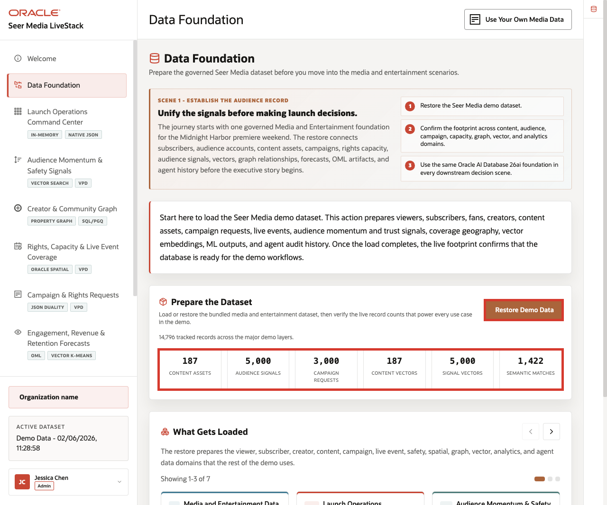
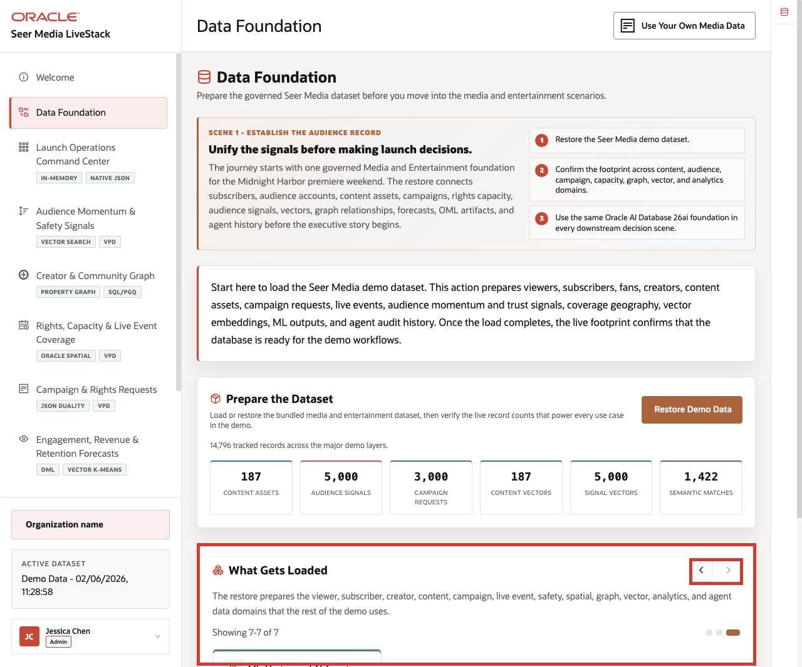

# Lab 1: Media Data Foundation

## Introduction

The **Midnight Harbor** launch story only works if audience signals, campaign orders, creator relationships, rights coverage, and AI outputs all start from the same governed foundation. 

This lab proves that the current Media LiveStack schema contains that shared evidence before learners interpret any downstream launch workflow.

### Operating Story

| Step | Media data-foundation focus |
| --- | --- |
| Business Problem | Seer Media cannot trust launch decisions unless the shared content, audience, campaign, and AI evidence is already in place. |
| Technical Challenge | The stack must expose relational, JSON, vector, graph, spatial, forecast, and audit objects from the current Media schema. |
| Persona Focus | Database developer, application developer, platform engineer, or technical media-demo builder. |
| What You Will Prove | The current Media LiveStack schema owns the content, signal, request, vector, graph, spatial, and audit surfaces used by every later lab. |
| Database Capability | Semantic views, JSON duality views, vector tables, property graph tables, spatial tables, and operational base tables in one schema. |
| Outcome | You confirm that the workshop starts from a known Media LiveStack baseline instead of a disconnected collection of demo pages. |
{: title="Media Data Foundation Operating Story Table"}

Persona focus: this lab is for the builder or reviewer who needs one trustworthy checkpoint before discussing launch metrics or AI workflows.

### Objectives

In this lab, you will:

- Confirm the core Media LiveStack row groups.
- Validate the semantic surfaces behind the Media demo.
- Map the main app scenes to the database capabilities behind them.

Estimated Time: **10 minutes**



*Figure 1: The Media Data Foundation page shows the restore path and the governed row groups behind the rest of the demo.*

## Task 1: Validate the current Media row groups

Perform the following set of steps to confirm that the core Media row groups are present before you trust later launch metrics, semantic matches, or AI-assisted actions:

1. Run this query:

    ```sql
    <copy>
    SELECT 'Content assets' AS data_group, COUNT(*) AS row_count FROM media_content_assets_v
    UNION ALL
    SELECT 'Audience signals', COUNT(*) FROM media_audience_signals_v
    UNION ALL
    SELECT 'Campaign orders', COUNT(*) FROM media_campaign_orders_v
    UNION ALL
    SELECT 'Content vectors', COUNT(*) FROM product_embeddings
    UNION ALL
    SELECT 'Signal vectors', COUNT(*) FROM post_embeddings
    UNION ALL
    SELECT 'Semantic matches', COUNT(*) FROM semantic_matches
    UNION ALL
    SELECT 'Distribution hubs', COUNT(*) FROM fulfillment_centers;
    </copy>
    ```

    **Expected output:**

    | DATA_GROUP | ROW_COUNT |
    | --- | ---: |
    | Content assets | 187 |
    | Audience signals | 5000 |
    | Campaign orders | 3000 |
    | Content vectors | 187 |
    | Signal vectors | 5000 |
    | Semantic matches | 1422 |
    | Distribution hubs | 30 |
    {: title="Core Media Row Group Counts Table"}

2. These counts anchor the rest of the workshop. They show that the app is backed by fixed rows, regenerated embeddings, and governed launch data instead of static screenshots.

**Note:** Sample values may change after data refreshes or rebuilds. Focus on the expected result pattern and the business takeaway, not the exact values.

## Task 2: Confirm the Media semantic surfaces

Perform the following set of steps to inventory the learner-facing Media surfaces that the app, trusted-answer flow, and trusted-action flow depend on:

1. Run this query:

    ```sql
    <copy>
    SELECT 'Media semantic views' AS object_group, COUNT(*) AS object_count
    FROM user_views
    WHERE view_name IN (
      'MEDIA_CONTENT_ASSETS_V',
      'MEDIA_CAMPAIGN_ORDERS_V',
      'MEDIA_AUDIENCE_SIGNALS_V',
      'MEDIA_DISTRIBUTION_CAPACITY_V',
      'MEDIA_CREATOR_RELATIONSHIPS_V'
    )
    UNION ALL
    SELECT 'JSON duality views', COUNT(*)
    FROM user_json_duality_views
    WHERE view_name IN ('ORDERS_DV', 'PRODUCTS_INVENTORY_DV')
    UNION ALL
    SELECT 'Property graphs', COUNT(*) FROM user_property_graphs
    UNION ALL
    SELECT 'Agent functions', COUNT(*)
    FROM user_objects
    WHERE object_type = 'FUNCTION'
      AND object_name IN (
        'DETECT_TRENDING_PRODUCTS',
        'CHECK_PRODUCT_INVENTORY',
        'FIND_BEST_FULFILLMENT',
        'GET_INFLUENCER_NETWORK',
        'LOG_AGENT_DECISION',
        'SEARCH_PRODUCTS_BY_TEXT'
      );
    </copy>
    ```

    **Expected output:**

    | OBJECT_GROUP | OBJECT_COUNT |
    | --- | ---: |
    | Media semantic views | 5 |
    | JSON duality views | 2 |
    | Property graphs | 1 |
    | Agent functions | 6 |
    {: title="Media Semantic Surface Inventory Table"}

2. These are the same surfaces the app, trusted-answer flow, and trusted-action flow rely on later in the workshop.

    

    *Figure 2: The runbook carousel translates the same schema into business language for launch teams.*

**Note:** Sample values may change after data refreshes or rebuilds. Focus on the expected result pattern and the business takeaway, not the exact values.

## Task 3: Map the app scenes to database capabilities

Perform the following set of steps to connect each Media app scene to the Oracle Database capability that supports its launch decision:

1. Run this feature-map query.

    ```sql
    <copy>
    SELECT 'Launch Operations Command Center' AS stack_scene,
           'SQL aggregation over campaign orders, audience signals, and content assets' AS database_capability
    FROM dual
    UNION ALL SELECT 'Campaign and Rights Requests', 'JSON Relational Duality plus relational SQL over one request record' FROM dual
    UNION ALL SELECT 'Audience Momentum and Safety Signals', 'VECTOR_EMBEDDING, VECTOR_DISTANCE, and semantic matches' FROM dual
    UNION ALL SELECT 'Creator and Community Graph', 'Property Graph and GRAPH_TABLE SQL/PGQ' FROM dual
    UNION ALL SELECT 'Rights, Capacity, and Live Event Coverage', 'SDO_GEOMETRY, demand regions, and proximity calculations' FROM dual
    UNION ALL SELECT 'Engagement, Revenue, and Retention Forecasts', 'DBMS_DATA_MINING models, forecast rows, and scoring views' FROM dual
    UNION ALL SELECT 'Ask Seer Media Data', 'Approved semantic views, comments, and visible SQL paths' FROM dual
    UNION ALL SELECT 'Seer Media Agent Console', 'PL/SQL tools plus durable audit history' FROM dual;
    </copy>
    ```

    **Expected output:**

    | STACK_SCENE | DATABASE_CAPABILITY |
    | --- | --- |
    | Launch Operations Command Center | SQL aggregation over campaign orders, audience signals, and content assets |
    | Campaign and Rights Requests | JSON Relational Duality plus relational SQL over one request record |
    | Audience Momentum and Safety Signals | VECTOR_EMBEDDING, VECTOR_DISTANCE, and semantic matches |
    | Creator and Community Graph | Property Graph and GRAPH_TABLE SQL/PGQ |
    | Rights, Capacity, and Live Event Coverage | SDO_GEOMETRY, demand regions, and proximity calculations |
    | Engagement, Revenue, and Retention Forecasts | DBMS_DATA_MINING models, forecast rows, and scoring views |
    | Ask Seer Media Data | Approved semantic views, comments, and visible SQL paths |
    | Seer Media Agent Console | PL/SQL tools plus durable audit history |
    {: title="App Scene Capability Map Table"}

2. Keep this map in mind as you move through the workshop. Every later lab explains one decision surface from this same governed launch foundation.

**Note:** Sample values may change after data refreshes or rebuilds. Focus on the expected result pattern and the business takeaway, not the exact values.

## Acknowledgements

* **Author** - Oracle LiveLabs Team
* **Last Updated By/Date** - Oracle Database Product Management, June 2026
