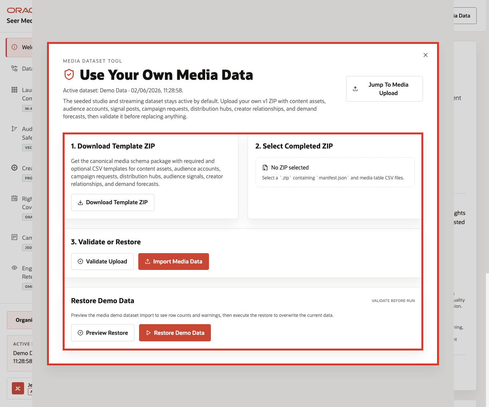

# Lab 10: Use Your Own Media Data

## Introduction

The **Media LiveStack** is not limited to the seeded Midnight Harbor story. The application also exposes a controlled import path so teams can validate and replace the demo dataset with their own schema-shaped Media data. This lab focuses on the database evidence that makes that transition reliable.

### Operating Story

| Step | Bring-your-own-data focus |
| --- | --- |
| Business Problem | Media teams want to test their own launch, audience, and rights data without breaking the baseline experience. |
| Technical Challenge | The stack must track the active dataset state and preserve a predictable import contract. |
| Persona Focus | Demo owner, solution engineer, data onboarding lead, or platform engineer. |
| What You Will Prove | The Media stack records which dataset is active and keeps the import path tied to a known schema contract. |
| Database Capability | Dataset-state metadata, governed base tables, and import-aware schema validation. |
| Outcome | You show that the demo can change datasets without losing the operational contract that later labs depend on. |
{: title="Bring Your Own Data Operating Story Table"}

Persona focus: this lab is for the team preparing a customer-specific dataset without losing the reliability of the workshop flow.

### Objectives

In this lab, you will:

- Inspect the current dataset-state row.
- Confirm the base tables the import workflow depends on.

Estimated Time: **8 minutes**



*Figure 1: The runbook shows the dataset tool that lets teams validate or replace the seeded Media data.*

## Task 1: Inspect the active dataset state

Perform the following set of steps to inspect the active dataset-state row that tells the app which Media dataset is currently live:

1. Run this query:

    ```sql
    <copy>
    SELECT state_id, active_source, active_label, active_version
    FROM app_dataset_state
    ORDER BY state_id;
    </copy>
    ```

    **Expected output:**

    | STATE_ID | ACTIVE_SOURCE | ACTIVE_LABEL | ACTIVE_VERSION |
    | ---: | --- | --- | --- |
    | 1 | demo | Media and Entertainment Demo Data | v1 |
    {: title="Active Dataset State Table"}

2. This is the metadata checkpoint that tells the app whether the seeded launch story or a customer dataset is currently active.

**Note:** Sample values may change after data refreshes or rebuilds. Focus on the expected result pattern and the business takeaway, not the exact values.

## Task 2: Confirm the import contract tables

Perform the following set of steps to confirm the import-contract tables that a replacement Media dataset must satisfy:

1. Run this query:

    ```sql
    <copy>
    SELECT
      ROW_NUMBER() OVER (ORDER BY table_name) AS contract_order,
      table_name
    FROM user_tables
    WHERE table_name IN (
      'BRANDS',
      'CUSTOMERS',
      'DEMAND_FORECASTS',
      'FULFILLMENT_CENTERS',
      'INFLUENCERS',
      'ORDER_ITEMS',
      'ORDERS',
      'POST_PRODUCT_MENTIONS',
      'PRODUCTS',
      'SOCIAL_POSTS'
    )
    ORDER BY table_name;
    </copy>
    ```

    **Expected output:**

    | CONTRACT_ORDER | TABLE_NAME |
    | ---: | --- |
    | 1 | BRANDS |
    | 2 | CUSTOMERS |
    | 3 | DEMAND_FORECASTS |
    | 4 | FULFILLMENT_CENTERS |
    | 5 | INFLUENCERS |
    | 6 | ORDER_ITEMS |
    | 7 | ORDERS |
    | 8 | POST_PRODUCT_MENTIONS |
    | 9 | PRODUCTS |
    | 10 | SOCIAL_POSTS |
    {: title="Import Contract Table List"}

2. This is why the import workflow can stay controlled. The schema contract is known before a customer dataset replaces the seeded rows.

**Note:** Sample values may change after data refreshes or rebuilds. Focus on the expected result pattern and the business takeaway, not the exact values.

## Acknowledgements

* **Author** - Oracle LiveLabs Team
* **Last Updated By/Date** - Oracle Database Product Management, June 2026
