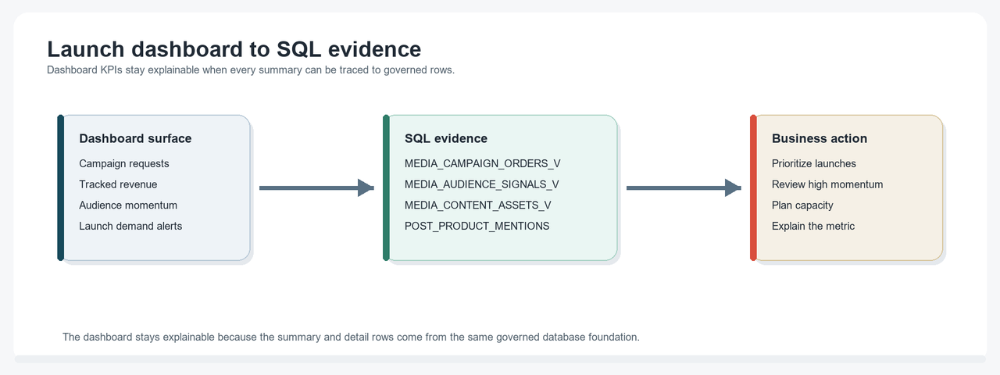
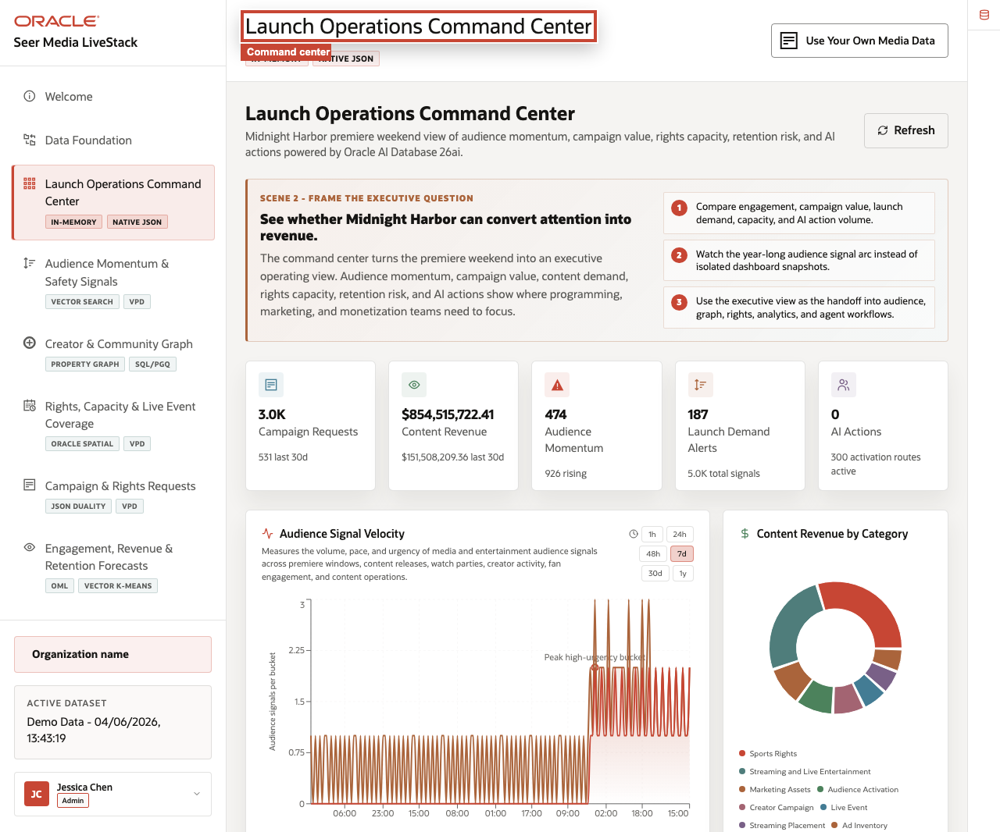

# Launch Operations Dashboard

## Introduction

Media operations leaders rarely have time to inspect every audience signal, content asset, and campaign order one by one. They need to know which launches, categories, and audience signals deserve review first. This lab recreates the evidence behind the application dashboard so each metric can be traced back to SQL.

The dashboard is the workshop's first decision surface. It summarizes campaign volume, revenue opportunity, audience momentum, and launch demand into measures that help media teams prioritize review.

In this lab, **audience momentum** means the reach and urgency of audience signals. A signal with low reach may still matter, but a high-virality signal can affect content programming, campaign timing, rights capacity, or retention action.

The key point is traceability. A dashboard can summarize the business, but Seer Media still needs to show where the numbers came from. Here, each metric is reproducible with SQL over media views and source tables.

<details>
<summary><strong>Key terms: KPI, audience signal, virality, campaign order, and launch alert</strong></summary>

> - A **KPI** is a key performance indicator. It is a summary measure that helps leaders understand the current operating picture quickly, such as campaign request volume, tracked revenue, high-virality signal count, or content assets under review.
>
> - An **audience signal** is a social, creator, subscriber, fan, or viewer event that may indicate demand, churn risk, brand safety pressure, or rights opportunity.
>
> - **Virality** is a severity-like measure for audience momentum. Higher virality means the signal appears more urgent or consequential.
>
> - A **campaign order** is follow-up work opened for campaign activation, distribution, rights, or audience operations.
>
> - A **launch alert** identifies a content asset that may need review because audience signal activity and capacity pressure are moving together.

</details>


The image below is the Launch Operations Command Center from the Seer Media application. It shows how operations leaders see KPI cards, signal momentum, revenue pressure, and launch alerts before drilling into the details. The SQL in this lab recreates the database evidence behind that screen so the dashboard is explainable instead of just visual.



### Objectives

- Calculate media launch KPIs.
- Identify content assets with high audience momentum.
- Drill from summary metrics to reviewable rows.

Estimated Time: **10 minutes**

### Business Scenario

| Step | Media focus |
| --- | --- |
| Business Problem | Media operations teams need a shared view of campaign volume, revenue, audience momentum, and launch demand. |
| Technical Challenge | App and data teams need one explainable query path instead of separate pipelines for content assets, audience signals, campaign orders, and distribution capacity. |
| Persona Focus | Media operations leaders read the dashboard; database and application developers show where the dashboard evidence comes from. |
| What You Will See | Dashboard metrics are database-backed and can be explained with SQL. |
| Database Capability | Converged SQL aggregates media views, campaign data, audience signals, and content records. |
| Outcome | Operators can move from a dashboard KPI to trusted detail without changing systems. |

Persona focus: You support the media operations leader by showing that one database query path can explain the dashboard instead of hiding work across integration layers.

## Task 1: Calculate launch operation KPIs

Start with the KPI query that explains the top-level dashboard numbers.

1. Run the dashboard aggregate query:

    > **SQL Worksheet reminder:** Need a reminder on how to open and use the SQL Worksheet? Return to [Getting Started Task 2: Open SQL Worksheet](/workshops/sandbox/index.html?lab=getting-started#Task2:OpenSQLWorksheet) for the step-by-step graphic showing where to paste and run SQL statements.

    You are recreating the dashboard's headline media measures directly from governed order and signal data. The SQL uses scalar subqueries so each metric can come from the best business view: campaign orders for request and revenue volume, audience signals for high-momentum signals, and content assets for launch demand alerts.

    MEDIA_CAMPAIGN_ORDERS_V is a view, not a raw table. It gives the dashboard a clean campaign-order shape with business columns such as campaign status, value, audience account, and distribution hub. MEDIA_AUDIENCE_SIGNALS_V exposes audience signal text, platform, virality, momentum, and creator context.

    <details>
    <summary><strong>Why this matters: better than a separate reporting pipeline</strong></summary>

    > In a fractured environment, the application may store campaign orders in one system, the dashboard may calculate metrics in another, and analysts may investigate audience signal details somewhere else. If the numbers do not match, teams must spend time reconciling them.
    >
    > With Oracle Database, the dashboard summary and the detail rows can come from the same governed media data. You can move from the KPI to the SQL behind it without leaving the database.

    </details>

    ```sql
    <copy>
    SELECT
      (SELECT COUNT(*) FROM media_campaign_orders_v) AS campaign_requests,
      (SELECT ROUND(SUM(campaign_value), 0) FROM media_campaign_orders_v) AS tracked_revenue,
      (SELECT COUNT(*) FROM media_audience_signals_v WHERE virality_score >= 90) AS high_momentum_signals,
      (SELECT COUNT(*) FROM media_content_assets_v WHERE audience_signal_count > 0) AS launch_demand_alerts
    FROM dual;
    </copy>
    ```

    **Expected output: Dashboard KPI Summary**

    | Campaign Requests | Tracked Revenue | High Momentum Signals | Launch Demand Alerts |
    | --- | --- | --- | --- |
    | 3000 | Greater than 0 | At least one row | 187 |

2. Interpret the result.
    The query compresses the current media operating picture into the headline measures a leader would scan first: campaign volume, tracked revenue, high-momentum signals, and content assets with launch demand alerts. These values explain the top row of the dashboard without requiring a separate reporting store.

## Task 2: Find top content exposure

Next, move from headline measures to the content assets driving monitored audience momentum.

1. Run this content exposure query:

    You are moving from dashboard totals to the content assets and studios that drive review priority. The SQL reads MEDIA_CONTENT_ASSETS_V, which combines content assets, studios or labels, capacity totals, and audience-signal counts into a business-ready view.

    Each returned row shows signal volume, average virality, and available capacity for a specific content asset. Sorting by virality and signal count creates a practical review queue.

    ```sql
    <copy>
    SELECT content_asset,
           studio_or_label,
           content_category,
           audience_signal_count,
           avg_virality_score,
           total_capacity_units,
           reserved_capacity_units
    FROM media_content_assets_v
    WHERE audience_signal_count > 0
    ORDER BY avg_virality_score DESC, audience_signal_count DESC
    FETCH FIRST 3 ROWS ONLY;
    </copy>
    ```

    **Expected output: Top Content Exposure**

    | Content Asset | Studio Or Label | Content Category | Audience Signal Count | Avg Virality Score | Total Capacity Units | Reserved Capacity Units |
    | --- | --- | --- | --- | --- | --- | --- |
    | Pulse Arena Regional Rights Window | Global Drama House | Sports Rights | 19 | 50.77 | 2244 | 175 |
    | Superfan Loyalty Bonus Content Track | Marquee Media Network | Streaming and Live Entertainment | 19 | 50.68 | 2893 | 264 |
    | Echo Valley Watch Time Personalization Test | AnimeForge | Streaming Placement | 19 | 50.67 | 2795 | 215 |

2. Use the top rows to explain dashboard priority.
    This query turns individual signal rows into a review queue that business users can understand. A content asset with many signals, high average virality, and constrained capacity should move to the top of the dashboard review queue.

## Task 3: Drill from dashboard summary to reviewable rows

Dashboard drill-through matters because summary numbers should lead to inspectable evidence.

1. Run this drill-through query:

    You are opening the rows behind launch demand. The query joins audience signals to product mentions and content assets so the dashboard can explain which creator posts or audience conversations are affecting a content asset.

    ```sql
    <copy>
    SELECT mas.audience_signal_id,
           mas.platform,
           mas.creator_handle,
           mca.content_asset,
           mca.studio_or_label,
           mas.virality_score,
           mas.views_count
    FROM media_audience_signals_v mas
    JOIN post_product_mentions ppm
      ON ppm.post_id = mas.audience_signal_id
    JOIN media_content_assets_v mca
      ON mca.product_id = ppm.product_id
    WHERE mas.virality_score >= 90
    ORDER BY mas.virality_score DESC, mas.views_count DESC
    FETCH FIRST 3 ROWS ONLY;
    </copy>
    ```

    **Expected output: High-Momentum Drill-Through**

    | Audience Signal Id | Platform | Creator Handle | Content Asset | Studio Or Label | Virality Score | Views Count |
    | --- | --- | --- | --- | --- | --- | --- |
    | 69 | youtube | @anime\_069 | BrightSide Lab Kids Safety Chat Coverage | Global Drama House | 99.9 | 8642937 |
    | 68 | twitter | @globaldrama\_068 | Dreamline Academy Watch Party Kit | Horizon Kids Network | 99.8 | 8543764 |
    | 67 | tiktok | @family\_067 | Festival Social Amplification | SoundStage Live | 99.7 | 8444591 |

2. Review why the result matters.
    The result connects a dashboard condition to the specific audience signal, creator, content asset, studio or label, virality score, and view count behind it. That is the practical value of the converged foundation: business users can move from "momentum is rising" to "this content asset needs attention" without waiting for a separate reconciliation process.

    A production dashboard may add indexes or materialized views for repeated aggregate queries. This workshop uses direct SQL so the calculation remains transparent and easy to inspect.

## Acknowledgements

* **Author** - Oracle LiveLabs Team
* **Contributor** - Oracle Database Product Management
* **Last Updated By/Date** - Oracle Database Product Management, July 2026

