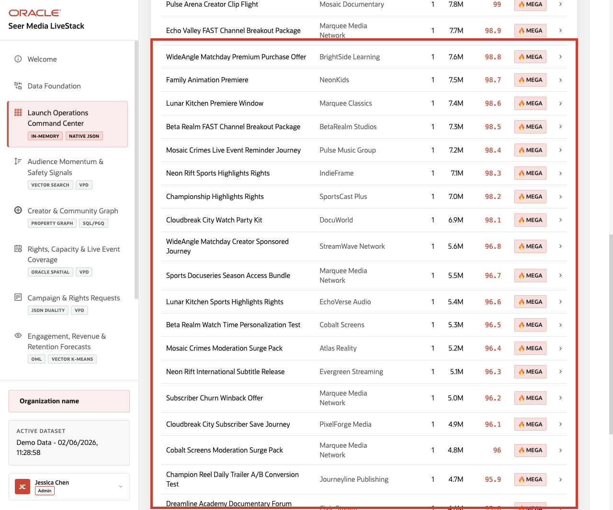

# Lab 2: Launch Operations Command Center

## Introduction

**Midnight Harbor** launch leaders need one answer first: what needs attention right now? The command center brings demand, revenue, audience momentum, and AI activity into one governed launch surface so the team can decide where to investigate before a rights, retention, or capacity issue grows.

### Operating Story

| Step | Command-center focus |
| --- | --- |
| Business Problem | Media teams need a daily operating surface that summarizes launch pressure across campaign orders, audience signals, and action history. |
| Technical Challenge | The dashboard must stay connected to governed operational rows instead of copied extracts or one-off BI snapshots. |
| Persona Focus | Media operations leader, streaming growth lead, rights planner, or network analyst. |
| What You Will Prove | The visible command-center indicators trace back to governed SQL evidence over the current Media dataset. |
| Database Capability | SQL aggregation, current relational rows, semantic views, and live launch metrics in one schema. |
| Outcome | You can move from launch concern to concrete database evidence without leaving Oracle Database. |
{: title="Launch Operations Operating Story Table"}

**Persona focus:** this lab is for the operator who needs triage, not another disconnected report.

### Objectives

In this lab, you will:

- Query the launch KPI summary.
- Review content revenue by category.
- Inspect the highest-pressure content demand alerts.

Estimated Time: **10 minutes**


*Figure 1: The command center turns launch pressure into one governed triage view.*

## Task 1: Confirm the launch KPI summary

Perform the following set of steps to confirm the launch KPI summary that anchors the command-center view:

Run this query:

```sql
<copy>
SELECT
  (SELECT COUNT(*) FROM orders) AS campaign_orders_total,
  (SELECT ROUND(NVL(SUM(order_total), 0), 2) FROM orders) AS content_revenue_total,
  (SELECT COUNT(*) FROM social_posts WHERE momentum_flag IN ('viral', 'mega_viral')) AS high_momentum_signals,
  (SELECT COUNT(DISTINCT product_id)
   FROM post_product_mentions
   WHERE post_id IN (
     SELECT post_id
     FROM social_posts
     WHERE momentum_flag IN ('viral', 'mega_viral')
   )) AS content_demand_alerts,
  (SELECT COUNT(*)
   FROM agent_actions
   WHERE NOT (
     agent_name = 'workshop_agent_demo'
     AND action_type = 'rights_capacity_review'
   )) AS agent_actions_total
FROM dual;
</copy>
```

**Expected output:**

| CAMPAIGN_ORDERS_TOTAL | CONTENT_REVENUE_TOTAL | HIGH_MOMENTUM_SIGNALS | CONTENT_DEMAND_ALERTS | AGENT_ACTIONS_TOTAL |
| ---: | ---: | ---: | ---: | ---: |
| 3000 | 854515722.41 | 474 | 187 | 0 |
{: title="Launch KPI Summary Table"}

These totals explain why the command center matters. The team is not reviewing one title or one market in isolation. It is reviewing a launch system with revenue at stake, fast-moving audience pressure, and a place for governed follow-up actions.

**Note:** Sample values may change after data refreshes or rebuilds. Focus on the expected result pattern and the business takeaway, not the exact values.

## Task 2: Review content revenue by category

Perform the following set of steps to review which content categories carry the most revenue pressure in the current launch window:

Run this query:

```sql
<copy>
SELECT
  p.category,
  COUNT(DISTINCT o.order_id) AS order_count,
  ROUND(SUM(oi.quantity * oi.unit_price), 2) AS total_revenue
FROM order_items oi
JOIN products p ON p.product_id = oi.product_id
JOIN orders o ON o.order_id = oi.order_id
GROUP BY p.category
ORDER BY total_revenue DESC
FETCH FIRST 8 ROWS ONLY;
</copy>
```

**Expected output:**

| CATEGORY | ORDER_COUNT | TOTAL_REVENUE |
| --- | ---: | ---: |
| Sports Rights | 706 | 217379750.00 |
| Streaming and Live Entertainment | 1427 | 183269000.00 |
| Marketing Assets | 865 | 64852250.00 |
| Audience Activation | 815 | 61534750.00 |
| Creator Campaign | 432 | 54985750.00 |
| Live Event | 385 | 40689750.00 |
| Streaming Placement | 432 | 37376250.00 |
| Ad Inventory | 383 | 33979000.00 |
{: title="Revenue by Content Category Table"}

This is the business interpretation to keep in view: launch pressure is not evenly distributed. Rights-heavy and streaming-heavy categories carry outsized revenue, so audience signals in those categories matter more.

**Note:** Sample values may change after data refreshes or rebuilds. Focus on the expected result pattern and the business takeaway, not the exact values.



*Figure 2: The runbook highlights the same KPI and category patterns that the SQL query returns.*

## Task 3: Inspect the highest-pressure demand alerts

Perform the following set of steps to identify the content assets carrying the strongest current audience-pressure signals.

Run this query:

```sql
<copy>
SELECT
  p.product_name AS content_asset,
  b.brand_name AS studio_or_label,
  COUNT(*) AS mention_count,
  SUM(sp.views_count) AS total_views,
  ROUND(AVG(sp.virality_score), 1) AS avg_virality
FROM post_product_mentions ppm
JOIN products p ON p.product_id = ppm.product_id
JOIN brands b ON b.brand_id = p.brand_id
JOIN social_posts sp ON sp.post_id = ppm.post_id
GROUP BY p.product_name, b.brand_name
ORDER BY mention_count DESC, total_views DESC, avg_virality DESC
FETCH FIRST 8 ROWS ONLY;
</copy>
```

**Expected output:**

| CONTENT_ASSET | STUDIO_OR_LABEL | MENTION_COUNT | TOTAL_VIEWS | AVG_VIRALITY |
| --- | --- | ---: | ---: | ---: |
| Forge Comics Live Regional Rights Window | SportsCast Plus | 19 | 13145741 | 46.6 |
| Superfan Loyalty Encore Pack | SoundStage Live | 19 | 13038690 | 46.5 |
| Behind-the-Scenes Creator Clip Pack | Aurora Studios | 19 | 12931639 | 46.4 |
| Signal Run Premium Purchase Offer | BrightSide Learning | 19 | 12846688 | 48.8 |
| Nova Kids Journey Regional Rights Window | Oceanic Anime | 19 | 12700617 | 48.7 |
| BrightSide Lab Watch Time Personalization Test | Mosaic Documentary | 19 | 12554546 | 48.6 |
| Regional Sports Rights Flash Sale | SportsCast Plus | 19 | 12408475 | 48.5 |
| Binge Night Featured Carousel | StreamWave Network | 19 | 12262404 | 48.4 |
{: title="Highest-Pressure Content Demand Alerts Table"}

This is the business hand-off from the dashboard into the deeper labs. Once the team sees which assets carry the strongest pressure, it can investigate the audience language, creator network, rights coverage, and campaign-request details behind those signals.

**Note:** Sample values may change after data refreshes or rebuilds. Focus on the expected result pattern and the business takeaway, not the exact values.

## Acknowledgements

* **Author** - Oracle LiveLabs Team
* **Last Updated By/Date** - Oracle Database Product Management, June 2026
