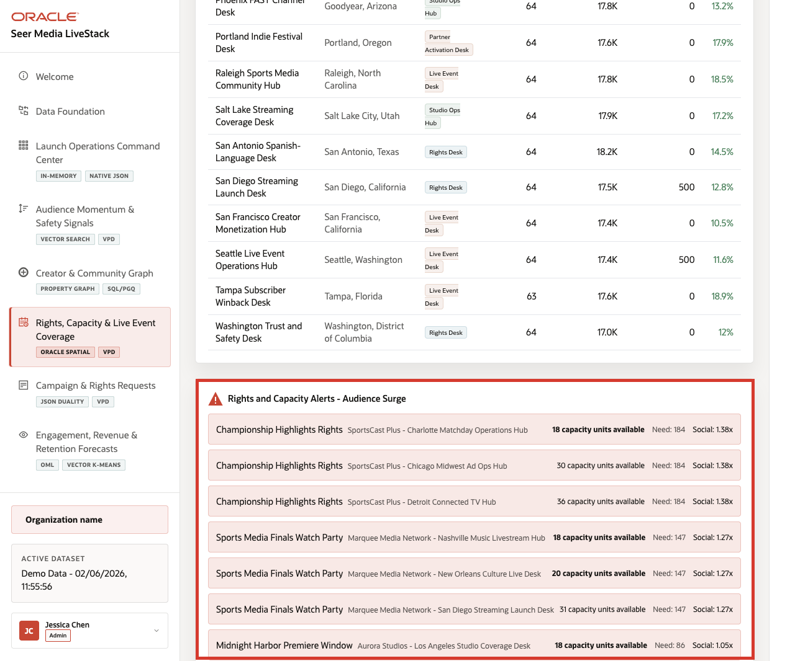
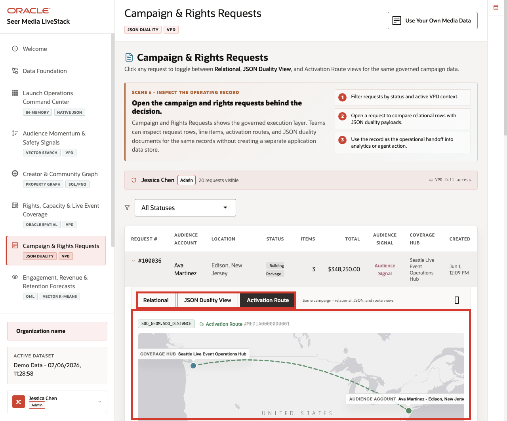
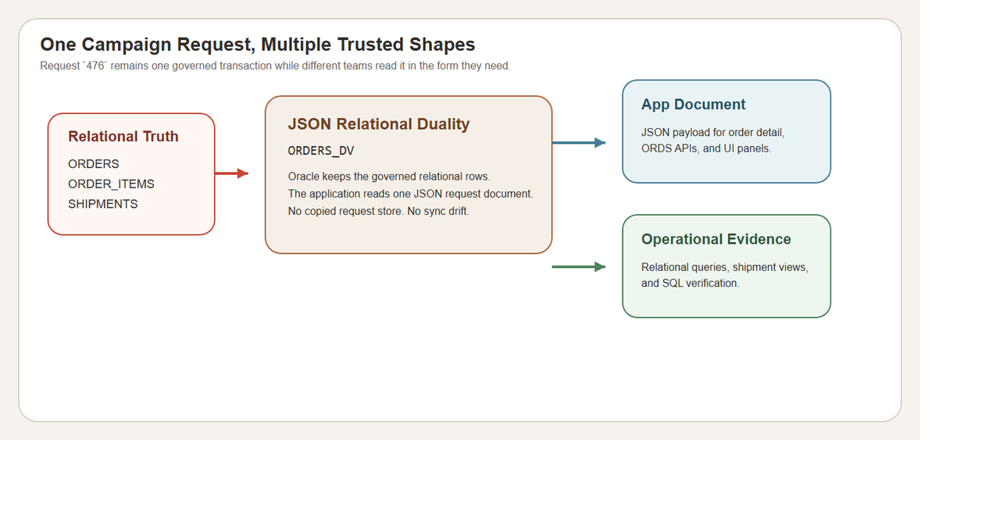

# Lab 3: Campaign and Rights Requests with JSON Relational Duality

## Introduction

The **Media LiveStack** does not ask launch teams to choose between app-friendly JSON and governed relational truth. A campaign or rights request has to support operators, APIs, and route planners at the same time. This lab follows one request across those representations so the learner can see that speed and governance do not require separate truth sources.

### Operating Story

| Step | Campaign-request focus |
| --- | --- |
| Business Problem | The same campaign request must support launch operations, application APIs, and rights follow-up without sync drift. |
| Technical Challenge | The database must expose one request as relational rows, a JSON document, and route-ready operational context at the same time. |
| Persona Focus | Campaign operations lead, rights planner, application developer, or database developer. |
| What You Will Prove | One Media request can move across SQL, JSON, and shipment context without leaving governed Oracle data. |
| Database Capability | JSON Relational Duality, relational SQL, SQL/JSON accessors, and route-aware order records. |
| Outcome | You can explain why the app sees one JSON-shaped request while Oracle still protects the underlying relational truth. |
{: title="Campaign Request Operating Story Table"}

Persona focus: this lab is for the team that needs app agility without sacrificing governed request data.

### Objectives

In this lab, you will:

- Inspect one campaign request as a relational row.
- Retrieve the same request from the JSON duality view.
- Review the route and shipment evidence tied to that request.

Estimated Time: **10 minutes**



*Figure 1: The request workspace shows the same launch request the learner will inspect through SQL and JSON.*



*Figure 2: The runbook highlights the relational request surface before the JSON view is opened.*



*Figure 3: JSON Relational Duality lets Media teams read one governed request in the shape each workflow needs.*

## Task 1: Inspect the relational request detail

Perform the following set of steps to inspect one high-value campaign request directly from the governed Media semantic view.

1. Run this query:

    ```sql
    <copy>
    SELECT
      campaign_order_id,
      campaign_status,
      campaign_value,
      audience_account,
      audience_region,
      distribution_hub,
      line_count,
      requested_units
    FROM media_campaign_orders_v
    WHERE campaign_order_id = 476;
    </copy>
    ```

    **Expected output:**

    | CAMPAIGN_ORDER_ID | CAMPAIGN_STATUS | CAMPAIGN_VALUE | AUDIENCE_ACCOUNT | AUDIENCE_REGION | DISTRIBUTION_HUB | LINE_COUNT | REQUESTED_UNITS |
    | ---: | --- | ---: | --- | --- | --- | ---: | ---: |
    | 476 | shipped | 768029.99 | Leo Chen | Michigan | Boston Premium Originals Hub | 3 | 6 |
    {: title="Campaign Request Relational Detail Table"}

2. This is the governed operational row that the rest of the lab depends on.

**Note:** Sample values may change after data refreshes or rebuilds. Focus on the expected result pattern and the business takeaway, not the exact values.

## Task 2: Retrieve the same request as a JSON document

Perform the following set of steps to retrieve the same request as a JSON document and verify that it carries the same governed business values:

1. Run this query:

    ```sql
    <copy>
    SELECT
      JSON_VALUE(o.data, '$._id' RETURNING NUMBER) AS request_id,
      JSON_VALUE(o.data, '$.customerId' RETURNING NUMBER) AS customer_id,
      JSON_VALUE(o.data, '$.status') AS status,
      JSON_VALUE(o.data, '$.total' RETURNING NUMBER) AS total,
      JSON_VALUE(o.data, '$.shippingCost' RETURNING NUMBER) AS shipping_cost,
      JSON_VALUE(o.data, '$.demandScore' RETURNING NUMBER) AS demand_score,
      JSON_VALUE(o.data, '$.items.size()' RETURNING NUMBER) AS item_count
    FROM orders_dv o
    WHERE JSON_VALUE(o.data, '$._id' RETURNING NUMBER) = 476;
    </copy>
    ```

    **Expected output:**

    | REQUEST_ID | CUSTOMER_ID | STATUS | TOTAL | SHIPPING_COST | DEMAND_SCORE | ITEM_COUNT |
    | ---: | ---: | --- | ---: | ---: | ---: | ---: |
    | 476 | 476 | shipped | 768029.99 | 0 | 96 | 3 |
    {: title="Campaign Request JSON Value Check Table"}

2. The document is app-friendly, but it is not a second truth source. It is the same order exposed through a JSON duality view, and the table proves the JSON path values match the governed relational request.

**Note:** Sample values may change after data refreshes or rebuilds. Focus on the expected result pattern and the business takeaway, not the exact values.

## Task 3: Review the route and shipment context

Perform the following set of steps to connect the same request to the route and shipment evidence that operations would review:

1. Run this query:

    ```sql
    <copy>
    SELECT
      s.order_id,
      fc.center_name AS distribution_hub,
      s.carrier,
      s.ship_status,
      s.distance_km,
      s.estimated_hours
    FROM shipments s
    JOIN fulfillment_centers fc
      ON fc.center_id = s.center_id
    WHERE s.order_id = 476;
    </copy>
    ```

    **Expected output:**

    | ORDER_ID | DISTRIBUTION_HUB | CARRIER | SHIP_STATUS | DISTANCE_KM | ESTIMATED_HOURS |
    | ---: | --- | --- | --- | ---: | ---: |
    | 476 | Boston Premium Originals Hub | StreamOps | delivered | 89.2 | 27 |
    {: title="Campaign Shipment Route Context Table"}

2. This is the operating value of JSON Relational Duality in the Media stack: the app can work with a document, while operations can still verify the route, shipment, and relational detail that sits behind it.

**Note:** Sample values may change after data refreshes or rebuilds. Focus on the expected result pattern and the business takeaway, not the exact values.

## Acknowledgements

* **Author** - Oracle LiveLabs Team
* **Last Updated By/Date** - Oracle Database Product Management, June 2026
