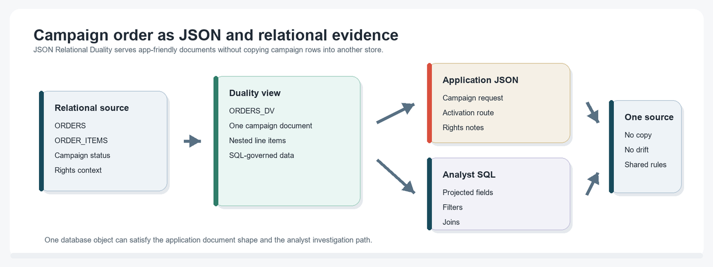
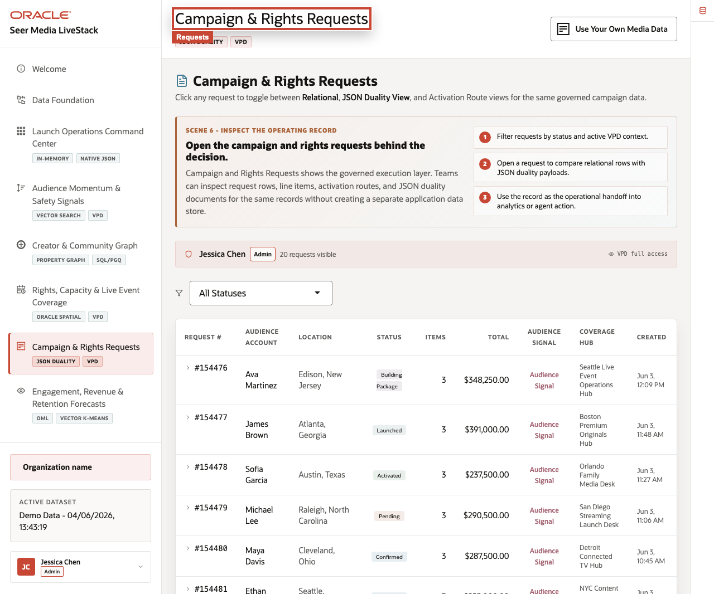

# Campaign Orders with JSON Relational Duality

## Introduction

Applications often need campaign order data as a clean JSON document, while analysts still need the same data in relational form for filtering, joining, and investigation. This lab uses **JSON Relational Duality** to satisfy both needs from the same data.

Think of this as one campaign order wearing two useful forms. The application gets an API-friendly document. Analysts and database developers still get governed SQL access to the underlying facts.

This matters after the dashboard lab because a KPI is not enough for review. When an analyst or application needs a specific campaign order, the database can return an API-shaped document and still preserve the relational joins needed for investigation.

<details>
<summary><strong>Key terms: JSON, relational tables, JSON Relational Duality, duality view, and projection</strong></summary>

> - **JSON** is a document format that application developers often prefer for APIs because it can represent a complete business object in one payload.
>
> - **Relational tables** store data in rows and columns with defined keys, relationships, constraints, and data types. That structure is excellent for analytics, joining across many entities, and enforcing shared business rules.
>
> - **JSON Relational Duality** lets Oracle Database expose relational data as JSON documents without copying it into a separate document database.
>
> - A **duality view** defines that document shape. In this lab, ORDERS_DV maps campaign order rows from ORDERS and nested line-item rows from ORDER_ITEMS into one campaign document.
>
> - **Projection** means pulling selected JSON fields into SQL columns. SQL/JSON projection lets analysts inspect document fields with normal SQL.

</details>


The image below is the Campaigns & Rights Requests screen from the Seer Media application. It shows campaign request detail, rights context, and activation workflow information in one operational view. The SQL in this lab explains how JSON Relational Duality can serve that application-style document while keeping the underlying rows queryable.



### Objectives

- Read application-friendly campaign documents from a duality view.
- Explain why JSON Relational Duality avoids a separate document copy.
- Use SQL/JSON projection to return document fields as SQL columns for investigation.

Estimated Time: **10 minutes**

### Business Scenario

| Step | Media focus |
| --- | --- |
| Business Problem | Application teams want document-shaped campaign data, while operations teams need relational controls. |
| Technical Challenge | Developers need API-friendly JSON without copying campaign order records into a separate document store. |
| Persona Focus | Application developers serve document payloads while database developers preserve relational governance and SQL access. |
| What You Will See | JSON Relational Duality exposes campaign documents without duplicating data. |
| Database Capability | Duality views and SQL/JSON functions expose JSON and relational access together. |
| Outcome | Campaign operations can serve application and analytics needs from one source. |

Persona focus: You are the application/database developer showing how Seer Media can expose campaign documents while keeping governed relational evidence intact.

### What Is a Duality View?

A JSON Relational Duality View is a database view that defines how relational tables should appear as a JSON document. The data still lives in relational tables, with keys, constraints, SQL access, and governance. The duality view adds a document access path over that same data.

For this lab, the workshop database already includes ORDERS_DV. The duality view maps relational columns into a document shape like this:

| JSON field | Relational source |
| --- | --- |
| _id | ORDERS.ORDER_ID |
| customerId | ORDERS.CUSTOMER_ID |
| status | ORDERS.ORDER_STATUS |
| items[] | Related rows from ORDER_ITEMS |

## Task 1: Inspect document-shaped campaign orders

First, inspect the campaign order shape an application can consume directly.

1. Run this query:

    > **SQL Worksheet reminder:** Need a reminder on how to open and use the SQL Worksheet? Return to [Getting Started Task 2: Open SQL Worksheet](/workshops/sandbox/index.html?lab=getting-started#Task2:OpenSQLWorksheet) for the step-by-step graphic showing where to paste and run SQL statements.

    You are viewing a campaign order the way an application can consume it: as a JSON document. The SQL selects from the JSON Relational Duality view ORDERS_DV and uses JSON_SERIALIZE(... PRETTY) so SQL Worksheet displays the document shape clearly.

    <details>
    <summary><strong>Why this matters: Oracle's converged approach helps here</strong></summary>

    > In a fractured environment, the application team might keep JSON documents in one system while analysts use relational tables in another. That creates a synchronization problem: which copy is current, which one is governed, and which one should an investigation trust?
    >
    > Oracle JSON Relational Duality avoids that split. The JSON document and the relational rows are two views of the same governed data.

    </details>

    ```sql
    <copy>
    SELECT JSON_SERIALIZE(
             JSON_OBJECT(
               '_id' VALUE JSON_VALUE(data, '$._id' RETURNING NUMBER),
               'customerId' VALUE JSON_VALUE(data, '$.customerId' RETURNING NUMBER),
               'status' VALUE JSON_VALUE(data, '$.status'),
               'total' VALUE JSON_VALUE(data, '$.total' RETURNING NUMBER),
               'demandScore' VALUE JSON_VALUE(data, '$.demandScore' RETURNING NUMBER),
               'createdAt' VALUE JSON_VALUE(data, '$.createdAt'),
               'items' VALUE JSON_QUERY(data, '$.items') FORMAT JSON
             ) PRETTY
           ) AS campaign_document
    FROM orders_dv
    ORDER BY JSON_VALUE(data, '$._id' RETURNING NUMBER)
    FETCH FIRST 1 ROW ONLY;
    </copy>
    ```

    **Expected output: Campaign Document Excerpt**

    | Campaign Document |
    | --- |
    | { "\_id" : 1, "customerId" : 1, "status" : "processing", "total" : 348250, "demandScore" : 73, "createdAt" : "2026-05-05T10:09:00", "items" : [ ... ] } |

2. Expand the document in SQL Worksheet.
    The query reads the duality view as a document source. The database constructs the JSON shape from relational data, so the application gets a campaign payload without creating a second copy of the campaign record.

## Task 2: Project JSON fields with SQL

Now use SQL to project document fields back into reviewable columns. In this context, "project" means pulling selected values out of the JSON document and displaying them as SQL result columns.

1. Run this SQL/JSON projection query:

    You are seeing the main advantage of JSON Relational Duality: the JSON document that works well for an application is still available for SQL analysis. The same campaign order shape can be queried, filtered, and joined to governed relational data.

    ```sql
    <copy>
    SELECT JSON_VALUE(od.data, '$._id' RETURNING NUMBER) AS campaign_order_id,
           JSON_VALUE(od.data, '$.status') AS campaign_status,
           c.email AS audience_account_email
    FROM orders_dv od
    JOIN customers c
      ON c.customer_id = JSON_VALUE(od.data, '$.customerId' RETURNING NUMBER)
    WHERE JSON_VALUE(od.data, '$._id' RETURNING NUMBER) IS NOT NULL
    ORDER BY campaign_order_id
    FETCH FIRST 3 ROWS ONLY;
    </copy>
    ```

    **Expected output: JSON Field Projection**

    | Campaign Order Id | Campaign Status | Audience Account Email |
    | --- | --- | --- |
    | 1 | processing | audience.account.0001@example.com |
    | 2 | shipped | audience.account.0002@example.com |
    | 3 | delivered | audience.account.0003@example.com |

2. Review the columns returned from the JSON document.
    This query shows the reverse path: SQL can project fields back out of the document, meaning it can return selected JSON values as SQL columns and join them to relational customer data.

## Acknowledgements

* **Author** - Oracle LiveLabs Team
* **Contributor** - Oracle Database Product Management
* **Last Updated By/Date** - Oracle Database Product Management, July 2026


