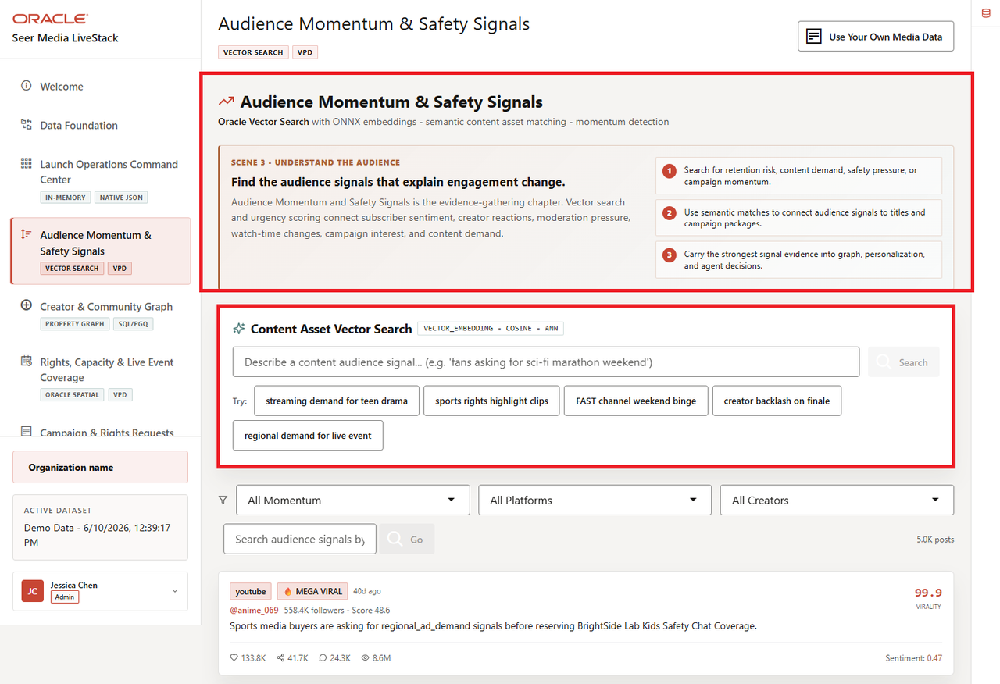
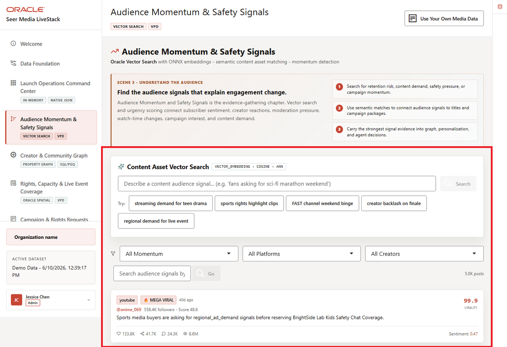
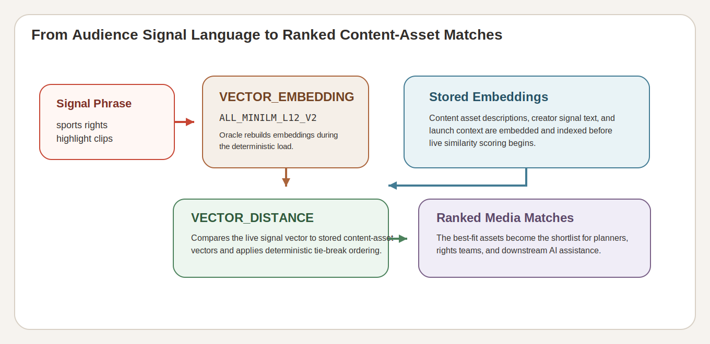

# Lab 4: Audience Momentum and Safety Signals with AI Vector Search

## Introduction

Audience language moves faster than metadata updates. Media teams hear about demand, rights pressure, churn risk, and trust-and-safety issues in free text long before the request queue tells the full story. This lab shows how the Media LiveStack keeps that semantic search path inside the same governed database workflow.

### Operating Story

| Step | Audience-signal focus |
| --- | --- |
| Business Problem | Operators need to connect audience signal language to affected content assets before the risk becomes obvious in downstream launch metrics. |
| Technical Challenge | Embeddings, vector search, and signal-to-content matching must stay close to governed Media data. |
| Persona Focus | Streaming growth lead, trust-and-safety analyst, rights planner, or search-aware application developer. |
| What You Will Prove | A free-text media phrase can become a governed vector search and return concrete content assets plus signal evidence. |
| Database Capability | `VECTOR_EMBEDDING`, `VECTOR_DISTANCE`, stored embeddings, and deterministic semantic matches. |
| Outcome | You show how Oracle AI Database matches content assets by meaning, not only by exact keywords. |
{: title="Audience Signal Operating Story Table"}

Persona focus: this lab is for the operator or builder who needs semantic discovery without moving sensitive audience text into a detached search stack.

### Objectives

In this lab, you will:

- Confirm the embedding model and vector inventory.
- Search for content assets with a natural-language sports-rights phrase.
- Review the audience-signal evidence behind those matches.

Estimated Time: **10 minutes**



*Figure 1: The audience signal workspace shows the launch phrase search and the governed signal feed it controls.*



*Figure 2: The runbook highlights the same query-chip and evidence flow that the SQL lab explains.*



*Figure 3: Oracle AI Vector Search keeps audience-signal matching inside the governed Media database path.*

## Task 1: Confirm the embedding model and vector inventory

Perform the following set of steps to confirm the embedding model and vector inventory that support audience-signal matching:

1. Run this query:

    ```sql
    <copy>
    SELECT model_name, mining_function, algorithm
    FROM user_mining_models
    WHERE model_name = 'ALL_MINILM_L12_V2';
    </copy>
    ```

    **Expected output:**

    | MODEL_NAME | MINING_FUNCTION | ALGORITHM |
    | --- | --- | --- |
    | ALL\_MINILM\_L12\_V2 | EMBEDDING | ONNX |
    {: title="Embedding Model Inventory Table"}

2. Run this supporting query to confirm the vector inventory.

    ```sql
    <copy>
    SELECT 'Content embeddings' AS vector_group, COUNT(*) AS row_count FROM product_embeddings
    UNION ALL
    SELECT 'Audience signal embeddings', COUNT(*) FROM post_embeddings
    UNION ALL
    SELECT 'Semantic matches', COUNT(*) FROM semantic_matches;
    </copy>
    ```

**Expected output:**

| VECTOR_GROUP | ROW_COUNT |
| --- | ---: |
| Content embeddings | 187 |
| Audience signal embeddings | 5000 |
| Semantic matches | 1422 |
{: title="Vector Asset Coverage Table"}

**Note:** Sample values may change after data refreshes or rebuilds. Focus on the expected result pattern and the business takeaway, not the exact values.

## Task 2: Search content assets by meaning

Perform the following set of steps to search content assets by meaning with a natural-language sports-rights phrase:

1. Run this query:

    ```sql
    <copy>
    WITH query_vector AS (
      SELECT VECTOR_EMBEDDING(ALL_MINILM_L12_V2 USING 'sports rights highlight clips' AS DATA) AS embedding
      FROM dual
    )
    SELECT
      p.product_name AS content_asset,
      b.brand_name AS studio_or_label,
      p.category AS content_category,
      ROUND((1 - VECTOR_DISTANCE(q.embedding, pe.embedding, COSINE)) * 100, 1) AS similarity_pct
    FROM query_vector q
    JOIN product_embeddings pe ON 1 = 1
    JOIN products p ON p.product_id = pe.product_id
    JOIN brands b ON b.brand_id = p.brand_id
    ORDER BY VECTOR_DISTANCE(q.embedding, pe.embedding, COSINE), p.product_id
    FETCH FIRST 8 ROWS ONLY;
    </copy>
    ```

    **Expected output:**

    | CONTENT_ASSET | STUDIO_OR_LABEL | CONTENT_CATEGORY | SIMILARITY_PCT |
    | --- | --- | --- | ---: |
    | Championship Highlights Rights | SportsCast Plus | Sports Rights | 67.2 |
    | The Last Laugh Track Sports Highlights Rights | EchoVerse Audio | Sports Rights | 61.8 |
    | Midnight Harbor Sports Highlights Rights | Civic Stream | Sports Rights | 57.5 |
    | Orbit Riders Sports Highlights Rights | ArcLight Originals | Sports Rights | 56.0 |
    | Neon Rift Sports Highlights Rights | IndieFrame | Sports Rights | 55.8 |
    | Lunar Kitchen Sports Highlights Rights | EchoVerse Audio | Sports Rights | 55.5 |
    | Shadow Circuit Sports Highlights Rights | PrimePitch Sports | Sports Rights | 54.5 |
    | Sonic City Sessions Sports Highlights Rights | IndieFrame | Sports Rights | 54.0 |
    {: title="Top Semantic Content Matches Table"}

2. This is the learning point for the lab. The result is not looking for the exact string `sports rights highlight clips` in a title column. It is comparing meaning with stored embeddings.

**Note:** Sample values may change after data refreshes or rebuilds. Focus on the expected result pattern and the business takeaway, not the exact values.

## Task 3: Review the content assets already carrying the strongest signal load

Perform the following set of steps to review the content assets already carrying the strongest audience-signal load:

1. Run this query to see which assets already carry the heaviest audience-signal footprint.

    ```sql
    <copy>
    SELECT
      content_asset,
      studio_or_label,
      audience_signal_count,
      ROUND(avg_virality_score, 2) AS avg_virality_score
    FROM media_content_assets_v
    ORDER BY audience_signal_count DESC, avg_virality_score DESC, content_asset
    FETCH FIRST 5 ROWS ONLY;
    </copy>
    ```

    **Expected output:**

    | CONTENT_ASSET | STUDIO_OR_LABEL | AUDIENCE_SIGNAL_COUNT | AVG_VIRALITY_SCORE |
    | --- | --- | ---: | ---: |
    | Pulse Arena Regional Rights Window | Global Drama House | 19 | 50.77 |
    | Superfan Loyalty Bonus Content Track | Marquee Media Network | 19 | 50.68 |
    | Echo Valley Watch Time Personalization Test | AnimeForge | 19 | 50.67 |
    | Forge Comics Live Premium Bundle Upsell | Forge Comics Studio | 19 | 50.58 |
    | WideAngle Matchday Creator Sponsored Journey | StreamWave Network | 19 | 50.57 |
    {: title="Highest Signal Load Content Assets Table"}

2. Together, these queries show why the app can move from audience language to a governed content shortlist without breaking the data boundary.

**Note:** Sample values may change after data refreshes or rebuilds. Focus on the expected result pattern and the business takeaway, not the exact values.

## Acknowledgements

* **Author** - Oracle LiveLabs Team
* **Last Updated By/Date** - Oracle Database Product Management, June 2026
